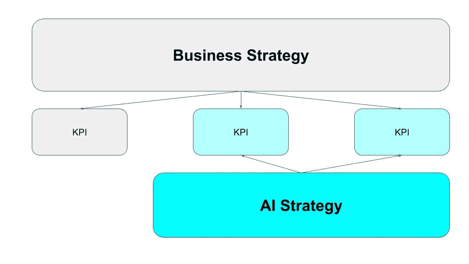
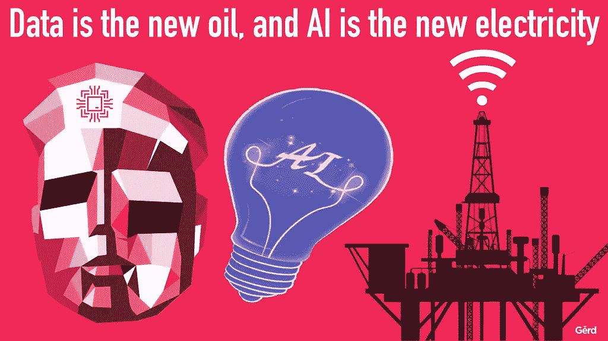
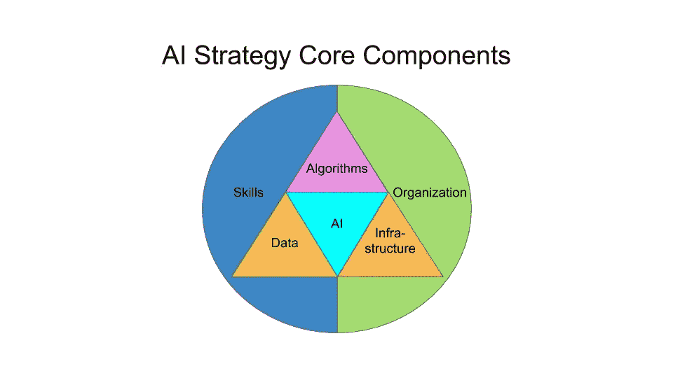
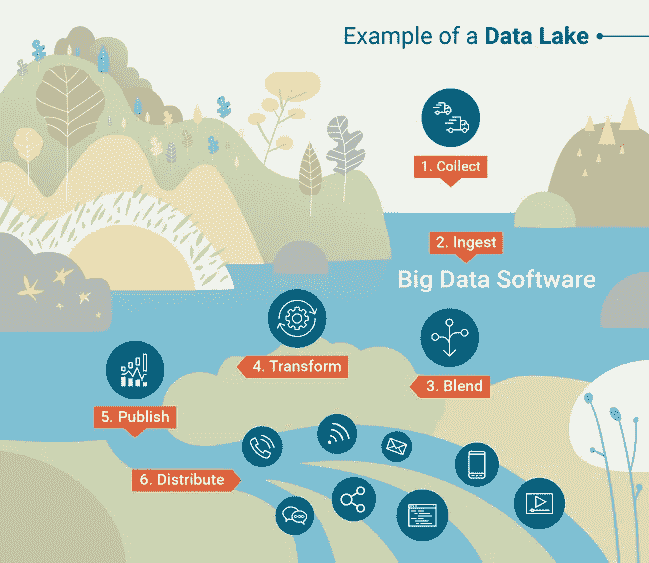
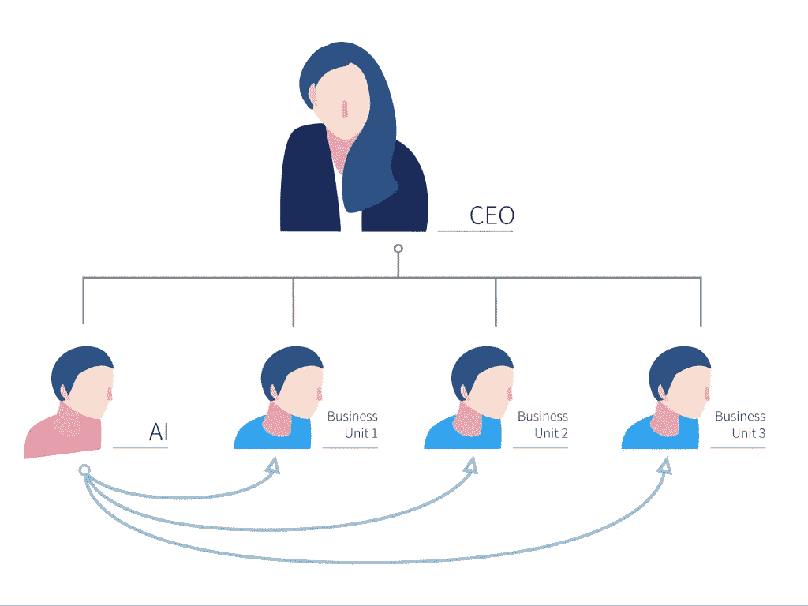
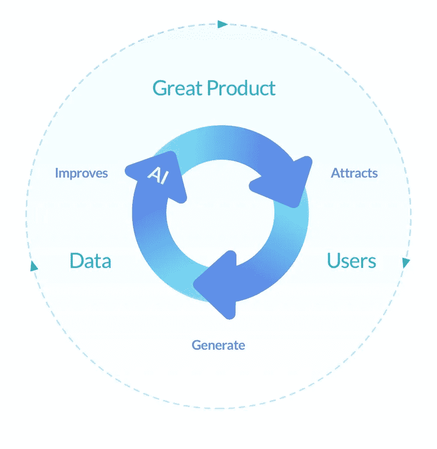

# 成功人工智能战略的秘密

> 原文：<https://towardsdatascience.com/the-secrets-to-a-successful-ai-strategy-d241adda5832?source=collection_archive---------11----------------------->

## [人工智能项目管理](https://towardsdatascience.com/tagged/project-management-ai)

## 虽然人们对创建商业战略已经有了很多了解，但创建人工智能战略却是一个新领域。你如何创造你的人工智能战略？

一个人工智能拥有[跨越行业和部门的巨大前景](https://www.mckinsey.com/featured-insights/artificial-intelligence/notes-from-the-ai-frontier-modeling-the-impact-of-ai-on-the-world-economy)。世界上最重要的人工智能传播者吴恩达，在他的[人工智能转型剧本](https://landing.ai/ai-transformation-playbook/?utm_source=MLYList&utm_medium=ButtonLink&utm_campaign=Playbook)中，将创造人工智能战略列为关键要素。随着人工智能开始改变每个行业，你如何创建一个明智的战略来利用它的力量？人工智能战略到底是由什么构成的？为创业公司和公司创建人工智能战略有什么不同？

Photo by [JESHOOTS.COM](https://unsplash.com/photos/fzOITuS1DIQ?utm_source=unsplash&utm_medium=referral&utm_content=creditCopyText) on [Unsplash](https://unsplash.com/search/photos/strategy?utm_source=unsplash&utm_medium=referral&utm_content=creditCopyText)

为人工智能战略建模不同于创建传统的商业战略。这篇文章旨在通过创建一个有针对性的人工智能策略的过程来指导从业者。这些见解是基于我的个人经历和对来自[大众](https://www.volkswagen.com/)、[谷歌](http://www.google.com)、[人工智能基金](https://aifund.ai/)等公司的全球人工智能领导者的专家采访。在文章结束时，你将知道人工智能战略如何与商业战略相关，人工智能战略的核心组成部分，以及如何区分好的和坏的人工智能战略。

我们开始计划吧。🤔

# 商业战略和人工智能战略

人工智能战略的存在是为了支持商业战略。商业战略为你的公司定义了前进的道路。哪些计划将提供最高的商业价值？哪些特征将公司与竞争对手区分开来？业务战略通过可衡量的目标来表达，例如，以关键绩效指标([KPI](https://www.quora.com/What-is-a-KPI))或目标和关键结果( [OKRs](/the-power-of-goal-setting-for-your-data-science-project-9338bf475abd) )的形式。这些方法跟踪实现业务目标的过程。

AI Strategy supports the business in achieving its KPIs.

[德中人工智能协会](https://www.gcaai.org/)副主席 Raphael Kohler 表示，很好地理解人工智能战略的目标至关重要。他强调，讨论不能以技术为中心，而必须由商业价值驱动。

> 就商业战略而言，人工智能战略没有放之四海而皆准的标准。— [张秀坤·海茨](https://medium.com/u/6533aa1281a?source=post_page-----d241adda5832--------------------------------)

业务部门联合起来实现这些 KPI。人工智能战略的工作是提供一条影响这些业务 KPI 的道路。

# 人工智能的机遇与挑战

平衡人工智能的能力和局限性是理解人工智能如何支持你的商业战略的关键。

> 如果没有你的努力，你不能指望让巫师们在你的生意上洒上机器学习的魔法来得到任何有用的东西。卡西·科济尔科夫

一般来说，AI 可以做好[三件事](/business-basics-for-data-scientists-862f116a82da):自动化流程，创造新产品，或者改进现有产品。自动化流程的一个例子是[机器人流程自动化](https://blog.bernd-ruecker.com/how-to-benefit-from-robotic-process-automation-rpa-9edc04430afa)，它将员工从繁琐、重复的任务中解放出来。人工智能还可以帮助公司产生全新的产品，例如[智能家庭扬声器](https://www.digitaltrends.com/home/alexa-and-google-home-smart-speakers-bring-ai-to-one-in-three-us-homes/)由人工智能驱动。最后，人工智能还可以改进现有的产品。如今的信贷决策大多由人工智能支持。这个模型处理的信息比人类更多，因此降低了消费者的总体信贷成本。

[Source](https://goo.gl/dPytnd)

然而，人工智能正在努力完成复杂的任务。这些任务可能包括上下文理解或其他任何需要一个人做不止[1 秒的事情。人工智能非常擅长执行狭窄定义的任务，在不确定的环境中表现不佳。](https://twitter.com/andrewyng/status/788548053745569792?lang=de)

在规划你的人工智能工作之前，理解人工智能的范围和边界是最重要的。

> 利用人工智能创造你的[行业](https://www.coursera.org/learn/ai-for-everyone)特有的优势。— [吴恩达](https://medium.com/u/592ce2a67248?source=post_page-----d241adda5832--------------------------------)

既然你已经理解了人工智能战略与商业战略的关系，以及存在哪些机遇和挑战，那么你如何着手创造一个呢？

# 人工智能战略的核心组成部分

正如每个公司都被电所感动一样，每个公司都将被人工智能的力量所感动。虽然没有一个人工智能策略看起来是一样的，但所有的人工智能策略都需要回答类似的问题。任何人工智能战略的核心组成部分都涉及其数据、基础设施、算法的神圣三位一体，周围是技能和组织的支柱。让我们深入了解每个组件。

# 数据

没有数据，就不可能有 AI。数据涉及所有与改善您的业务相关的信息。它可以是任何东西，从自动驾驶汽车的传感器数据到商业决策的金融数据。创建数据策略是任何人工智能策略的重要组成部分。吴恩达建议触及以下几点:

*   你可以战略性地获取哪些数据？
*   您收集所有数据还是选定的数据？

人工智能基金的人工智能投资者 Jason Risch 强调了获取战略数据的正确时机的重要性。淹没在数据中不再是一种选择。Jason 见证了“ **select *** ”数据策略在创业公司和企业中都失败了。在建立可行的产品之前专注于创建模型的创业公司浪费了宝贵的资源。类似地，那些因为数据过多而收购初创公司的公司往往没有发现其中的价值。这是医疗保健行业常见的谬误，公司希望算法能在随机数据中找到模式。关键是收集正确的数据。

> 在过去十年中，数据一直是公司提升的主要来源。数据驱动的决策是成功的关键，因此您需要定义一个强大的数据策略。— [塔利·辛格](https://medium.com/u/b7b54430a021?source=post_page-----d241adda5832--------------------------------)

创建数据策略后，接下来是考虑基础架构的时候了。

# 基础设施

人工智能战略的第二个核心组成部分是基础设施。基础设施涉及使数据可访问，并提供处理数据所需的计算能力。AI 模型渴望计算能力，你的 AI 团队需要开发和部署模型的基础设施。理想情况下，这种基础设施会根据您公司的需求进行调整。

*   你能创建一个统一的数据仓库吗？
*   您使用的是[云服务](https://www.quora.com/What-are-cloud-computing-services)还是[本地解决方案](https://www.hpe.com/us/en/what-is/on-premises-vs-cloud.html)？

统一的数据仓库集中了对整个公司可用数据的访问。在传统公司中，你会发现数据储存在筒仓中，无法被其他团队访问。这通常有结构、组织和法律方面的原因。然而，跨业务团队特定数据建立联系是你的人工智能工作的中心。数据科学家擅长在数据中寻找模式，所以你的目标是让他们获得尽可能多的数据。

[Source](https://learn.g2.com/what-is-a-data-lake)

重要的问题是，你是依赖云服务，还是为人工智能建立自己的基础设施。像 [AWS](https://aws.amazon.com/machine-learning/) 、[微软](https://azure.microsoft.com/en-us/services/machine-learning-studio/)或[谷歌](https://cloud.google.com/ml-engine/?hl=en)这样的云供应商提供开箱即用的人工智能解决方案。使用云时，您只需为您消费的内容付费。大量的资源也可以帮助您快速设置。您还不断投入时间和资源来维护您的服务器。购买自己的硬件时，前期成本更高。一开始，云解决方案比较便宜，但是从长远来看，投资你自己的[基础设施](https://www.softwareadvice.com/resources/cloud-erp-vs-on-premise/)是值得的。利弊取决于你所在的行业，所以在做决定之前弄清楚自己的需求很重要。deepkapha.ai 的首席执行官兼联合创始人 Tarry Singh 并不建议那些将开发算法作为竞争优势的公司只关注云计算。

一旦你知道如何利用人工智能的硬件，接下来考虑人工智能的算法部分。

# 算法

算法位于人工智能三位一体的顶端，因为它们使用数据和基础设施来生产有价值的产品。你的人工智能策略的算法部分很棘手。回答这些问题会让你更进一步。

*   专有算法是商业价值的关键驱动力吗？
*   你是开源你的模型还是倾向于保持它们的私有性？

谷歌首席决策科学家 Cassie Kozyrkov 认为[机器学习存在两个世界](https://hackernoon.com/why-businesses-fail-at-machine-learning-fbff41c4d5db)。凯西喜欢区分机器学习研究和应用机器学习。进行研究需要一种不同于应用现有算法的方法。

人工智能社区在发布可重用的公共数据集和模型方面已经变得好得多。这为你的公司提供了巨大的优势，因为你可以接触到各种各样的[人工智能模型动物园](https://github.com/collections/ai-model-zoos)。在你的人工智能战略中，你应该回答的主要问题是，算法是否是人工智能功能的主要商业驱动力。如果是的话，你应该建立一个专利项目，激励员工申请专利。如果没有，你应该考虑开源你的模型，利用大众知识来改进你的算法。

接下来，让我们看看在您的公司中利用人工智能所需的技能。

# 技能

一旦人工智能的神圣三位一体到位，你需要人来完成它的使命。人是让你的数据、基础设施和算法发挥作用以产生商业价值的核心。你如何让你组织中的人使用人工智能？在你的人工智能策略中回答以下问题:

*   你是建立内部团队还是外包任务？
*   你如何持续地对管理层和员工进行人工智能教育？

吴恩达建议建立一个内部人工智能团队。人工智能依赖于领域知识，这在某些行业可能很难外包。外部顾问可能不像你自己的员工那样了解你的数据、基础设施和问题。因此，可行的方法是捆绑热情的员工，对他们进行人工智能教育。

Photo by [Tim Mossholder](https://unsplash.com/@timmossholder?utm_source=unsplash&utm_medium=referral&utm_content=creditCopyText) on [Unsplash](https://unsplash.com/search/photos/education?utm_source=unsplash&utm_medium=referral&utm_content=creditCopyText)

[1&1 Ionos 的数据科学家张秀坤·海茨](https://twitter.com/d_haitz)表示，人工智能作为一种新技术不同于其他技术创新。人们往往不仅不知道人工智能的实际能力，而且他们经常对它有误解。这可以从“对人类的无所不能的威胁”到直接开箱即用的多用途系统的概念。

一旦内部团队到位，他们需要充当推动者的角色。人工智能的承诺太大了，无法将它们封装在一个团队中。人工智能战略应该实现一个程序，不断教育所有人寻找人工智能用例。通常，这些计划应该针对能够投资人工智能项目的高影响力个人。 [todoku.ai](https://todoku.ai/) 的联合创始人雷切尔·贝里曼确信，人工智能对经理的理解至关重要，因为这将作为人工智能的机会渗透到他们所在行业的员工。

让我们研究一下你的人工智能战略的最后一个组成部分——组织。

# 组织

人工智能战略的最后一个也是最重要的部分是让你的组织为人工智能做好准备。具体评估你的组织设计和开发过程。然后，将它们与最佳实践结合起来。

*   你如何让你的人工智能团队提供跨团队和跨领域的商业价值？
*   您的流程为 ML 工作流程做好准备了吗？

人工智能的好处是万能的。最重要的是要明白人工智能不能在筒仓中工作。人工智能不是在以客户为中心的垂直业务部门工作，而是可以被视为公司的横向推动者。人工智能能够影响内部流程，创造新产品，或改进现有产品。为了做到这一点，吴恩达建议建立一个独立的部门，成为整个公司人工智能的中心支持点。然后，该单位与现有部门合作，寻找高影响力的人工智能项目，并支持它们的实施。

[Source](https://landing.ai/ai-transformation-playbook/)

在整个公司实现人工智能需要理解[机器学习工作流程](https://cloud.google.com/ml-engine/docs/tensorflow/ml-solutions-overview)。机器学习遵循一个高度迭代的过程，其结果远非确定。你可以使用像[人工智能项目画布](/introducing-the-ai-project-canvas-e88e29eb7024)这样的工具来评估成功的可能性，但你很难保证具体的结果。人工智能的探索性质使得它很难遵循公司范围的目标衡量。

> 在没有彻底评估数据的情况下，你不能承诺一个工作模型。因此，如果不首先投资 [ETL](https://www.quora.com/What-is-ETL) 和初始数据分析，很难估计 AI 项目的具体业务影响。— [雷切尔·贝里曼](https://medium.com/u/3f9e7bda6adb?source=post_page-----d241adda5832--------------------------------)

考虑你的过程:它们准备好支持人工智能了吗？如果你在一个安全至关重要的行业工作，很可能不存在验证统计学习模型的过程。你的公司遵循瀑布工程流程吗？重新考虑你当前的开发过程，检查它是否符合机器学习的工作流程。

现在你已经理解了人工智能策略的核心组件，让我们看看更多的技巧来避免常见的陷阱。

# 好的、坏的和丑陋的人工智能策略

你的团队需要谁来创造一个人工智能战略？什么构成了一个好的或坏的人工智能策略？企业和初创公司的人工智能战略有什么不同？这最后一个摘要旨在回答前面的问题。

Photo by [Franki Chamaki](https://unsplash.com/@franki?utm_source=unsplash&utm_medium=referral&utm_content=creditCopyText) on [Unsplash](https://unsplash.com/search/photos/artificial-intelligence?utm_source=unsplash&utm_medium=referral&utm_content=creditCopyText)

## 人工智能战略团队

创造一个人工智能战略是一个团队的努力。你需要对人工智能战略的核心组成部分有不同的观点。创业公司和公司的团队组合是不同的。初创公司以较小的团队为中心，围绕来自数据工程师的技术反馈和来自产品所有者或业务开发人员的业务反馈，创建人工智能战略。公司团队涉及更多的功能。为世界上最大的汽车制造商创建了内部人工智能战略的 Andreas Meier 知道，在有专门角色的公司中，你需要大量的领域知识来找到可行的人工智能战略。在一家公司中，你需要一大群不同角色的人，而在初创公司中，你可以用几个多面手创建一个出色的人工智能战略。

## 好的和坏的人工智能策略的标志

在所有公司中，好的和坏的人工智能策略都有共同的特点。好的人工智能战略是影响驱动的，在公司得到很好的支持，在时间、工资和期望方面有充足的资金。糟糕的人工智能战略是炒作驱动的，专注于技术而不是影响，并雇佣 2-3 名数据科学家争夺项目。试着远离后者。

## 企业和初创公司的人工智能战略

创建人工智能战略对公司和初创公司来说是不同的。Raphael Kohler 解释说，企业必须考虑遗留系统，并且也面临现有组织的变革管理的挑战，而初创公司可以专注于进入人工智能的[良性循环。安德烈亚斯·梅尔知道，为人工智能铺设一条产生影响的道路可能会令人不知所措。他指出，在大公司中，利用人工智能实现流程自动化的潜力很大。对 Andreas 来说，简单地开始并交付价值是很重要的。](https://venturebeat.com/2018/08/19/how-to-create-a-virtuous-cycle-of-data-with-your-customers/)

[Source](http://Montreal Ethics)

另一方面，创业公司应该专注于提供一种在没有人工智能的情况下也能正常工作的产品，但随着越来越多的客户使用该产品，该产品会稳步改善。然后对客户互动进行分析，以改进产品，从而吸引更多的用户。一旦进入人工智能的良性循环，人工智能初创公司就走上了成功之路。

> 数据是喂给人工智能引擎的油，不能低估思考如何从客户那里获得初始集以及正确的信息以迭代地改进产品的重要性。— [杰森·里施](https://www.linkedin.com/in/jason-risch-b17aa893/)

# 关键要点

人工智能战略的核心组成部分相互交织，相互依存。核心组件在不同的行业中可能有不同的重要性，但它们总是相关的。

*   人工智能战略应该始终服务于更高的公司战略
*   人工智能战略的核心组成部分是数据、基础设施、算法、技能和组织
*   人工智能战略团队应该由产品经理、数据科学家和业务开发人员组成
*   一个好的人工智能战略应该关注中期目标和整体方法，而不是大肆宣传雇佣一些数据科学家
*   战略数据获取的正确时机可以成就或毁灭你的人工智能财富

在本文中，您学习了如何创建人工智能策略。在创建你的人工智能策略时，考虑人工智能的核心组件。我们期待一个拥抱人工智能实施的[十年的世界。](https://aisuperpowers.com/blog/the-age-of-implementation)