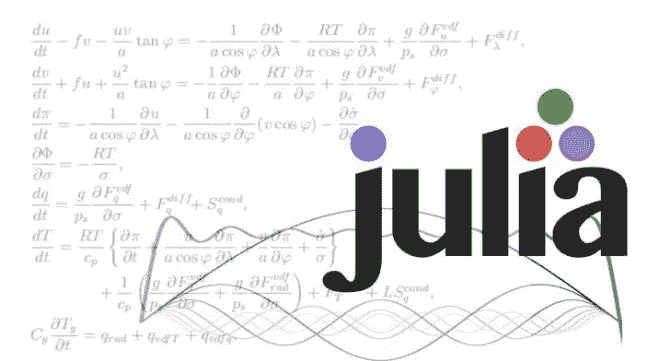
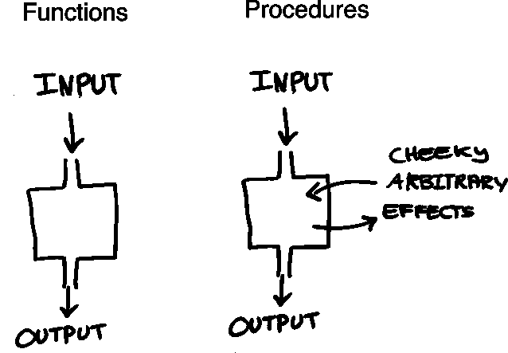
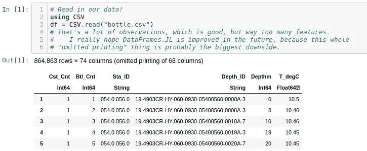
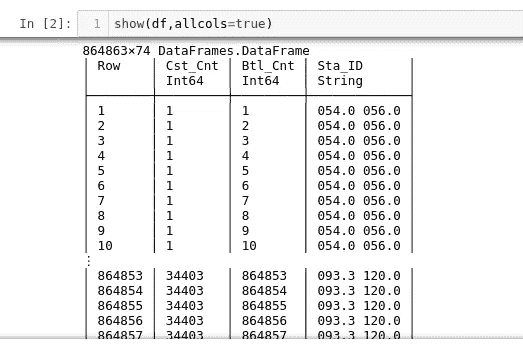

# 1.0.3 中 Julia 语言的严重缺点

> 原文：<https://towardsdatascience.com/the-serious-downsides-to-the-julia-language-in-1-0-3-e295bc4b4755?source=collection_archive---------2----------------------->



我已经说了很多我有多爱茱莉亚。如果有人问我现在最喜欢的编程语言是什么，我肯定会回答“Julia”。另一方面，我不太谈论的是我不喜欢朱莉娅的地方。虽然今天我想谈谈我对这种语言的一些弱点和个人不满，但我坚信使用 Julia 的好处大于可能必须做出的任何妥协。如果你从未使用过 Julia，我强烈建议你去看看！有了我的推荐，我也将开始抱怨我如此热爱它的原因。

# 我喜欢朱莉娅的地方

## 朱莉娅了解自己



Julia 非常喜欢函数式语言，并且喜欢函数式语言。我在我的[循环速度测试](/julia-speed-battle-syntactual-recursive-and-iterative-loops-ff5f719867c1)中展示了一个很好的例子，Julia 在函数递归方面做得非常好。

函数递归循环是我个人在做统计工作时最喜欢使用的外观。然而，通常在其他语言中，比如 Python，每当使用递归时，我们都会遇到速度上的障碍，我认为这对于统计计算来说是一个很大的缺点。

## 朱莉娅打破了规则

> 好的，Julia 是一种用于统计的函数式语言…
> 
> 一定很低级。

Julia 确实打破了规则，每年它似乎都在一点点接近 Python 那样的多功能性。


Genie 是一个很好的例子，因为它实际上是一个在 Julia 内部开发 web 后端和管道的框架，如果我自己这么说的话，这是一个相当高级的框架。

## 就在时间之前

朱莉娅速度很快，我不是随便说说。Julia 的典型运行速度与 c 语言相似。这使得部署速度比需要进行计算的传统基于 Python 的 web 应用程序更快，特别是如果您要部署到非活动服务器，例如 Heroku 上。Julia 能够处理和操作你甚至无法读入 Python 的数据。当处理 2000 万到 3000 万的数据集时，Julia 的速度和效率实在是微不足道，而且计算时间还不到 20 秒。

虽然我不会说 Julia 一定会取代 Scala，但我想说的是，它肯定有潜力取代 Scala。当我可以使用 Julia 时，我发现自己几乎不需要使用 Spark，这很好，因为我有下一个优势:

## 简单快捷

当然，快速不是指我们讨论过的速度，而是指努力的时间。通常在像 Julia 这样的强大语言中，一个显著的缺点是一些相当丰富的语法，如果这种语言是独一无二的，就像 Julia 一样，这可能会令人畏惧和不快。Julia 很容易设置，甚至有办法集成到 Spark 和 Python 中。如果你想了解更多关于茱莉亚和火花的事，看看这个吧！

# 底片。


## DataFrames.jl

虽然相当关键和次要，但我想一开始就提到的最大的一个是 DataFrames.jl。现在不要误解我，我在某种程度上喜欢 DataFrames……但尤其令人讨厌的是 data frames 向用户显示的方式，我真的不明白这样做的原因。当然，这可能是我不知道的性能问题，但我肯定不确定。

首先，为了读入 CSV 文件，我们不像在 Python 中使用 Pandas 那样使用 DataFrames.jl，甚至不使用 R 的内部表。首先，我们必须

```
Pkg.add("CSV")
```

这将为读取 CSV 添加一个完整的模块，稍后会详细介绍。

不过，每当我们在添加 CSV 后读取 CSV 时，我们都会在数据框顶部看到一条消息:



> “省略打印 68 列”

当然，这不是问题，但是我们如何显示所有的列呢？没什么太复杂的，只是:

```
show(df,allcols=true)
```

但我的问题是之后会有什么回报:



我的天啊。今年是哪一年？

也许你会说这不太严重，但是试着在这个小 iframe 中整理成百上千的特性，而不仅仅是运行

```
df.head()
```

然后尽量不去抱怨。与熊猫和 R 数据框相比，朱莉娅肯定是最后一名！考虑到这一点，经过一些思考，我认为他们完全有可能让你使用熊猫和 PyCall，但这纯粹是猜测。

## 分散

还记得我说过的使用 CSV.jl，而不是使用 DataFrames.jl 读取 CSV 吗？(这是可以的，DataFrames.read_table，但是它做了一些非常奇怪的事情，并抛出了一个不推荐使用的警告。)在 Julia 中，函数和包的分散几乎贯穿了所有东西。


例如，如果我想使用决策树，我必须在谷歌上搜索 DecisionTree.jl 和 Pkg.add()它。

```
Pkg.add("DecisionTree")
```

这很简单，那还有什么问题呢？

您想要的每一个模型都包含在不同的模块中，都有自己的方法、参数、构造函数、语法和文档。在文档谱上，它可以从两行没有真正解释任何事情的示例代码一直到完全压倒性的一页文档(这是我最喜欢的一种！)

## Pkg 细微差别

我的第三个也是最后一个抱怨是关于 Julia 的软件包管理器 Pkg。Pkg 很棒，我真的很喜欢它，事实上，Pkg 有自己的 REPL，你可以随时从朱莉娅 great 进入，这使它更加甜蜜。

然而，这些包确实有一些缺陷、依赖问题和随机的小毛病。通常这并不太糟糕，但偶尔你会安装一个新的模块，并最终一遍又一遍地重新构建 20 个不同的包，如果你不得不用一个精灵网络应用程序来完成这个过程，例如，不仅要在你的个人电脑上提交执行，还要在你的服务器上做同样的事情，这个过程可能会有点烦人。

# 救赎


虽然我承认:这些都是相当小的抱怨，而且通常不会过多地扰乱朱莉娅的生态系统，但我确实觉得这是一些想试用朱莉娅的人想知道的信息。Julia 现在很棒，但着眼于未来而不是现在，我肯定会看到 Julia 起飞并成为数据科学家中的核心语言。很多人可能没有意识到 Julia 仍然是一个婴儿，去年刚刚进入 1.0。而且一门语言这么年轻，当然包是要散的！

自从我在茱莉亚工作以来，茱莉亚已经看到了可观的收入增长。我经常发现我想到了我想做的事情，GitHub 上有一个包可以准确地完成它，这太棒了。软件包在不断扩展，这才是真正使 DS-语言在未来可行的原因。对于 ML，我们有 XGBoost.jl、Lathe.jl、MLBase 和 Flux.jl:

```
Pkg.add("XGBoost")
Pkg.add("Lathe")
Pkg.add("Flux")
Pkg.add("MLBase")
```

对于 stats，我们有 StatsBase.jl、GLM.jl、Lathe.jl 和 Distributions.jl:

```
Pkg.add("StatsBase")
Pkg.add("GLM")
Pkg.add("Lathe")
Pkg.add("Distributions")
```

对于预处理，我们有 MLDataUtils.jl 和 Lathe.jl:

```
Pkg.add("MLDataUtils")
Pkg.add("Lathe")
```

有了 Julia 的高级包管理器，开发所说的包就出奇的容易！

所以我鼓励任何对 Julia 感兴趣的人现在就投入进来，帮助开发语言和软件包库。我坚信，凭借它的速度和用途，我们将看到 Julia 在全球企业生态系统中的使用增加。我对 Julia 的未来感到非常兴奋，它可能会一直保持我最喜欢的语言的地位。