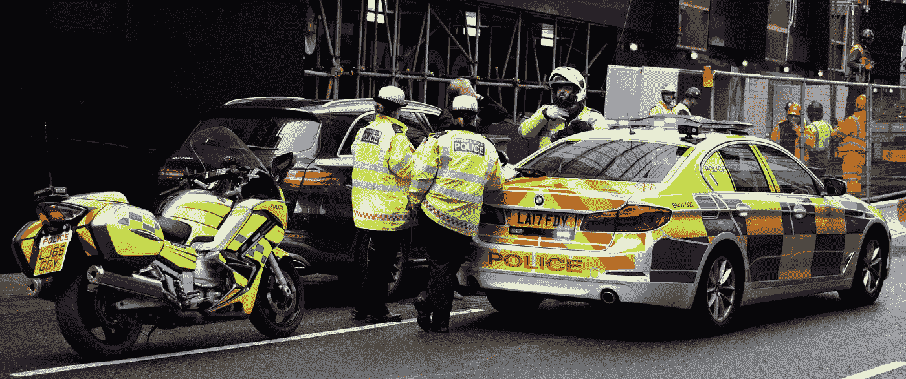
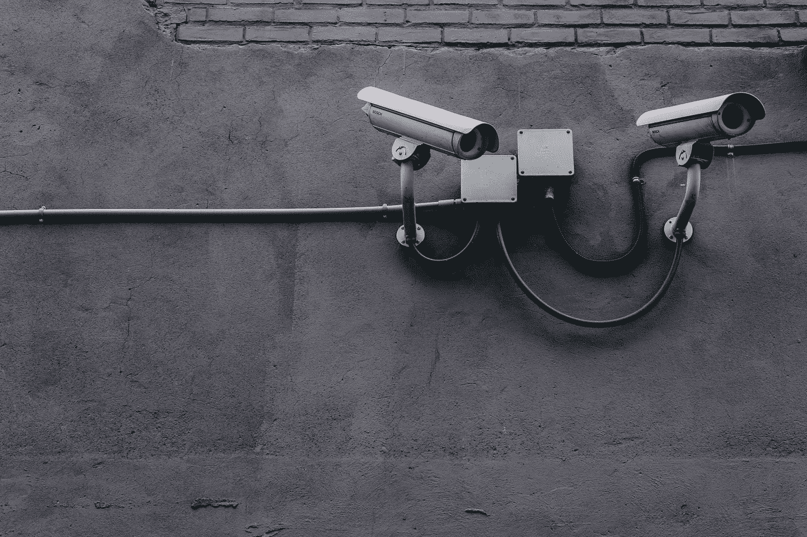

# 面部识别的严重后果

> 原文：<https://towardsdatascience.com/the-severe-consequences-of-facial-recognition-e4260f961b84?source=collection_archive---------19----------------------->

## 必须不惜一切代价反对面部识别的快速启动。原因如下。

随着国家和企业数字监控的兴起，以及 2013 年[斯诺登的爆料](https://www.theguardian.com/world/interactive/2013/nov/01/snowden-nsa-files-surveillance-revelations-decoded#section/1)，许多人在数据的数字控制、全球大规模监控以及最近的**面部识别**等问题上采取了非常支持隐私的立场。

那么，什么是面部识别呢？面部识别正是它听起来的样子:基于面部特征(如肤色、面部毛发和生物数据)识别你的面部的技术。尽管这看起来很简单(事实也确实如此)，但是在大规模的社会范围内将它引入人类生活的想法会引起很多关注。

在我深入研究面部识别的批评以及它的引入可能带来的后果之前，我想仔细看看这项技术的最近历史。为此，我们需要看一下两个特定的实体:

*IBM 和纽约警察局(NYPD)。*

2001 年 9 月 11 日恐怖袭击后，西方世界，尤其是美国，陷入了一种不确定感。这主要是因为袭击粉碎了任何外国或非国家行为者不能袭击美国的想法或观念。

在袭击发生后的几个月里，时任总统乔治·w·布什签署了《爱国者法案》,使之成为法律，并开始修建道路，最终通过美国情报机构和其他盟国进行大规模全球监控。

Photo by [Matthew Henry](https://unsplash.com/@matthewhenry?utm_source=unsplash&utm_medium=referral&utm_content=creditCopyText) on [Unsplash](https://unsplash.com/s/photos/surveillance?utm_source=unsplash&utm_medium=referral&utm_content=creditCopyText)

根据*截获的*和“[机密公司文件](https://www.documentcloud.org/documents/4452844-IBM-SVS-Analytics-4-0-Plan-Update-for-NYPD-6.html)”，很明显“[IBM 开始开发这种物体识别技术](https://theintercept.com/2018/09/06/nypd-surveillance-camera-skin-tone-search/)”，并通过“[秘密获取 NYPD 的摄像机镜头](https://theintercept.com/2018/09/06/nypd-surveillance-camera-skin-tone-search/)。*还表示，截击*是到 2012 年，“IBM 正在创建新的搜索功能，允许其他警察部门通过头发颜色、面部毛发和肤色搜索摄像机镜头中的人的图像”。

对于一般人来说，这可能只是一种将犯罪嫌疑人逼入更小的身份识别因素的方法，但当考虑到美国各种警察部队严重的种族偏见时，这并不意味着什么。

*The Intercept* 还报告了 IBM 没有对提出的许多问题做出回应的事实，包括但不限于以下内容:

*为什么没有公开与 NYPD 的合作？*

*视频分析的当前可用性状况如何？*

NYPD 提供的视频片段是做什么用的？

## 面部识别不起作用:

据《独立报》报道，当伦敦警察厅使用"[面部识别软件](https://www.independent.co.uk/news/uk/home-news/met-police-facial-recognition-success-south-wales-trial-home-office-false-positive-a8345036.html)时，结果显示，高达"[98%的警报都是误报"，因此该软件"](https://www.independent.co.uk/news/uk/home-news/met-police-facial-recognition-success-south-wales-trial-home-office-false-positive-a8345036.html)[还不适合使用](https://www.independent.co.uk/news/uk/home-news/met-police-facial-recognition-success-south-wales-trial-home-office-false-positive-a8345036.html)"。

*The Independent* 还报道称，自 2017 年 6 月开始使用该软件以来，南威尔士警方在 15 次部署中总共有“【2,400 次误报”。

Photo by [Oliver Hale](https://unsplash.com/@4themorningshoot?utm_source=unsplash&utm_medium=referral&utm_content=creditCopyText) on [Unsplash](https://unsplash.com/s/photos/london-police?utm_source=unsplash&utm_medium=referral&utm_content=creditCopyText)

这些巨大的不准确性概述了识别软件在未来潜在可用所必需的发展。报告的错误可能会在现实世界中造成非常毁灭性的影响，包括但不限于虚假指控、国家骚扰等。

## 侵犯和侵犯隐私权:

人们一次又一次地看到政府机构超越了法律的范围。例子包括国家安全局(NSA)违反隐私法，特别是关于“[在美国境内未经授权监视美国人或外国情报目标](https://www.washingtonpost.com/world/national-security/nsa-broke-privacy-rules-thousands-of-times-per-year-audit-finds/2013/08/15/3310e554-05ca-11e3-a07f-49ddc7417125_story.html)。

即使在后斯诺登时代隐私倡导的大规模超载和《自由法案》的通过之后，事情并没有改变，该法案本应有助于遏制美国境内正在进行的违宪监控。2016 年， *The Verge* 报道称，NSA“[收集了超过 1.51 亿条关于美国人电话通话的记录](https://www.theverge.com/2017/5/3/15527882/nsa-collecting-phone-records-us-citizen-metadata)，这促使电子前沿基金会(EFF)等个人和组织开始[进一步要求删除该程序本身](https://act.eff.org/action/end-the-nsa-s-call-detail-records-program-once-and-for-all)。

Photo by [Scott Webb](https://unsplash.com/@scottwebb?utm_source=unsplash&utm_medium=referral&utm_content=creditCopyText) on [Unsplash](https://unsplash.com/s/photos/national-security-agency?utm_source=unsplash&utm_medium=referral&utm_content=creditCopyText)

如果数百万美国人的隐私被故意侵犯，为什么人们应该期待面部识别技术被不同地使用？事实已经一次又一次地表明和证明，国家机构不愿意正确地通过可用的法律方法来获取私人信息，因此面部识别不应该以任何其他方式处理。

## 结论:

除了缺乏功能和侵犯隐私之外，还有许多其他问题，例如错误识别少数群体和活动分子的威胁，以及情报组织缺乏针对其他国家或非国家行为者的保障措施。

在目前的状态下，面部识别不是一种可以被各种国家机构使用的技术，并且在大多数情况下应该被明确反对，以防止它具有的许多缺点。如果人们关心学术研究人员、活动家团体、调查记者和其他需要隐私来安全开展工作的个人所做的私人工作，那么这些人应该非常反对进一步实施生物特征数据收集。