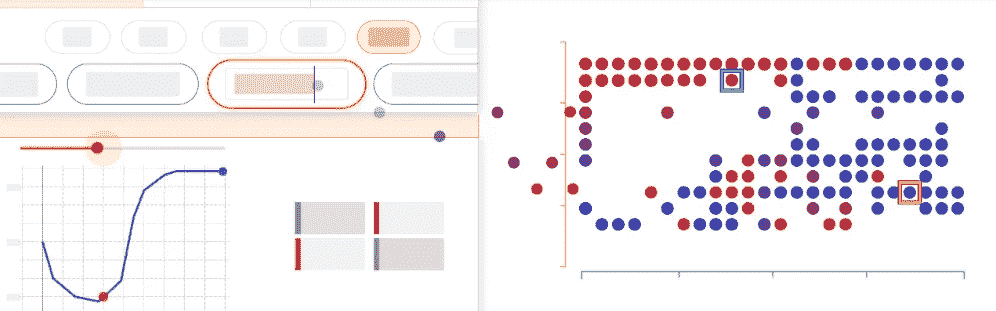

# 数据科学家:22 世纪最性感的工作

> 原文：<https://towardsdatascience.com/the-sexiest-job-of-the-22nd-century-ffe753e1d155?source=collection_archive---------3----------------------->

## 问这三个问题，确保雇主已经为你做好了准备

数据科学被称为“[21 世纪最性感的工作](http://bit.ly/sexy21cjob)”——如果我看到更多的商业领袖雇用数据科学家进入我们可以有效工作的环境，我会相信这种观点。相反，我们中的许多人感到被误解和被忽视。

Image: [Source](http://news.nus.edu.sg/highlights/data-science-training-public-sector)

# 下个世纪最性感的工作

我们是帮助[为你的业务启发](http://bit.ly/quaesita_analysts)新方向，降低你让[重要决策](http://bit.ly/quaesita_statistics)付之一炬的风险，以及[通过机器学习和人工智能自动化不可言喻的](http://bit.ly/quaesita_simplest)的人。我们[让你们的数据变得有用](http://bit.ly/quaesita_datasci)，然而你们却让我们生活在资源贫乏的环境中。你要求我们与下列人讲和:

**不熟练的领导** —如果没有擅长领导和管理数据科学职能的人员[，我们的日子会很难过。如果决策者不擅长合理分配工作并做出](http://bit.ly/quaesita_dsleaders)[数据驱动的](http://bit.ly/quaesita_inspired)决策，数据科学家实际上是[无用的](http://bit.ly/quaesita_bubble)。

**无数据** —如果你在[数据工程师](http://bit.ly/quaesita_eng)之前雇佣数据科学家，通常意味着我们没有数据可处理，我们必须首先为你建立数据工程功能，否则我们将被迫卷铺盖走人。如果我们留下，我们最终会做一份你声称雇佣我们的工作以外的工作。我已经[说过](http://bit.ly/quaesita_aibias)并且我会继续说下去:你需要高质量的[数据](http://bit.ly/quaesita_hist)数据科学才能有效。我们不是神奇的小妖精，所以我们不能为你无中生有。

令人讨厌的工具——数据科学开发工具是一种痛苦。生态系统是支离破碎的，尤其是在人工智能方面，即使是最好的选择也远非完美。总有一些事情让旅途变得颠簸。

如果你在面试一份数据科学的工作，确保你询问了你的潜在雇主关于这三点的计划，这样你就不会陷入悲伤的境地。别忘了问一下*人* - **的**工作是什么，以确保你有[数据](http://bit.ly/quaesita_hist)？如果你所有的见解都没有用在任何事情上，谁会被解雇？谁负责挑选您使用的工具，并确保它们与所有其他基础设施配合良好？

如果所有这些问题的答案都是***YOU***——也许是因为公司不知道什么是数据科学(但[无论如何都想要它](http://bit.ly/quaesita_bubble))——那么适当地设定你的期望。你将不得不自己完成多项工作，大致按照这个顺序来处理它们。在学校接受 [#6](http://bit.ly/quaesita_roles) 训练？你可能在几年内都不会接触到那些很酷的贝叶斯网络(而且到时候你也不太可能真正使用它们，因为你会忙于管理你建立的团队)。它可能非常适合你，但是请你一定要看看(并且想一想！)三思而后行。

我已经写了很多关于[领导力](http://bit.ly/quaesita_dsleaders)和[数据](http://bit.ly/quaesita_hist)的文章，所以现在是我提到工具的时候了。应用[数据科学家](http://bit.ly/quaesita_datasci)(包括那些从事 [ML/AI](http://bit.ly/quaesita_emperor) ) [不想从零开始构建我们的工具](http://bit.ly/quaesita_kubeflow)(那是一项不同的工作——如果我们想要，我们早就在里面了)。例如，我们更愿意使用一个现有的包来制作一个[直方图](http://bit.ly/quaesita_hist)，而不是编写在屏幕上显示矩形的代码。如果你要开一家餐馆，要求我们自己生产就像要求你自己制造微波炉一样。如果有必要的话，我们会建造它们，但是我们更喜欢直接进入烹饪阶段。

# 与撒旦一起工作

有时候，管理层强加给数据科学家的专有工具甚至比他们自己拼凑的工具还要糟糕。我记得我的朋友们给它起了个绰号叫“撒旦”，意思是，“是的，我知道这在 [*R*](http://bit.ly/vanillar) *中需要一行代码，但是你可能需要一整天的预算来让它在撒旦中工作。”当你手中的工具糟糕透顶时，你很难在心中歌唱一天。*

# 从设计师的角度来看

有时候，可用工具的问题是旁观者的看法——也许你沮丧的根源是你选择了一个不是为你制造的工具。我们来看看 Google origin 的两个工具。Keras 不仅是一个漂亮的 API，而且它是以数据科学家的理念构建的。例如， [Keras](http://keras.io) 的错误消息旨在指导数据科学家的下一步行动，因此它们简洁且看起来友好，而 [TensorFlow](http://bit.ly/quaesita_tf) 中的一个等效错误则抛出了一堆杂乱的[狄更斯式比例](http://bit.ly/dickens4m)。

如果你已经戴上了设计思维的帽子，这不会让你感到惊讶；作为 AI 的工业车床， [TensorFlow](http://bit.ly/quaesita_tf) 最初的设计并没有考虑到数据科学用户。它是为在谷歌范围内开辟新领域的研究人员而设计的…而且它很擅长它的用途。这也是你经常想要扼杀的工具。

Hurray for [TF 2.0](http://bit.ly/quaesita_tf2), which is going all-in on usability! There might be teething pains as TF switches over to Keras style and says bye bye to making you write all that boilerplate, but I’m excited. One might even say I’m [eager](https://www.tensorflow.org/guide/eager).

对我们数据科学类型的人来说，好消息是，甚至 [TensorFlow](http://bit.ly/quaesita_tf) 也变得更加可爱了。新的 [2.0 版本](http://bit.ly/quaesita_tf2)正朝着我们的方向发展，这已经显示出来了。让我们为数据科学家开始说“*我喜欢 TensorFlow* ”的那一天欢呼吧(相对于*“我容忍 TensorFlow，因为它是在这个规模上处理我的数据的唯一东西”*)。

我很高兴成为明确将数据科学家确定为主要用户的 [TensorFlow](http://bit.ly/quaesita_tf2) 计划的一员。我期待在未来的帖子中告诉你的一个例子是 [*假设工具*](http://bit.ly/whatiftool) ，它使模型理解、偏差检测和 ML 数据探索变得容易。该团队包括一名用户体验设计师，他的任务是让数据科学家们高兴...从*第 1 天*！可以在这里偷偷看一下结果[。](http://bit.ly/whatiftool)

Curious to know what you’re looking at? Find out more about the What-If Tool [here](http://bit.ly/whatiftool).

# 如果它不是为你做的，它可能不适合你

重要的是花点时间思考你正在考虑学习的工具的起源，以及它的构建者在指导新版本开发时向其提议的社区。

# 买之前先试试

当我们这样做的时候，如果您正在为您的组织调用工具，不要在您的数据科学家对工具进行测试之前就承诺使用它。你可能会认为这是不言而喻的，但撒旦却有不同的暗示。考虑挑选一款专为零售领域分析师打造的工具，并将其直接插入您的医疗保健公司？哦亲爱的。

您可能需要考虑一些来自专业工程师的工具支持，这样您的数据科学家就不会痛苦了。您当前的分析师可能没有签约处理对他们来说感觉像一件垃圾的东西，他们可能没有足够的时间来了解询问工具(以及对这些工具的工程支持！)在他们的采访中。

# 笑点

如果你是一名正在寻找新工作的数据科学家，不要忘记检查一下你将要信任的人是否了解你的需求。向潜在雇主提出关于数据、决策者和工具的问题。确保他们拥有我们需要的快乐和有效的东西。不要以为雇主在这个世纪已经为你做好了准备。如果你热爱这份工作，我不希望看到你成为另一个没有数据的公司的数据科学主管！

Image: [Source](http://blog.eyecuelab.com/2016/04/29/breaking-your-coders-block/)

# 感谢阅读！人工智能课程怎么样？

如果你在这里玩得开心，并且你正在寻找一个为初学者和专家设计的有趣的应用人工智能课程，这里有一个我为你制作的娱乐课程:

Enjoy the entire course playlist here: [bit.ly/machinefriend](http://bit.ly/machinefriend)

# 喜欢作者？与凯西·科兹尔科夫联系

让我们做朋友吧！你可以在 [Twitter](https://twitter.com/quaesita) 、 [YouTube](https://www.youtube.com/channel/UCbOX--VOebPe-MMRkatFRxw) 、 [Substack](http://decision.substack.com) 和 [LinkedIn](https://www.linkedin.com/in/kozyrkov/) 上找到我。有兴趣让我在你的活动上发言吗？使用[表格](http://bit.ly/makecassietalk)联系。