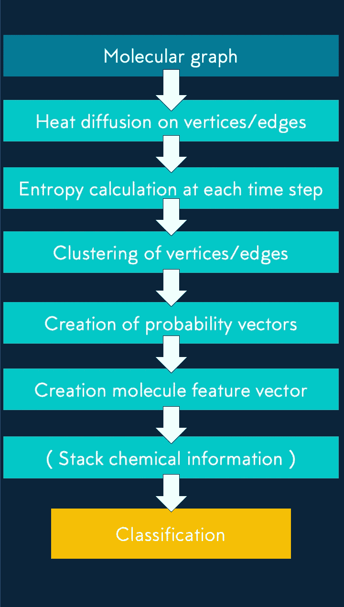

# 化学函数的形状

> 原文：<https://towardsdatascience.com/the-shape-of-chemical-functions-d1e1568d020?source=collection_archive---------23----------------------->

## “形式服从功能”这句话我们能走多远？用数据回答。

> 弗朗切斯科·帕斯，弗朗切斯科·帕尔马，马特奥·曹尔西，托马斯·博伊斯

[https://github . com/Giotto-ai/the-shape-of-chemical-functions](https://github.com/giotto-ai/the-shape-of-chemical-functions)(简单安装说明如下。)

即使你第一次呆在一个房间里，你周围的物体也会让你感到非常熟悉。最微小的细节将包含足够的信息来识别一个物体并将其与一个功能联系起来。物体看起来像什么，我们不严格地称之为它的形状，告诉我们一些更深层的东西:它的功能，物体做什么。

想一想，很不寻常的是，短暂的一瞥一个无生命的物体会唤起你可以用它做的所有事情。如果是藏在一张纸下面的一副耳机，或者是你家工具棚里一件积满灰尘的旧工具，不需要深入分析，你大概会对它的功能有一个极其有见地的猜测。

## 我们能把形式和功能分开吗？

嗯……想象一下不能区分电锯和面包刀。

Objects with the same form might not always have the same function…

对于复杂的进化系统来说，恰当地检验这个问题似乎很困难，因为这个系统有影响自身的力量。然而，对于像化学这样基础的东西，我们可以期待一个不那么偏颇的答案。

## 让我们更深入地探讨这个问题

在化学中，毫无疑问，分子的形状对决定它们的功能有一定的作用。蛋白质构成我们的皮肤，携带血液中的氧气，帮助我们的肌肉运动等等。在我们的身体内部，蛋白质根据它们被赋予的任务呈现出许多特殊的形状，例如，支架帮助细胞移动并保持其形状，酶由于特殊的口袋而加速生物机械反应。虽然这些形状比日常物体复杂得多，但蛋白质的结构在多大程度上反映了它在体内的作用？

Proteins are made up of long strands of smaller molecules called amino acids, which twist and fold into specific shapes.

# 形状对分子的功能有多重要？

让我们尝试给这个问题一个定量的答案。如果形状信息决定了分子的功能，那么仅仅依靠形状特征就有可能建立高度精确的预测模型。

## 检验假设:一种分子是 HIV 抑制剂吗？

因为我们一次只能测试一个化学反应，所以我们简化了问题，并试图预测一个分子是否会执行一个确切的功能。在我们的案例中，我们专注于预测一种分子是否能抑制 HIV 的传播。

> 要从分子中提取形状，自然要用到一些拓扑。

## 简单地说，结果

仅依靠形状信息，我们成功地在 AUC-ROC 中达到 0.74 的分数。我们通过包括关于键的性质的基本化学信息来实现进一步的性能提升，达到 0.77。今天的技术水平达到了 0.78。非常可敬！

复制我们的结果所需的代码是完全可用的，可以在[这个库](https://github.com/giotto-ai/the-shape-of-chemical-functions)中找到。要运行其中包含的 Jupyter 笔记本，您需要:a)下载存储库的内容；b)按照[自述文件](https://github.com/giotto-ai/giotto-learn/blob/master/README.rst)中“开发者安装”下的说明，安装最新(非发布)版本的开源库 [giotto-learn](https://github.com/giotto-ai/giotto-learn) 。很快，这些实验性的特性将可以通过`pip`更简单地获得，而不需要克隆库的 repo，所以请继续关注！

# 数据和方法

HIV 数据集由药物治疗计划引入，以鼓励 HIV 抑制化合物的研究，它被收录在 [MoleculeNet](http://moleculenet.ai/) 中。对于 4 万种化合物中的每一种，他们测试了该化合物是否抑制艾滋病毒的复制，从而产生了数据集的二进制标签。这两类是不平衡的，因为只有 2%的分子是抑制剂。为此，我们选择了 [AUC-ROC](https://en.wikipedia.org/wiki/Receiver_operating_characteristic) 指标。

将分子表示为图形是很常见的:将化合物的原子视为顶点，将化学键视为顶点之间的边。在我们下面描述的设置中，我们从分子图中提取形状信息。

> 为了在预测模型中使用这种形状信息，我们需要从图形中提取特征。

## 创建特征向量来比较图形

如果我们的假设成立，希望当两种化合物结构相近时，它们会有相似的功能。我们如何构建嵌入来突出图形之间的结构相似性？

让我们想象一下，我们嵌入了图的顶点，以便表示它们在图中的角色(中枢与孤立节点)。

如果一个图与另一个图相似，那么它的许多顶点在向量空间中具有相似的嵌入，因此得到的分子特征向量应该在嵌入空间中是接近的。因此，我们将问题简化为确定顶点的嵌入，这些顶点对它们在图中扮演的角色进行编码。

## 产生顶点嵌入的热流模拟

我们可以把一个顶点的作用想象成它连接图中所有其他顶点的方式。通过模拟一个单位的热量如何从一个顶点扩散到图表的其余部分，我们可以量化扩散的速度和范围，从而量化其作用。完整的方法在[这里](http://snap.stanford.edu/graphwave/)公开。

对于给定数量的时间步长，我们使用拉普拉斯图来模拟热扩散。作为扩散的度量，我们取扩散的每个时间步的熵。因此，一旦这个过程开始，你就以固定的时间间隔测量扩散，并在给定的时间步数内停止扩散。我们认为 40 英镑是合理的。

Diffusing heat from the red node to the rest of the graph

通过在 40 个时间步长的每一步测量图的熵，每个原子都有一个 40 维的表示。

## 顶点特征向量

最后，我们准备好了特征向量。我们对嵌入的顶点执行 k 均值聚类，我们选择 k=10。然后，顶点的特征向量由属于 10 个聚类中的每一个的 10 维概率向量给出。

## 我们对边缘重复同样的过程

多亏了霍奇理论，也有可能研究同样的扩散过程，但这次是在图的边缘。通过重复前面的步骤，我们可以将另一个特征向量叠加到我们的模型中。

## 分子特征向量

我们通过堆叠以下两个向量来获得分子的特征向量:

*   属于分子的顶点的矢量和
*   该矢量将属于分子的边相加

为了测量我们在分子特征向量上叠加的化学信息的影响:

*   每种类型的键的总数(单键、双键、三键和芳香键)

## 分类

是时候把这些特征输入到你最喜欢的分类器中了。在我们的例子中，我们选择一个具有两个隐藏层的神经网络，分别具有 32 和 64 个 Relu 神经元。

The 2-hidden layer neural obtained in cross

# 结果

从分子图中提取的特征所实现的性能给出了令人印象深刻的 0.74。化学信息将性能提升到 0.77，接近使用大量化学信息的最新内核 SVM 所达到的 0.78。在这里找到[的书房。](https://pubs.rsc.org/en/content/articlelanding/2018/sc/c7sc02664a#!divAbstract)

Our results on predicting HIV inhibitors with only structural features

State of the art results in AUC-ROC on predicting HIV inhibitors

结构特征击败了包含更广泛特征的次优模型。形状确实是功能的一个很好的代理，即使简单的化学属性会导致性能的提升。尽管如此，值得注意的是，除了形状之外，几乎没有什么化学信息是接近最先进性能所必需的。

# 链接:

*   [Github 上的 Giotto 库](https://github.com/giotto-ai/giotto-learn)
*   [包含代码的笔记本](https://github.com/giotto-ai/the-shape-of-chemical-functions)
*   [网站上的更多学习资料](https://giotto.ai/)
*   [足球的形状](/the-shape-of-football-games-1589dc4e652a)及其[笔记本](https://github.com/giotto-ai/noise-to-signal)
*   [检测股灾](/detecting-stock-market-crashes-with-topological-data-analysis-7d5dd98abe42)及其[笔记本](https://github.com/giotto-ai/stock-market-crashes)
*   [人口动态的形状](/the-shape-of-population-dynamics-ba70f253919f)及其[笔记本](https://github.com/giotto-ai/beetles-tda)