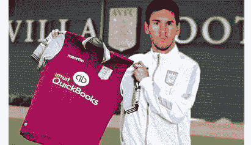
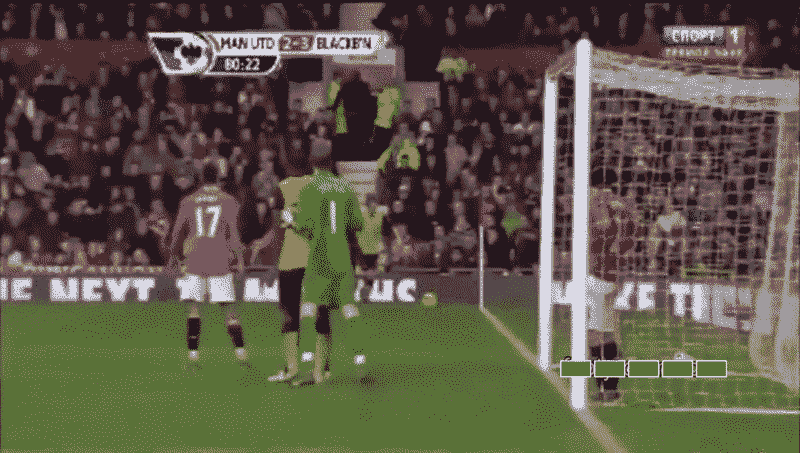
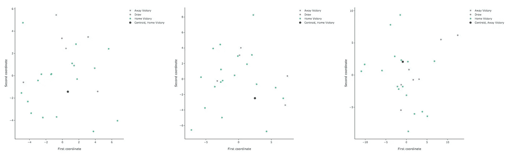
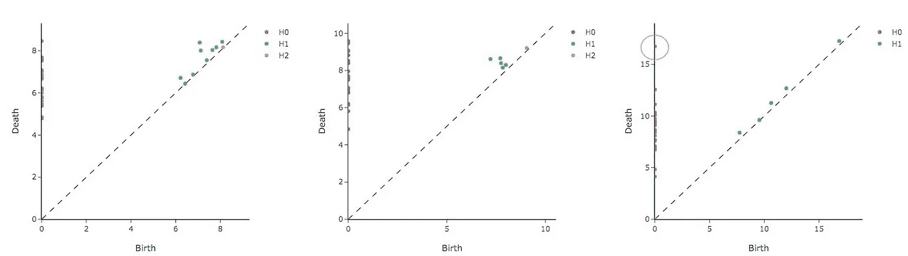
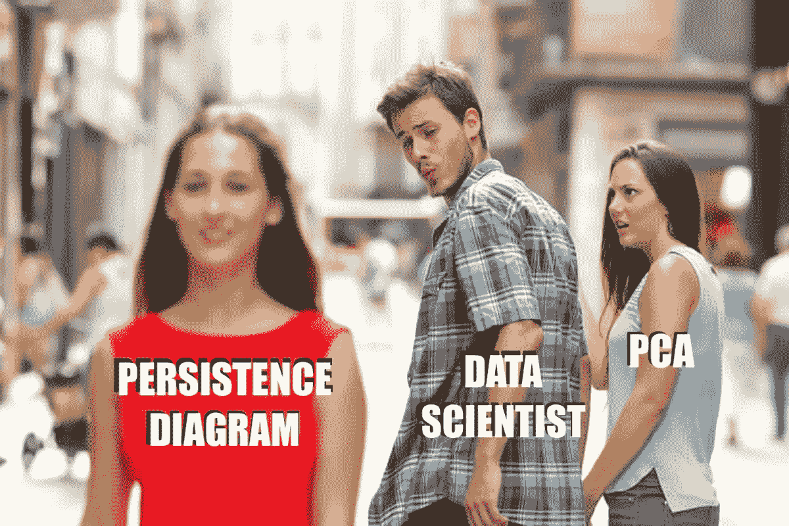
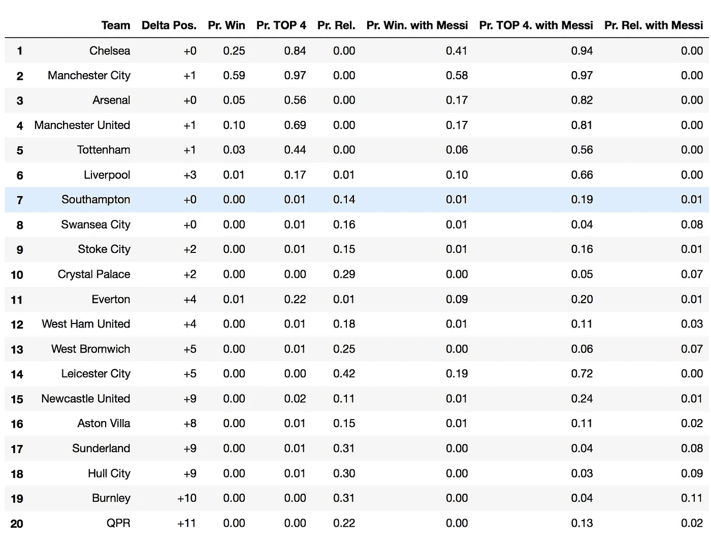
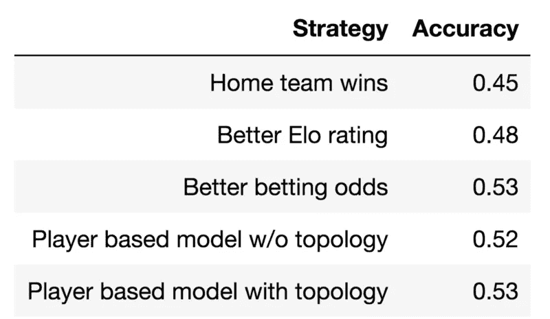
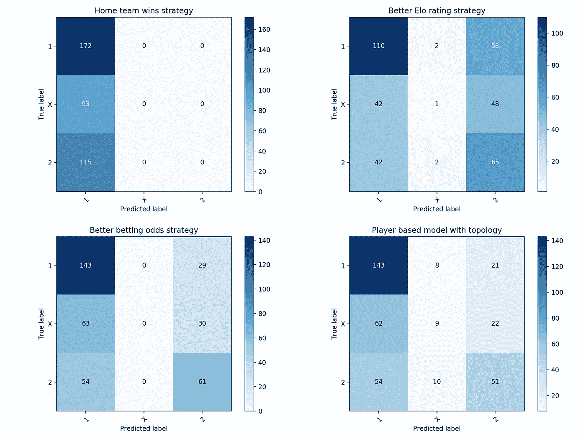

# 足球比赛的形式

> 原文：<https://towardsdatascience.com/the-shape-of-football-games-1589dc4e652a?source=collection_archive---------15----------------------->

## *使用球员特征和拓扑数据分析模拟足球比赛的结果*

> 由弗朗切斯科·帕尔马、迭戈·费奥里、丹·泰特斯·萨拉詹、阿莱西奥·巴切利、马特奥·德·奥斯皮纳和托马斯·博伊斯创作

如果你是一个足球迷，你会渴望梅西加入你的球队。你的队会赢得冠军吗？它至少能避免降级吗？由于梅西不能加入每个人的团队，我们选择使用数据和模拟来推断答案。EA Sport 的 Fifa 数据集是我们球员特征的代理，TDA(拓扑数据分析)是模拟每场比赛结果概率的 spice。通过对这些概率的模拟，我们得出了英超联赛最有可能的最终排名。

Messi is only joining Aston Villa in our Python Jupyter Notebook (source:[https://twitter.com/concarp98](https://twitter.com/concarp98/))

> 今年击败克洛普需要谁？

我们的模型允许您组成您的团队，并衡量团队在排行榜中的年终排名的整体影响。自己试试模型，python 代码在[这里](https://github.com/giotto-ai/football-tda)有，数据在这里:[匹配](https://www.openml.org/d/42197)，[赔率](https://www.openml.org/d/42198)， [tda 特色](https://www.openml.org/d/42188)，[玩家统计](https://www.openml.org/d/42194)，[玩家姓名](https://www.openml.org/d/42199)(原始来源[这里](https://www.kaggle.com/hugomathien/soccer))。

# 系统模型化

> **假设 1:** 一场足球比赛的产出只取决于场上球员的具体和组合属性。

大多数教练不同意这种假设，因为我们忽略了团队精神、天气、周内比赛导致的疲劳、伤病、黄/红牌、换人、战术、个别球员的个人承诺、赛季时间、球迷的特殊承诺以及其他许多可能影响比赛结果的内部和外部因素。

Walter Mazzari, former Watford manager, became a reference while he was at F.C. Internazionale in 2014 for the iconic sentence: “we were playing well, and then it started raining”. (source:[https://www.standard.co.uk](https://www.standard.co.uk))

话虽如此，你可能已经明白了第一个不可否认的事实:

> **我们的模型明显是错的**(任何模型都是…) **。**

无论是作为球员、教练、球迷、服务员、替补队员还是园丁，任何人都知道，在预测比赛结果时，要考虑的信息量比可以记录的信息量更大。看台上的一声尖叫，裁判的一声误判，或者午餐菜单上的虾，都可能危及比赛的整体结果。一些受人尊敬的科学家声称，足球只是随机的，或者像证明费马大定理一样困难(除了我们对后者有 129 页的数学证明)。

Professor Andrew Wiles proved Fermat’s last theorem in 1994\. After 358 years we finally have a proof that “t*here are no whole number solutions to the equation x^n + y^n = z^n when n is greater than 2, unless xyz=0”. Will somebody ever find a solution for predicting the outcome of football matches? (source:*[http://www.ox.ac.uk](http://www.ox.ac.uk))

我们当然知道，没有任何预测模型可以完美地预测足球比赛的结果。我们的目标是看看拓扑数据分析的不可知论方法是否可以在每个团队的七个聚合特征的微小集合中识别相关模式。

我们使用 EA 给每个玩家的 24 个属性来设计攻击和防御特性。初始属性相关矩阵给出了构建后者的方向。为了生成整个团队的特征，我们基于初始匹配组合构建了以下 7 个特征:

守门员的等级

团队中最大攻击值

团队中最大防御值

队内平均攻击力

队内防守一般

团队攻击的标准偏差，以百分比表示

团队防守的标准差，以百分比表示

我们基于过去六个英超赛季的 2591 场比赛训练了一个模型来估计每场比赛结果的概率。我们对 14/15 赛季的 380 场比赛进行了测试，并提供了最终排行榜的模拟。

# 动机

2011 年 12 月 31 日，弗格森爵士 70 岁了，曼联将在老特拉福德迎战排名最后的布莱克本流浪者队。在最后一场比赛中，流浪者队以 1 比 7 惨败。那天晚上，那些期待弗格森的球队再次表现的人会非常惊讶。布莱克本以 2 比 0 领先，并在最后 10 分钟以 3 比 2 锁定胜局。

> 那天晚上，幸运的下注者在赌场赢了 28:1。

The Rovers’ future captain Grant Campbell Hanley scored the victory goal at Old Trafford. At that time the Scottish defender was just 20, he left Blackburn in 2016 with 183 appearances and 8 goals. (source:[https://www.dailymotion.com](https://www.dailymotion.com))

不幸的是，在老特拉福德的这场奇迹般的胜利并没有让布莱克本免于降级。另一方面，从长远来看，这些分数对红魔来说是致命的。那晚错过的机会导致在最终排行榜上不可思议的平局。曼城和曼联都以 89 分结束了这个赛季。由于一个更好的净胜球，市民赢得了奖杯，给曼联留下了苦涩的余味。

> 太好了。但是为什么是拓扑呢？

虽然这一事件对曼联来说似乎不可预测，但拓扑结构清楚地将这场比赛与布莱克本的比赛和与相同水平球队的对抗区分开来。例如，我们考虑同一赛季曼联对西布朗和曼联对博尔顿。

让我们试着理解为什么我们的比赛如此特别(这样你就可以计划下一次去赌场)。我们可以做的第一件事是研究比赛的空间，一场比赛是 14 维空间中的一个点(记住每个队有 7 个特征，一场比赛有 7+7=14 个特征)。我们使用主成分分析的前两个部分，以我们考虑的每个匹配为中心来可视化相似的匹配。

2-dimensional PCA representation for Man-Utd vs West Brom. 3–0, Man-Utd. vs Bolton 2–0 and Man-Utd. vs Blackburn 2–3

> 你用主成分分析看不到的，你可以用 TDA 看到

这三个图是用来描述匹配的 14 个特征的投影，精确到两个，并且已知投影会丢失信息。我们使用 TDA 从原始空间中恢复和可视化结构。我们使用的工具是一个持久性图(在 [Giotto](https://giotto.ai) 中可用！).持久性图是数据集在点的连通性方面的表示，它是通过逐步连接相邻点并测量结构的同源性而获得的。这是一种理解、可视化和从数据中提取特征的新方法。如果你想更多地了解 TDA，我们推荐这个[帖子](/persistent-homology-with-examples-1974d4b9c3d0)。

Persistence diagram for Man-Utd vs West Brom. 3–0, Man-Utd. vs Bolton 2–0 and Man-Utd. vs Blackburn 2–3

三个持久性图是在与 PCA 情况相同的点云上计算的。图中的点不再匹配，而是描述了原始空间中的点之间的关系。在我们的例子中，它描述了三个匹配点周围的点云的形状。

> 持久性图告诉您局部和全局结构

从前两个图中，我们可以看到所有的连通分量(用橙色点表示)都集中在 y 轴上[5，10]之间。此外，环(由绿点表示)集中在框[6，8]x[6，8]中，并且它们到 y=x 的最大距离是 1。

在最后一张图中，橙色点更加分散，极值点(0，17)表示较晚与数据集的其余部分连接的组件。最重要的是，绿点在 y=x 线上也更加分散，它们总体上更靠近这条线。

> 第三张图的结构暗示了一个异常值

事实上，橙色的点(0，17)代表了人类之间的融合。Utd。-Blackburn 与剩余的匹配，这意味着该匹配比它在 PCA 图中所表示的更远。

持久性图很棒，但是它们不能直接输入到预测模型中。您将需要知道如何将持久性图转换成模型的特性。

> 我们使用一种叫做*振幅函数的技巧来合成*图表*中的信息。*

关于我们如何从持久性图中提取特性的更详细的解释也包含在我们正在分享的 Python Jupyter 笔记本中。

# 结果

单个比赛的模型已经训练好了:我们现在准备运行整个赛季的一些模拟。你可以选择一个小队，看看他们能走多远。作为对模型的测试，我们研究了每个英超球队转会梅西的影响。

> 不出意外，雇佣梅西总是好的。

有梅西在你的球队，你降级的几率平均下降 12%，把奖杯带回家的几率平均增加 4%，进入前四的几率增加 14%。最需要梅西的球队是女王公园巡游者队，他们将在排行榜上攀升 11 个位置。最初获得第 14 名，模拟概率为 72%，莱斯特城将获得欧冠资格。

下面是第 14-15 季的原始排行榜，以及以下各项的模拟概率:

*   赢得冠军，
*   进入前 4 名
*   被降级

每个阵容里有没有梅西。

Leaderboard for Premier League season 14–15, including simulated probabilities with and without Messi

# 模型评估

排行榜模拟的质量直接反映了模型在预测比赛结果方面的准确性。我们对持久性图中的 14 个特征+特征使用随机森林分类器，并根据一些基线预测策略测试该框架:

1)预测主队总是获胜(基线)

2)根据团队绩效计算的 Elo 评分

3)通过投注赔率给出的市场预测

Accuracy of predictive strategies on 14–15 season

在上表中，我们给出了测试集上每个策略的准确性。下面我们比较了这些预测的混淆矩阵。

Confusion matrix of the different predictive strategies

> 结果证实:足球是随机的。即使是博彩公司也只有 53%的比赛赔率是正确的。

我们的结果与博彩赔率给出的结果相当，与博彩赔率有惊人的强相关性。结果很有趣，因为我们的模型依赖于过于简单的数据。我们的模型具有预测抽奖的非凡能力(代表 27%的结果)。

当提供其他年份和其他锦标赛的数据时，该模型具有很好的通用性。在没有“看过”意大利比赛的情况下，同一模型在预测 2015/2016 赛季意甲比赛时的准确率为 52%。这对于团队特定的策略(如 Elo 评级)来说是不可能的。

也许这个模型最好的属性是它在建立和测试团队时的灵活性。我们不仅可以混合球队和模拟锦标赛，我们还可以做出明智的转会决定。在预算固定的情况下，你可以根据球员的成本和收益来优化他们的最佳组合。

Lionel Messi is playing in Barcelona since 2011, maybe it’s time for him to join other teams at least virtually…(source:[https://metro.co.uk](https://metro.co.uk/2019/09/26/fifa-deny-world-player-year-award-fixed-lionel-messi-win-10813224/))

# 结论

我们的尝试是给一个复杂的三元分类问题一个简单的解决方案。拓扑模型在非常有限的一组要素上实现了很好的准确性，并且它可以与常见的方法相媲美，尽管灵活性较差。

我们已经在梅西身上试过了，现在我们很好奇，罗纳尔多会表现得更好吗？

*参考文献:*

 [## 持续同源:一个带有例子的非数学介绍

### 在数据科学中使用拓扑数据分析(TDA)工具

towardsdatascience.com](/persistent-homology-with-examples-1974d4b9c3d0) 

[https://arxiv.org/abs/1710.04019](https://arxiv.org/abs/1710.04019)