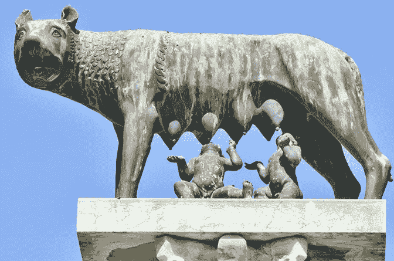
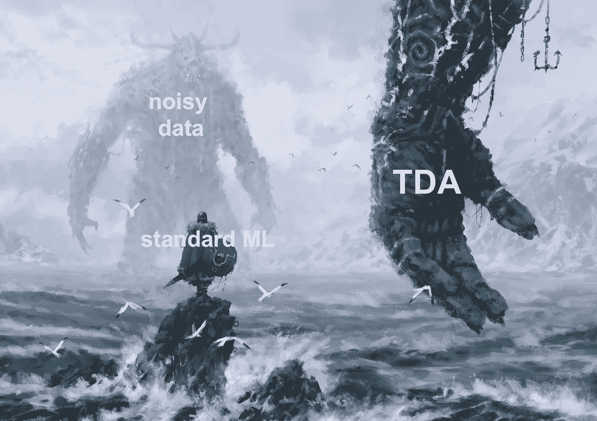
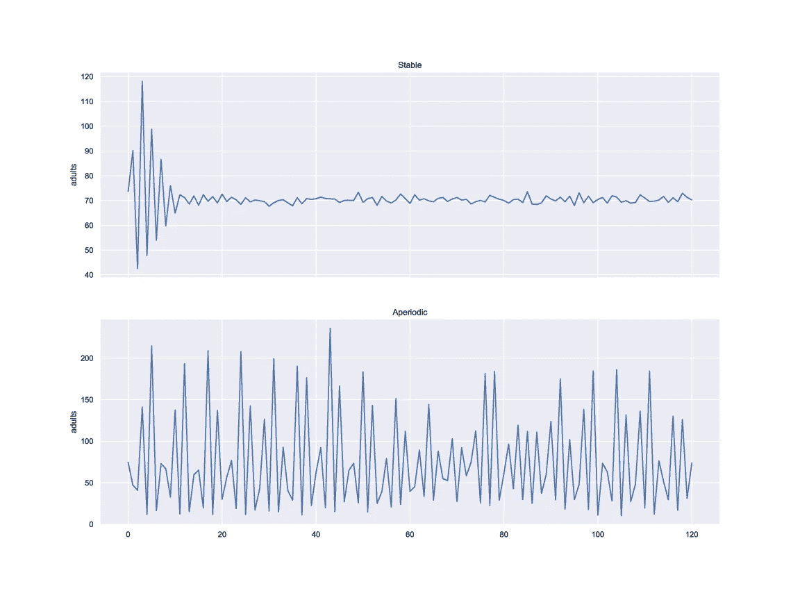
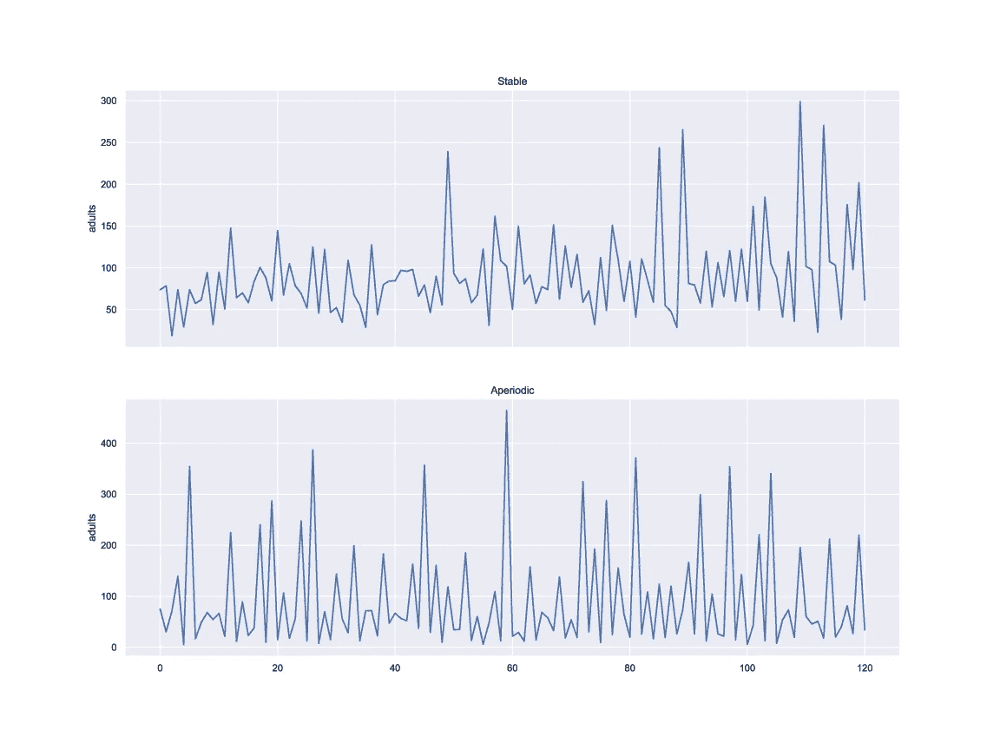
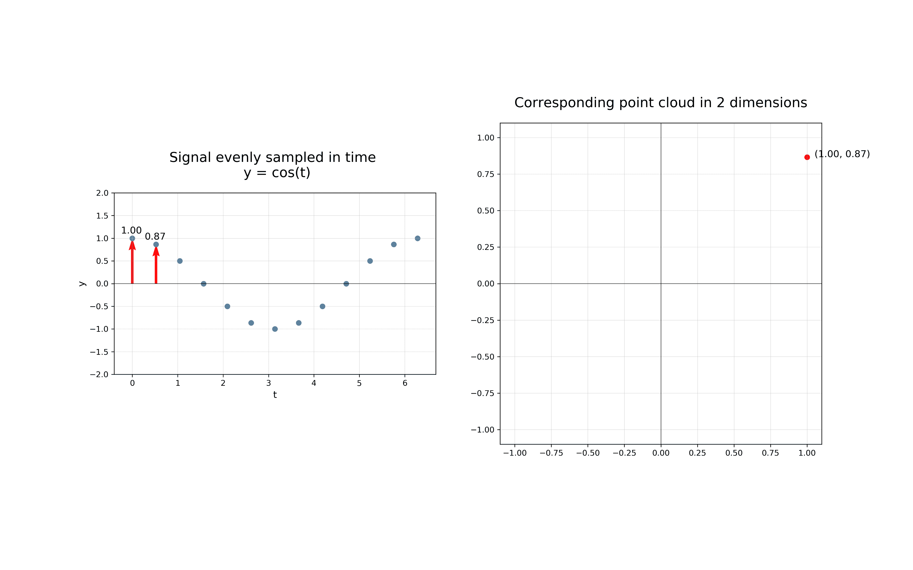
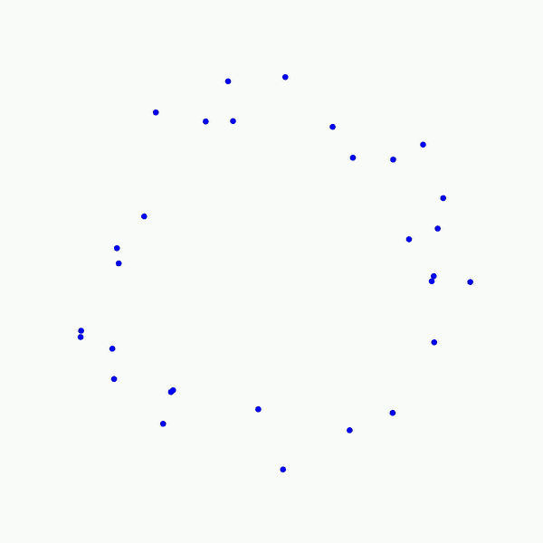
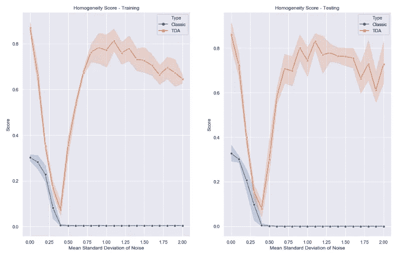
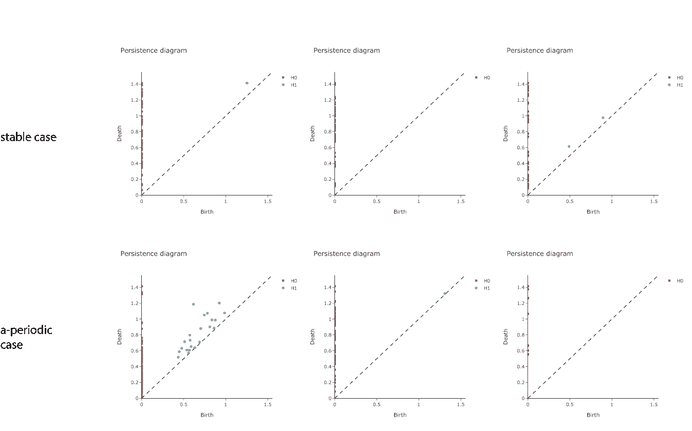

# 人口动态的形状

> 原文：<https://towardsdatascience.com/the-shape-of-population-dynamics-ba70f253919f?source=collection_archive---------23----------------------->

## *利用拓扑数据分析研究种群动态*

> 由弗朗西斯科·帕尔马、[菲利普·魏勒](https://medium.com/@p.weiler)、[路易斯·汤斯顿](https://medium.com/@lewis.c.tunstall)和[托马斯·博伊斯](https://medium.com/@t.boys_87095)编剧。

[https://github.com/giotto-ai/beetles-tda](https://github.com/giotto-ai/beetles-tda)

尽管狼以凶猛的杀手而闻名，但 1995 年在黄石国家公园重新引入狼使该地区恢复了生机。随着狼群将鹿和驼鹿从河流和山谷中赶走，植被开始重新生长。由于栖息地更加丰富，鸟类和海狸等较小的动物开始在水边定居。因此，就像罗穆卢斯和雷穆斯的情况一样，狼可以被认为是生命的承载者。

According to the legend, the twin brothers Romulus and Remus were abandoned on the river Tiber to die. Thanks to the help of a she-wolf they managed to survive and founded the city of Rome in 753 BC, [Source](https://www.rome.net/romulus-and-remus)

> 人口动态会表现出违反直觉的行为。

今天，濒危物种的数量在增加。在不危及整个生态系统的情况下识别和保护它们是一个真正的挑战。这就是为什么我们从早期预警信号中得出正确的行动是至关重要的。

> "每一个作用总会有相反的反作用."牛顿第三定律

就像牛顿写了一个方程解释作用和反作用之间的关系一样，我们可以依靠数学方程来描述人口动态。这种内在的建模方法揭示了种群内部起作用的机制，例如对资源消失的反应。

> 在固有模型中，噪声项捕捉环境的不确定性

要测量人口数据中的重复模式，自然要寻求一种稳定且通用的方法，如拓扑数据分析(TDA)。我们的文章探讨了拓扑特征如何被用来分类非周期性和稳定的人口增长机制。

> 我们发现，仅用几个拓扑特征，即使包含显著的噪声，也有可能提高简单基线模型的性能。

我们采用的方法受到佩雷拉和德梅洛工作的启发。我们使用开源库 [Giotto-learn](https://github.com/giotto-ai/beetles-tda) 提供代码来复制我们的结果。

# 模拟种群的进化

农业受到一种臭名昭著的甲虫的损害——赤拟谷盗。它是如此之小，以至于在不到几克的面粉中就能找到数百个样本。当缺乏资源时，这种甲虫依靠同类相食来恢复种群平衡。因此，它们可以作为捕食者和猎物，使它们成为一个自给自足的生态系统。

> 面粉甲虫通过同类相食来自我调节它的种群。

为了达到稳定的种群，甲虫会自我监控每只成年甲虫的可用资源比例。然而，这种监控操作的成功并不意味着一定会失败。在没有任何外部刺激的情况下，成年甲虫的数量级会无休止地波动，永远不会达到稳定的数量级。

皇家诺顿·查普曼于 1928 年首次提出了增长模型，我们用来模拟人口动态的增长模型可以在 20 世纪 70 年代由[康斯坦丁诺等人](https://www.nature.com/articles/375227a0)撰写的文章中找到。我们用他们的差分方程模拟了*赤拟谷盗*面粉甲虫种群。我们的目标是确定成年甲虫种群是处于稳定状态还是非周期性状态。

Two regimes of adult beetle population as function of time

Two regimes of adult beetle population with increased environmental uncertainty

> 我们表明，TDA 方法比基线模型更好地区分了这两种情况。TDA 特征是高度可预测的，以区分甲虫种群中的稳定和非周期性状态。此外，即使在环境条件高度不确定的情况下，它们也能保持预测性。

# 用 TDA 聚类时间序列

面粉甲虫是种群动力学中一个被充分研究的例子，它表现出两种截然不同的行为:稳定的和非周期性的。对于许多其他物种来说，这种洞察力是不存在的，并且为它们的进化找到一个合适的模型是乏味的。

然而，我们可以依靠数据科学来洞察不同模式的人口动态。我们设计了一种基于相似性度量的不可知方法来聚类人口时间序列。基线方法是将每个人口时间序列视为一个高维向量，并对其进行聚类。

我们的方法依靠 TDA 来降低问题的维度，压缩并保留时间序列中包含的基本模式。流水线包括以下处理步骤:

## 1.应用 [Takens 嵌入](https://docs.giotto.ai/generated/giotto.time_series.TakensEmbedding.html#giotto.time_series.TakensEmbedding):

Takens 嵌入背后的思想是将一维时间序列 *y(t)* 嵌入到一个 *d-* 维空间中。在连续数据的情况下，我们将时间序列离散化(任何方法都可以)，并且我们通过在彼此距离*的 *τ* 处选择 *d* 点来应用滑动窗口方法。*这些值成为代表 *d-* 维空间中时间窗口的矢量坐标。

A Takens’ embedding on a sinus curve exhibits a loop in the embedding space (here d=2, *τ=1)*

通过在时间序列上逐步滑动时间窗口，并重复该操作，我们获得了数据在维度 *d* 中的新表示。

> 塔肯夫妇的嵌入给了我们一个新的视角来揭示隐藏的模式。

这种嵌入需要调谐参数，例如嵌入尺寸 *d* 或时间延迟 *τ。*两者都可以通过实验或最小化特定问题的损失函数找到。

> 在 [giotto-learn](https://github.com/giotto-ai/giotto-learn) 中，时延 *τ* 是从时延互信息的内置最小化中获得的。

## 2.建造 Vietoris-Rips 综合体:

我们使用 Vietoris-Rips (VR)算法来研究这个点云的形状和连通性。当半径递增的两个球(以每个点为中心)相交时，VR 算法连接两个点。这样的过程让我们可以观察连接组件的合并，以及洞(圆)的创建和塌陷。下面的 GIF 图展示了 2D 背景下的概念:

The Vietoris-Rips algorithm produces a sequence of graphs by progressively connecting the dots

## 3.计算持久性图表:

持续图总结了包含在由 VR 算法产生的图形序列中的拓扑信息。该总结包括一对 *(b，d)，*，其中 *b* 和 *d* 分别表示拓扑特征(组件/孔/空隙)出现和消失的半径。

## 4.从持久性图中提取特征:

持久性图提供了关于点云的定性信息，但它们不是向量！这就是为什么我们不能直接使用它们作为特性。有许多方法可以将持久性图转化为特征向量，例如使用两个持久性图之间的距离(有许多[和](/the-shape-that-survives-the-noise-f0a2a89018c6)的例子)。我们使用

1.  每一维孔的平均寿命。
2.  每个维度的孔数。
3.  “存活”时间超过给定阈值的洞数。该阈值被选择为空穴最大寿命的一部分(在维度中)。
4.  每尺寸孔的最大寿命。
5.  图表的幅度。它充当持久性图的规范，因为它采用持久性图和平凡图(图中所有点位于直线上 *y=x* )之间的距离。

## 5.对要素执行聚类

我们对生成的 TDA 特征应用 k 均值聚类，k=2。

# 结果

> TDA 特征包含内在模型中没有的性能提升信息。

仅使用所述特征的 TDA 方法总是优于使用 120 个特征的基线。基线的[均匀性分数](https://scikit-learn.org/stable/modules/generated/sklearn.metrics.homogeneity_score.html)随着环境中噪声的增加而不断降低。一旦噪声的标准偏差的平均值达到 0.5，基线方法仅找到单个聚类。

Homogeneity score for baseline (blue) and TDA approach (red) as a function of noise

TDA 方法也遭受了性能的早期下降，这可以通过两种情况之间日益增加的相似性来解释。当进一步增加噪声时，性能恢复，这表明通过 TDA 透镜观察，两种情况再次变得不同。我们可以通过查看三个示例案例的持久性图来验证这一点:

The persistence diagrams of two sample behaviors as the noise increases (from left to right). Red points represent connected components, and green points represent holes.

1.  确认该方法捕获了明显的情况，持久性图的第一列清楚地区分了稳定和非周期性的情况。
2.  对于中间的情况，随着噪声的增加，在稳定和 a 周期情况的图之间没有客观差异。这解释了在 0.25 噪声附近观察到的性能下降。
3.  当噪声达到最大值时，两个持久性图再次变得不同。

# 结论

> TDA 的特点是性能提升和抗噪音

为了理解我们如何在时间序列的集合中识别不同的聚类，TDA 提供了相关的特征来压缩时间序列的主要特征，同时保持对噪声的鲁棒性。在我们的例子中，九个特性足以将性能提高几个数量级。

## 链接:

*   [Github 上的 Giotto 库](https://github.com/giotto-ai/giotto-learn)
*   [装有密码的笔记本](https://github.com/giotto-ai/beetles-tda)
*   更多学习资料请访问[网站](https://giotto.ai/)
*   [足球的形状](/the-shape-of-football-games-1589dc4e652a)及其[笔记本](https://github.com/giotto-ai/football-tda)
*   [检测股灾](/detecting-stock-market-crashes-with-topological-data-analysis-7d5dd98abe42)及其[笔记本](https://github.com/giotto-ai/stock-market-crashes)
*   [噪音背后的形状](/the-shape-that-survives-the-noise-f0a2a89018c6)及其[笔记本](https://github.com/giotto-ai/noise-to-signal)