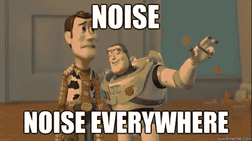
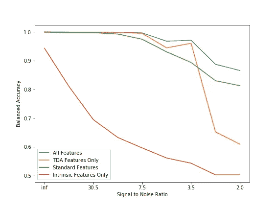
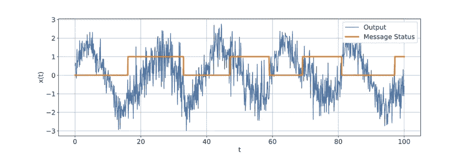
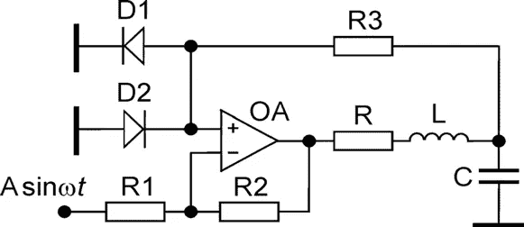
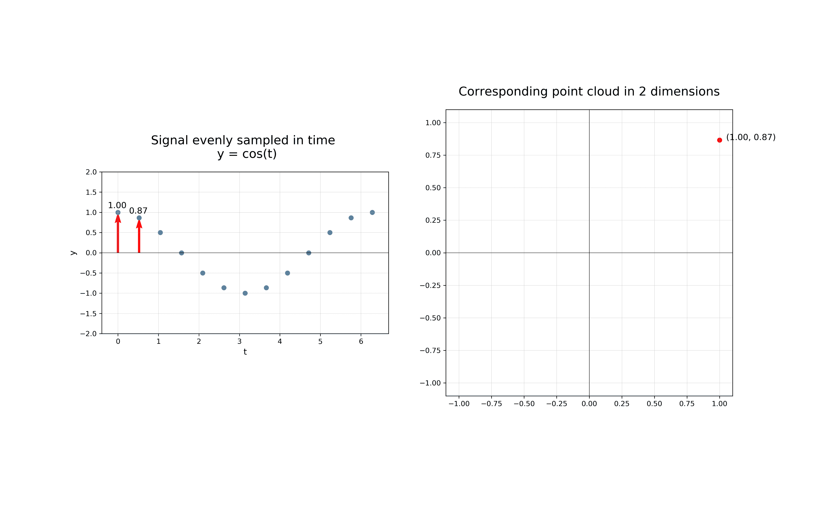
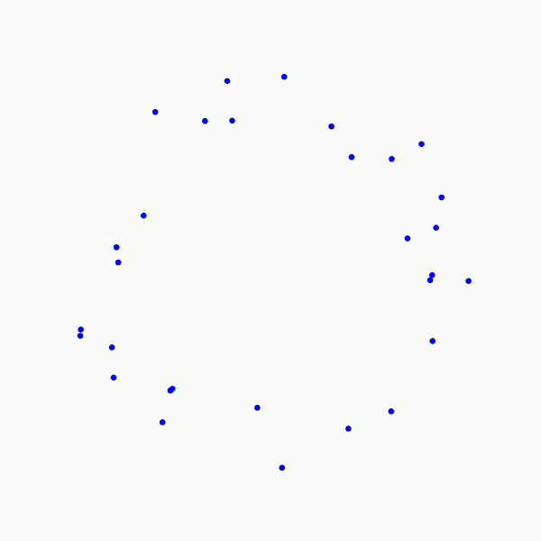
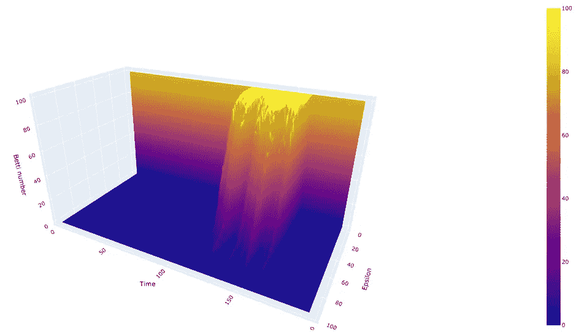
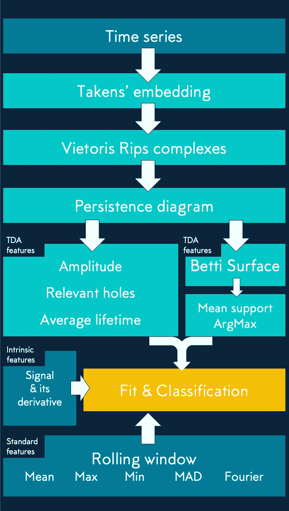
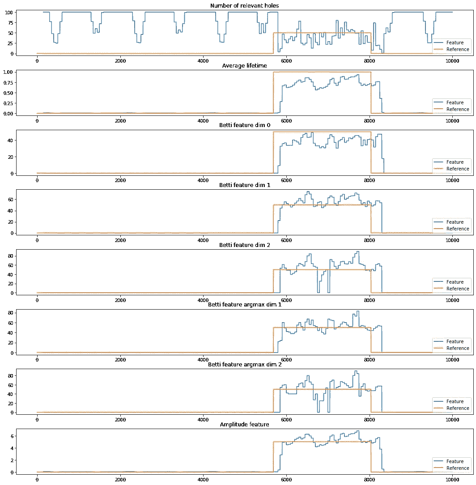
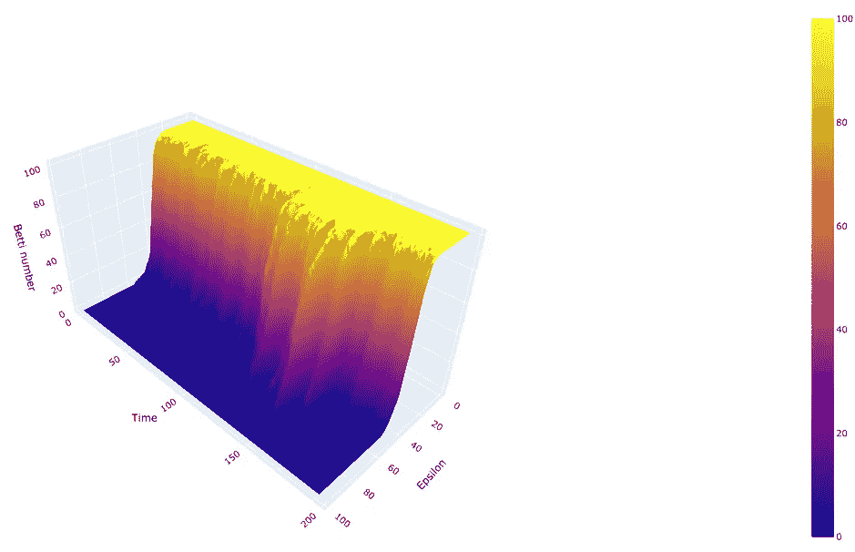

# 在噪音中幸存的形状

> 原文：<https://towardsdatascience.com/the-shape-that-survives-the-noise-f0a2a89018c6?source=collection_archive---------12----------------------->

> 由科林·卡林、菲利普·魏勒、玛尔塔·安吉洛、菲利普·阮、本杰明·罗素和托马斯·博伊斯撰写。

[https://github.com/giotto-ai/noise-to-signal](https://github.com/giotto-ai/noise-to-signal)

因为处理噪声先于任何类型的模型拟合，所以您希望有一种透明的方法来从噪声中提取稳健的信号。

> 去除噪声是一项永无止境的任务，快速修复会危及整个分析。

Sisyphus is forced to roll an immense boulder up a hill only for it to roll down when it nears the top, repeating this action for eternity.

> TDA 通过提取数据的基本形状来去除噪声。

典型的方法包括滤波(卡尔曼滤波器…)和平滑策略(指数移动平均…)。这些方法都侧重于时间平均法，并在噪声频率远高于希望提取的信号频率的假设下工作。相比之下，TDA 主要不是基于简单的时间平均，而是从每个固定时间提取结构信息。

# 噪声信号中隐藏信息恢复的应用

我们考虑在噪声下预测状态变化的问题。为了了解哪些特征集最适合预测状态变化，我们构建了四个模型来执行二元分类任务。每个模型都是使用不同的特征集构建的:两组特征不包含 TDA，一组仅使用 TDA 特征，另一组包含所有组合特征。

Noise, when good theory meets dirty practices. It is that unwanted party in your signal.

## 我们的结果简而言之

TDA 的特征对于*快速*检测噪声信号关键特征的细微变化具有高度的预测性。

> 这些功能优于标准功能。它们还包含标准方法中没有的性能提升信息。

下面，我们针对标准特征创建策略，使用 TDA 特征对复杂数字电路系统中的快速状态检测进行基准测试。

我们发现，在高噪声区域，TDA 特征比标准特征策略产生了显著的性能提升。TDA 不仅优于单独的标准策略，当两者结合时，它在标准策略之上提供了明显的性能提升。因此，它清楚地包含与标准特征中存在的信息不相交的预测信息，并且因此可以增强预测。

Detection accuracy as noise is added to data

# 问题陈述

阿里和朱莉想要分享一个隐藏的信息，以组织他们在英镑商店的秘密假日购物(波亚卡莎:他的[代码](https://github.com/giotto-ai/noise-to-signal)可用)。

Ali explaining his message because the signal was too noisy.

> 隐藏在众目睽睽之下:隐写术是一种将一个信号隐藏在另一个信号中的艺术。

阿里狡猾地隐藏了他们秘密会面的地点、日期和时间，用橙色信号表示的 1 和 0 的序列，有点像莫尔斯电码。为了隐藏信号，他通过杜芬振荡器转动信号，输出蓝色信号，里面隐藏着信息。

Message in orange and noisy carrier signal by Duffing oscillator in blue.

为了隐藏消息，Ali 根据他的消息(橙色信号)的数字改变了 Duffing 振荡器的“A”参数。这种变化在具有不同拓扑属性的杜芬振荡器的两个*状态*之间切换输出信号。重要的是，这两种体制无法用肉眼区分。这使得它们适合在显眼的地方隐藏信息。

Duffing oscillator circuit, electronic circuits are great source of data to study periodic and chaotic signals. Figure by [**Elena Tamaševičiūtė**](https://www.researchgate.net/profile/Elena_Tamasevicit) **et al.**

其混沌输出允许杜芬振荡器用于 T2 信号提取和检测任务。在信号处理领域，尤其是实时信号处理领域，对于所有方式的滤波任务、异常检测和信号提取，使用特定电路是常见的。

## 重建信息

最终，Julie 需要从蓝色信号的“状态变化”中重建信息(橙色信号)。她使用 ML 分类器通过识别两种机制来提取信息，但只有当她拥有正确的特征创建步骤时才会成功。

为了训练她的解码器，Julie 测量了 Duffing 电路的电压输出(她将其分为训练/测试 140，000 点和 60，000 点)。每个测量值都配有一个标签，表明它属于哪个区域。

# 特征创建

固有特性是直接测量输出信号的电压及其时间导数。

标准的时间序列特征是由许多不同大小的滚动窗口创建的。我们在滚动窗口中创建的特征是平均值、最大值、最小值、移动平均差(MAD)和前几个傅立叶系数。

## TDA 特色

我们的目标是根据时间序列的状态看到拓扑不同的点云(从而提取信息)。TDA 的特征是使用[乔托](https://github.com/giotto-ai/giotto-learn)库创建的。

为了创建 TDA 特征，我们使用 Takens 嵌入法将我们的时间序列嵌入到一个更高维度的空间中(在这里[解释](/detecting-stock-market-crashes-with-topological-data-analysis-7d5dd98abe42))。滚动窗口的每一步都被转换成高维空间中的单个向量(其维度是窗口的大小)。

Takens embedding in dimension two.

拓扑研究每个点云中的连通性。我们应用 Vietoris-Rips 算法，该算法通过一条边连接在某个距离阈值下的点，并且通过改变该阈值，V-R 以不同的粒度级别创建点云的近似。

Vietoris-Rips algorithm.

发现以下特征是有效的预测因素。

## 孔特征的总数

关于漏洞的信息包含在持久性图中。它是逐渐连接距离(ε)越来越大的点的结果，我们用它来创建 Betti 曲面。Betti 表面计算作为ε和时间的函数的数据中存在的孔的数量。

Betti surface showing the 1 and 0 regimes in the Duffing oscillator output.

## 相关孔特征

相关孔特征计算超过给定阈值大小(大于最大值的 70%)的孔的数量。

## 图表特征的振幅

我们使用图范数作为图中所有洞的总持久性的度量。

## 平均支持特征

在 Betti 曲面中产生非零 Betti 值的ε距离的平均值。

## ArgMax 功能

argmax 特征是每个时间窗的 Betti 数最高的ε值。

## 平均寿命特征

对于每个维度，我们取持久性图中空穴的平均寿命(=固定时间的 Betti 表面)。

# 管道

Steps of the feature creation and model fit pipeline.

## 特征说明

我们演示了在噪声杜芬振荡器上的管道中创建的功能，其中隐藏着阿里的消息。我们清楚地看到，TDA 特征在这么短的时间内确定了 1 和 0 的状态:

Topological features output from the Jupyter notebook.

# 结果

> 我们可以清楚地识别出两个性质不同的区域。

即使在噪声状态的情况下，Betti 表面也清楚地区分信号的 1 和 0 区域。

Betti 数在隐藏信号的 0 区域中比在 1 区域中下降得更快(随着ε增加)。

梯度增强分类器输出处理如下:首先，我们应用滚动窗口并计算其中的平均值。接下来，我们将高于预定义阈值的所有值标记为 1，否则标记为 0。

为了便于比较，我们通过使用以下工具独立训练四次，对 TDA 功能进行了基准测试:

*   只有时报系列
*   一组标准的时间序列功能
*   TDA 特色
*   全部合并

为了测试对噪声的鲁棒性，我们在数据集的失真版本上训练每个配置(通过添加增加量的高斯噪声)。这是噪声函数的性能图:

Accuracy in function of noise.

我们看到，当我们使用所有功能时，可以实现最佳性能。因此，添加 TDA 特征提高了整体性能，并使分类器更能抵抗噪声。

在噪声被添加到信号之前，TDA 和标准策略都完美地执行。然而，这是一个难题，当我们加入噪音时，TDA 的表现优于标准策略，当两种方法结合使用时，表现更好。

这表明，不仅 TDA 特征本身具有高度预测性，而且它们还包含标准方法中没有的性能提升信息。

尽情探索您自己的抗噪信号处理 TDA 应用。

## 链接:

*   [Github 上的 Giotto 库](https://github.com/giotto-ai/giotto-learn)
*   [包含代码的笔记本](https://github.com/giotto-ai/noise-to-signal)
*   [网站上的更多学习资料](https://giotto.ai/)
*   [足球的形状](/the-shape-of-football-games-1589dc4e652a)及其[笔记本](https://github.com/giotto-ai/noise-to-signal)
*   [检测股灾](/detecting-stock-market-crashes-with-topological-data-analysis-7d5dd98abe42)及其[笔记本](https://github.com/giotto-ai/stock-market-crashes)