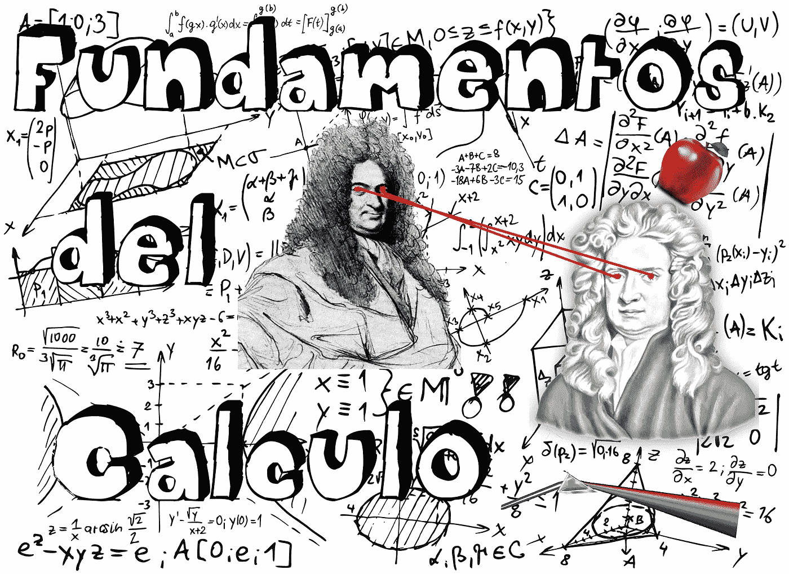
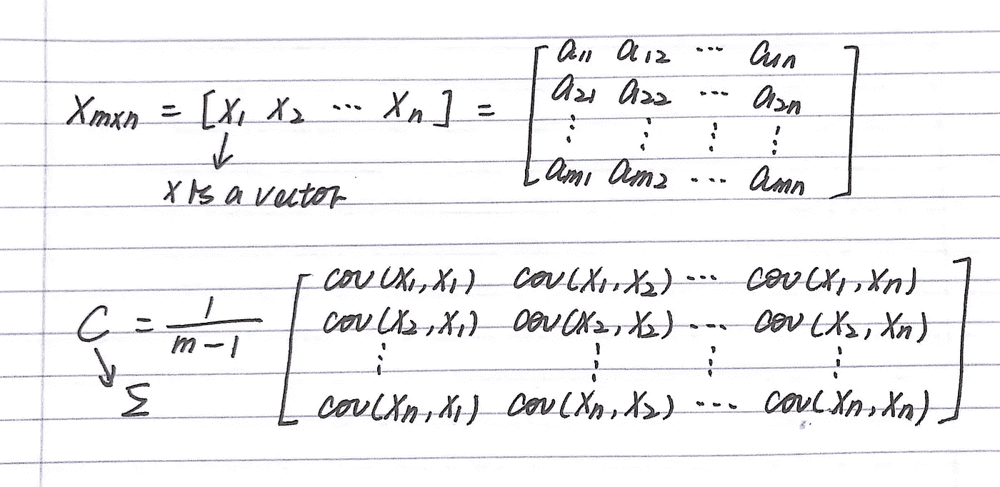
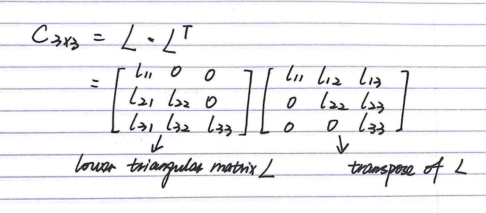
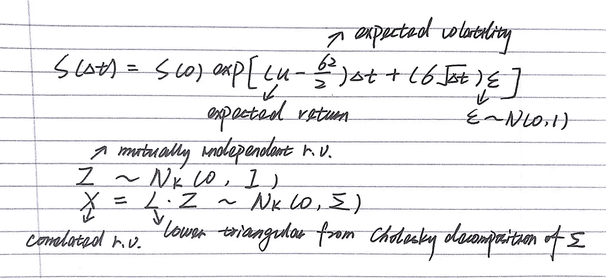
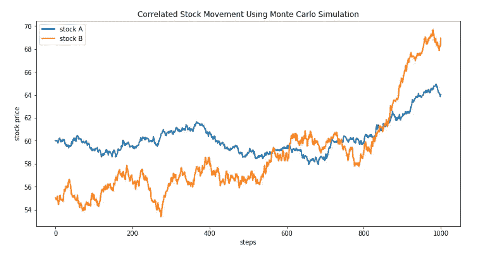

# 协方差矩阵的意义及其应用

> 原文：<https://towardsdatascience.com/the-significance-and-applications-of-covariance-matrix-d021c17bce82?source=collection_archive---------4----------------------->

## 线性代数和各种应用之间的一个联系

“数学的美妙之处在于简单的模型可以做伟大的事情。”现代数据科学中不乏花哨的算法和技术。技术容易学，但也容易落后。然而，从长远来看，数学基础是有益的。协方差矩阵是一个简单而有用的数学概念，广泛应用于金融工程、计量经济学以及机器学习中。鉴于它的实用性，我决定从我的记事本中总结一些要点和例子，并整理出一个有凝聚力的故事。



Photo from Pixabay

协方差衡量两个随机变量在总体中一起变化的程度。当总体包含更高维度或更多随机变量时，用一个矩阵来描述不同维度之间的关系。用一种更容易理解的方式来说，协方差矩阵就是将整个维度上的关系定义为任意两个随机变量之间的关系。



## 用例 1:随机建模

协方差矩阵最重要的特点就是正半定，这就带来了[](https://en.wikipedia.org/wiki/Cholesky_decomposition)*。*

**

*简单地说，乔莱斯基分解就是将一个正定矩阵分解成一个下三角矩阵与其转置矩阵的乘积。在实践中，人们用它来生成相关随机变量，方法是将分解协方差矩阵得到的下三角乘以标准法线。此外，矩阵分解在许多方面是有帮助的，因为使用隐藏因子来表征矩阵揭示了通用的属性，并且我们不经常能够显式地执行矩阵计算。*

*在金融工程中，蒙特卡洛模拟在期权定价中起着重要作用，在期权定价中，衍生品的收益取决于一篮子基础资产。给定股票价格演变的标准公式，该公式假设股票价格遵循几何布朗运动，相关股票价格可以通过将乔莱斯基分解应用于协方差矩阵来计算。*

**

*下面是我用 python 编写的一个简单例子，用这种方法模拟相关的股票价格路径。*

```
*import numpy as np
import matplotlib.pyplot as pltmu_a, mu_b = 0.2, 0.3 # annual expected return for stock A and stock B
sig_a, sig_b = 0.25, 0.35 # annual expected volatility
s0_a, s0_b = 60, 55 # stock price at t0
T = 1 # simulate price evolution for the next year
delta_t = 0.001 
steps = T/delta_trho = 0.2 # correlation between stock A and stock B
cor_matrix = np.array([[1.0, rho],
                       [rho, 1.0]])
sd = np.diag([sig_a, sig_b]) 
cov_matrix = np.dot(sd, np.dot(cor_matrix, sd)) 
L = np.linalg.cholesky(cov_matrix) # Cholesky decompositionplt.figure(figsize = (12, 6))
path_a = [s0_a]
path_b = [s0_b]
st_a, st_b = s0_a, s0_b
for i in range(int(steps)):
    V = L.dot(np.random.normal(0, 1, 2)) 
    st_a = st_a*np.exp((mu_a - 0.5*sig_a**2)*delta_t + sig_a*np.sqrt(delta_t)*V[0])
    st_b = st_b*np.exp((mu_b - 0.5*sig_b**2)*delta_t + sig_b*np.sqrt(delta_t)*V[1])
    path_a.append(st_a)
    path_b.append(st_b)
plt.plot(path_a, label = 'stock A', linewidth = 2)
plt.plot(path_b, label = 'stock B', linewidth = 2)
plt.legend()
plt.title('Correlated Stock Movement Using Monte Carlo Simulation')
plt.ylabel('stock price')
plt.xlabel('steps')*
```

**

## *用例 2:主成分分析*

*PCA 是一种无监督的线性降维算法，将原始变量转化为这些独立变量的线性组合。它将整个数据集投影到不同的特征空间，在该空间中，它可以对解释数据最大差异的维度进行优先排序。机器学习实践者利用 PCA 通过降低低方差维度来降低计算复杂度，以及创建更好的可视化。*

*PCA 和协方差方差是怎么联系起来的？ ***特征分解****

*就像乔莱斯基分解一样，特征分解是一种更直观的矩阵分解方式，通过使用矩阵的特征向量和特征值来表示矩阵。特征向量被定义为当对其应用线性变换时仅由标量改变的向量。如果 A 是表示线性变换的矩阵， *v* 是特征向量，λ是对应的特征值。可以表示为 *v* =λ *v.* 一个正方形矩阵可以有和它的维数一样多的特征向量。如果把所有的特征向量作为矩阵 V 的列，把相应的特征值作为对角矩阵 L 的元素，上述方程可以推广到 AV = VL。在协方差矩阵的情况下，所有的特征向量彼此正交，它们是新特征空间的主分量。*****

*参考资料:*

1.  *[https://skymind.ai/wiki/eigenvector#code](https://skymind.ai/wiki/eigenvector#code)*
2.  *[https://blog.csdn.net/thesnowboy_2/article/details/69564226](https://blog.csdn.net/thesnowboy_2/article/details/69564226)*
3.  *[https://datascienceplus . com/understanding-the-协方差矩阵/](https://datascienceplus.com/understanding-the-covariance-matrix/)*