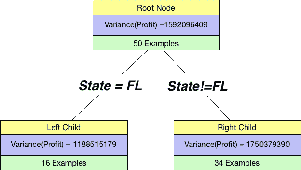

# 3 个决策树分裂标准背后的简单数学

> 原文：<https://towardsdatascience.com/the-simple-math-behind-3-decision-tree-splitting-criterions-85d4de2a75fe?source=collection_archive---------3----------------------->


Image by [Bela Geletneky](https://pixabay.com/users/photoshopper24-81349/?utm_source=link-attribution&utm_medium=referral&utm_campaign=image&utm_content=683437) from [Pixabay](https://pixabay.com/?utm_source=link-attribution&utm_medium=referral&utm_campaign=image&utm_content=683437)

## 🌀理解分割标准

决策树很棒，对各种任务都很有用。它们构成了业界大多数性能最佳的模型的主干，如 XGboost 和 Lightgbm。

但是它们到底是如何工作的呢？其实这是 ML/DS 面试中被问得最多的问题之一。

我们通常知道它们以逐步的方式工作，并且有一个树形结构，在这个结构中，我们根据某种标准使用某种特征来分割一个节点。

但是这些特征是如何被选择的，一个特定的阈值是如何被选择的呢？

***在这篇文章中，我将谈论决策树中使用的三个主要分裂标准以及它们为什么有效。这是一个已经被反复提及但从未真正做得足够好的东西。***

# 1.基尼杂质

根据维基百科，

> Gini 杂质是一种度量，用于衡量从集合中随机选择的元素被错误标记的频率，前提是根据子集中的标签分布对其进行随机标记。

简单来说，基尼杂质就是一个节点 中杂质的 ***度量。它的公式是:***


其中 J 是节点中存在的类的数量，p 是节点中类的分布。

为了更好地理解这个公式，让我们具体讨论一下二进制的情况，其中我们的节点只有两个类。

因此，在下面五个标有 A-E 的候选节点示例中，显示了正类和负类的分布，哪一个是理想状态？

我想你会说 A 或 E，你是对的。最糟糕的情况是什么？我认为在这个节点上数据正好是 50:50。


现在，这一切看起来很好，直觉上。基尼系数给了我们一个量化的方法。

让我们分别计算所有五个节点的基尼系数，并检查这些值。


✅基尼不纯的作品如预期的那样。节点 C 的最大值以及 A 和 e 的最小值。我们需要选择具有最小 Gini 杂质的节点。

我们还可以看到二元情况下的基尼系数图来验证上述情况。


Gini Impurity

❓So:我们如何在决策树中准确地使用它？

假设，我们有 UCI 心脏病的数据。“目标”字段是指患者是否存在心脏病。它是 0(不存在)或 1。


我们现在已经有了一个衡量标准(基尼系数)，我们可以用它来评估一个特定变量在某个阈值(连续的)或值(分类的)上的分裂。

## 分类变量拆分

为了简单起见，让我们从一个分类变量开始——性别。

如果我们按性别划分，我们的树将如下所示:


If we split on Gender

注意我们用 Sex =0 和 Sex！=0，因此这可以很好地推广到具有多个级别的类别。我们的根节点有 165 +ve 的例子和 138 -ve 的例子。当我们按性别分开时，我们得到两个子节点。

我们已经知道如何计算一个节点的杂质。所以我们计算左孩子和右孩子的杂质。

```
I_Left = 1 - (72/96)**2 - (24/96)**2
I_Right = 1 - (93/207)**2 - (114/207)**2print("Left Node Impurity:",I_Left)
print("Right Node Impurity:",I_Right)
---------------------------------------------------------------
Left Node Impurity: 0.375
Right Node Impurity: 0.4948540222642302
```

我们这里有两个数字。我们需要得到一个单一的数字来提供单一分裂的杂质。那我们该怎么办？我们应该取一个平均值吗？我们可以取一个平均值，但是如果一个节点只有一个例子，而另一个节点有所有其他的例子，会发生什么呢？

为了减轻上述影响，我们采用了两种杂质的加权平均值，该平均值由单个节点中的样本数进行加权。在代码中:

```
gender_split_impurity = 96/(96+207)*I_Left + 207/(96+207)*I_Right
print(gender_split_impurity)
----------------------------------------------------------------
0.45688047065576126
```

## 连续变量分割

我们也可以用连续变量来分割。让我们尝试使用数据集中的胆固醇特征进行分割。我们选择了 250 的阈值并创建了一棵树。


```
I_Left = 1 - (58/126)**2 - (68/126)**2
I_Right = 1 - (107/177)**2 - (70/177)**2print("Left Node Impurity:",I_Left)
print("Right Node Impurity:",I_Right)
---------------------------------------------------------------
Left Node Impurity: 0.49685059208868737
Right Node Impurity: 0.47815123368125373
```

只看两者接近 0.5 的杂质，就可以推断不是好的拆分。尽管如此，我们还是像以前一样计算加权基尼系数:

```
chol_split_impurity = 126/(126+177)*I_Left + 177/(126+177)*I_Right
print(chol_split_impurity)
---------------------------------------------------------------
0.48592720450414695
```

从`chol_split_impurity` > `gender_split_impurity`开始，我们根据性别进行划分。

事实上，我们评估了很多不同的拆分。对于连续变量有不同的阈值。以及分类变量的所有级别。然后选择在子节点中为我们提供最低加权杂质的分裂。

# 2.熵


Entropy == Randomness

另一种非常流行的在决策树中分割节点的方法是熵。熵是系统中随机性的度量。熵的公式是:


其中 C 是节点中存在的类的数量，p 是节点中类的分布。

再次讨论我们之前讨论过的二元情况。从 A 到 E 的所有 5 个案例的熵值是多少？


熵值按预期工作。节点 C 最大，A 和 e 最小。我们需要选择熵最小的节点。

我们也可以看到二元情况下的熵图来验证上述情况。


Entropy

那么我们如何在决策树中使用熵呢？

我们像以前一样使用心率示例。我们现在已经有了一个合适的度量(熵),使用它我们可以评估一个个体变量在某个阈值(连续的)或值(分类的)上的分裂。

## 分类变量拆分

为了简单起见，让我们从一个分类变量开始——性别。

如果我们按性别划分，我们的树将如下所示:


If we split on Gender

我们已经知道如何计算一个节点的随机性。所以我们计算左孩子和右孩子的随机性。

```
E_Left = -(72/96)*np.log2(72/96) - (24/96)*np.log2(24/96)
E_Right = -(93/207)*np.log2(93/207) - (114/207)*np.log2(114/207)print("Left Node Randomness:",E_Left)
print("Right Node Randomness:",E_Right)
---------------------------------------------------------------
Left Node Randomness: 0.8112781244591328
Right Node Randomness: 0.992563136012236
```

我们这里有两个数字。我们需要得到一个单一的数字来提供单次分裂的随机性。那我们该怎么办？我们再次采用加权平均，其中我们根据单个节点中的示例数量进行加权。在代码中:

```
gender_split_randomness = 96/(96+207)*E_Left + 207/(96+207)*E_Right
print(gender_split_randomness)
----------------------------------------------------------------
0.9351263006686785
```

## 连续变量分割

和之前一样，我们也可以用连续变量来分割。让我们尝试使用数据集中的胆固醇特征进行分割。我们选择阈值 250 并创建一棵树。


```
E_Left = -(58/126)*np.log2(58/126) - (68/126)*np.log2(68/126)
E_Right = -(107/177)*np.log2(107/177) - (70/177)*np.log2(70/177)print("Left Node Randomness:",E_Left)
print("Right Node Randomness:",E_Right)
---------------------------------------------------------------
Left Node Randomness: 0.9954515828457715
Right Node Randomness: 0.9682452182690404
```

只看两者都接近 1 的随机性，就可以推断不是好的分裂。尽管如此，我们还是像以前一样计算我们的加权熵:

```
chol_split_randomness = 126/(126+177)*E_Left + 177/(126+177)*E_Right
print(chol_split_randomness)
---------------------------------------------------------------
0.9795587560138196
```

从`chol_split_randomness` > `gender_split_randomness`开始，我们根据性别进行拆分。和我们从基尼得到的结果完全一样。

# 3.差异

基尼系数和熵在分类场景中表现得相当好。

但是回归呢？

在回归的情况下，最常用的分割度量就是节点的加权方差。这也是有意义的:我们希望分割后节点的变化最小。


我们需要一个回归任务。所以，我们有 50 家创业公司的数据，我们想预测利润。


## 分类变量拆分

让我们尝试按分类变量进行拆分州=佛罗里达。

如果我们按 State=FL 进行分割，我们的树将如下所示:



总方差就是单个方差的加权和:

```
overall_variance = 16/(16+34)*Var_Left + 34/(16+34)*Var_Right
print(overall_variance)
----------------------------------------------------------------
1570582843
```

## 连续变量分割

和之前一样，我们也可以用连续变量来分割。让我们尝试使用数据集中的 R&D 支出功能进行拆分。我们选择了 100000 的阈值并创建了一棵树。


Splitting on R&D

只要看看这个，我们就能看到它比我们之前的分裂要好。因此，我们找到了这种情况下的总方差:

```
overall_variance = 14/(14+36)*419828105 + 36/(14+36)*774641406
print(overall_variance)
----------------------------------------------------------
675293681.7199999
```

自从有了`overall_variance(R&D>=100000)< overall_variance(State==FL)`，我们更喜欢基于 R & D 的拆分

# 继续学习


如果你想了解更多关于数据科学的知识，我想调出吴恩达的这个 [***精品课程***](https://coursera.pxf.io/NKERRq) 。这是我开始的原因。一定要去看看。

谢谢你的阅读。将来我也会写更多初学者友好的帖子。在 [**媒体**](https://medium.com/@rahul_agarwal) 关注我或者订阅我的 [**博客**](http://eepurl.com/dbQnuX) 了解他们。一如既往，我欢迎反馈和建设性的批评，可以通过 Twitter [@mlwhiz](https://twitter.com/MLWhiz) 联系。

此外，一个小小的免责声明——在这篇文章中可能会有一些相关资源的附属链接，因为分享知识从来都不是一个坏主意。