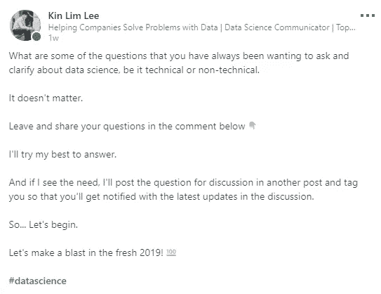
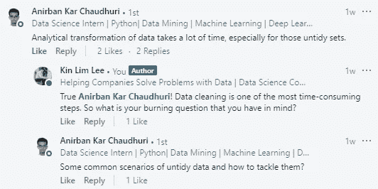

# 简单而实用的数据清理代码

> 原文：<https://towardsdatascience.com/the-simple-yet-practical-data-cleaning-codes-ad27c4ce0a38?source=collection_archive---------5----------------------->

## 为了解决混乱数据的常见情况

在我的一篇文章— [我的第一个数据科学家实习](/my-first-data-scientist-internship-7f7aa2ee4040)中，我谈到了数据清理(数据预处理、数据管理……无论是什么)是多么重要，以及它如何能够轻易地占据整个数据科学工作流程的 40%-70%。世界是不完美的，数据也是。

> **垃圾进，垃圾出**

真实世界的数据是脏的，我们作为数据科学家，有时也称为数据清理者，应该能够在任何数据分析或模型构建之前执行数据清理，以确保最高的数据质量。

长话短说，在数据科学领域呆了一段时间后，我确实感到在处理数据分析、可视化和模型构建之前进行数据清理的痛苦。

不管你承认与否，数据清理并不是一件容易的事情，大多数时候是耗时且乏味的，然而这个过程太重要了，不容忽视。

如果你经历过这个过程，你就会明白我的意思。这也正是我写这篇文章来帮助您以更流畅的方式执行数据清理的原因。

# 为什么这篇文章对你很重要？

[My recent post on LinkedIn](https://www.linkedin.com/feed/update/urn:li:activity:6486373885376851968)

一周前，我在 LinkedIn 上发帖，询问并回答了一些有抱负的数据科学家和数据科学专业人士面临的紧迫问题。

> 如果你一直在关注我的工作，[我的任务是通过在 LinkedIn 上发起有抱负的数据科学家、数据科学家和其他不同专业知识和背景的数据专业人士之间的讨论，使 LinkedIn 上的共享学习环境民主化](https://www.linkedin.com/pulse/2018-year-turning-point-my-life-kin-lim-lee/)，特别关注数据科学。如果你想参与这些关于数据科学有趣话题的讨论，请随时关注我的 LinkedIn。您会惊讶于数据科学社区的参与度和支持度。*😊*

所以我在评论里得到了几个有趣的问题。然而，有一个由 [Anirban](https://www.linkedin.com/in/anirban-kar-chaudhuri-7913737b/) 发布的特殊问题，我最终决定写一篇文章来回答这个问题，因为我不时地收到类似的问题。

事实上，不久前我意识到，当涉及到数据清理时，一些数据有类似的模式。这是我开始组织和编译一些数据清理代码的时候，我认为它们将适用于其他常见场景——**我的数据清理小工具箱**。

因为这里的常见场景跨越不同类型的数据集，所以本文更侧重于展示和解释这些代码的用途，以便您可以轻松地即插即用。

在本文的最后，我希望您会发现这些代码很有用，并且会使您的数据清理过程更快、更有效。

我们开始吧！

# 我清理数据的小工具箱

在下面的代码片段中，出于不言自明的目的，代码是用函数编写的。您总是可以直接使用这些代码，而无需将它们放入参数稍有变化的函数中。

## 1.删除多列

有时，并不是所有的列都对我们的分析有用。因此，`df.drop`可以方便地根据您的指定删除所选的列。

## 2.更改数据类型

当数据集变大时，我们需要转换`dtypes`以节省内存。如果你有兴趣学习如何使用 Pandas 处理大数据，我强烈建议你看看这篇文章— [为什么以及如何使用 Pandas 处理大数据](/why-and-how-to-use-pandas-with-large-data-9594dda2ea4c)。

## 3.将分类变量转换为数值变量

一些机器学习模型要求变量采用数字格式。这时，我们需要在将分类变量输入模型之前，将它们转换成数值变量。就数据可视化而言，我建议保留分类变量，以便有更明确的解释和理解。

## 4.检查丢失的数据

如果您想检查每一列的缺失数据的数量，这是最快的方法。这使您可以更好地了解哪些列丢失的数据较多，从而决定您下一步的数据清理和分析操作。

## 5.删除列中的字符串

可能有一段时间你会面对新的行字符或者其他出现在字符串列中的奇怪符号。使用`df['col_1'].replace`可以很容易地解决这个问题，其中`col_1`是数据帧`df`中的一列。

## 6.删除列中的空白

当数据混乱时，一切皆有可能。在字符串的开头有一些空格是很常见的。因此，当您想要删除列中字符串开头的空格时，这种方法很有用。

## 7.用字符串连接两列(带条件)

当您希望有条件地将两列与字符串组合在一起时，这很有帮助。例如，如果第一列中的字符串以某些字母结尾，您希望将第一列与第二列连接起来。根据您的需要，结尾字母也可以在连接后删除。

## 8.转换时间戳(从字符串到日期时间格式)

在处理时间序列数据时，我们很可能会遇到字符串格式的时间戳列。这意味着我们可能必须将字符串格式转换为日期时间格式——根据我们的需求指定的格式——以便使用数据进行有意义的分析和演示。

# 最后的想法

[(Source)](https://unsplash.com/photos/oTvU7Zmteic)

感谢您的阅读。

这些代码本质上实现起来相对简单。我希望这个数据清理的小工具箱能让你更有信心执行数据清理，并根据我的经验从更广阔的角度了解数据集通常是什么样子。

一如既往，如果您有任何问题或意见，请随时在下面留下您的反馈，或者您可以随时通过 [LinkedIn](https://www.linkedin.com/in/admond1994/) 联系我。在那之前，下一篇文章再见！😄

## 关于作者

[**阿德蒙德·李**](https://www.linkedin.com/in/admond1994/) 目前是东南亚排名第一的商业银行 API 平台 [**Staq**](https://www.trystaq.com) **—** 的联合创始人/首席技术官。

想要获得免费的每周数据科学和创业见解吗？

你可以在 [LinkedIn](https://www.linkedin.com/in/admond1994/) 、 [Medium](https://medium.com/@admond1994) 、 [Twitter](https://twitter.com/admond1994) 、[脸书](https://www.facebook.com/admond1994)上和他联系。

 [## 阿德蒙德·李

### 让每个人都能接触到数据科学。Admond 正在通过先进的社交分析和机器学习，利用可操作的见解帮助公司和数字营销机构实现营销投资回报。

www.admondlee.com](https://www.admondlee.com/)