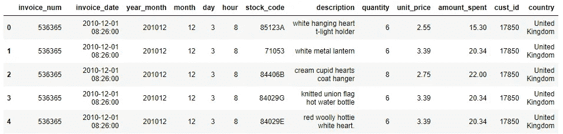
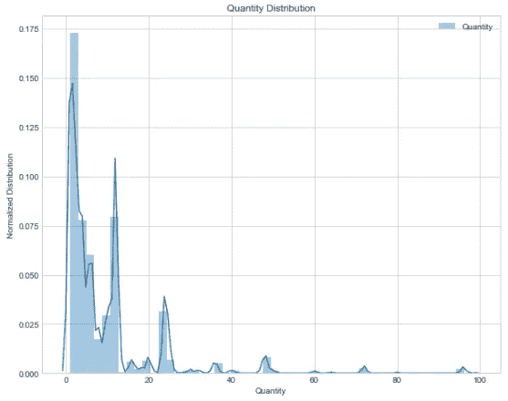
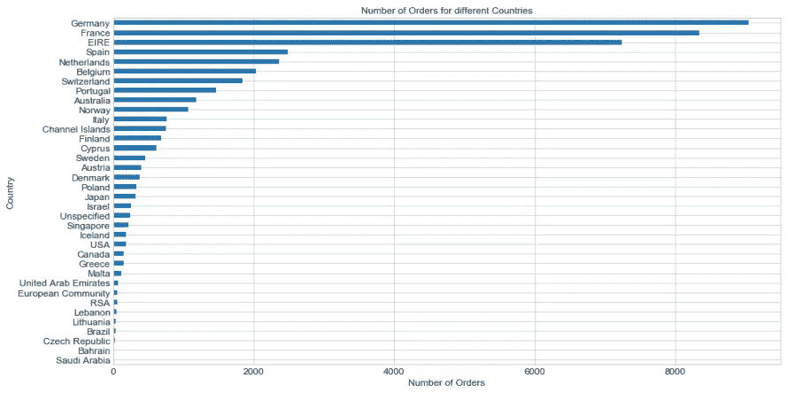
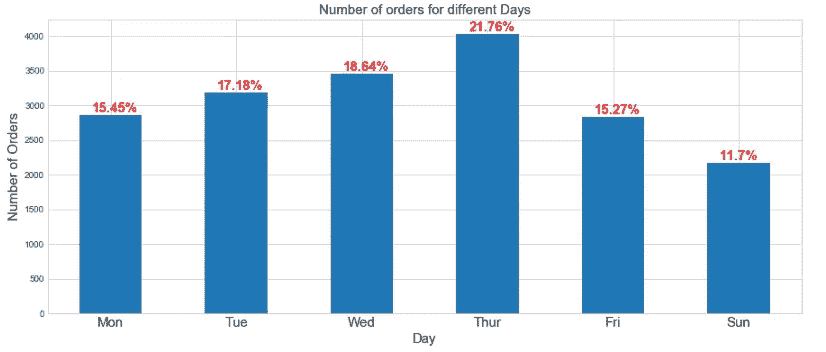
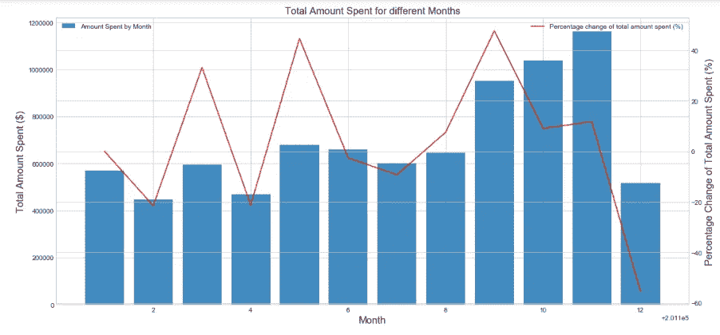

# 简单而实用的数据可视化代码

> 原文：<https://towardsdatascience.com/the-simple-yet-practical-data-visualization-codes-bca99971cdb2?source=collection_archive---------10----------------------->

## 解决绘图和 EDA 的常见情况

> 在上一篇文章中，我分享了关于[我的数据清理小工具箱](/the-simple-yet-practical-data-cleaning-codes-ad27c4ce0a38)，在此之前，我意识到一些代码适用于最常见的混乱数据场景。
> 
> 换句话说，有一种**模式**(或一种方法)，通常用于数据科学中的数据清理，我将它们编译成函数，以便将来重用。

有趣的是，在我看来，这种“模式”在探索性数据分析(EDA)中也会被注意到，尤其是在数据可视化的情况下。我认为这篇文章有必要在这里分享我的代码和解释，以造福他人。

记得几个月前我发表了一篇文章——[关于电子商务数据的探索性数据分析](/exploratory-data-analysis-on-e-commerce-data-be24c72b32b2)？在那篇文章中，我谈到了 EDA 在数据科学中的重要性，以及如何以更简单的方式探索和可视化数据，从而为您或潜在的利益相关者提供有意义的见解。

为了理解您的数据并与利益相关者交流结果，数据可视化对于让数据有故事可讲(讲故事)至关重要。

因为这里的常见场景跨越不同类型的数据集，所以本文更侧重于展示和解释代码以及绘图的用途，以便您可以在项目中轻松地即插即用。

在这篇文章的最后，我希望你会发现这些代码很有用，它们会让你的数据可视化过程更有趣、更快速、更有效！

我们开始吧！

# 数据集背景

在整篇文章中，我们将使用从 [Kaggle](https://www.kaggle.com/) 获得的[电子商务数据集](https://www.kaggle.com/carrie1/ecommerce-data)进行数据可视化(关于数据的更多详细信息可以在[这里](/exploratory-data-analysis-on-e-commerce-data-be24c72b32b2)找到)。

简而言之，这些数据由来自不同国家的客户的**交易数据组成，这些客户从一家位于英国的在线零售公司购买独特的全场合礼品**。

下面的代码实际上可以根据您的需要进行一些小的调整，推广到其他数据集。

这里的目标是向您展示在给定一些通用数据集的情况下，我通常如何执行数据可视化。此外，代码绝不是一个详尽的汇编，以涵盖所有类型的阴谋，但他们应该基本上足以让你开始。

这里显示的数据也经过了一些数据清理，以便我们可以直接使用它，并专注于数据可视化。如果你想知道数据清理是如何完成的，你可以随时参考[之前写的这篇文章](/exploratory-data-analysis-on-e-commerce-data-be24c72b32b2)。

这个数据可视化的 Jupyter 笔记本和干净的数据已经上传到我的 [GitHub](https://github.com/admond1994/E-Commerce-Data-EDA) 。

Snapshot of how the data looks like

鉴于我们处理的是典型的电子商务数据，每一列都非常简单明了。让我们看看我们能做些什么来可视化这些数据！

# 我的数据可视化小工具箱

## 1.箱线图—单价

Boxplot for unit price of the items

这里的单价是指每个项目的价格。在电子商务世界中，我们对单价的传播很好奇，以了解其价格的分布。

我们使用 Seaborn 来绘制箱线图(这是我最喜欢的工具之一！)只有一行代码，其余的只是为了标记的目的。从图中我们看到，大部分单价低于 800 美元，最高单价可达 8000 美元以上。很好。让我们进行下一步。

## 2.分布图—销售数量

Distribution plot of quantity sold

同样，我们使用 Seaborn 来绘制分布图。在这种情况下，我们只考虑销售量(小于 100)，因为这是大部分数据所在的位置。

我们看到大多数商品的销售量都在 30 以内。酷毙了。销售到各个国家的订单数量呢？

## 3.水平条形图

Bar chart of the number of orders for different countries

由于在线零售公司的总部设在英国，所以英国的订单数量最多也就不足为奇了。因此，为了在其他国家之间进行更有意义的比较，我们有意忽略了这个国家。

现在你可能已经注意到，`dataframe.groupby`在绘制由一些分类变量分组的连续变量时非常有用。

您甚至可以直接从数据帧中绘图，而不必使用`matplotlib`。使用垂直条形图还是水平条形图取决于您的需求。在这种情况下，我们选择了水平条形图，以更清晰的方式显示每个国家的名称。

我们将在下一节看到如何使用垂直条形图。

## 4.垂直条形图(带注释)

Number of orders for different days

带注释的竖条图**来了。有时，我们可能希望显示一个带有百分比注释的垂直条形图，以显示某些变量所占的部分。**

在我们的上下文中，我们希望知道不同日期的订单数量，并查看它们各自的百分比以获得更多的见解。

上面附加了一个代码示例，向您展示如何在不影响视觉效果的情况下在同一个绘图中标注百分比。

## 5.条形图和折线图(组合)

Combined bar chart and line plot to show the total amount spent for different months

最后，我们想知道客户每月的总消费金额(或总销售额)。

在某个时间点，我们可能还想知道当前元素和先前元素之间的百分比变化。在这种情况下，我们可以制作一个折线图，以了解从上个月到本月的百分比变化——全部在一个图中。

> 明智而谨慎地使用这种组合图，因为这可能会使信息过多的人感到困惑。同样，组合情节的可用性取决于情况和需要。

# 最后的想法

[(Source)](https://unsplash.com/photos/Z2ImfOCafFk)

感谢您的阅读。

数据可视化不过是讲故事。谁是你的观众？你希望你的观众从可视化中获得什么？要执行的可操作的洞察是什么？

我希望这个数据可视化的小工具箱能在某些方面帮助你。

如果你有兴趣学习如何可视化数据和讲故事来抓住观众的注意力并有效地传达你的想法，我强烈建议你看看这本书——《用数据讲故事:商业人士数据可视化指南》。

一如既往，如果您有任何问题或意见，请随时在下面留下您的反馈，或者您可以随时通过 [LinkedIn](https://www.linkedin.com/in/admond1994/) 联系我。在那之前，下一篇文章再见！😄

## 关于作者

[**Admond Lee**](https://www.linkedin.com/in/admond1994/) 目前是东南亚排名第一的商业银行 API 平台[**Staq**](https://www.trystaq.com)**—**的联合创始人/首席技术官。

想要获得免费的每周数据科学和创业见解吗？

你可以在 [LinkedIn](https://www.linkedin.com/in/admond1994/) 、 [Medium](https://medium.com/@admond1994) 、 [Twitter](https://twitter.com/admond1994) 、[脸书](https://www.facebook.com/admond1994)上和他联系。

 [## 阿德蒙德·李

### 让每个人都能接触到数据科学。Admond 正在通过先进的社交分析和机器学习，利用可操作的见解帮助公司和数字营销机构实现营销投资回报。

www.admondlee.com](https://www.admondlee.com/)