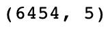
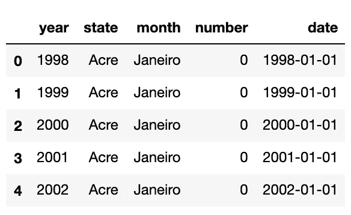
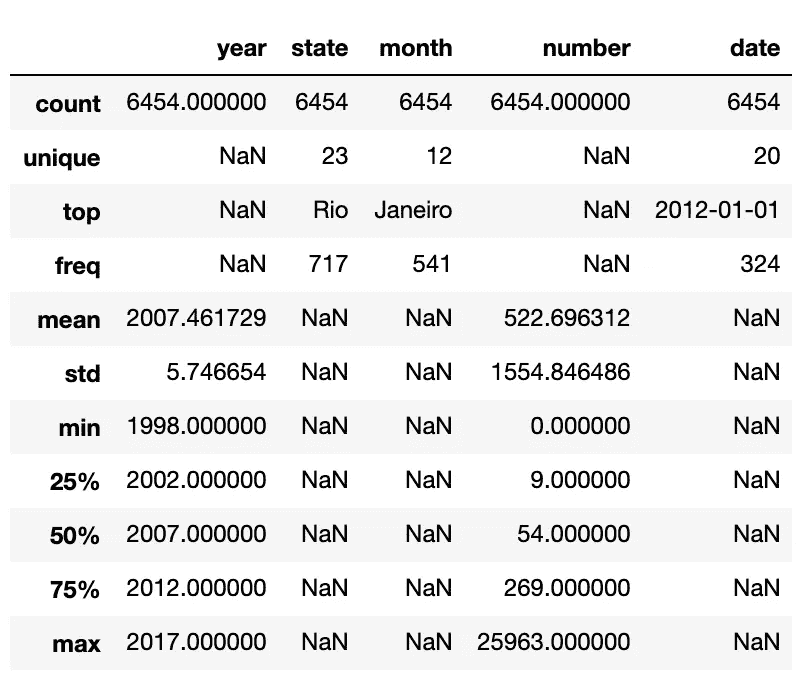
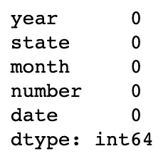
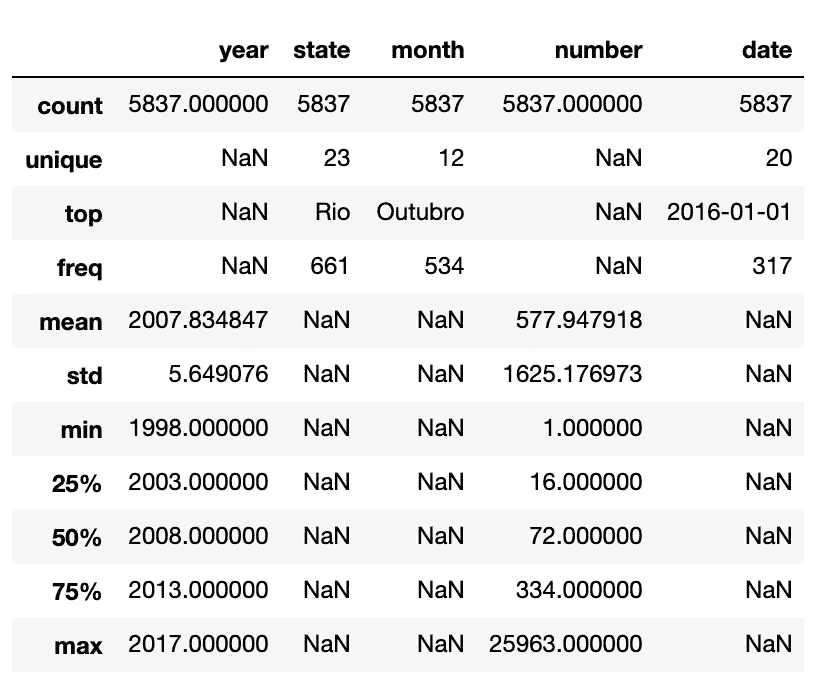
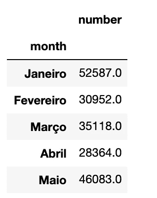
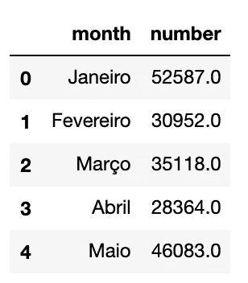
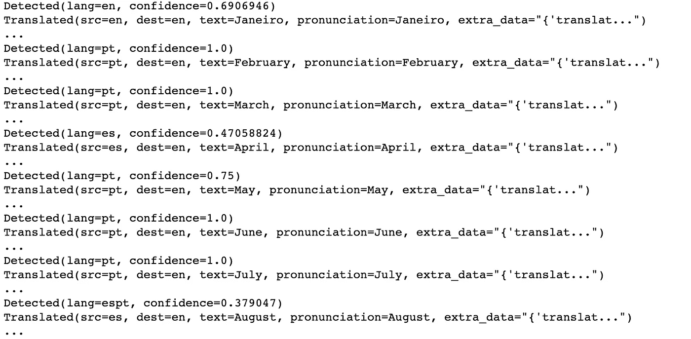
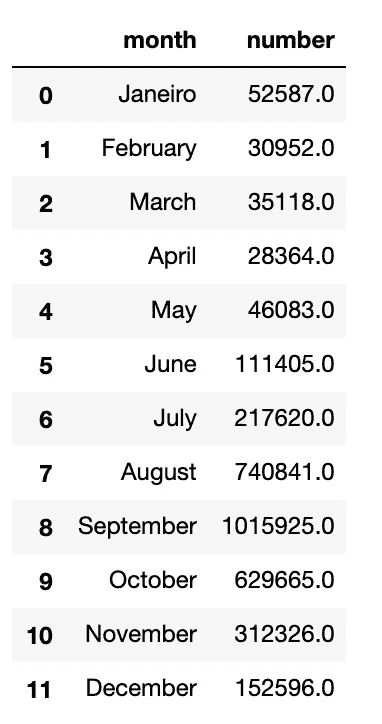
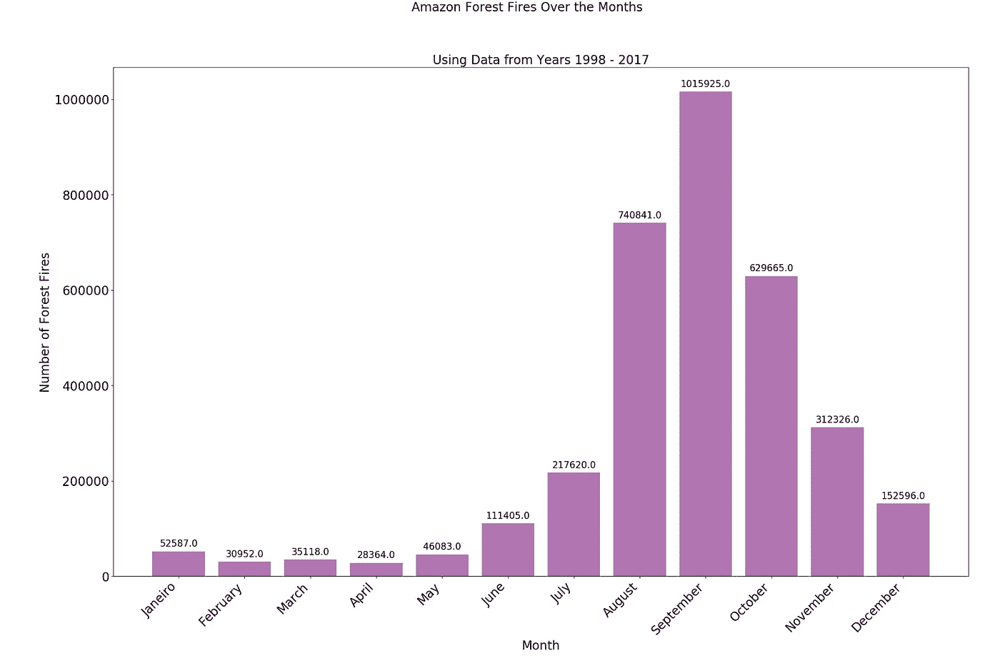

# 使用 Pandas & Matplotlib 的最简单的数据科学项目

> 原文：<https://towardsdatascience.com/the-simplest-data-science-project-using-pandas-matplotlib-9d7042e7ce6f?source=collection_archive---------6----------------------->

## 多年来亚马逊森林大火


Photo by [Markus Spiske](https://unsplash.com/@markusspiske?utm_source=unsplash&utm_medium=referral&utm_content=creditCopyText) on [Unsplash](https://unsplash.com/s/photos/data-visualisation?utm_source=unsplash&utm_medium=referral&utm_content=creditCopyText)

我们如此努力地寻找*完美的*数据集来测试和提高我们的技能。但事实是，没有一个数据集是完美的。通过对数据进行预处理，你可以使它变得完美，或者至少改进它——这是任何数据相关项目的重要部分。

所以，只要拿起**任何**数据集并开始工作！我尝试了一下，旅程充满了乐趣和学习。

以下所有代码都是在 Jupyter Notebook 中实现的。

我得到了一个巴西森林火灾的数据集(来自 Kaggle ),那里有地球上最大的雨林——亚马逊雨林。我不想挑剔，所以这个数据集完全是随机选择的。

关于数据:

`year`是森林火灾发生的年份；
`state`是巴西的州；
`month`是森林火灾发生的月份；
`number`是报告的森林火灾数量；
`date`是报告森林火灾的日期

*   浏览 csv 文件(`amazon.csv`)，您会注意到有些`numbers`是十进制的。2.588 起森林火灾说不通。这是因为小数是千的格式。所以，2.588 意味着 2588 次森林火灾。这在读取 csv 文件时很容易解释。
*   您还会注意到`month`列是葡萄牙语的。这个问题也即将得到解决。
*   下载后第一次导入文件时，出现错误:`UnicodeDecodeError: 'utf-8' codec can't decode byte in position : invalid continuation byte`。为了解决这个问题，我在 Sublime Text 中打开了 csv 并:用编码保存- > `UTF-8`。但是，这导致了`date`列中的错误。于是，我干脆把原来的 csv 打开，导出为 csv。很奇怪，但很有效。

## 进口:

对于这个项目，我使用`virtualenv`建立了一个虚拟环境。检查这个[帖子](/demystifying-virtual-environments-in-python-7c0a0b255928)的所有步骤。我们使用三个主要的库:`pandas`、`matplotlib`、`googletrans`。
`!pip3 install`这些包(如果你还没有)在导入它们之前。

```
import sys
sys.path.insert(1, './lib/python3.7/site-packages')
import pandas as pd
import googletrans
import matplotlib.pyplot as plt; plt.rcdefaults() 
```

完成`sys.path.insert`步骤是为了确保虚拟环境的站点包目录包含在系统路径中。在这个 python 虚拟环境[帖子](/demystifying-virtual-environments-in-python-7c0a0b255928)中了解更多。

## 读取数据:

确保`amazon.csv`在您的工作目录中。

`data = pd.read_csv("amazon.csv", thousands = '.')`

`thousands = "."`参数弥补了十进制格式。

## 查看数据:

`data.shape`



data.shape

`data.head()`



data.head()

`data.describe(include= "all")`

给出了一个很好的数据总结。例如所有列的计数、每列中出现的最高值(如果适用)及其频率。



data.describe(include = “all”)

## 检查是否有任何缺失值:

`data.isna().sum()`



data.isna().sum()

没有吗？太好了！

## 将数据集分成更小的子集:

我的第一个想法是想象几年来，几个月来森林火灾的数量。你需要能够识别出大局中的小部分。

让我们从数据集中删除与森林火灾数量无关的行。因此，必须删除 number 列值为 0 的任何行。我们首先将 0 转换为 NaN，然后删除特定列`number`中带有 NaN 的行。

```
data = data.replace(0, np.nan)
data2 = data.dropna(subset=['number'])
```

我们的数据集现在从 6454 行减少到 5837 行。

`data2.describe(include= "all")`



data2.describe(include=”all”)

## 创建数据子集:

`forest_fire_per_month = data2.groupby('month')['number'].sum()`:按月对数据分组，并对数字求和。输出的是一个**熊猫**系列。

`print(forest_fire_per_month)`:我们注意到结果是按字母顺序排列的。为了将其恢复到每月订单，我们使用 dataframes 的`reindex`属性:

```
forest_fire_per_month = forest_fire_per_month.reindex(months_unique, axis=0) 
```

在哪里，

`months_unique = list(data.month.unique())`


months_unique

接下来，我们通过`forest_fire_per_month = forest_fire_per_month.to_frame()`将序列转换成数据帧

`forest_fire_per_month.head()`



forest_fire_per_month.head()

这看起来不对劲。这是因为`month`被认为是数据帧的索引。
设置默认指标:
`forest_fire_per_month.reset_index(level=0, inplace=True)`

`forest_fire_per_month.head()`



forest_fire_per_month.head()

## 输入`googletrans`:

`googletrans`是一个实现 Google Translate API 的 python 库。我在`months_unique`上测试过。

```
translator = Translator() ***#create an object of Translator*** for month in months_unique: 
    detected = translator.detect(month)     
    translated = translator.translate(month)     
    print(detected)     
    print(translated)     
    print("...")
```



Output for detected and translated month

返回的`Translator()`对象的成员变量:

*   src —源语言(默认:自动)
*   dest —目标语言(默认:en)
*   原点—原始文本
*   文本—翻译的文本
*   发音——发音

这些变量可以使用`.`操作符单独访问。

例如:`translated.text`将输出翻译后的英文文本。

我们使用`Translator`的实例将`forest_fire_per_month`中的`month`列翻译成英语。

```
translator2 = Translator() ***#create a new object of Translator. #cannot use the one defined before as that contains the latest #month’s calculated value***for i, m in enumerate(forest_fire_per_month['month']):
    translated = translator2.translate(m)  
    month1 = translated.text    
    forest_fire_per_month.at[i, 'month'] = month1
```

`enumerate()`函数为 iterable 对象中的每一项分配一个索引，该索引可用于以后引用该项。
Python 中常用`enumerate()`函数代替`for`循环。这是因为`enumerate()`可以迭代一个条目的索引，以及条目本身。

`print(forest_fire_per_month)`



forest_fire_per_month

除了一个案例之外，它对所有案例都有效！

## 剧情:

让我们用条形图来表示它。

```
plt.figure(figsize=(25, 15)) ***#specify width and height*** ***#plt.bar(x-values, y-values)*** plt.bar(
forest_fire_per_month['month'],
forest_fire_per_month['number'], 
color = (0.5,0.1,0.5,0.6)) ***#use*** ***.suptitle*** ***for the actual title and .title for the subheading***plt.suptitle('Amazon Forest Fires Over the Months', fontsize=20) plt.title('Using Data from Years 1998 - 2017', fontsize=20)  plt.xlabel('Month', fontsize=20) 
plt.ylabel('Number of Forest Fires', fontsize=20)***#plt.text(x-coordinate, y-coordinate, valueOfText, alignmnet)******#this adds text at the top of each bar indicating its value***for i, num in enumerate(forest_fire_per_month['number']):
    plt.text(
        i,
        num + 10000,
        num,
        ha='center',
        fontsize=15) ***#plt.setp is to set a property on an artist object.
#plt.gca() gets the current axes (gca) instance on the current figure #matching the given keyword args.
#xticklabels and yticklabels are nothing but the values of the #lables on the x and y axis.
#The code below lets us set the fontsize and alignment of the x and #y axis tick labels***plt.setp(plt.gca().get_xticklabels(),
         rotation=45,
         horizontalalignment='right',
         fontsize=20)plt.setp(plt.gca().get_yticklabels(), fontsize=20)
```

输出:



Output bar graph

这是一个非常小的文档，说明了可以用这个数据集做什么。你只需要开始。而且这个过程充满了学习新东西。

因此，只需下载一个随机数据集并开始行动！

超级有用的资源:

*   [为](https://www.codeproject.com/Tips/1236705/How-to-Use-Google-Translator-in-Python)为`[googletrans](https://www.codeproject.com/Tips/1236705/How-to-Use-Google-Translator-in-Python)`
*   [用](https://www.bitdegree.org/learn/python-enumerate)和`[enumerate()](https://www.bitdegree.org/learn/python-enumerate)`进行循环