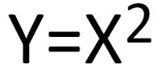
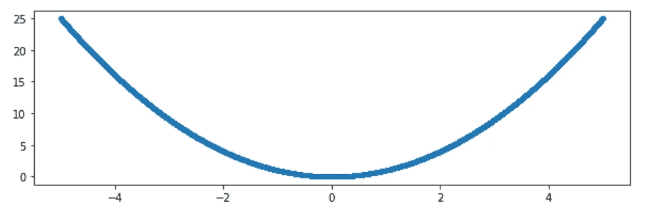
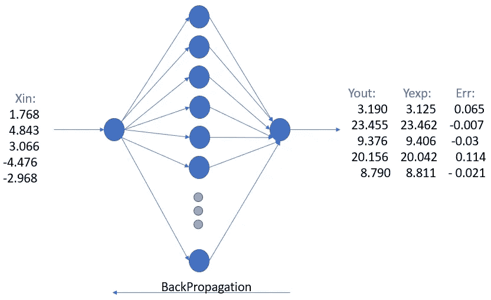
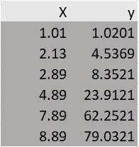
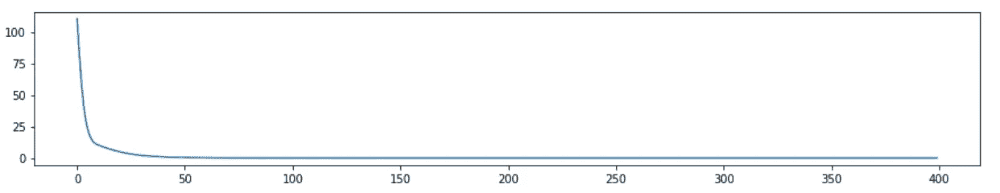
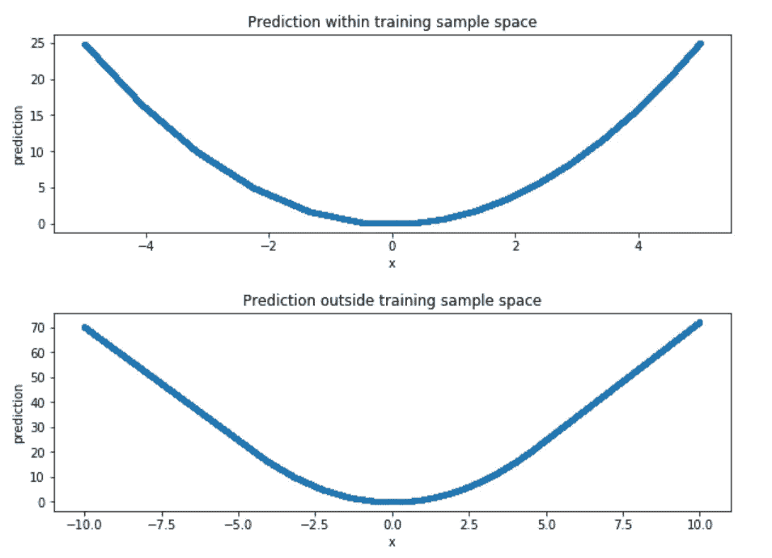

# 最简单的神经网络:理解非线性

> 原文：<https://towardsdatascience.com/the-simplest-neural-network-understanding-the-non-linearity-10846d7d0141?source=collection_archive---------11----------------------->

您希望使用数字平方构建的第一个神经网络。是的，这不是异或或 MNIST

每当你想了解 NNs 或数据科学或人工智能时，你就通过谷歌搜索，通过 Reddit，获得一些 GitHub 代码。到处都有 MNIST 数据集、GANs、卷积图层。每个人都在谈论神经网络。你拿起你的笔记本电脑，运行代码，瞧！它工作了。然后你会挠头，你知道这是数学，但这是怎么回事？

突然你想:够了，我要学基础。你去谷歌搜索‘神经网络基础’,结果是:很多教程展示了 MNIST 数据集、异或门。你实现了，它工作了，但是问题出现了 ***鸭子是如何工作的？*** 你开始了解多层感知器——神经网络的基础知识。再说一次，研究盖茨并不能让你满意，因为这似乎并不能预测什么。它来自训练数据集的 1 和 0。您想要一些真实世界的示例，然后您看到了这篇文章。你再想一想关于 NNs 的文章。但在本文中，没有基础理论，而是神经网络的适用性。我并没有向你们展示内部数学发生的情况，而是让你们感受一下神经网络是如何按照你们所看到的方式运作的。希望这能帮助你理解“基本”神经网络的工作原理(非线性)。

和外太空一样，大脑是一个在很多方面都还无法解释的东西。我们知道存在小的类似外星人的结构(是的，那些是可怕的)，神经元，它们负责信息的传递，大脑有几个部分，像大脑，小脑，它们有不同的功能。不同的神经元被不同地激活(以非线性方式)，并通过电脉冲传递信息。但是这些器官如何工作的确切功能以及神经元如何结合、传递和存储信息并使大脑成为最不可思议的事物之一，并且仍然有巨大的研究范围。


Neural Networks: An attempt to apply Brain’s network to machines

当你作为一名人工智能爱好者开始你的旅程时，你会遇到许多开始学习的方法。数据科学与统计学和数学的关系更大。但据观察，神经网络可以将数据科学的力量提高到一个巨大的水平，因为它也可以学习数据之间的非线性关系，这是很难通过正常的统计数据观察到的。

# 什么是神经网络——已经足够了

有许多很好的帖子解释了神经网络如何工作，反向传播，不同的节点如何使用权重相互连接，以及许多超参数控制这些。因此，我不会在这篇文章中给出这些细节。[这个](https://medium.com/@14prakash/back-propagation-is-very-simple-who-made-it-complicated-97b794c97e5c)和[这个](https://medium.com/machine-intelligence-report/how-do-neural-networks-work-57d1ab5337ce)是关于神经网络和反向传播的非常好的帖子，其中第二个*链接我强烈推荐*，它帮助我深入了解神经网络。在第二个链接中，有一个 relus(激活函数)如何帮助确定网络中的非线性复杂性的详细解释。

但是由于神经网络都是关于数学，非线性，学习；我想看看它如何适应简单的非线性函数。是的，平方函数



这是我为了分析而创作的 jupyter 笔记本:

 [## tseth92/NeuralNet_Square

### 此时您不能执行该操作。您已使用另一个标签页或窗口登录。您已在另一个选项卡中注销，或者…

github.com](https://github.com/tseth92/NeuralNet_Square) 

# 别说了，给我看看代码

## 导入库:

我们将主要使用 TensorFlow 的 Keras，以及来自 Keras 的 Sequential 和 Dense。Tensorflow 是一个广泛用于神经网络和深度学习的框架。Keras 曾经是隔离 Tensorflow/Pytorch 的包装器，这样你用 Keras 开发的代码可以在任何库中工作。但是在 tensorflow2.0 中，Google 意识到 TF1.0 太复杂了，他们在 tensorflow2.0 中引入了 Keras API 作为它的一部分。

**顺序型和功能型**是 Keras 中的两种车型。其中顺序允许层按顺序连接，即。一个接一个；该功能允许将整个网络中的任何层连接到任何层。因为我们将只使用一个具有一个输入层和一个输出层的隐藏层。

密集有助于实现密集连接的层。Keras core 提供了更多的[实现](https://www.tensorflow.org/api_docs/python/tf/keras/layers/)，如卷积、LSTM 等。但这不是 Keras post，还是把重点放在我们的神经网络上吧。

```
*'''Training a neural network to predict the square of a number'''*
**import** **numpy** **as** **np**
**import** **matplotlib.pyplot** **as** **pp**
**from** **tensorflow** **import** keras
**from** **keras.models** **import** Sequential
**from** **keras.layers.core** **import** Dense
**from** **IPython.display** **import** Audio, display
```

## 设置一些超参数:

让我们看看创建和运行这个神经网络需要哪些超参数。

**n _ samples**:1 个历元需要多少个样本。

**历元**:当所有样本完成正向和反向传播时

**batch_size** :一次可以向神经网络引入多少个样本

**mid_range** :取样数量的范围。

**num_neurons:** 要保留在隐藏层中的神经节点数

我们需要 100000 个 1 到 10 之间的样品。所以，它会给我们 1.02，7.89 这样的值

```
*'''configurations for neural net'''*
*# change these values to experiment*
n_samples = 100000 *# number of samples between 0 and mid_range*
epochs = 400 # number of times for the fwd and backward propagation
batch_size = 1000 # number of samples sent through NN at once
mid_range = 10 *# range within which data is required* num_neurons = 10 # number of neurons in the hidden layer
```

## 生成数据样本:

get_data 方法取 n_samples = 100000，mid_range=10，这意味着它将在 1 和 10 之间随机产生 1000000。

```
*'''creates random samples of n_samples rows which are between 0 to 1.*
*mid_range decides the range under which the samples will be created.'''*
**def** get_data(n_samples, mid_range):
  X = np.random.random((n_samples,1))*mid_range-(mid_range/2)
  *# eg. if n_samples = 10000, mid_range = 10 then it will create samples b/w* 
  *# 0 and 5 positive and negative*
  y = X*X
  *#print(X)*
  **return** X,y
```



Data Distribution for y=x²

## 创建神经网络模型:



在这里，我们创建一个神经网络的一个节点作为输入，10 个节点作为隐藏层(没有任何硬性规定。检查哪个最适合你)和一个输出层。

```
*''' creating the neural net model of 1:20:1; relu activation, mse as loss and* 
*adam optimizer'''*
**def** get_model():
  model = Sequential()
  model.add(Dense(num_neurons, input_shape=(1,), activation='relu'))
  model.add(Dense(1))
  print(model.summary())
  model.compile(loss='mse', optimizer='adam')
  **return** model
```

# 训练用样本生成的模型:

如上图所示，我们使用所有 10，00，000 个样本对神经网络进行了限定次数的训练。网络的输入为 X，预期输出为 y。



X and y fed to the Neural Network

```
*''' train the model for specified number of epochs, batch_size'''*
**def** train_model(X, y, model, epochs, batch_size):
  h = model.fit(X, y, validation_split=0.2,
               epochs=epochs,
               batch_size=batch_size,
               verbose=1)
  pp.figure(figsize=(15,2.5))
  pp.plot(h.history['loss'])
  **return** model
```



Y-axis shows the error and X-axis as the number of epochs. The training error ie. rmse reduces as the number of epochs is increased.

# 预测模型:

这里我们预测 X_train 的模型，它是训练数据，而 X_test 在训练数据之外。

```
*''' predict the model for X(training data) and or X2 which is outside* 
*the training dataset'''*
**def** predict_model():
  pred = model.predict(X)
  mid_range = 20
  X2 = np.random.random((n_samples,1))*mid_range-(mid_range/2)
  pred2 = model.predict(X2)

  *# uncomment below code to observe the expected and actual values*
  *# in the form (inputData, expectedOutputData, predictedOutputData, difference)*

  *#pred2 = model.predict([-6])*
  *#for i,j in zip(X, pred):*
  *#  print(i,i*i,j, j-(i*i))*
  pp.figure(figsize=(10,3))
  pp.plot(X,pred, '.')
  pp.xlabel('x')
  pp.ylabel('prediction')
  pp.title('Prediction within training sample space')

  pp.figure(figsize=(10,3))
  pp.plot(X2,pred2, '.')
  pp.xlabel('x')
  pp.ylabel('prediction')
  pp.title('Prediction outside training sample space')
```



# 主要方法:

```
**if __name__ == '__main__' :**
  X_train,y_train = get_data(n_samples, mid_range_train)
  X_test,y_test = get_data(n_samples, mid_range_test)
  model = get_model()
  pp.figure(figsize=(10,3))
  pp.plot(X_train, y_train,'.')
  pp.title('Original Training Data')
  model = train_model(X_train, y_train, model, epochs, batch_size)
  predict_model(X_train, X_test)
  # below is audio which will fireup(literally :D) when the training and 
  #prediction completes
  display(Audio(url='[https://sound.peal.io/ps/audios/000/000/537/](https://sound.peal.io/ps/audios/000/000/537/) \
                original/woo_vu_luvub_dub_dub.wav', autoplay=True))
```

# 为什么训练样本空间之外的预测不同？

主要原因是神经网络擅长插值而不是外推 ie。如果数据位于样本空间内，(可能不是训练数据，但在训练数据范围内)，例如本例中的 1–10。

如果我试着预测 11，12 等等。它可能会预测错误。原因是在样本空间之外，神经网络离开了非线性，变成了线性，正如你从上面的图中看到的。

# 你应该做的一些实验:

1.  **将 mid_range 更改为 100** ，看看性能如何下降。原因是现在样本空间太庞大，无法想象在 1 和 2 之间，有无限大的数。因此，1–100 对于样本空间来说太大了。你也可以为此进行训练。但是你可能需要 100，000，000 个样本和大量的纪元。也许更多。为此，您需要强大的计算环境和更多的时间。
2.  **改变 num_neurons** 看看它表现如何。你可以看到，随着神经元数量的减少，它会变得越来越线性，并开始失去非线性。**原因是非线性伴随着许多线性的加强(许多线性函数的产物)。**
3.  **改变批量**观察较低和较高批量的表现。批量太小，训练时间太长，而且一段时间后会饱和，不能很好地训练。批量太大，需要收敛的时期就越多。所以，最好是保持一个最佳值(最佳点)

**注**:我给你看的这段代码是基于 tensorflow==1。如果我不使用 Keras，而是使用 tensorflow==2.0 并使用 tf.keras，x 会失败，我已经在 GitHub 上提出了这个问题的[问题](https://github.com/tensorflow/tensorflow/issues/33283)。当问题解决后，我会在这里更新。在 Jupyter 笔记本中，它仍然使用 1。TensorFlow 的 x 版本。

在下一篇文章中，我将向您展示如何通过创建两个**微服务**并使用 **Flask** rest 和 **gRPC** 调用它们，通过 **Google Kubernetes 引擎**将这种神经网络训练和预测部署到 **Kubernetes 集群**。不要错过它，因为它都在一个帖子里。在那之前，继续玩神经元(不是真正的神经元:P)。在 [LinkedIn](https://www.linkedin.com/in/tusharseth92/) 上与我联系。结束！！。