# 辛普森一家遇到了数据可视化

> 原文：<https://towardsdatascience.com/the-simpsons-meets-data-visualization-ef8ef0819d13?source=collection_archive---------6----------------------->

# 介绍

没有什么比《辛普森一家》更让我喜欢的了。三十季 600 多集的动画喜剧在我心中占有特殊的位置。偶尔，当*的《犁先生》*或*的《人人都讨厌内德·弗兰德斯》*出现在我脑海中时，我会发现自己在跟着唱。

很自然地，当我发现我可以下载所有我想要的剧集脚本时，我知道我该做什么。几乎可以接触到荷马说过的任何东西，我忍不住戴上我的数据科学家帽子，以便从过去三十年最著名的动画电视节目之一中梳理出一些见解。

# 人物

我们来看看剧中的人物。下面是一个气泡图，显示了 15 个字符的最大行数和他们的总行数。气泡大的角色比气泡小的角色说的台词多。

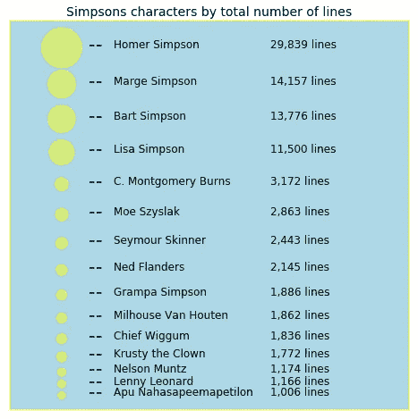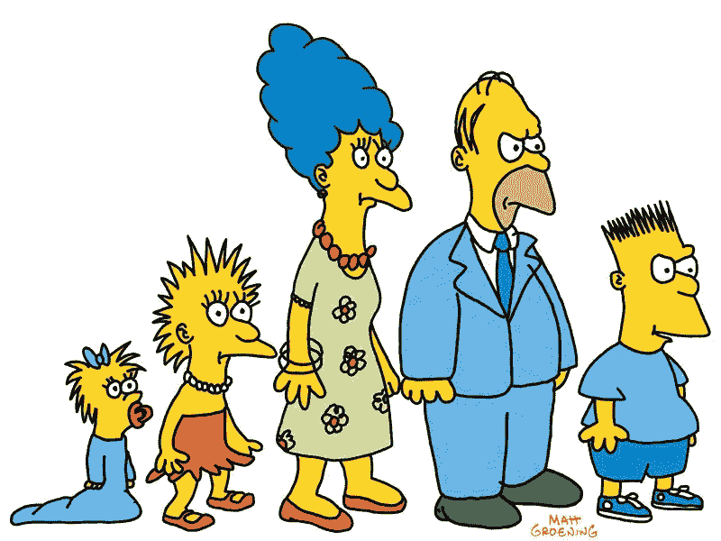

很明显，这部剧的主角实际上是荷马、玛吉、巴特和丽莎·辛普森。他们比其他角色有更多的台词。有趣的是，尽管格兰帕是辛普森家庭的一员，经常出现在辛普森家，但他并不像家里的其他人甚至其他角色那样爱说话。

现在我们已经了解了剧中每个角色的对话量，让我们更进一步，使用热图来观察角色之间的对话量。

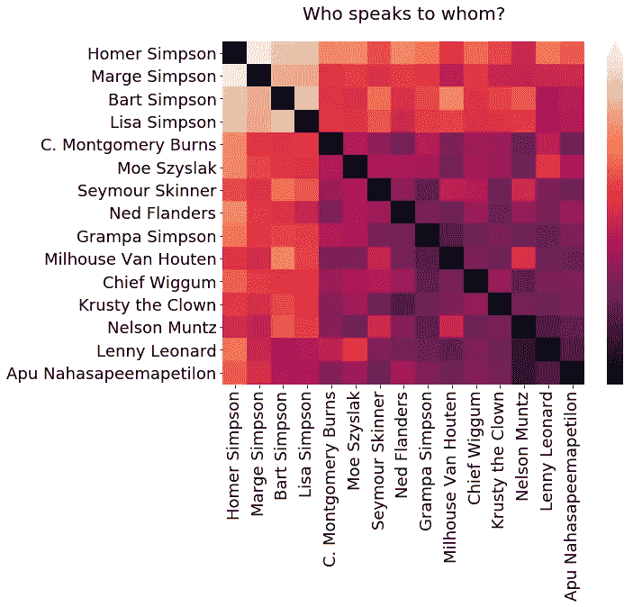

Rows speak to columns. The color of each square represents the number of lines that the character in each row said to the character in each column. Lighter squares mean that more lines were spoken.

这个情节向我们展示了人物之间三种主要的互动。首先，辛普森一家内部有很多对话。接下来，辛普森家庭成员和角色之间的对话也不多。最后，很少有不涉及辛普森一家的对话。

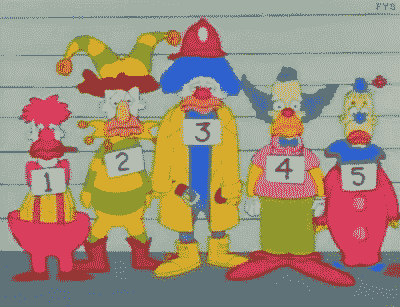

这个情节的巧妙之处在于它突出了一些有趣的角色动态。

例如，小丑 Krusty 与法律的冲突反映在与警察局长 Wiggum 的大量对话中。

我制作了另一张热图，其中包含了 75 个角色。这是一幅美丽的画面，但也表明大多数对话只发生在几个角色之间(即数据有一条“长尾”)。

heat map with top 75 characters

# 他们在说什么？

我们能更好地理解这些角色在说什么吗？一种方法是看他们说的话的情绪。

我们可以使用自然语言处理技术 [VADER 情感分析](http://​http://datameetsmedia.com/vader-sentiment-analysis-explained/)来量化每一行的情感。需要注意的一点是，这种方法是针对社交媒体文本优化的，所以我们应该对结果持保留态度。

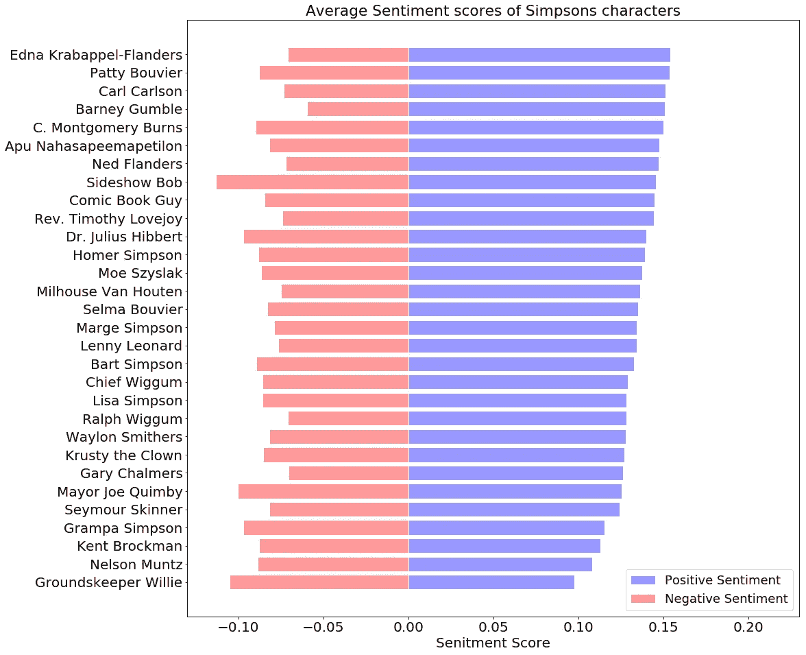

现在我们可以看到，根据对它们的积极程度的估计，排序最多的 30 个字符。似乎埃德娜·克拉巴佩尔(巴特的老师)和帕蒂·布维尔(玛吉的妹妹)是最积极的角色。然而，我从未发现它们特别令人愉快。

另一方面，令人欣慰的是，内德·弗兰德斯在排行榜的顶部，祖父、纳尔逊和墓地看守人威利在底部。另外，有趣的是 Sideshow Bob 既有非常积极的一面，也有非常消极的一面。他是小丑 Krusty 的伙伴，所以他应该是一个积极的家伙，但当我们记得他所有的谋杀阴谋，看到这样的消极并不奇怪。

查看某些字符是否比其他字符有更长的行也是有帮助的。也许荷马有最多的台词，因为他是主角，但也许他一次只说几个词，像“嗯，油炸圈饼”或“为什么你小！”下面的方框图将帮助我们了解每行中哪些字符说得最多。

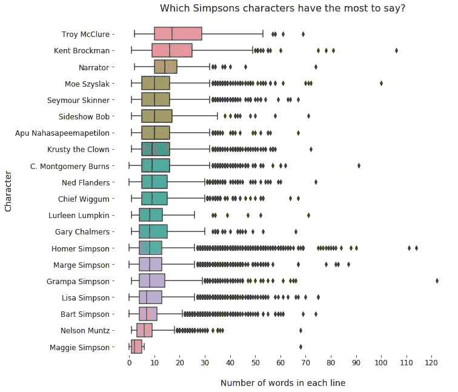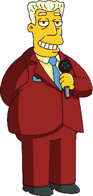

事实证明，只有少数角色的每行字数的中位数超过 10 个，但许多人至少有几行话要说很长时间。

玛吉·辛普森很少说话(事实上她还是个婴儿)，但她至少有一次长篇大论。特洛伊·麦克卢尔和肯特·布罗克曼拥有最大的每行字数中位数，当我们想起他们都是电视明星时，这是有道理的(肯特·布罗克曼发布新闻，而特洛伊·麦克卢尔是 70 年代过气的演员)。

爷爷辛普森是节目中最长的。我会把它留在这里给你欣赏。

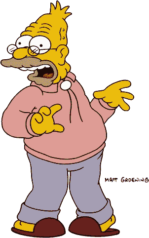

一个窍门是给他们讲一些没有任何意义的故事……就像那次我乘渡船去谢尔比维尔一样。我的鞋子需要一个新鞋跟，所以我决定去摩根维尔，那时候他们叫它谢尔比维尔。所以我在腰带上绑了一个洋葱，这是当时的流行款式……现在乘渡船要花 5 分钱，在那个时候，5 分钱硬币上有大黄蜂的图案。你会说“给我五只 25 美分的蜜蜂”。现在，我们说到哪了？哦，是的，重要的是我的腰带上有一个洋葱，这是当时的风格。他们没有白洋葱，因为战争…

除了了解每个角色说了多少话，我还好奇他们什么时候说话。数据中的每一行都包括一个事件内时间戳，这让我可以回答这个问题。我考虑了行数最多的 3000 字。

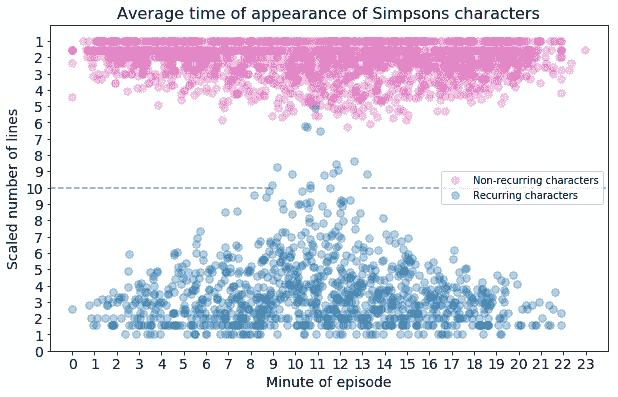

我把角色分成两类，只出现在一集的和出现在不止一集的。在 y 轴上画出每个角色的(按比例)行数，很明显，平均来说，有更多行数的角色更倾向于出现在剧集的中间。这是有道理的，因为他们总是说得太多，他们的平均时间将接近一集的中间。

然而，有趣的是，在右上角，看起来好像只出现在一集《辛普森一家》中的角色通常会讲到这一集的三分之二。这似乎是合理的，因为我们可能会期望在剧集中间的某个地方遇到新角色，而不是一开始，而且随着我们对他们的了解，他们可能会说更多的台词。

# 他们在哪里说话？

到目前为止，我们只研究了角色和他们的台词。我们还没有调查《辛普森一家》剧集的拍摄地点或它们之间的关系。

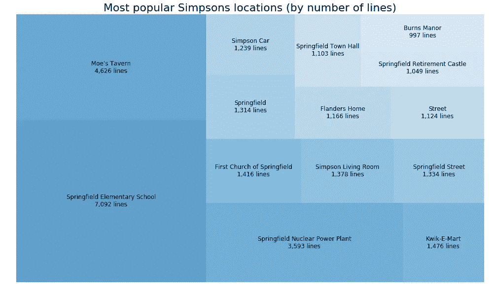

我们看到春田小学、莫酒馆和春田核电站(荷马工作的地方)是剧中最常见的地点。我要指出的是，我把辛普森家从这个地块中移走了，因为否则它会占据整个空间。

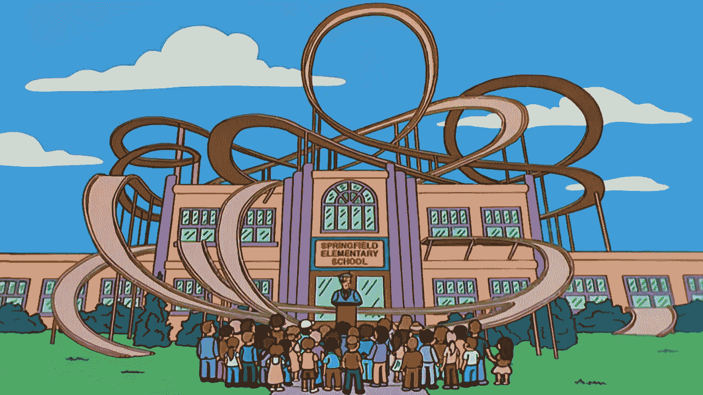

其他受欢迎的地点是教堂、客厅、Kwik-E-Mart 甚至伯恩斯庄园。每个方框的颜色和大小与每个地方说的台词数量相对应。

真实的地方呢？剧中人物对我们的世界了解多少？我们可以做的一件事是看看他们提到美国每个州的次数。

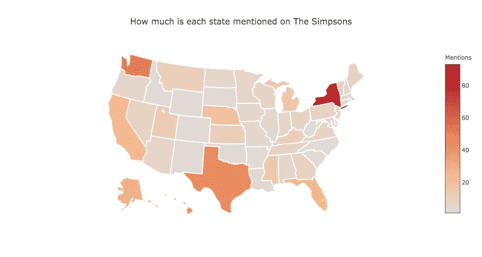

他们经常谈论纽约、德克萨斯、加利福尼亚、阿拉斯加、佛罗里达、华盛顿，甚至内布拉斯加。我应该指出，我们应该更仔细地看看华盛顿的数据。我过滤掉了包含“华盛顿特区”或“乔治·华盛顿”的行，但可能有其他情况，它们不一定是在谈论州。

这很好，因为它不受制于美国热图的典型问题。这些图常常变成人口密度图，因为我们要绘制的东西通常与人口有关。然而，由于我们看到的是一个并不真正与人口相关的指标，我们不应该预料到(也没有)这个问题。

# 现实世界中的辛普森一家

剧本台词让我们更好地理解了《辛普森一家》中人物和地点的动态。现在让我们换个话题，审视一下节目的观众。下面是美国所有剧集的观众人数分布。

大多数剧集都有八九百万观众观看，但有些已经被观看了三千万甚至更多！一集少于 1500 万的观众比拥有更多观众要常见得多。

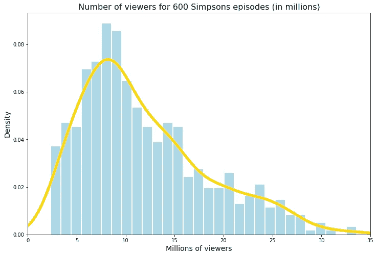

然而，这并没有考虑到时间，尽管我们认为这是一个重要的因素。正如我的下一个情节将展示的那样，在三十年的过程中,*《辛普森一家》*的受欢迎程度已经发生了变化。

这种可视化是交互式的，你可以在克隆 Github [回购](https://github.com/areevesman/the_simpsons)后在线[这里](https://github.com/areevesman/the_simpsons/blob/master/plots/stream.html)获得完整版本。它是一个 html 文件，可以下载并在浏览器中打开。如果这不起作用，你可以重新运行这个[笔记本](https://github.com/areevesman/the_simpsons/blob/master/notebooks/viewers-histogram_and_stream_plot.ipynb)。

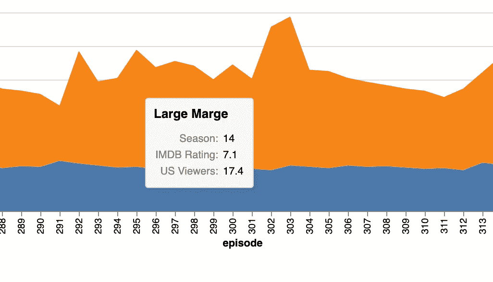

该图显示了每集的 IMDB 评分(蓝色)和美国浏览量(橙色)。此外，当鼠标悬停时，它会显示剧集的名称和季节。水平滚动显示所有剧集的完整时间线。

很明显，一开始，《辛普森一家》有很多观众。事实上，他们的受欢迎程度一直持续到第八季结束。在第九、第十和第十一季中，观众寥寥无几。第十二季一开播就有了显著的提升，碰巧的是，《史上最差剧集》在那一季拥有最多的观众。从那以后，《辛普森一家》经历了一个稳定的衰落。

看的人少吗？也许吧。然而，总体上看电视网的人越来越少。收视率非常接近他们一直以来的水平，所以我要说的是《辛普森一家》还活着，而且很好。

# 结论

在这篇报道中，我们看到了很多关于《辛普森一家》的内容，甚至像我这样的忠实观众以前可能都没有想过。我们知道了谁说得最多，谁和谁说话，以及这些角色在说什么。除了他们谈论的地点之外，我们还知道了他们谈论的时间和地点。最后，我们研究了他们在流行文化中的地位，以及他们是如何生存了这么久的。

我将很高兴收到以上任何反馈。你可以通过 LinkedIn 或者电子邮件在 areevesman@gmail.com 找到我。所有代码和图都可以在 [Github](https://github.com/areevesman/the_simpsons) 上获得。请让我知道你发现了什么见解！

点击此链接查看更多辛普森分析:[https://www.youtube.com/watch?v=9D420SOmL6U](https://www.youtube.com/watch?v=9D420SOmL6U)。

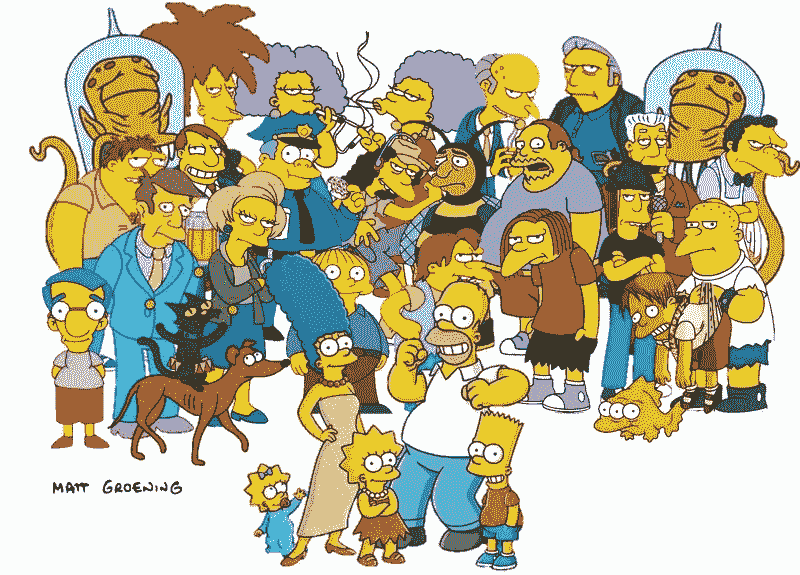