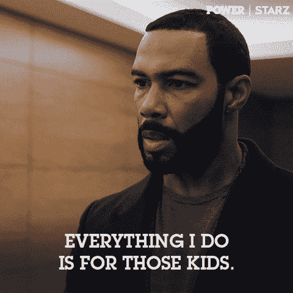

# 找到发展目标所需的单一策略

> 原文：<https://towardsdatascience.com/the-single-strategy-you-need-to-find-your-development-target-7c4553cd5e37?source=collection_archive---------37----------------------->

## 企业数据科学不仅仅是数据科学

Aerial Target Interdiction Archives: California Tactical Academy

谁是你的客户？今年早些时候，我参加了一个展示，展示了一种“可能”取代波音 V-22 鱼鹰的飞机。V-22“鱼鹰”是一种多任务军用飞机，自 2000 年开始服役。虽然这听起来不像该飞机已经服役很长时间，但值得一提的是，该飞机的原始合同结合了常规直升机的功能与垂直起飞和着陆能力，以及涡轮螺旋桨飞机的高速巡航性能，最初于 1983 年联合授予贝尔和波音直升机公司。V-22 于 1989 年首飞。

***一辆在近 40 年前就完成并提交了原始计划的车辆，目前正在服役，并做这样的事情……***

V-22 Osprey preparing for transport at undisclosed military location. Image Source: GTFErinyes

回到演示上来，我们听到了汽车的替代品。他们的目标发布时间是 10 年后，该团队计划为新的飞机提供 25 年的使用寿命。想想吧。建筑师和开发人员今天正在设计一种飞机，这种飞机将被用于非常重要的场合，可能是生死攸关的场合，预计从现在起十年后仍然有效，至少在发布日期后的几十年内保持竞争力。一个团队如何做到这一点？当他们无法知道未来会在哪里时，他们如何在未来击中目标？

答案是，它们确实有。我是说不完全是，但他们有代理人。一位首席建筑师开始谈论这种新飞机的仪表板。这个人开始谈论他的飞行员。他评论说，第一批驾驶这架飞机的飞行员目前大约 8 岁。出于这个原因，他们围绕 8 岁儿童目前熟悉的东西进行设计…..手机、平板电脑和触摸屏。能够用手缩放图像，实时移动各种应用程序。覆盖图。

想想吧。虽然这架飞机将由成年军人驾驶，事实上他们正在与成年军人一起设计和建造这架飞机，但他们不是为那些成年飞行员建造的。他们更像是在为他们真正的用户建造；孩子。

我可以告诉你，我参加过很多策划会议。许多营销意识训练。我不相信我已经积极地让许多团体为未来的成年人而不是今天的成年人设计东西。他们之前的成功，以及很可能的后续成功都围绕着瞄准目标的想法，而不是目标在哪里。我是认真的，玩具公司之外的谁会谈论为孩子们做这件事？

from GIPHY; STARZ Drama Series Power

好吧，他不算。

# 拦截任务

我以前的军事服务导致这种类比继续是舒适的，所以希望，你仍然和我在一起。在军队中，我们有一个*遮断*的概念，也就是说，攻击一个移动的目标。这个概念是首先获取你现有的信息，理想的是目标移动的方向和速度。接下来，你检查了你当前的位置、距离和方向。使用所有这些输入，你可以调整你的方向和速度，这样你的路线就会与目标的路线相交。使它成为一种禁止的是，这些课程不仅相交，而且它们同时相交。

我的职业是数据科学家，但我相信这种满足目标的心态同样适用于数据、工程和软件项目。如果你估计 5 年完全开发你的产品，5 年把你的产品作为销售产品的主线，15 年的使用寿命，那么十年后你的产品最初的客户是什么样子的？他们处于职业生涯的开始、中期还是末期？随着时间的推移，人口是越来越年轻还是越来越老？有证据表明他们的教育水平发生了变化吗？我记得有一个例子，我们在设计一个产品，我们请专业人士提供反馈。我们得到了非常积极的评价。我们不断得到的主要积极反馈是，与 20 世纪 80 年代生产的产品相比，我们的产品有多先进。我们花了一段时间才意识到，按照我们的开发计划，我们的第一批客户将在 2020 年达到 30 多岁。这一代人不会对超越 20 世纪 80 年代的技术留下深刻印象。除了陌生的事物，这一代人对 20 世纪 80 年代没有任何概念。

from GIPHY; Netflix Horror Series Stranger Things

即使那样，他们也会期待一些美妙的东西。

# 学校正在上技术课

这种方法的另一个很好的例子是迈克尔·克罗领导下的亚利桑那大学。在他的书《设计新美国大学》中，迈克尔谈到了如何实现不仅成为一流研究型大学，而且成为公立大学的目标。学校的积极目标不仅仅是获得令人尊敬的排名，他们希望将学校与支持和积极影响地区社区的目的结合起来。这意味着拆除要求学生遵从他们的传统结构，设计反思性结构，考虑到学生的到来，他们将离开的世界，并确保学校是两者之间的适当桥梁。

学校没有告诉学生在开学时关掉电子设备，而是开始积极地将技术融入到学习和生活体验中。通过设备吸引学生。提供越来越多的在线互动课程。利用技术实现协作成果，不仅是参与项目的学生之间，还包括设计和监督课程和讲座的教师之间。该学院没有告诉学生毕业后的工作环境是什么样的，而是与大大小小的公司合作，建立合作机构。事实证明，这些机会对于寻求确认他们所学知识是否相关的学生来说是一种胜利，并导致相关公司的所有权，这些公司自然会雇佣许多与他们一起工作的学生和大学研究人员。学生被积极地招募到学校规划委员会，与教师和行政领导一起工作。甚至还有与高中和退伍军人服务办公室(仅举几例)的积极互动，以确保与客户(即学生)的适当配合。

# 摘要

为了更好地理解这一点，在当今快节奏、不断发展的世界中，给定技术，为客户构建解决方案的最佳策略是获得客户的距离、方向和速度，并制定计划在他们要去的地方满足他们，而不是去他们在的地方，并希望他们在你到达时就在那里。顾客想见你。**他们想见你！！**

from GIPHY; VHI reality series Signed

在客户将要去的地方见他们…

# 计划一个拦截课程！

感谢您花时间通读这些概念！

*原载于 2019 年 11 月 26 日*[*https://dev . to*](https://dev.to/rayphaistos1/the-single-strategy-you-need-to-find-your-development-target-56m1)*。*