# 游戏中的皮肤启发防止灾难

> 原文：<https://towardsdatascience.com/the-skin-in-the-game-heuristic-for-protection-against-disasters-eaa7bda8b026?source=collection_archive---------35----------------------->

## 为什么缺乏个人风险会将整个系统置于危险之中

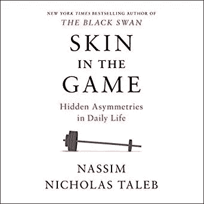

# **简介**

*“如果一个建筑者为一个人建造了一座房子，却不把建造的声音发出来，一堵墙裂开了，建筑者应该自费加固那堵墙。*

*“如果建筑者为一个人建造房屋，却不把建造的声音发出来，他所建造的房屋就倒塌了，导致房屋主人的死亡，那么建筑者就要被处死。*

人们可以在古老的汉谟拉比法典中找到这些规则，作为道德和风险管理策略的基础。

生活中很常见的一件事是，为一项成就邀功，但却掩盖失败或责怪他人。当事情进展顺利时，我们倾向于从声称的奖励中受益，当我们运气不好时，我们试图逃避为我们的决定的后果买单。我们喜欢令人愉快的“我告诉过你！”但当事情突然出乎意料地出错时，保持沉默。**没想到**是这里的关键词。

用技术术语来说，在“ [*现实世界*](http://www.datascienceassn.org/sites/default/files/Probability%20and%20Risk%20in%20the%20Real%20World.pdf) ”中，大数定律收敛得非常慢，或者根本不收敛，给定决策所依据的有限的观察时间跨度。因此，观测者完全看不到罕见的灾难性尾部事件的统计特性。关键的问题是，这些罕见的尾部事件，通常被数据科学家标记为“异常值”并从分析中删除，恰恰是代表感兴趣的基本属性的观察结果。胖尾域[描述](https://arxiv.org/pdf/1308.0958.pdf)如下:统计性质的大部分来自极值；对于包含𝑛观测值的时间序列，随着𝑛变大，最大或最小观测值将与总和处于同一数量级。偏离分布中心的情况会残酷而剧烈地发生；罕见事件占主导地位。

*"现实世界*"经济、社会和政治变量都是极其厚尾的。此外，正如[的 Nassim Taleb 和 Constantine Sandis 的](https://arxiv.org/pdf/1308.0958.pdf)所述，标准经济理论意识到了[委托代理问题](https://en.wikipedia.org/wiki/Principal%E2%80%93agent_problem)，但没有意识到委托代理问题、信息不透明(数据收集的时间范围有限或信息不对称)和肥尾现象的结合。它不愿意接受厚尾事件不可预测、不可统计测量的事实，除非是由一个人造成的，或者是在一个上行空间小、下行空间大的环境中运营。

胖尾事件的一个问题是它们发生之前的时间周期延长了。例如，如果你是一名城市规划者，你的决策产生影响需要很长时间，以至于你会有动力去关注看似积极的短期影响，并倾向于忽视与你的决策相关的长期危险。当它发生时，你将不再负责。

Taleb [带来了](https://arxiv.org/pdf/1308.0958.pdf)公司经理激励结构的例子。与公众的看法相反，公司经理不是企业家。2000 年至 2010 年间，在美国，与将资金投入现金或短期国库券相比，投资者在股市损失了高达两万亿美元(取决于人们如何衡量)。人们很容易想到，既然经理们因良好的业绩而获得高额报酬，那么如果他们表现不佳，他们就会遭受损失。根本不是:塔勒布说，这是一种非理性和不道德的不对称。由于他们职业中的嵌入式期权，经理们获得了超过 4000 亿美元的薪酬。亏损的经理不会返还奖金，也不会招致负奖金。

那么我们如何解决厚尾环境下的委托代理问题呢？公司经理从一个随机变量中得到的比失去的多，这一事实造成了一种风险被简单地掩盖起来(在这种情况下是被掩盖起来)的局面，这种局面只能通过迫使他们为一些损失买单来解决。不只是开除他们，而是强迫他们在游戏 中拥有自己的 ***皮肤。这种启发也适用于政治家、经济学家、城市规划者和其他专业人士，他们的决策会对我们的生活产生重大影响。***

在这篇笔记中，我将用 Python 再现 [Taleb 和 Sandis 的论文](https://arxiv.org/pdf/1308.0958.pdf)中的关键思想，用随机变量及其属性来描述上述思想。

# 回报偏态和缺乏游戏中的皮肤

塔勒布的目的是表明**如果一个代理人有随机变量的收益的上行，没有下行，并且完全根据过去的业绩来判断，那么激励是使用业绩的负偏斜(或更一般地，不对称)分布来隐藏左尾中的风险。这可以推广到任何不承担自己行为的全部风险和负面后果的回报**。

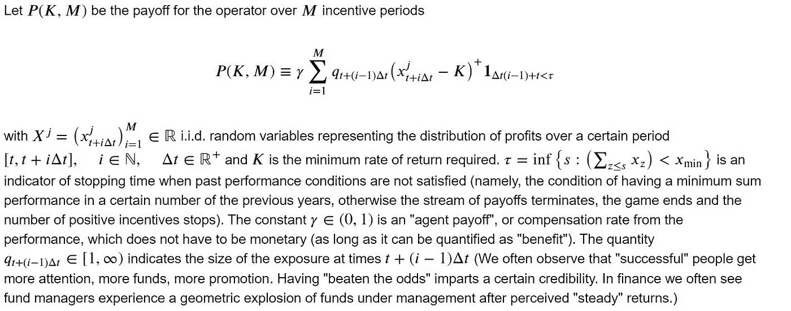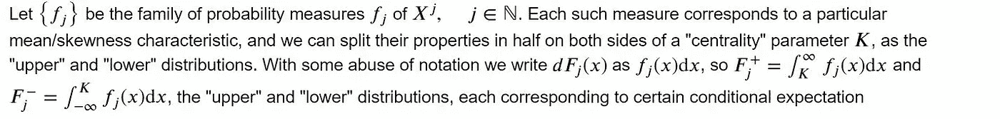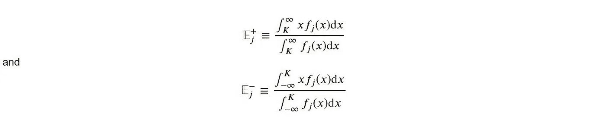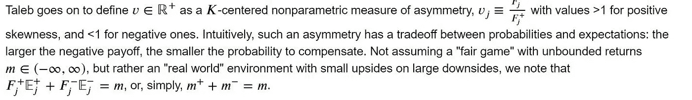

# 计算预期收益

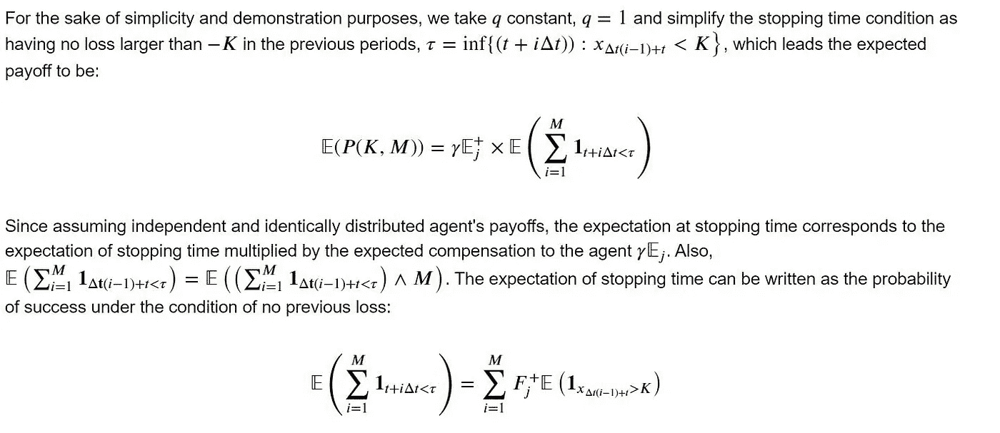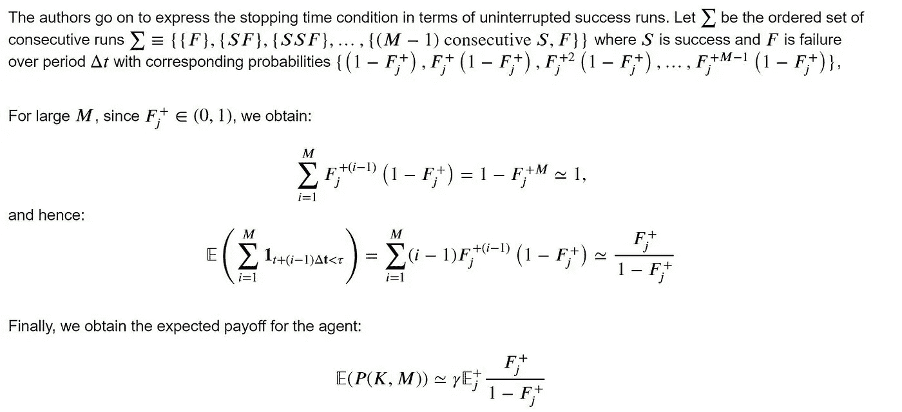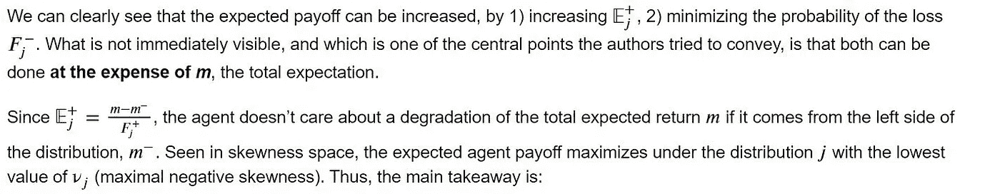

**无利益博弈的正向激励的预期收益取决于负偏度，而不是 m！**

# 让我们看看这是怎么回事！

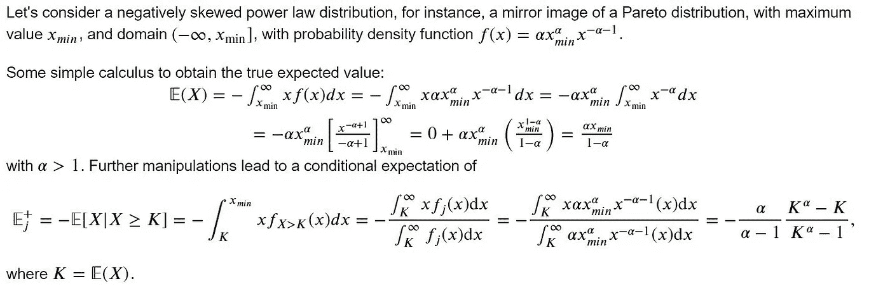

让我们设想一个幂律分布的移位镜像，其指数为𝛼=1.95，值域为∞，10:

```
# import necessary libraries
**import** numpy **as** np
**import** matplotlib.pyplot **as** plt
**import** scipy.stats **as** stats
**from** scipy.stats **import** pareto
**import** scipy.integrate#define pareto pdf 
**def** pareto_pdf(x,alpha, loc, scale):
 **return** (alpha / ((-x — loc) / scale)**(alpha+**1**)) /scalealpha = **1.95**
loc = **-11**
scale = **1**
fig, ax = plt.subplots(figsize=(**10**,**5**))
r = — pareto.rvs(alpha,loc=loc, scale=scale, size=**500000**)
count, bins, ignored = plt.hist(r, bins=**10000**, density=**True**, alpha=0.5, label=r’$x_{min} = 10, P(X > x) = -x^{-\alpha} x_{\min }^{\alpha}$’)
plt.plot(np.array([**10**]***1000**),np.linspace(**0**,**1.5**, **1000**), linestyle = ‘ — ‘, color=’r’, alpha=**0.75**, linewidth=**0.75**)
plt.plot(bins, pareto_pdf(bins, alpha, loc, scale), color=’orange’)
ax.set_xlim(-**100,15**)
ax.set_ylim(**0,1.5**)
ax.annotate(r’$x_{min} = **10**$’, 
 xy=(**10**, **1.5**), 
 xytext=(**10**, **1.65**), 
 arrowprops = dict(edgecolor=’red’,facecolor=’red’, shrink=**0.03**))
ax.set_xlabel(‘Pareto RV’)
ax.set_ylabel(‘Frequency’)
plt.title(‘Pareto distribution’)
plt.legend()
plt.show()
```

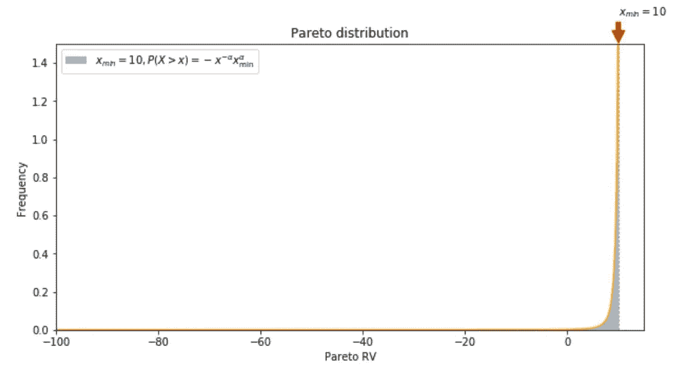

现在，让我们看看著名的 80–20 帕累托分布的样本均值如何收敛到真实均值:

```
pareto_alpha = **1.15**
Pareto_true_mean = -pareto_alpha/(pareto_alpha-**1**) — loc
**print**(‘Pareto **80–20** true mean: ‘, Pareto_true_mean)means = []
pareto_alpha = **1.15**
for n in range(**1**, **10000**):
 distr = — pareto.rvs(pareto_alpha,loc=loc, scale=scale, size=n)
 means.append(np.mean(distr))
fig, ax = plt.subplots(figsize=(**10,5**)) 
ax.plot(np.arange(**1, 10000**), means, linewidth=**0.5**, c=’**r**’)
ax.plot(np.arange(**10000**), np.array([Pareto_true_mean]***10000**), linestyle=’ — ‘, color=’**blue**’, alpha=**0.8**, label=r’$P(X > x) = -x^{-\alpha} x_{\min }^{\alpha}$’)
ax.set_ylim(-**3000**, **1000**)
ax.set_xlim(**0**, **10000**)
ax.set_xlabel(r’$n$’)
ax.set_ylabel(r’$\frac{1}{n}\sum_{i=1}^{n} x_{i}$’, rotation=**0**)
plt.title(‘Convergence of mean for Pareto’)
plt.legend()
plt.show()
```

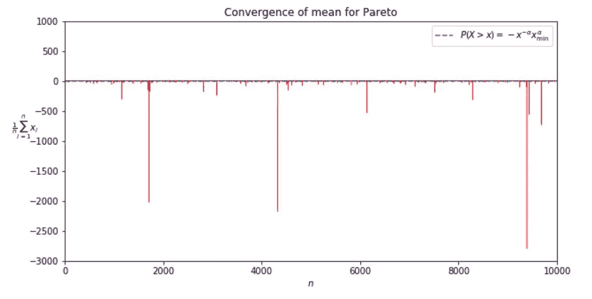

```
means = np.array(means)
perc_above_mean = **100***len(means[means>Pareto_true_mean])/len(means)
print(‘Percentage of observations above mean: ‘, perc_above_mean)
```

我们每隔一段时间就会看到典型的跳跃，对于𝛼=1.15 来说，大约 90%的观察值都高于平均值。厚尾分布隐藏了真实的平均值！

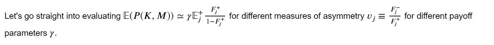

```
#set up parameters
gamma = **0.1**
scale= **1**
loc= -**11**
pareto_alpha = **1.15**# define power law pdf and expected value functions
power_law_pdf = **lambda** x: (pareto_alpha / ((-x — loc) / scale)**(pareto_alpha+1)) /scale
expected_val = **lambda** x: x*(pareto_alpha / ((-x — loc) / scale)**(pareto_alpha+1)) /scale#define the payoff function
**def** **Payoff**(alpha, gamma=gamma, loc=loc, scale=scale):
 true_mean = -alpha/(alpha-1) — loc
 F_right = scipy.integrate.quad(power_law_pdf, true_mean, **10**)[**0**]
 F_left = scipy.integrate.quad(power_law_pdf,-**100000**, true_mean)[**0**]
 expected_val_right = scipy.integrate.quad(expected_val, true_mean, **10**)[**0**]/scipy.integrate.quad(power_law_pdf, true_mean, **10**)[**0**]
 expected_val_left = scipy.integrate.quad(expected_val,-**100000**, true_mean)[**0**]/scipy.integrate.quad(power_law_pdf,-**100000**, true_mean)[**0**]

 **return** gamma*expected_val_right*F_right/(**1**-F_right)alphas = np.linspace(**1.1, 3, 1000**)
payoffs_1 = []
payoffs_3 = []
payoffs_5 = []
payoffs_7 = []
payoffs_9 = []
for alph in alphas:
 payoffs_1.append(Payoff(alph, gamma=**0.1**))
 payoffs_3.append(Payoff(alph, gamma=**0.3**))
 payoffs_5.append(Payoff(alph, gamma=**0.5**))
 payoffs_7.append(Payoff(alph, gamma=**0.7**))
 payoffs_9.append(Payoff(alph, gamma=**0.9**)) 

# set up the asymmetry measures
vs = []
**for** alpha **in** alphas:
 true_mean = -alpha/(alpha-**1**) — loc
 F_right = scipy.integrate.quad(f, true_mean, **10**)[**0**]
 F_left = scipy.integrate.quad(f,-**100000**, true_mean)[**0**]
 vs.append(F_left/F_right)
vs = np.array(vs)fig, ax = plt.subplots(figsize=(**10,8**))
ax.plot(vs, payoffs_1, label=r’$\gamma = **0.1**$’)
ax.plot(vs, payoffs_3, label=r’$\gamma = **0.3**$’)
ax.plot(vs, payoffs_5, label=r’$\gamma = **0.5**$’)
ax.plot(vs, payoffs_7, label=r’$\gamma = **0.7**$’)
ax.plot(vs, payoffs_9, label=r’$\gamma = **0.9**$’)
ax.plot(np.array([**0**]***1000**), np.linspace(**-5, 125, 1000**), linestyle=’ — ‘, color=’**black**’, alpha=**0.5**, linewidth=**0.8**)
ax.plot(np.linspace(**-0.05, 0.9, 1000**),np.array([**0**]***1000**), linestyle=’ — ‘, color=’**black**’, alpha=**0.5**, linewidth=**0.8**)
ax.set_xlim(**-0.05, 0.9**)
ax.set_ylim(**-5, 125**)
ax.set_xlabel(r’$v_{j} \equiv \frac{F_{j}^{-}}{F_{j}^{+}}$’)
ax.set_ylabel(‘Payoff’)
plt.title(‘No $skin \ in \ the \ game$ payoffs under asymmetric fat tails’)
plt.legend()
plt.show()
```

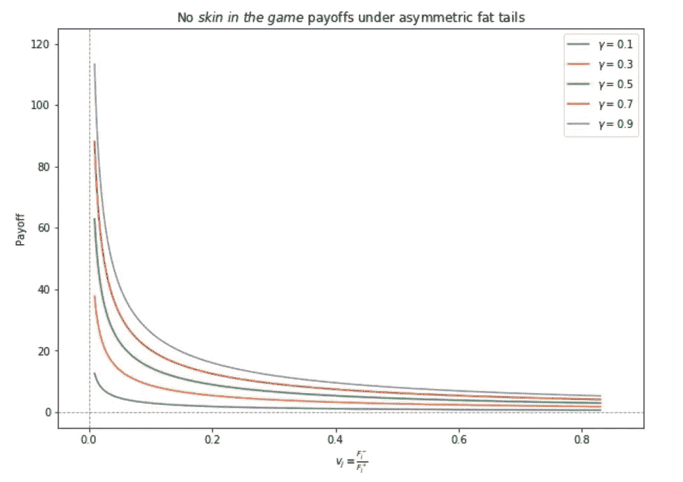

我们看到了什么？代理人从“好”的结果中受益，而没有承担“坏”的结果的成本，看到他们的预期收益随着𝑣𝑗的下降而增加。**这意味着代理人有动机让左尾巴变长，从而累积风险，增加严重崩盘的可能性！**

# 结论

讨论的例子显示了在大多数决策机构和运行它们的代理中危险的风险不对称，并呼吁一个古老的启发式方法作为补救:**游戏中的皮肤。**

正如塔勒布所言，“这种启发意味着，一个人应该是自己产品的第一个消费者，一个厨师应该自己测试自己的食物，直升机修理工应该随时准备乘坐他们维护的旋翼飞机进行随机飞行，对冲基金经理应该最大限度地投资于他们的基金。但这并不天真地暗示人们应该一直使用自己的产品:理发师不能给自己理发，癌症药物的制造商不应该使用自己的产品，除非他生病了。所以一个人应该有条件地使用他的产品，在被召唤使用它们的时候。然而，在涉及系统性风险的问题上，该规则要严格得多:简单地说，某些决定永远不应由某一类人做出。”

有关游戏中皮肤试探法的伦理和哲学含义的更多细节，请参考[原始论文](https://arxiv.org/pdf/1308.0958.pdf)。

完整的 jupyter 笔记本和上面的笔记代码可以在这里找到。