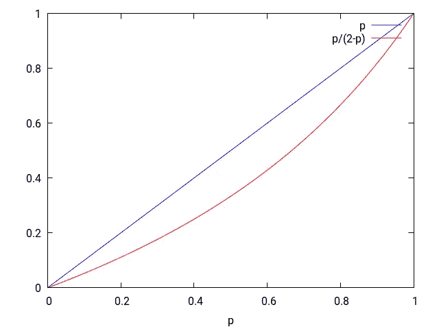
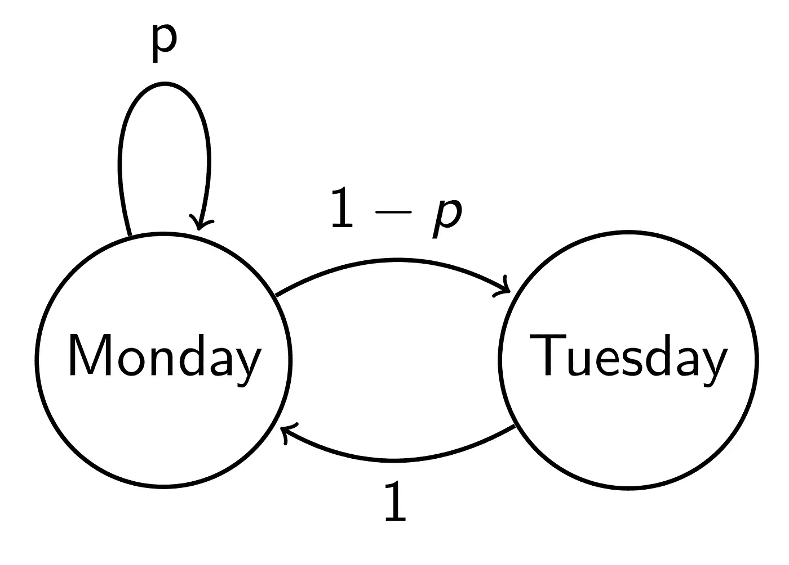

# 睡美人问题:数据科学家的视角

> 原文：<https://towardsdatascience.com/the-sleeping-beauty-problem-a-data-scientists-perspective-56223b5128e4?source=collection_archive---------7----------------------->


Photo by [Javier Ramos](https://unsplash.com/photos/bzM0FW2ozS0?utm_source=unsplash&utm_medium=referral&utm_content=creditCopyText) on [Unsplash](https://unsplash.com/?utm_source=unsplash&utm_medium=referral&utm_content=creditCopyText)

我在实验物理课程中学到的第一课也是最难忘的一课是:永远不要，T2，永远不要，画一张没有误差线的测量图。误差线表示特定测量值的不确定程度。这条实用规则有更深层次的道理。这意味着任何经验证据或数据的真实性都存在不确定性。更重要的是，如果我们不能衡量这种不确定性，这些数据将变得毫无用处。

概率的抽象概念允许我们对不确定的事件进行推理，例如“这个仪表显示的电势是 1.5 V 还是 1.4 V？”。它不仅是数据科学领域的核心，实际上也是任何利用统计描述的实证科学的核心。因此，即使对于应用科学家来说，偶尔停下来思考一下关于概率的更基本的问题也是有意义的。

睡美人问题是决策理论中的一个思想实验，触及了概率的基础。这篇文章的主要目的是对这个问题提供一些独到的见解，也许能为解决这个问题提供新的思路。

想象一个实验设置，包括一个自愿的主题——同名的睡美人——和一个公平的硬币。

来自[维基百科](https://en.wikipedia.org/wiki/Sleeping_Beauty_problem):

> 睡美人自愿接受以下实验，并被告知以下所有细节:周日她将被实施安乐死。有一两次，在实验过程中，睡美人会被唤醒，接受采访，然后用一种诱发失忆的药物让她忘记那次醒来。一枚[公平硬币](https://en.wikipedia.org/wiki/Fair_coin)将被[投掷](https://en.wikipedia.org/wiki/Coin_flipping)以决定进行哪个实验程序:
> 
> 如果硬币正面朝上，睡美人将在周一被唤醒并接受采访。
> 
> 如果硬币正面朝上，她将在周一和周二被叫醒并接受面试。
> 
> 无论哪种情况，她都将在周三被唤醒，没有面试，实验结束。
> 
> 每当睡美人被唤醒并接受采访时，她都不知道今天是哪一天，也不知道自己以前是否被唤醒过。在采访中，睡美人被问到:“现在你对硬币正面朝上的说法有什么信心？”

这个悖论来自于试图给以下问题一个独特的答案:作为一个理性的代理人，睡美人在每次采访中应该给*什么答案？*

**“半工”的职位。睡美人被告知实验装置的所有细节。因此，她醒来后没有获得额外的信息，因为她知道她会一直醒来。因此，在周一或周二，或者在实验结束前的任何时间点，某人认为硬币正面朝上的信念一定是相同的。**

既然她也知道硬币是公平的，那么可信度一定是 1/2。

**“第三者”的位置。SB 被告知实验装置的所有细节。因此，在觉醒时，她知道发生了以下互斥且详尽的事件之一:**

1.  今天是星期一，硬币正面朝上。
2.  今天是星期一，硬币正面朝上。
3.  今天是星期二，硬币正面朝上。

在没有进一步信息的情况下，SB 不得不假设每个事件发生的可能性是相等的。

因此，她认为硬币正面朝上的概率是三分之一，即 1/3。

如果这是你第一次听说这个思想实验，我建议你在继续阅读之前思考一下这个问题，并决定你属于哪一个阵营:你是半个还是三个 T21？

从表面上看，这个问题与其他概率谜题非常相似，如蒙提霍尔问题或伯特兰悖论，因为这些问题也能产生多种答案。

然而，通过概率建模的标准技术可以很好地理解 Monty Hall 问题的解决方案。最初的困惑来源于正确的解决方案与个人直觉的冲突，有些人可能会发现难以调和。但是在盯着决策树看了足够长的时间和/或在一副牌的帮助下重演了 Monty Hall 游戏之后，直觉通常会随之而来。

另一方面，伯特兰悖论就有点复杂了。在最初的问题陈述中，生成样本的过程不够精确，因此您可能会满意地得出结论，混乱只是由不适定的问题引起的。然而，寻找 Bertrand 悖论的“适当”解决方案的工作仍在继续，因为许多现实世界的问题实际上是不适定的，显然也需要找到这类问题的“最佳”解决方案。

然而，睡美人悖论似乎是另一种野兽:作为一个活跃的研究问题，研究它的人仍然分为“半睡者”和“三睡者”(尽管更多的立场也得到了捍卫。)

与蒙蒂·霍尔问题不同，当你从任何一方听到足够多的论据时，直觉不会跟着做，双方通常都会援引相当标准的论据。

与伯川德悖论不同，这个问题至少在*看来*被定义得足够好，有一个独特的解决方案。

# 睡美人与人类推理

O 启动[直觉泵](https://en.wikipedia.org/wiki/Intuition_pump)的一个方法是概括问题并调整实验的设置。此外，也许更重要的是，我们可以测试 halfer 和 thirder 位置对这种一般化的鲁棒性。例如，我们可以调整唤醒的次数:

**SB 在《尾巴世界》里醒了很多次。尼克·博斯特罗姆邀请我们想象当硬币正面朝上时，某人被唤醒一百万次，而不是仅仅两次。如果硬币正面朝上，她只会在周一醒来，就像最初的实验一样。**

根据最初的第三个论点，在每次觉醒时，SB 现在几乎可以肯定硬币落在了反面:不是只有三个，而是有 100 万个可能的结果，其中只有一个意味着正面。

根据最初的 halfer 论证，无论她在“反面世界”和“正面世界”中被唤醒的频率不同，SB 的可信度都保持在 1/2。

**SB 在《人头世界》中始终没有醒来。假设我们改变实验，如果硬币正面朝上，某人将不会被唤醒。如果硬币正面朝上，某人至少会被唤醒一次。因此，某人醒来时硬币正面朝上的可信度一定等于零，因为醒着就是相反的证据。**

这种变化与[人类推理](https://en.wikipedia.org/wiki/Anthropic_principle)和宇宙学的[微调问题](https://en.wikipedia.org/wiki/Fine-tuned_Universe)有关:假设硬币严重偏向“正面”,那么它落在反面的先验概率将是，比如说，0.0000000001。然而，这种可能性有多小(或多高)并不重要:当某人被唤醒时，她可以绝对肯定地断定硬币落在了反面。

类似地，人择推理告诉我们:我们不应该对这么多看似不可能的情况聚集在一起使有意识的生命成为可能感到惊讶:我们不能以任何其他方式观察它。人类永远不可能在“人头世界”中觉醒。

B 另外两种变化实际上是密切相关的:它们描述了这样的情况，在这种情况下，某人可能被唤醒的“头世界”的数量比“尾世界”的数量少得多。

因此，第三个作者的论点很好地将两种变化联系在一起:SB 在“正面世界”中从不醒来的情况可以被视为她在“反面世界”中醒来次数少得多的极限情况。

半身人被迫承认，SB 在“正面世界”中从未醒来是一个特殊的情况:与原始的实验设置或任何其他在两个世界中非零醒来的设置相比，SB 这次显然从被唤醒中获得了信息，并不得不调整她对掷硬币的判断。

然而，在这种情况下援引第三个论点意味着另一种麻烦。想想傲慢的哲学家:这位傲慢的哲学家认为任何预测我们的宇宙包含一万亿万亿个有意识观察者的宇宙模型比任何预测只有一万亿个这样的观察者的模型更有可能存在一万亿倍。因此，他或她可以——原则上——通过纸上谈兵的争论来贬低大多数物理实在的理论。

没有进一步的阐述，我发现这个反对意见并不强烈，因为，例如，奥卡姆剃刀也提出了一个非常常用的纸上谈兵的论点来挑选理论——即使当它们做出完全相同的预测。

事实上，如果你站在某人的立场上考虑，直觉可能会更偏向半方，实验会有以下变化:硬币严重倾斜，因此正面落地的几率是反面的 1000 倍。正面的时候你只会被唤醒一次，反面的时候你会被唤醒一百万次。

即使硬币有如此大的偏向正面的倾向，第三个位置告诉我们，当你醒来时，硬币仍然更有可能是反面着地。

在面试过程中，你的任务不是给出你对掷硬币结果可信度的数值，而是猜一猜，即明确回答“正面”或“反面”。面试官，一个邪恶的科学家，如果你答错了会当场杀了你。即使你是第三个，你会自信地说“尾巴”吗？我将在最后一节回到这个变化。

# 拿着不公平硬币的睡美人

修改醒来的次数是概括睡美人的一种方式。另一种方法是假设一个不公平的硬币，并采用最初的 halfer 和 thirder 论点，以测试它们对这种一般化的鲁棒性。

在下一节介绍马尔可夫链观点之前，我将描述一种将睡美人推广到有偏差硬币的替代方法，这种方法更接近于问题解决方案的通常推导。我们将再次假设最初的觉醒次数:如果硬币正面落地，一次觉醒；如果硬币反面落地，两次觉醒。

让我们假设硬币落地正面的先验概率是 **P(正面)= *p*** ，它是 0 和 1 之间的某个数字，但不一定是 1/2。SB 知道 ***p*** 的值；或者，她可能有机会在实验开始前通过多次投掷硬币来自己估算 p。

目标是确定 **P⁺(heads) := P(头|清醒)**。现在，对半分者和三分者都同意 **P⁺(heads|Tuesday) = 0** 。

然而，双方在周一的条件反射的含义上存在分歧:

**半身位。**觉醒后某人的信任度没有变化: **P⁺(heads) = P(人头)= *p*** 。

第三个位置。为了让我们把第三种情况推广到有偏差的硬币，我们需要调整最初的论点。基本的论点是基于无差别原则:公平地说，对于睡美人来说，任何结果都没有明显的区别，所以在最初的设置中， **P⁺(heads，星期一)**和 **P⁺(tails，星期一)**和 **P⁺(tails，星期二)**是相等的。

然而，如果硬币是有偏差的，那么这个假设就不成立，因为生活在“正面世界”或“反面世界”的人可能有非常不同的可能性。

如果你从这个现在已经不合法的论点中去掉第三个立场，你就剩下下面这个立场，它代表了与半者观点的关键区别:如果某人被唤醒，实验者告诉她，事实上是星期一，她对硬币正面落地的信任度必须等于她先前的信任度(因为她在星期一醒来，不管硬币投掷的结果如何，因此没有学到任何新东西): **P⁺(heads|Monday) = P(正面)= *p***

上述假设将**【p⁺(⋅】**分别确定为对半者和三者的参数化联合分布，如下所示:


对于半工来说，参数 ***t*** 对最终结果 **P⁺(heads) = p** 没有影响。

然而，第三个用户仍然需要选择参数 ***q*** ，该参数可以解释为某人相信她醒来时是星期一:**p⁺(monday)=*q****。*

选择该参数的一种方法可以是最大熵原理:在没有进一步信息的情况下，我们应该选择最接近均匀的分布。作为参数 ***q*** 的函数，给定 ***p*** ，上述分布的熵可以计算为

***S*(*q*)=-(1-*p*)*q*log((1-*p*)*q*)-*pq*log(*pq*)-(1-*q*)log(1-*q*)【T51，**

其中的最大值可以通过基本微积分找到。

然而，我们需要拒绝最大熵解，因为它意味着 **P⁺(heads) = 1/2** 在 ***p* → 1** 的极限内——这当然没有意义，因为 SB 应该确定，每当该事件的先验概率已经接近 1 时，硬币正面落地。

找到参数 ***q*** 的合理值的另一种方法是调用无差别原则，毕竟——但只基于以 **tails** 为条件的分布:假设无论何时 SB 在“tails world”中醒来，她都无法区分星期一和星期二。因而，**p⁺(monday|tails)= P⁺(Tuesday|tails)**，从而 **P⁺(Monday，尾巴)= p⁺(tuesday，尾巴)**，并因此**(1-*p*)*q*= 1-*q***最终导致***q*= 1/(2-*p*)**

这一分析得出以下结论:

半身美女不更新硬币正面落地的可信度: **P⁺(heads) = P(正面)= *p*** *。*

第三位美女在醒来时通过乘以她们的主观概率来更新她们的可信度: **P⁺(heads) = P(人头)⋅p⁺(monday)=*pq*=*p*/(2-*p*)**。



Halfer posterior (blue line) vs. thirder posterior (red line) for priors P(heads) = p

# 马尔可夫链上的睡美人

L et 采用不同的视角，将问题建模为*重复*睡美人实验的马尔可夫链:



这个状态转换图应该这样理解:当 SB 在星期一醒来时，她下一次醒来的概率是 ***p*** 她将再次在星期一醒来:当硬币正面朝上时，星期二将没有面试，实验将重复进行。

以概率 **1 - *p*** ，她下一次觉醒将是在实验重复之前的一个星期二。

某人对今天是什么日子这一事实的无知可以直接转化为她对她当前所处的状态的无知:她所经历的只是一系列无法区分的觉醒。

让我们把星期一→星期一的转变称为“正面转变”，而星期一→星期二的转变称为“反面转变”。假设这个实验已经重复了很多次。

在该模型中，halfer 和 thirder 解决方案呈现出显著的特征:

马尔可夫半工。由 ***p*** 给出*下一个转变*是正面还是反面*将是*正面转变的概率:

要么是星期一，下一个转换是概率为 ***p*** *—* 的正面转换，要么是星期二，下一个转换是重复实验，之后的转换是概率为 ***p*** 的正面转换。

马尔科夫·瑟德。要么正面要么反面*的*先前转换*是正面转换*的概率由***p*/(2-*p*)**给出:

如果今天是星期二，前面的转换一定是尾部转换。如果是星期一，前一个转换是概率为 ***p*** *的正面转换。*如果实验已经经历了许多周期，SB 可以确信成为星期一的概率由马尔可夫链**π(⋅)**的平衡分布给出，在这种情况下由**π(星期一)= 1/(2 - p)** 确定——这是我们在上面的更“贝叶斯”处理中已经遇到的概率。因此，最终概率不是由转移概率给出的，而是由概率通量**π(星期一)⋅ P(星期一→星期一)=*p*/(2-*p*)**给出的。

请注意，第三个位置也可以应用于遥远的未来:被访问后的第一百万个正面或反面转换是正面转换的概率将非常接近***p*/(2-*p*)**。

当我们通过将问题建模为马尔可夫链来处理这个问题时，我们仍然面临着相同的不同解决方案，我觉得这导致了对这些解决方案的解释的更清晰的画面。有人可能会说，这种明显的区别可以归因于我们赋予同一个词“概率”的不同含义:

1.  “预测概率”睡美人希望表达她的信念:无论实验者何时投掷硬币，硬币都是正面朝上的。这种预测不依赖于今天是什么日子或任何其他事态。那个可信度是 1/2(或者更一般的， ***p*** )。
2.  “描述性概率。”睡美人希望表达她对事件“正面”在她的参照系中通常发生的频率的看法。这个频率是 1/3(或者更一般的，***p*/(2-*p*)**)。

这一悖论似乎源于这样一个事实，即通常每个概率概念的值是一致的:在掷了一百万次骰子之后，我们确信，由于每个可能结果的频率(“描述性概率”)非常接近 1/6，所以我们可以根据相同的不确定性度量(“预测性概率”)来推断下一次我们掷同样的骰子的时间。

# 睡美人和参考类问题

他将睡美人问题的解决方案分成两半和三瓣，这可以解释为参照类问题的一个例子:作为参照类，SB 应该选择实验类(一系列实验中的两个中的一个将产生“头”)，还是醒来类(三个中的一个)。你可能会很快争辩说，SB 当然应该选择她“自己的”参照类，即觉醒类。

然而，在这种情况下，我将通过如下重复睡美人实验的变体，为 halfer 的立场给出一个论点。在原始公式中，SB 完全知道生成数据的机制，但她无法访问实际数据。

现在假设 SB 每次醒来都被告知硬币是否正面朝上，她被允许记录醒来的次数。然而，这一次她并不知道这些数据是通过复杂的程序产生的。因此，她可能会得到这样一个序列( ***p*** = 1/2， **H** =正面， **T** =反面):

```
TTTTHTTTTTTHTTHTTHHHHTTTTHHHTTHHTTTTTTTTHTTHTTHTTTTHTTHTTHTTTTTTHHTTTTTTHTTTTTTTTHHTTTTTTTTHTTHTTTTTTTTHTTTTHTTTTHHHHHTTTTHTTTTTTTTHHHHHTTTTTTTTTTTTTTTTTTTTTTHHTTTTTTTTTTHHHTTTTTTTTTTHTTTTTTTTHHHHHHTTHTTHHHTTTTTTTTHTTHHHHTTTTTTHTTTTHHTTHHHHTTHHHTTHTTTTHHHHTTTTTTTTTTTTHHHHHHHTTTTTTTTHHHHHTTHTTTTTTHTTHTTTTHHTTTTHTTHHTTTTHTTHTTTTHTTHHTTHTTHHTTHHTTHTTHHHTTHTTTTHHTTHHTTHTTHHTTHHTTHHHTTHTTTTHHTTHTTHTTTTTTTTHTTTTTTTTHHTTHTTHHTTHHHTTTTTTHTTHTTTTTTTTHTTTTTTHTTHHHTTHTTHTTTTTTTTTTHHTTTTHTTHHHTTHTTTTHHHHHHTTHTTHTTHHHTTHHTTTTTTHTTHTTHHHHTTHHTTTTTTHHHHHTTHTTTTHTTHHHTTTTTTHTTTTHHTTTTHTTTTHTTTTTTTTHHTTTTTTHHTTTTHHHHTTTTHTTTTTTHHTTHHTTTTHTTTTHTTTTTTTTHHTTHTTHTTTTTTTTTTHTTHHHHTTHTTHTTTTHTTHTTHTTHHHHTTTTTTHTTTTHHHHTTTTHHHTTHHTTTTTTTTTT
```

对这一抛硬币序列的简单分析将使她能够计算出“正面”出现的频率，大约是三分之一。然而，她也可以了解到某些特征似乎永远不会出现，例如 **HTH** 。

因此，SB 被给予所有的数据，并且她甚至不知道她应该相对于哪个特定的参考类来计算频率。尽管如此，她仍将得出结论，尽管假设以 1/3 的概率随机抽取 **H** 和以 2/3 的概率随机抽取 **T** 与数据一致，但产生观察结果的更好解释是以 1/2 的概率顺序抽取 **H** 和 **TT** 。

当她被告知实验的细节后，她会发现优越的理论得到证实。因此，如果实验继续，但她没有得到任何新的数据，她没有理由修改她对实际发生的事情的信任，这包括两个看似矛盾的陈述“ **H** 以 1/2 的概率得出”和“ **H** 以 1/3 的概率得出”，但它们只是两个不同假设的一部分，只有在脱离上下文的情况下才显得矛盾。

# 总结和结论

当你试图将半分者和三分者的论点扩展到一个不公平的实验设置时，这个实验设置涉及一个以任意频率显示头部的硬币*，在如何扩展三分者的论点方面存在一些模糊性。但可以得到一致的广义三阶结果: ***p* /(2 - *p* )** 。*

*此外，通过提供一个在重复执行实验时生成数据(不被 SB 观察到)的模型，有两种方法可以结合 halfer 和 thirder 观点:*

1.  *一个马尔可夫链模型，其中 ***p*** 代表转移概率***p*/(2-*p*)**分配给“跳过星期二”的概率通量，*
2.  *一个随机序列，其中“正面”以频率***p*/(2-*p*)**出现，但该频率仅作为该序列的部分描述:“正面”以概率 ***p*** 出现，“反面，反面”分别以概率 **1 - *p*** 出现。*

*就我个人而言，在思考这个问题时，我的观点从三分之一变成了二分之一。目前，我认为，睡美人的可能答案的明显矛盾可以通过接受这样一个事实来缓解，即两者都不能完全描述她所处的情况，因为产生看不见的数据的机制不能仅由一个参数完全描述。*

*最后，睡美人的正确答案可能就像这样简单:*

*“在这个实验过程中，硬币正面着地的概率由值 ***p*** 给出。但是如果我猜测硬币正面朝上，我会以更小的概率***p*/(2-*p*)***猜对。**

*这也可以用不同的实用程序来举例说明:*

1.  *如果邪恶的科学家在某人猜“正面”或“反面”时因给出错误答案而杀死她，她最好以 ***p*** 作为她回答的基础。(这是显而易见的，当她在周三的整个实验后被杀。但如果她在周一被杀，这也成立，因为在那种情况下不会有周二的觉醒，有效地缩小了觉醒的参考类。)*
2.  *如果 SB 每次猜对硬币都被奖励一个价格(例如，钱)，那么当评估硬币显示“正面”的概率为***p*/(2-*p*)**时，她将有更大的预期收益。*

*因此，这个悖论可能源于一种误解，即睡美人的现实只能由一个概率变量来详尽描述。然而，我相信讨论不会就此结束。*

## *参考*

*[睡美人问题](https://www.youtube.com/watch?v=zL52lG6aNIY)，朱莉娅·加里夫的视频*

*米（meter 的缩写））皮乔内和 a .鲁宾斯坦。[关于不完全回忆决策问题的解释](https://doi.org/10.1006/game.1997.0536)。载于:游戏与经济行为 20 (1997)，第 3-24 页*

*A.埃尔加。[自我定位信仰与睡美人问题](https://doi.org/10.1093/analys/60.2.143)。载于:分析 60.2 (2000 年)，第 143-147 页*

*南吉阿苏和申尼策尔。[最大熵原理](https://doi.org/10.1007/BF03023004)。摘自:《数学智能 7.1》(1985)，第 42-48 页*

*F.p .凯利。[可逆性和随机网络](http://www.statslab.cam.ac.uk/~frank/BOOKS/kelly_book.html)。奇切斯特，威利，1979 年*

*D.刘易斯。“[睡美人:回复 Elga](https://doi.org/10.1093/analys/61.3.171) ”。载于:分析 61.3 (2001 年)，第 171-176 页*

*名词（noun 的缩写）博斯特罗姆。[睡美人和自我定位:一个混合模型](https://doi.org/10.1007/s11229-006-9010-7)。载于:综合 157.1 (2007)，第 59-78 页*

*页（page 的缩写）温克勒。[睡美人之争](https://doi.org/10.4169/amer.math.monthly.124.7.579)。载于:《美国数学月刊》124.7 (2017)，第 579 页*