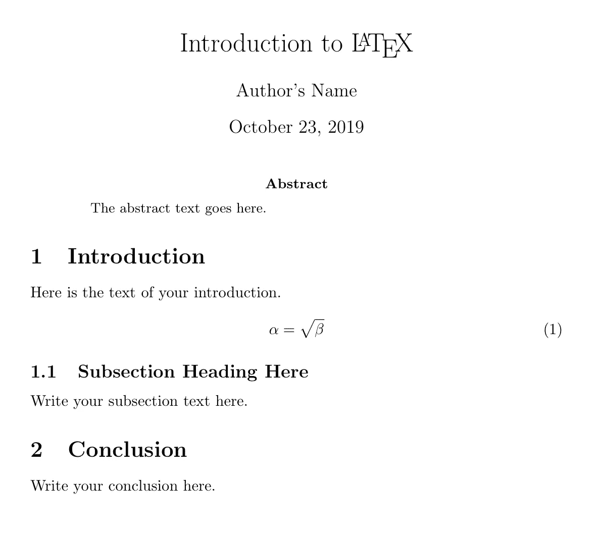

# ArXiv 论文空间

> 原文：<https://towardsdatascience.com/the-space-of-arxiv-papers-1f9648005cab?source=collection_archive---------32----------------------->


ArXiv’s recently-old favicon. [The full story here](https://www.quora.com/Whats-the-story-behind-the-arXiv-org-favicon).

T 今年夏天，我和我的团队与英伟达人工智能技术中心的研究人员联手，在新加坡技术与设计大学使用机器学习技术设计和开发了一个人工智能(AI)研究助理。

这个项目背后的动机？让人工智能助手处理学术研究过程的一部分，减少人类研究人员的认知负荷，并为他们腾出宝贵的时间和资源来执行更高级的任务，如构思、实验设计和写作。

在这篇文章中，我们将谈论我们收集的一些重要想法，以及我们可能如何考虑设计人工智能系统来构建知识空间，导航和操纵数据，并提供见解而不是信息过载。

# 设计知识空间

事实证明，研究过程的很大一部分，尤其是早期阶段，自动化的潜力很大。我们进行的一项涉及 64 名研究人员的研究揭示了早期研究痛点的两个关键见解:(1)信息空间太难导航，以及(2)这一空间的结构非常复杂，迫使通过研究论文之间的递归引用路径导航-不能保证找到有价值的东西。

但是，如果我们可以把这个看似不可避免的、人类难以解决的问题，转化成一个自动化的任务，会怎么样呢？我们能在信息空间中轻松定位自己，并更容易探索我们附近的区域吗？这是我们的目标。

我们需要将这个问题转化为一个工程问题——我们如何构建和分析研究知识的空间，并确保它容易穿越，不带偏见，并最终有益于人类研究人员？我们首先需要一个巨大的、结构化的研究知识来源，为了获得一个真正好的样本，我们期待着 [ArXiv](http://arxiv.org) ，康乃尔的电子印刷档案，来形成我们的知识库。

提交给 ArXiv 的论文通常会在会议或期刊上发表，并且可能会经历极其缓慢的同行评审过程。毫无疑问，ArXiv 正迅速成为事实上的标准，用于快速声明研究想法、非正式审查，以及使某些科学领域的科学工作民主化。经过验证的研究人员自行向 ArXiv 提交预印本，并鼓励以(La)TeX 格式提交。如果我们检查一下 [ArXiv 批量源文件访问](https://arxiv.org/help/bulk_data_s3)页面，我们会看到这些文章以`.tex`格式的大量集合可供下载。

# 关于乳胶的简短介绍

首先，一个简单的渲染文档及其 LaTeX 源代码如下所示。



A PDF document compiled from its LaTeX source (shown below).

```
\documentclass{article}
\begin{document}

\title{Introduction to \LaTeX{}}
\author{Author's Name}

\maketitle

\begin{abstract}
The abstract text goes here.
\end{abstract}

\section{Introduction}
Here is the text of your introduction.

\begin{equation}
    \label{simple_equation}
    \alpha = \sqrt{ \beta }
\end{equation}

\subsection{Subsection Heading Here}
Write your subsection text here.

\section{Conclusion}
Write your conclusion here.

\end{document}
```

TeX 文件包含排版的基本说明，可以呈现为各种格式，最常见的是 pdf。LaTeX 包含一组方便的宏，可以轻松定义和重用书写要素，如标题、页眉、等式、节和页脚。

# 研究论文的结构

将文档存储在 TeX 中意味着您只需要重新创建这些漂亮、结构化和格式化的研究论文的源文件`.tex`,以及源文件引用的任何图形或媒体文件。

如果你是机器学习的实践者，你可能已经认识到这些摘要、标题、章节、小节等。，以及它们的文本和图形内容，形成标签-数据对，所有这些都已经为我们分配好了！我们现在可以把 ArXiv 看作一个标签和文本(或者图像和其他媒体)的结构化数据集。例如，如果我们对论文中的文本字符串进行分类感兴趣，我们可以在如下所示的样本上训练我们的分类模型:

```
Label: \section{Results} -> 'results'
Data:  "The results of our method...
```

拥有结构合理的研究论文也使我们能够尝试和猜测研究论文的哪些部分是重要的——如果我们知道论文的摘要是全文的良好总结，那么我们可以训练模型尝试在给定研究论文全文的情况下重建摘要。

为了进一步发展这一思想，一些 ArXiv 论文包含结构化的摘要，这些摘要是在摘要部分中的论文的每个部分(例如，数据、方法、结果、结论)的小标签摘要，实质上在它们的正常部分中提供了较长文本对，以及在摘要中找到的它们的摘要。毫不奇怪，它们[最近已经被](https://www.reddit.com/r/MachineLearning/comments/dloody/p_a_bertsum_bert_extractive_summarizer_model/)用来训练抽象的摘要模型！

相比之下，如果我们试图分析 PDF 或扫描文档，就会出现大量的设计问题:我们应该使用 [OCR](https://en.wikipedia.org/wiki/Optical_character_recognition) ，还是应该尝试[从图像中重建标签](https://arxiv.org/pdf/1711.05862.pdf)？或者我们应该试着把 PDF 重新转换成 LaTeX？哪种转换可能会损失更大？很明显，只要有可能，坚持使用 LaTeX 会给我们提供来自源代码发行版的最干净的数据(作者！)产生它，绝对没有噪音。

# 研究论文的空间

好了，我们现在知道了一篇研究论文的样子，但是它们看起来完全不同:似乎没有一种方法可以恰当地比较这些论文！人工智能助手将如何从它所拥有的研究论文中构建知识的表示，并将其简化，以便主题查询，如*“煮鸡蛋”*，或结构化问题，如*“卷积和相关性之间的关键区别是什么？”*，可以开始讲道理了吗？问助理一个问题意味着什么，它将如何在这个空间中尝试并返回一个答案？

让我们假设今年是 [2028](http://www.vetta.org/2011/12/goodbye-2011-hello-2012/) ，你是一个功能正常的人类级人工智能助理。你试图回答*卷积与相关性*的问题来帮助一位研究员。让我们假设你已经明白你的任务是比较两个事物，带着“关键差异”所隐含的紧迫感，你知道你必须只返回最大的差异。现在你有两个关键词，“卷积”和“相关”。你知道你必须查看提到这两个词中的一个或两个的文档，并处理这两个词用法之间的相似之处，这样你就能通过减法和逻辑方法发现它们的不同之处。很容易，不是吗！

现在让我们回到现在的 2019 年，想象你是建造助手的人。你被困住了——你收集了大量的文档，但是你没有办法处理文档之间的相似性或相关性，这是比较“卷积”和“相关性”的第一步。还是你？

有一些可能性。如果我们看一下我们收集的所有 ArXiv 论文，我们可能会意识到它们实际上是由很多单词组成的。我们可能会猜测，在两个文本文档中有相似的单词、样式或内容意味着这两者很可能彼此相关。这给我们带来了两种评估文档中单词之间关系的流行方法:(1)排序方法，和(2)向量嵌入。

像 [TF-IDF](https://skymind.ai/wiki/bagofwords-tf-idf) 或 [BM25](https://en.wikipedia.org/wiki/Okapi_BM25) 这样的排序方法使用单词在文档中的出现作为相似性的标记。TF-IDF 认为，只有当文档经常共享不同的单词时，它们才是相似的。[向量嵌入](https://hackernoon.com/understanding-word-embeddings-a9ff830403ce)通常在大型语料库(如我们的文章集)上进行训练，并在推理过程中，为给定的单词生成向量，然后可以对其进行数字处理——例如使用余弦距离。此外，像 ELMo 和 BERT 这样的上下文敏感的嵌入让我们能够区分使用不同的完全相同的单词。

这两种方法让我们通过指定文章之间的某种形式的相似性来遍历文章之间的空间。通过扩展，我们获得了相互比较文档的能力，也就是说*这个*比*那个*更相关。这可以说是学习以下能力的第一步:对信息进行优先排序，根据标准对知识进行排序，在广泛的指标范围内比较研究论文、主题和查询。

如果我们的研究集合的文本内容还不够丰富，ArXiv 还存储了每篇论文的元数据。所有文章都附带元数据文件，其中至少包含作者姓名、文章标题、主题类别、明文摘要和日期，提供了额外的维度或指标来评估研究文档集的相关性和相似性。谁说研究想法或知识在文档中是孤立的，或者单词相似性需要成为空间的基础？用我们能够提取的特征，我们还能建造什么样的空间？关于……

# 引文

参考书目是判断一篇研究论文是否与另一篇相似的巨大线索。想象一下，构建一个巨大的知识图，其中的节点是单个的研究论文，有向边携带着关于哪篇论文引用了哪篇论文的信息。我们可以根据论文的内容来学习这些边缘的权重吗？这是一个完全不同的——也可以说是更有条理的——研究领域的代表！重要的是，如果我们想象这个巨大的引用网络，我们现在能够可视化论文之间的真实联系，这使得构建搜索算法来遍历它们变得更容易，就像我们习惯的图形问题一样。除了相似性的文本特征表示，通过将引用的概念添加到我们的 ArXiv 空间中，我们现在有了对论文之间的外部关系进行编码的维度，即作者身份和思想传播领域中的维度。

不过，恢复完整的参考网络并不容易。当我们试图递归生成这个网络时，那些本身不在 ArXiv 上的论文经常会破坏引用路径。如果你需要引用一篇非常非常旧的论文呢？或者，如果那张特定的[报纸是 ViXra.org](https://academia.stackexchange.com/questions/105518/what-are-the-differences-between-vixra-org-and-arxiv-org)的呢？

# 公平知识的问题

尽管试图设计知识可能令人兴奋，但当我们试图将我们辛苦收集的数据集与知识等同起来时，当我们未能考虑到 ArXiv 仅仅是所有可用研究信息的样本时，就会出现一个突出的问题。值得注意的是，通过使用来自 ArXiv 的 TeX 文章，我们明确地将人工智能助手偏向于从 2000 年 1 月 1 日至今提交的来自 8 个研究领域的特定的、经过验证的研究人员的定量研究。

学习程序还需要考虑统计上的不平衡，比如领域之间的提交数量或提交的季节性。我们还面临着更大时间范围内的偏差:数字人文学科正在积极研究长期以来文档中语言的变化——句子结构和单词用法随时间的变化如何影响我们的相似性和摘要算法，以及我们如何调整它们以解决这些问题？

有许多悬而未决的问题，需要考虑很多，而且这些问题到目前为止看起来相当棘手。但我希望，这些从设计可导航信息空间的尝试中收集的见解，将对任何碰巧想解决类似或不太相关的问题的人有用，无论是否在人工智能领域。

作为一个轻松的总结，这里有一个有趣的问题——我们超级聪明、征服 ArXiv 的人工智能助手将如何能够不学习[废话](https://arxiv.org/pdf/1703.10449.pdf)？