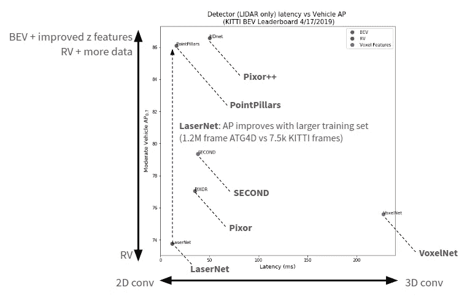
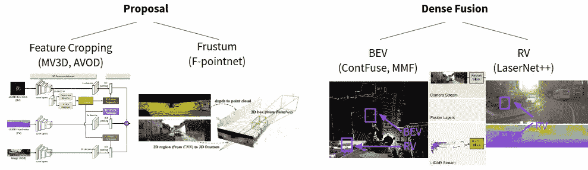
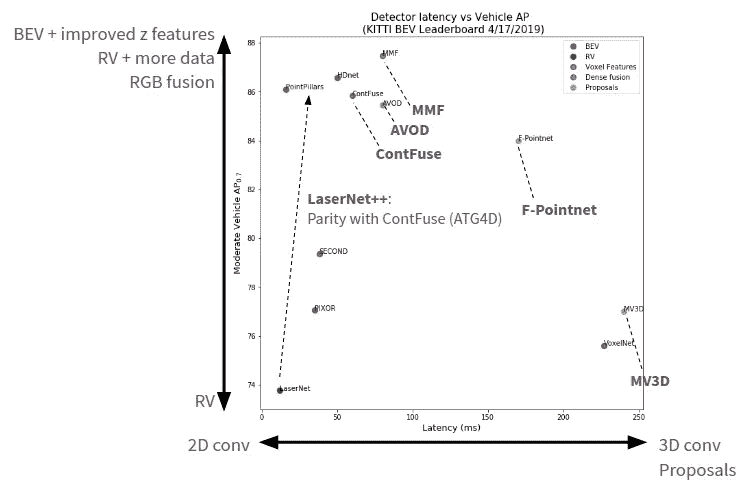
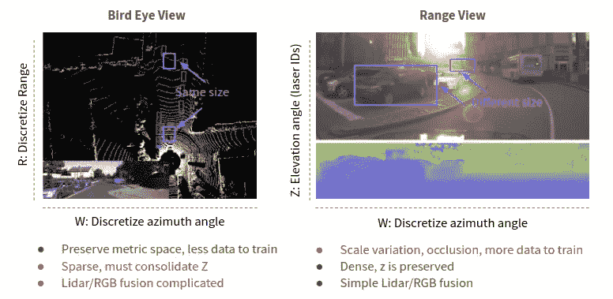

# 三维物体检测的现状

> 原文：<https://towardsdatascience.com/the-state-of-3d-object-detection-f65a385f67a8?source=collection_archive---------7----------------------->

## 基于 KITTI 排行榜的技术现状综述

# **前言**

> **此贴更新** [**此处**](https://medium.com/ike-blog/perception-for-automated-trucking-c8a8c12e1015) **。**

# **简介**

3D 对象检测是自动驾驶的一个基本挑战。 [KITTI vision 基准](http://www.cvlibs.net/datasets/kitti/)提供了一个标准化数据集，用于训练和评估不同 3D 物体检测器的性能。在这里，我使用来自 KITTI 的数据来总结和强调 3D 检测策略中的权衡。这些策略通常可以分为使用**激光雷达**的策略和使用**激光雷达+图像(RGB)** 的策略。我分别分析这几类。

# **激光雷达**

[CNN 机械](http://cs231n.github.io/convolutional-networks/)对 2D 天体的探测和分类已经[成熟](http://www.image-net.org/challenges/LSVRC/)。但是，用于自动驾驶的 3D 物体检测提出了至少两个独特的挑战:

*   与 RGB 图像不同，激光雷达点云是 3D 和非结构化的。
*   自动驾驶的 3D 检测必须快速(< ~100ms).

Several 3D detection methods have tackled the first problem by discretizing the LIDAR point cloud into a 3D voxel grid and [应用 3D 卷积](https://arxiv.org/pdf/1611.08069.pdf))。然而，3D 卷积比 2D 卷积具有更大的计算成本和更高的等待时间。或者，点云可以被投影到自上而下鸟瞰视图( **BEV** )或激光雷达的本地范围视图( **RV** )中的 2D 图像。优点是投影图像可以用更快的 2D 卷积有效地处理，产生更低的等待时间。

我从 [KITTI BEV](http://www.cvlibs.net/datasets/kitti/eval_object.php?obj_benchmark=bev) 排行榜中挑选了一些方法，以强调在 **RV** 、 **BEV** 和操作体素特征的方法之间的一些权衡。该图显示了报告的推断延迟(毫秒)与车辆 [AP](https://medium.com/@jonathan_hui/map-mean-average-precision-for-object-detection-45c121a31173) 的关系:

Detector (LIDAR only) latency vs vehicle AP

结果中的关键要点:

*   ***BEV*** *投影保留了物体大小随距离的变化，为学习提供了强有力的先验。*Z 轴被视为 2D 卷积的特征通道。手工制作的 Z 轴宁滨(例如 [PIXOR](http://openaccess.thecvf.com/content_cvpr_2018/papers/Yang_PIXOR_Real-Time_3D_CVPR_2018_paper.pdf) )可以使用 [PointNet](https://arxiv.org/pdf/1612.00593.pdf) 进行改进，以将 Z 轴整合到学习的特征中(例如 [PointPillars](https://arxiv.org/pdf/1812.05784.pdf) )。此外，地面高度可用于展平 Z 轴上的点(如 [HDNet](http://proceedings.mlr.press/v87/yang18b/yang18b.pdf) )，减轻道路坡度引起的平移变化的影响。
*   ***BEV*** *用* *的博学(PointNet)特性来巩固 Z 轴实现强劲性能*。[第二个](https://pdfs.semanticscholar.org/5125/a16039cabc6320c908a4764f32596e018ad3.pdf)用体素特征编码层和稀疏卷积实现；新版[秒](https://pdfs.semanticscholar.org/5125/a16039cabc6320c908a4764f32596e018ad3.pdf)(1.5 版)报告了更好的 AP (86.6%)和低延迟(40ms)。 [PointPillars](https://arxiv.org/pdf/1812.05784.pdf) 在 Z 轴柱子上应用简化的点网，产生一个 2D BEV 图像，该图像被输入到 2D CNN。
*   ***RV*** *投影受遮挡和物体大小随距离变化的影响。* **RV** 探测器(如 [LaserNet](https://arxiv.org/pdf/1903.08701.pdf) )在 KITTI 的~7.5k 帧训练数据集上性能落后于 **BEV** 探测器。但是， [LaserNet](https://arxiv.org/pdf/1903.08701.pdf) 在 1.2M 帧 ATG4D 数据集上的性能与 **BEV** 探测器(例如 [HDNet](http://proceedings.mlr.press/v87/yang18b/yang18b.pdf) )不相上下。
*   ***RV*** *投影具有低延迟*(例如 [LaserNet](https://arxiv.org/pdf/1903.08701.pdf) )，可能是由于相对于较稀疏的 **BEV** 的密集 **RV** 表示。[体素网](https://arxiv.org/pdf/1711.06396.pdf)开创了体素特征的使用，但由于 3D 卷积而遭受高延迟。较新的方法(例如[第二](https://pdfs.semanticscholar.org/5125/a16039cabc6320c908a4764f32596e018ad3.pdf))可以使用相同的体素特征编码层，但是使用稀疏卷积来避免 3D 卷积以减少等待时间。

# **激光雷达+ RGB**

激光雷达+ RGB 融合提高了 3D 检测性能，特别是对于较小的对象(例如，行人)或长距离(> ~ 50 米-70 米)，其中激光雷达数据通常很稀疏。下面总结了几种融合方法。**基于提议**的方法生成 RGB(例如 [F-Pointnet](https://arxiv.org/pdf/1711.08488.pdf) 或 BEV(例如 [MV3D](https://arxiv.org/abs/1611.07759) )的对象提议。**密集融合**方法将激光雷达和 RGB 特征直接融合到一个公共投影中，通常具有不同的分辨率。

General approaches for LIDAR+RGB fusion. Images are adapted from MV3D (Chen et. at. 2016), F-Pointnet (Qi et. al. 2017), ContFuse (Liang et. al. 2018), and LaserNet (Meyer et. al. 2018).

该图显示了报告的推断潜伏期(ms)与车辆 AP 的关系:

Detector (LIDAR+RGB fusion labeled) latency vs vehicle AP

结果中的关键要点:

*   ***RV*******密集融合*** *在所有方法中延迟最低，基于* ***提议*** *的方法一般比* ***密集融合*** *延迟高。* **RV** **密集融合**(例如 [LaserNet++](https://arxiv.org/pdf/1904.11466.pdf) )速度快因为 RGB 和 LIDAR 特征都在 **RV 中。**激光雷达特征可以直接投影到影像中进行融合。相比之下，[密集融合](http://openaccess.thecvf.com/content_ECCV_2018/papers/Ming_Liang_Deep_Continuous_Fusion_ECCV_2018_paper.pdf)不**密集融合** **。它从 RGB 特征生成一个 **BEV** 特征图，并与激光雷达 **BEV** 特征图融合。这很有挑战性，因为在 **RV** RGB 图像中并不是所有 **BEV** 中的像素都是可见的。几个步骤可以解决这个问题。对于一个未观察到的示例 **BEV** 像素，提取 K 个附近的激光雷达点。计算每个点和目标 **BEV** 像素之间的偏移。这些点被投影到 **RV** 以检索相应的 RGB 特征。偏移和 RGB 特征被馈送到[连续卷积](http://openaccess.thecvf.com/content_cvpr_2018/papers/Wang_Deep_Parametric_Continuous_CVPR_2018_paper.pdf)，其在 RGB 特征之间进行插值，以在目标 **BEV** 像素处生成未观察到的特征。这是为所有的 **BEV** 像素完成的，生成 RGB 特征的密集插值 **BEV** 图。***
*   **融合方法通常在激光雷达稀疏的较长距离和小物体上具有最大的性能增益。*激光雷达+ RGB 特征融合([激光网络++](https://arxiv.org/pdf/1904.11466.pdf) )相对于激光雷达([激光网络](https://arxiv.org/pdf/1903.08701.pdf))的 AP 改进在车辆上是适度的(在 0-70 米处大约 1%的 AP)，但在较小的类别上更显著，特别是在较长的范围内(在 50-70 米处大约 9%的自行车 AP)。 [LaserNet++](https://arxiv.org/pdf/1904.11466.pdf) 在 ATG4D 上表现强劲，但其 KITTI 性能未见报道。*

# ***总结***

*在 **BEV** 和 **RV** 投影之间存在权衡。 **BEV** 保留度量空间，保持对象大小与范围一致。相比之下， **RV** 在范围和遮挡方面存在尺度变化。因此， **BEV** 检测器(如 [PointPillars](https://arxiv.org/pdf/1812.05784.pdf) )在小数据集(如约 7.5k 帧的 KITTI)上实现了优于 **RV** (如 [LaserNet](https://arxiv.org/pdf/1903.08701.pdf) )的性能，具有相似的延迟(如 [PointPillars](https://arxiv.org/pdf/1812.05784.pdf) 为 16 毫秒，而 [LaserNet](https://arxiv.org/pdf/1903.08701.pdf) 为 12 毫秒)。然而， **RV** 的性能在更大的(例如，1.2M 帧 ATG4D)数据集上与 **BEV** 不相上下。尽管有这个缺点，**密集特征融合**在 **RV** 中比 **BEV 中更快。** [LaserNet++](https://arxiv.org/pdf/1904.11466.pdf) 报告了令人印象深刻的延迟(38 毫秒)和比**密集 BEV fusion** 探测器更好的性能(例如[cont fuse](http://openaccess.thecvf.com/content_ECCV_2018/papers/Ming_Liang_Deep_Continuous_Fusion_ECCV_2018_paper.pdf)60 毫秒)。下图总结了这些权衡。新的激光雷达+ RGB 融合架构可以找到在投影之间移动的方法，利用每个投影的优势。*

**

*Trade-offs between RV and BEV projections*