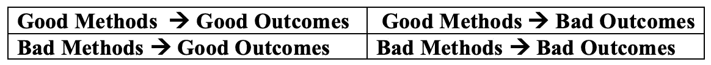

# 强化学习研究中的基线

> 原文：<https://towardsdatascience.com/the-state-of-baselines-in-reinforcement-learning-research-160e463003d9?source=collection_archive---------23----------------------->

## 当基线很容易允许新论文被比较时，它们是很棒的，但是当它们被要求在工作中试图进步理解和应用时，它们可能会腐蚀科学实践。

Mujoco simulations and learning curves are commonplace in reinforcement learning (sources [1](http://papers.nips.cc/paper/7725-deep-reinforcement-learning-in-a-handful-of-trials-using-probabilistic-dynamics-models.pdf), [2](https://www.cs.toronto.edu/~tingwuwang/mbrl.html), [3](http://www.mujoco.org/)).

基线是一个领域的从业者应该共享的工具集，以建立一个比较实验的共同基础。*科研论文*应该根据其想法的质量和实验的彻底性来评判，基线会有所帮助。*我在强化学习研究中发现，基线已经成为一种障碍。*

最近，我发表了一篇论文，对基于模型的强化学习中的常见实践进行了批评——这是以一种非常不科学的方式进行批评的，这将长期阻碍该领域的发展。*评审者反对我们，因为我们的实现对评审者*的基线不满意。最后，主要的区别是模拟版本化，这使得这篇论文的概念对于评论者来说几乎站不住脚。这对科学界来说是极其危险的，因为**强化学习中的峰值基线性能通常更多地是参数调整的结果，而不是复制期间的洞察力。**

将基线作为讨论的拐杖是不科学的，只会限制该领域的发展。当信任一个模拟机制而不是被评估的东西时，一个取得好的数字结果的科学家最终会强化潜在的坏行为。彼得·阿提亚在他的播客中多次评论这种危险(尽管是从医学的角度)。这个想法是，你可以从极化的方法和结果中选择一个象限，如下所示。

High level quad-chart for evaluating scientific practices.

我们拥有的选择以不同的方式影响科学家的精神状态——其中一些特别具有挑战性。

1.  **好的**方法，**好的**结果:作为一名科学家的最佳感受——你严格地计划你的实验，它们奏效了。
2.  **好的**方法，**坏的**结果:作为一名科学家最常见的感受——你所有的计划都达不到要求，你不得不从头开始。
3.  **不好的**方法，**好的**结果:在 RL 研究中变得太常见的事情— **你尝试一些事情，得到了一个好的结果，却不知道为什么会发生**。*当不使用回溯来找出方法论* **时，这变得更糟。**
4.  **不好的**方法，**不好的**结果:是时候寻求更多的指导了。继续努力。

最终，当人们得到好的结果时，他们会得到积极的强化，所以他们会重复这些方法。*我不禁觉得强化学习中实现的一些算法和论文都属于 3 (* ***不好的*** *方法* ***好的*** *结果)*，所以平庸的方法都被强化了。

当我在脸书人工智能实习期间与一个“最先进的”强化学习算法的作者交谈时，他告诉我，他改变了现有代码中的一些策略参数化(*从技术上讲，他添加了一个额外的值函数，以更好地处理不确定性*)，并注意到性能有了显著改善，所以他运行了它。这变成了第一作者论文和一定数量的强化学习名气。**当前的学术周期奖励回溯，并以某种方式用引用来解释这些业绩上升**，但我认为这是一项有风险的业务。我绝不是批评个人促进他们的工作，我更多的是在看这个系统，因为它没有比一个单独的数字看得更深。基线应该仅用于评估声称有性能的算法。

> 随着未来学习算法的中心阶段从模拟任务转移到真正的机器人代理，这个公式将不得不被重新评估。

Macao — the location for the last robotics conference I went to ([IROS](https://www.iros2019.org/)).

回到给我留下深刻印象的评论家。我理解这一评论，但我想指出我们的 RL 实现与原始实现之间的性能差距的可能原因。在这种情况下，我们与原作者合作，在 PyTorch 中从其原始 TensorFlow 重新实现了他的算法[PETS](http://papers.nips.cc/paper/7725-deep-reinforcement-learning-in-a-handful-of-trials-using-probabilistic-dynamics-models.pdf)(*这是第一个潜在原因，这是两种计算结构之间的微小数字差异，并导致控制算法*的概率推出的显著差异)。

Half Cheetah Mujoco simulation render from [source](https://gym.openai.com/envs/HalfCheetah-v2/). This little buddy gets so much attention from the best and brightest researchers in RL.

我们假设的主要差异是模拟器的**差异。今天在强化学习研究中最常用的模拟器是 [MuJoCo](http://www.mujoco.org/) ，这是一个研究项目转化为多体接触力的产品。RL 的一些任务中的最高性能来自于在模拟器中利用非物理的微妙之处。非物理效应的产生是因为 [**接触力**](https://cs.stanford.edu/group/manips/publications/pdfs/Park_2008_Robotica.pdf) 难以建模，并且是高度非线性的。*当在非线性函数的预期支持区域之外对其进行采样时，会出现“混乱”——复合非线性函数会迅速发散。***

人们可以很容易地[读到 MuJoCo 版本之间有多少变化](https://mujoco.org/#changelist)，但是旧的研究没有被重新访问以更新结果。我们的实现从 1.31 版更改为 1.51 版，我们失去了峰值性能(在半猎豹任务上几乎损失了 40%的奖励)。考虑到这一点，我们将它与我们的其他高保真重新实现进行了比较，它们反映了这一下降。这种差异在学术界的贡献并不显著，但在如何接受工作方面却举足轻重。

审查者可能已经观察到的另一项是**状态数据如何通过算法**学习和控制过程的差异。基于模型和无模型强化学习的子区域之间的差异最为明显。由于在线规划中需要可访问的奖励，基于模型的强化学习需要访问奖励计算期间使用的所有状态变量，而无需更新模拟器的状态。这导致了环境中的以下微妙差异——让我们从一个[无模型实现](https://github.com/openai/gym/blob/52e66f38081548e38711f51d4439d8bcc136d19e/gym/envs/mujoco/half_cheetah.py#L21)开始。

Returned observation when learning in the half-cheetah environment with model-**free** algorithms, ([source](https://github.com/openai/gym/blob/52e66f38081548e38711f51d4439d8bcc136d19e/gym/envs/mujoco/half_cheetah.py#L21)).

您可以在[基于模型的基线](https://github.com/kchua/handful-of-trials/blob/77fd8802cc30b7683f0227c90527b5414c0df34c/dmbrl/env/half_cheetah.py#L31)中看到观察结果发生了变化:

Returned observation when learning in the half-cheetah environment with model-**based** algorithms, ([source](https://github.com/kchua/handful-of-trials/blob/77fd8802cc30b7683f0227c90527b5414c0df34c/dmbrl/env/half_cheetah.py#L31)).

大多数研究人员不会达到这种细节的水平，但所有的算法都显示出随着使用不同的状态变量，性能会发生巨大的变化。出于好奇，在第二幅图像中附加到观察结果的状态数据是速度，在本例中直接用于计算奖励。当无模型算法可以直接获得奖励时，可以发现它们从剩余的上下文中学习得更少。

最终翻转模拟版本、自动微分软件包或环境观察结构中的任何一个都会导致算法的模拟结果达不到要求。这方面的一大亮点是该领域一群顶尖人物尝试的一篇基线论文，参见:

 [## 基于标杆模型的强化学习

### 基于标杆模型的强化学习

基于基准模型的强化 Learningwww.cs.toronto.edu](https://www.cs.toronto.edu/~tingwuwang/mbrl.html)  [## WilsonWangTHU/mbbl

### Arxiv 链接 PDF 项目页面摘要:基于模型的强化学习(MBRL)被广泛认为有潜力…

github.com](https://github.com/WilsonWangTHU/mbbl) 

敏锐的读者会将他们给出的情节与发表的原始情节进行比较，差异比比皆是。 ***在强化学习中复制结果几乎是可笑的艰难*** 。

Fun Unitree bots (doggos) — taken at IROS 2019.

自受孕以来，DeepMind 的使命一直是:

> “解决智能”

但是，如果研究因次要细节的差异而混乱，这种情况就不会发生。我认为脸书·艾的使命不太明确，就是:

> “加深我们在新领域和现有领域的基本理解，涵盖与人工智能相关的所有主题，以通过开放研究推进人工智能的最新发展为使命，造福全人类”

在脸书，我知道他们很幸运地聚集了一个不可思议的团队，这个团队在这个领域取得了巨大的进步，但使命宣言留下了很多有待涵盖的内容。随着时间的推移，**核心价值观复合并创造了研究和贡献的环境**。如机构 [DeepMind](https://deepmind.com/about) 、[脸书 AI](https://ai.facebook.com/research) 等。声称他们在这些领域有长期、大胆的目标，*我希望那些没有紧张、学术宵禁和压力的成员能够以不会导致过度依赖基线问题的方式来设计他们的工作。*

更多？订阅我关于机器人、人工智能和社会的时事通讯！

 [## 自动化大众化

### 一个关于机器人和人工智能的博客，让它们对每个人都有益，以及即将到来的自动化浪潮…

robotic.substack.com](https://robotic.substack.com/)