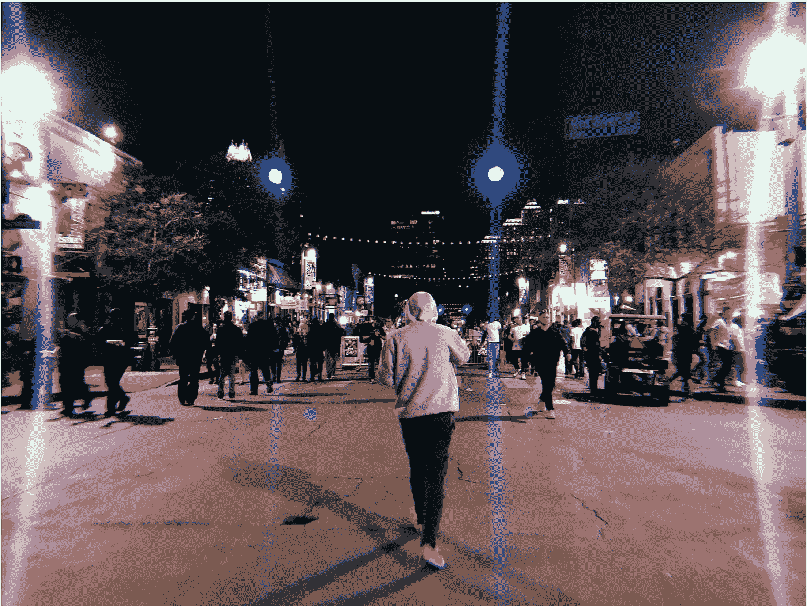

# SXSW 时尚与美容技术，我的评论

> 原文：<https://towardsdatascience.com/the-state-of-fashion-tech-8aa28794adf6?source=collection_archive---------26----------------------->

我在 SXSW 学到的一些关于时尚和美容技术的东西

今年我第一次参加了 SXSW(德克萨斯州奥斯汀)。迄今为止我参加过的最好的会议之一。这个节目的广度和深度给我留下了深刻的印象，而且你可以听到一个关于人工智能的演讲，然后去看一个利基[爱尔兰嘻哈艺术家](https://schedule.sxsw.com/2019/artists/2006939)(大声喊出来！).我对[美国国防部](https://schedule.sxsw.com/2019/events/PP92817)如何思考人工智能中的伦理问题，了解到[中情局如何创新](https://schedule.sxsw.com/2019/events/PP83359)，或者欧莱雅如何在美容技术领域遥遥领先印象深刻。

我还看到[陈慧娴谈论教育](https://schedule.sxsw.com/2019/events/PP102391)，[廷克·哈特菲尔德谈论设计空中乔丹](https://schedule.sxsw.com/2019/events/PP102343)，还有我最喜欢的[亚历山大·奥卡西奥-科尔特斯](https://www.google.com/url?sa=t&rct=j&q=&esrc=s&source=web&cd=1&cad=rja&uact=8&ved=2ahUKEwj-lo3AvqjjAhUF3KQKHcVKAoQQwqsBMAB6BAgJEAQ&url=https%3A%2F%2Fwww.youtube.com%2Fwatch%3Fv%3DJU-SE5eNt04&usg=AOvVaw2B07PhzOcJ419uVW4cSPTf)！这是一个真正鼓舞人心的节目，展示了我非常关心的许多话题之间的交集。社会，城市化，政治，科技，人工智能和时尚。这也是一个很好的练习，听人们谈论一些我根本不熟悉的话题，走出我的舒适区。

Austin by night, the Saturday after the SXSW Conference (by me)

在这一周里，我在时尚和美容数字领域看到了一些非常有趣的趋势，尤其是人工智能在该领域的有趣应用。在这篇博客中，我分享了我在奥斯汀 SXSW 的一周里学到的一些见解。

# “随着对更好的发现和搜索体验需求的增长，个性化将成为未来的关键，有多种方式来导航和影响客户看到的产品组合”

在 Tony Bacos(亚马逊时尚首席技术官)和 Blair Eadie(大西洋太平洋公司)的对话中，我们从最大的参与者之一那里瞥见了时尚电子商务平台的未来。两人都认为投资时尚是一个很好的机会，因为还没有人获得这种体验，尤其是从发现、浏览或试穿的角度来看。事实上，Bacos 提到，时尚电子商务平台领域的一些问题自 2000 年以来一直存在，但尚未得到解决。

*   个性化和推荐将继续成为亚马逊这样的大公司的关注领域，与其他较小的零售商相比，亚马逊拥有较大的目录。当然，在这个领域，家庭购物者仍然是一个未解决的问题，为此亚马逊计划允许客户在会话开始时表明自己的身份。此外，由于缺乏词汇，人们无法描述自己的需求，在未来几年，以时尚领域特有的方式理解图像将非常重要，以便为客户提供符合他们品味、风格和身材的产品。
*   在尺寸和合身——商业模式成功的关键——这个话题上，亚马逊时尚花费了很多努力，包括推出一个名为 [*prime 衣柜*](https://www.amazon.com/learn-more-prime-wardrobe/b?ie=UTF8&node=16122413011)*的新项目，顾客可以收到多达 8 件商品，他们可以在家里试穿，并且只需为他们保留的商品付费。亚马逊也有自己的品牌尺寸映射，这是一个特别困难的问题，因为它不仅与尺寸有关，还与偏好有关。例如，有些人喜欢穿宽松的衣服，而另一些人穿同样的衣服，但要紧身得多。*
*   *一个主要的全球趋势是时尚产业中有影响力的人的角色正在上升。20 年前，人们通常会去商场购物，而现在他们会去 instagram 寻找灵感，这给时尚营销的运作方式带来了巨大的转变。因此，时尚电子商务平台和影响力之间的关系将在未来几年增长，亚马逊等公司将开发工具，让有影响力的人推动他们的业务，并建立他们的受众。*
*   *虽然评论一直是亚马逊客户做出决策的强大工具，但该领域的用户体验正在增加——特别是在搜索和发现方面。在接下来的几年里，我们将看到围绕发现产品组合的新方法的创新:创建服装，探索视觉上相似的商品，或在搜索中实现新的发现体验，以便为每个客户创建精选商品。此外，新的多模态体验显示出早期的成功，人们更经常地问“ *Alexa，我应该穿什么？*”*
*   *同样，如果你开一家新店，如果你把它放在一个偏僻的小巷里，你也不太可能成功，亚马逊在试图把流量转移到一个全新的目的地时，没有成功地改变客户的行为。然而，[多次失败和支点](https://fashionunited.uk/news/retail/amazon-replaces-social-discovery-app-amazon-spark-with-founditonamazon/2019062143821)带来了教训。亚马逊已经利用了这些经验，他们现在的目标是建立可重复使用的内容体验，让客户可以在不同的渠道中享受，并试图通过这些媒介接触尽可能多的人。在这个新阶段，与有影响力的人合作至关重要。*

# *“美容的未来是超个性化的。想想 23andMe，除了美容产品”*

*我对 Liz Bacelar(现任)和 Guive Balooch(欧莱雅)关于 [**联网美容**](https://schedule.sxsw.com/2019/events/PP88898) **的对话印象特别深刻。令我惊讶的是，这个行业在很长一段时间里，在新的数字体验方面被大量发明。***

*   *数字原生消费者越来越依赖科技来满足他们的#美丽目标。品牌正在通过创造将数字与物理相结合的工具来满足这种需求，个性化是核心，模糊了零售或家居美容体验之间的界限。*
*   *当欧莱雅在 2014 年首次推出虚拟试衣时，他们着眼于动画行业，与 [imagemetrics](https://image-metrics.com) 合作推出了他们的首款产品。从那以后，他们在这个领域推出了几个产品，包括一个虚拟发型师。*
*   *几年前，定制粉底被视为美容体验中个性化的前沿——50%的人找不到适合他们的色调！虽然从技术角度来看，创造某种色调的妆容并不是一个难以解决的问题，但挑战在于如何对肤色进行适当的测量来生产这种妆容，并将其包装成对顾客有吸引力的体验。*
*   *在数字体验、可穿戴设备和健康意识之间进行创新时，欧莱雅推出了一款漂亮的可穿戴设备[来测量紫外线暴露量](https://www.loreal.com/media/news/2018/nov/my-skin-track-uv)。该设备没有电池，便于使用，并为佩戴者提供重要信息——他们暴露在多少紫外线下。随着黑色素瘤的增加，人们通常不会意识到自己暴露在阳光下，这种可穿戴设备成为一种非常重要的预防工具。*
*   *对于美容，欧莱雅认为下一个前沿是将健康与美容结合起来，致力于类似于 [23andme](https://www.23andme.com) 的美容产品。打造超个性化的皮肤护理产品，根据个人的皮肤组成，甚至基因组量身定制！*

# *“用这些数据来制作你自己的衣服怎么样？还是火绒，换衣服？利用数据是像 StitchFix 这样的数字玩家的关键*

*[埃里克·科尔森(Stitch Fix)](https://schedule.sxsw.com/2019/speakers/3590) 、[安迪·方(DoorDash)](https://schedule.sxsw.com/2019/speakers/2005576) 和[瑞秋·梅斯(CNN 财经)](https://schedule.sxsw.com/2019/speakers/2011363)在小组讨论中讨论了人工智能如何[改变我们的社会生活方式](https://schedule.sxsw.com/2019/events/PP90512)。*

*   *我在会议中听到的最有趣的事情之一是 Eric Colson 谈论 StitchFix 如何使用遗传算法来设计衣服，模仿自然选择的进化方式。该算法能够将不同的衣服组合在一起，甚至可以设计出新的衣服——想象一件皮革领的亚麻衬衫。这个想法最初是由作为公司的一个研究项目发起的，已经帮助推出了 140 多个非常成功的产品(我强烈推荐在 StitchFix 的 blo 上阅读更多相关信息)。*
*   *StitchFix 雇佣了 4000 多名造型师，他们与算法专家一起工作。科尔森解释说，人类和算法之间的关系是共生的，但有时很难，算法在某些领域缺乏理解。例如，算法无法理解特定的客户需求，例如在夏天去其他地方滑雪，并且在这些场合从不推荐合适的毛衣。算法也不擅长理解文本中的时尚概念(部分原因是顾客无法用语言表达他们的需求)。最终，算法无法模仿人的同理心，以及与他人联系的能力，这使得人类+机器的配对成为解决这类问题的好方法。*
*   *在这次演讲中，尺码和合身问题也被多次提及，StitchFix 解释了他们如何利用顾客关于合身程度的数百万反馈。他们使用隐含的反馈来推导身体的潜在尺寸，并学习某人的尺寸。由于像 StitchFix 这样的公司比传统品牌更了解数据，他们与他们分享免费的尺寸、合身或颜色建议，为双方创造了双赢的局面。*
*   *创造探索和发现时尚的新方法也是 StitchFix 提到的一个挑战，它最近推出了*【shuffle】，一款类似 tinder 的服装应用程序。这使得他们能够收集大量数据，直接从图像中学习。数据的收集加上他们的人工智能技术使 StitchFix 能够创建理解风格的算法，然后驱动他们的许多推荐系统、与风格匹配算法或客户获取算法等。**