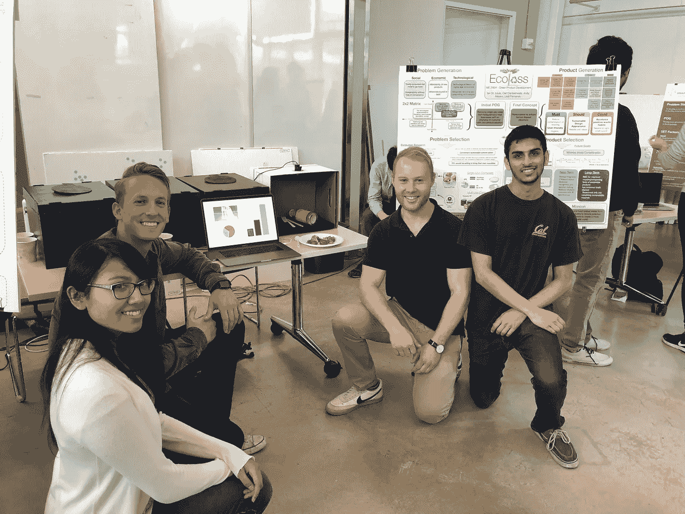
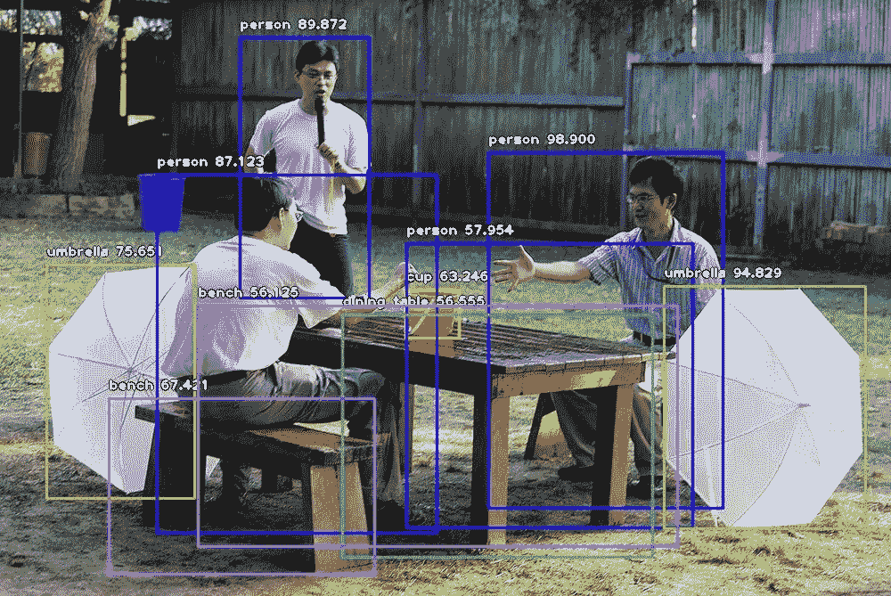

# ImageAI 的故事和未来——一周年纪念

> 原文：<https://towardsdatascience.com/the-story-and-future-of-imageai-one-year-anniversary-e63c80f527c8?source=collection_archive---------18----------------------->

## *ImageAI 的全球覆盖、案例研究和未来版本*

我怀着无比激动的心情写下这篇文章，不仅因为 **ImageAI** 项目自 2018 年 3 月**日**22 日**启动以来产生了难以置信的影响，还因为该项目将在未来几年使创新成为可能。自从我们宣布 **ImageAI** 以来，已经过去了一年零两个月，这是一个我们构建的计算机视觉库，旨在使任何专业水平的开发人员都能访问和集成由**深度学习支持的最先进的计算机视觉功能。**如今， **ImageAI** 正被全球超过 **65，000 名**开发人员、工程师、大学生、研究机构、企业和新兴创业公司用于构建难以置信的想法和创新。**

在这篇文章中，我将讨论这个项目的三个要点

**-数字全球覆盖**。

**-** 突出**应用**和**案例分析**

**-****下一版本**的时间表和特性

**(1)全球覆盖**

当我们发布了 [**ImageAI**](http://imageai.org) 库以及其英文[文档](https://imageai.readthedocs.io/)和各种强调其功能实现的[教程](http://imageai.org)时，我们并不知道其源代码来源于我们的计算机系统的项目将在世界各地的各个国家和各个行业中得到广泛使用。自从过去一年零两个月以来， **ImageAI**

*   已安装超过**65000 次**次 **(** [**链接**](https://www.somsubhra.com/github-release-stats/?username=OlafenwaMoses&repository=ImageAI) **)**
*   在全球 **60+** 国家使用。
*   在全球 **200 多种**出版物和研究论文中出现
*   官方教程已经看了 **42 万**遍
*   已被精选于**视频教程**的**分数**拥有数万浏览量 **(** [**谷歌视频**](https://www.google.com/search?q=imageai&source=lnms&tbm=vid&sa=X&ved=0ahUKEwjAhazGkKPiAhXyunEKHTnKAtUQ_AUIDigB&cshid=1558115535992213&biw=1366&bih=608)**)(**[**YouTube**](https://www.youtube.com/results?search_query=ImageAI)**)**

 [## ImageAI

### 易于使用的计算机视觉库，用于最先进的人工智能。

imageai.org](https://imageai.org)  [## 使用 Resnet50 - ImageAI 的对象+边界框

### 使用来自多个数据源的数据

www.kaggle.com](https://www.kaggle.com/shivamb/objects-bounding-boxes-using-resnet50-imageai)  [## 使用图像人工智能|英特尔开发人员网格进行人群预测分析

### 概述/用法需要注意的是-计算机视觉由多个方面组成，如图像…

devmesh.intel.com](https://devmesh.intel.com/projects/crowd-prediction-analysis-using-image-ai-23087)  [## 什么是智能图像

### 快速学习的聪明方法。你会得到详细的描述与视频和 ppt。

www.smarttuts.com](http://www.smarttuts.com/imageai/what_is_imageai)  [## จากตรวจจับวัตถุในรูปภาพด้วยโค้ด·艾·แค่10บรรทัดสู่การตรวจจับวัตถุแบบเรียลไทม์และการทำ…

### คำกล่าวนี้ไม่ใช่เรื่องเกินจริงปัจจุบันเราสามารถเขียน·艾·เพื่อตรวจจับวัตถุในรูปภาพ(物体探测)ได้ง่ายนิดเดียว…

www.patanasongsivilai.com](https://www.patanasongsivilai.com/blog/object-dection/) 

**(2)案例分析**

在过去的一年里，我收到了来自世界各地的开发者、工程师、学生和研究人员的超过 1000 封电子邮件,内容是关于他们如何应用 **ImageAI** 来推动他们正在进行的令人难以置信的创新和项目。有趣的是，这些个人和团体在开始使用 ImageAI 库时，并没有计算机编程的知识。凭借 ImageAI 提供的简单、有据可查但功能强大的识别、检测和分析功能，下面列出的 **3 个案例研究**成为可能。不久，我将发表详细介绍每个案例研究的综合文章。

*   ***桑迪*** *教授来自爱尔兰共和国* ***大学都柏林学院*** *。*

桑迪·威尔金森教授是一名历史学家，他致力于保存 1800 年前欧洲印刷的数百万件历史装饰和插图。他的部门有这些插图的数字副本，但由于涉及大量的手动任务，手动分类时遇到了问题。桑迪教授能够使用 **ImageAI** 仅用 **5 行代码**训练一个定制识别模型，该模型自动化了数百万份数字副本的分类，为他节省了数千小时的人工工作。用他的话说，他说

"*作为一名历史学家，我发现你们的 github 软件非常有用！我已经按照你的详细和非常有用的指示训练了一个测试 RESNET50 模型。它产生了惊人的精确结果。*”

 [## 桑迪·威尔金森简介|都柏林大学学院

### 我的兴趣在于早期现代欧洲的社会和文化史，尤其是书籍史…

人民. ucd.ie](https://people.ucd.ie/sandy.wilkinson)  [## 用 5 行代码训练图像识别人工智能

### 在本文中，我们将简要介绍人工智能领域，特别是在计算机视觉中，人工智能的应用

towardsdatascience.com](/train-image-recognition-ai-with-5-lines-of-code-8ed0bdd8d9ba) 

*   ***来自印度的 14 岁奥姆什列什蒂***

在 2019 年 3 月 2 日的周末，当我听到 14 岁的 Omshreshti 的故事时，我的喜悦之情溢于言表，他是印度最有才华的青少年之一。Omshreshti 参加了在印度举行的 **Raspberry Pi** 周年纪念 **IoT** 科学博览会，直到活动的最后一刻，他还没有想出如何在他的项目中部署最先进的计算机视觉。一位名叫 [Soma Bhadra](https://twitter.com/SomaBhadra8) 的杰出数据科学家建议 Omshreshti 在他的项目中实现 **ImageAI** 检测功能。

几分钟内，年轻的青少年 Omshreshti 就让他的项目运行了他的项目中最先进的对象检测算法之一。最精彩的部分是，他的项目成为物联网科学博览会上最受欢迎的项目，他的朋友们把他扛在肩上&显然是在为他欢呼！用他的话说，奥姆什列什蒂说

“*太感谢你了！你的*[*ImageAI*](https://twitter.com/hashtag/ImageAI?src=hash)*库帮我提交的&也是最受欢迎的。希望更多的人从中受益，也为它做出贡献。我希望我能学到足够的知识，也能有所贡献。*”

 [## 奥姆的世界之窗

### Om 在超级英雄命名页面的左栏选择了“The Flying”，右栏选择了“Favorite Food”。还有…

omshreshti.blogspot.com](http://omshreshti.blogspot.com/) 

*   ***安德鲁·斯科特·迈耶斯*** *及其团队***美国加州大学伯克利分校**

**由于深度学习和计算机视觉具有无限的可能性，美国加州大学伯克利分校的硕士学生安德鲁·斯科特·梅耶斯使用 ImageAI 构建了一个废物扫描仪项目，他们在刚刚结束的加州大学伯克利分校设计创新展示会上展示了该项目。这个充满激情的研究团队能够利用最先进的识别和检测算法来识别废物并管理废物处理，以解决全球环境问题；使用 **ImageAI 的易用功能，一切皆有可能。**用他的话说，安德鲁说**

**"*在展示会上，人们对这个项目很感兴趣，大多数人都对使用****ImageAI****库实现我们的想法的便捷性印象深刻。我们非常感谢****ImageAI****，并且很兴奋地向别人推荐你的作品。***

****(3)ImageAI 的未来版本****

****

**我们受到了使用 **ImageAI** 生成的故事、用例、视频、教程、内容和研究工作的启发。距离上次更新 **ImageAI (v2.0.2)已经过去了 10 个月。**我们已经审查了来自使用和支持该项目的开发人员社区的所有评论、建议和反馈。我们也想借此机会感谢他们在过去几个月耐心等待下一个版本。我们的团队一直致力于各种项目，包括 **ImageAI。**下一版本将于 2019 年 6 月 15 日**发布，并将提供以下功能:****

*   **设置视频检测**持续时间限制****
*   **完整保存**定制训练模型**，允许定制识别任何 **Keras** 模型，无需指定模型类型**
*   ****将**定制训练模型导出到 **Tensoflow** 。pb 格式**
*   ****来自先前保存的模型文件的连续模型训练****
*   ****转移学习**用于少量图像的训练**
*   **运行**多个定制识别**型号**
*   **将模型导出为 [**DeepStack API**](https://deepstack.cc/) 格式**
*   **使用 **YOLOv3** 进行自定义对象检测训练和推理**

**为了准备这个版本，我们已经启动了 **ImageAI** 论坛，以确保我们可以使用 **ImageAI、**与开发人员社区联系，讨论错误、功能请求、类和功能说明、教程、文档、示例应用程序和用例故事。**

** [## ImageAI 论坛

### ImageAI 项目的官方论坛。

forum.imageai.org](https://forum.imageai.org/) 

一如既往，新版本将被完整地记录，所有新特性的示例代码将被提供，大量的教程将被发布。如果你想联系我们并讨论这个项目，请随时加入上面链接的 **ImageAI** 论坛。

**ImageAI** 由 **DeepQuest AI** 团队**开发维护。**

"*在****deep quest AI****上，我们选择接受的使命是推进人工智能并使其民主化，并使其能够为地球上的每个个人和组织所用。*

 [## DeepQuest AI

### 在设备和云上提供 AI APIs。

deepquestai.com](https://deepquestai.com) 

如果您希望就您的团队或个人项目直接联系我们，您可以随时通过我的电子邮件和下面的社交资料联系我。

电子邮件:guymodscientist@gmail.com

**推特:**https://twitter.com/OlafenwaMoses

**https://www.facebook.com/moses.olafenwa:**T30

 [## OlafenwaMoses/ImageAI

### 一个 python 库，旨在使开发人员能够构建具有自包含计算机视觉的应用程序和系统…

github.com](https://github.com/OlafenwaMoses/ImageAI)**