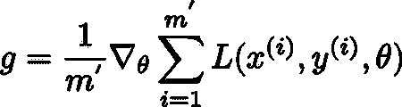
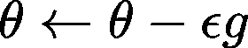
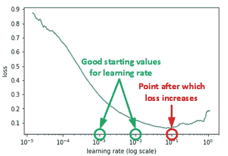
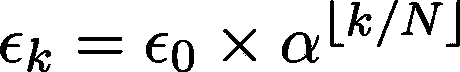
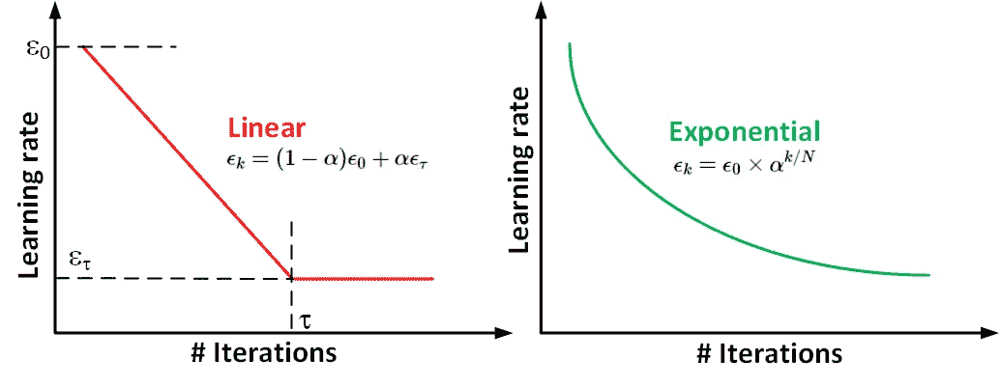
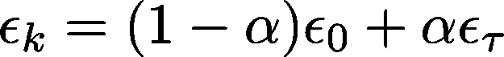
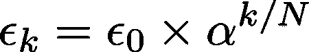
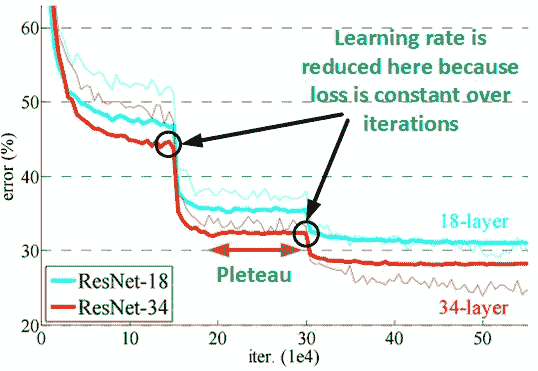
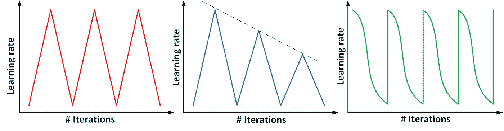
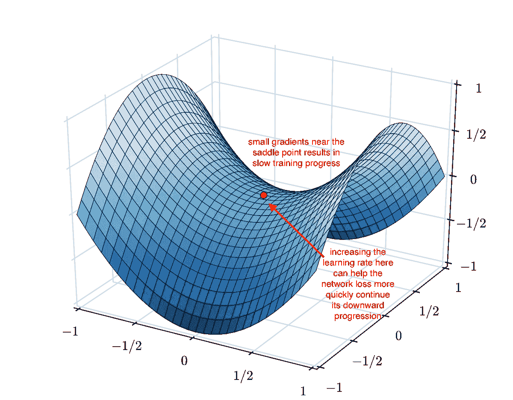

# 固定和修改学习速度的微妙艺术

> 原文：<https://towardsdatascience.com/the-subtle-art-of-fixing-and-modifying-learning-rate-f1e22b537303?source=collection_archive---------15----------------------->

## 学习率超参数、原则和程序的介绍，以找到一个好的起始值，并在培训过程中进行调整。

Picture from [internet](https://homework-writer.com/blog/lab-report)

L 收益率是最关键的超参数之一，有可能决定你深度学习算法的命运。如果你搞砸了，那么优化器可能根本无法收敛！它就像一个闸门，控制优化器根据损耗梯度更新参数的程度。就方程而言，梯度由下式给出:

使用来自小批量的梯度，随机梯度下降遵循估计的下坡:

其中ϵ是学习率。下图解释了学习率对梯度下降的影响。非常小的学习率会让梯度下降即使梯度很大也是小步走，从而减缓学习的进程。如果学习率很高，那么在训练过程接近结束时，不可能学习到微调模型所需的参数的非常小的变化，因此误差很早就变平了。如果学习率很高，那么梯度下降就迈大步，跳来跳去。这会导致发散，从而增加误差。

## 为学习率选择一个好的起始值:

现在问题来了，学习率的最佳值是多少，如何决定？一种评估良好学习率的系统方法是，最初以非常低的学习率训练模型，并在每次迭代中增加学习率(线性或指数增长)(如下所示)。我们一直这样做，直到损失停止减少并开始增加。这意味着学习速率对于应用来说太高，因此梯度下降是发散的。对于实际应用，我们的学习率应该比这个值小 1 或 2 步。

如果我们跟踪学习率，并绘制学习率和误差的日志，我们将看到如下图。一个好的学习率在图表最低点的左边(如下图所示)。在这种情况下，它是 0.001 到 0.01。

总的来说，没有一个固定的学习率对整个训练过程最有效。通常，我们从使用上述方法找到的学习率开始。在培训过程中，我们会改变学习速度，以便更好地促进学习。有许多不同的方法来实现这一点。在这篇博客中，我们将浏览一些流行的学习进度计划。

## 阶跃衰减

步长衰减计划每隔几个历元就将学习速率降低一个因子。阶跃衰减的数学形式是:

其中，ϵ_{k}是第 k 个时期的学习率，ϵ_{0}是初始学习率，α是学习率降低的分数，⌊。⌋是下限操作，n 是学习率下降后的周期数。

在 Tensorflow 中，这很容易做到。为了修改学习率，我们需要一个变量来存储学习率，一个变量来存储迭代次数。

## 基于时间的线性或指数衰减

这种技术也被称为学习速率退火。我们从相对较高的学习率开始，然后在训练过程中逐渐降低。这种方法背后的直觉是，我们希望从初始参数快速遍历到一系列“好”参数值，但我们希望学习率足够小，以便我们可以探索“损失函数更深、更窄的部分”(微调参数以获得最佳结果)。

实际上，在迭代τ之前，学习速率通常会衰减。在线性衰减的情况下，学习率以下列方式修改:

其中α=\frac{k}{τ}。在迭代τ之后，通常使ϵ常数保持不变。

在指数衰减的情况下:

在 Tensorflow 中，这可以像我们实现步进衰减一样实现。在这种情况下，我们让 starboard = False，这使用了浮点除法，从而导致学习率逐渐降低。

## 当你达到一个稳定水平时，降低学习速度

这种技术也很流行，而且很直观。保持使用较大的学习率来快速接近局部最小值，并在我们达到稳定状态时降低它(即，这个学习率对于现在来说太大了，我们需要较小的值来更好地微调参数)。术语平台指的是当训练迭代的损失 w.r.t .的变化小于阈值θ时的点。这实际上意味着损失与迭代曲线变得平坦。下图对此进行了说明。

这种定制的学习率衰减调度程序可以通过将学习率作为占位符来轻松实现。然后，我们根据一些规则计算学习率，并将其与其他数据(输入、输出、辍学率等)一起传递给 feed_dict 中的 Tensorflow。

## 循环学习率

到目前为止，我们讨论的所有方案的目标都是以大的学习率开始，随着训练的进行，学习率越来越小。一些工作，如用于训练神经网络的[循环学习率](https://arxiv.org/abs/1506.01186)和[带有热重启的随机梯度下降](https://arxiv.org/abs/1608.03983)提出了不同的建议。循环学习率背后的基本假设是“提高学习率可能会有短期的负面影响，但却能实现长期的有益效果”。这些著作的作者已经证明了在两个界限值之间变化的循环学习率计划可以比传统的学习率计划提供更好的结果。为什么循环学习率起作用的直觉是:

1.  很好地概括数据的最小值不应是急剧的最小值，即参数的微小变化不应降低性能。通过允许我们的学习速度不时增加，我们可以“跳出”尖锐的最小值，这将暂时增加我们的损失，但最终可能导致收敛于更理想的最小值。请看这篇[文章](https://arxiv.org/abs/1703.04933)中的一个很好的反驳论点。
2.  增加学习速率还可以允许“更快速地穿越鞍点平稳段”。正如你在下图中看到的，在一个鞍点处，梯度可以非常小。因为参数更新是梯度的函数，这导致我们的优化采取非常小的步骤；在这种情况下，提高学习速度可以避免在鞍点停留太长时间。因此，定期提高学习率有助于快速跳跃鞍点。

循环学习率的代码可以在[这里](https://github.com/bckenstler/CLR)找到。

最后要说明的是，没有一个学习率计划方案能对所有应用程序和体系结构都有效。我几乎总是以线性衰减方案开始我的实验(衰减学习速率直到某次迭代，然后保持它不变)。你总是可以从一些方案开始，如果训练误差没有像预期的那样下降，尝试一些其他的方案。快乐编码。