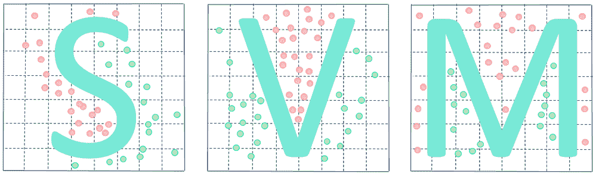
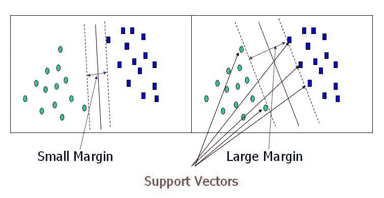
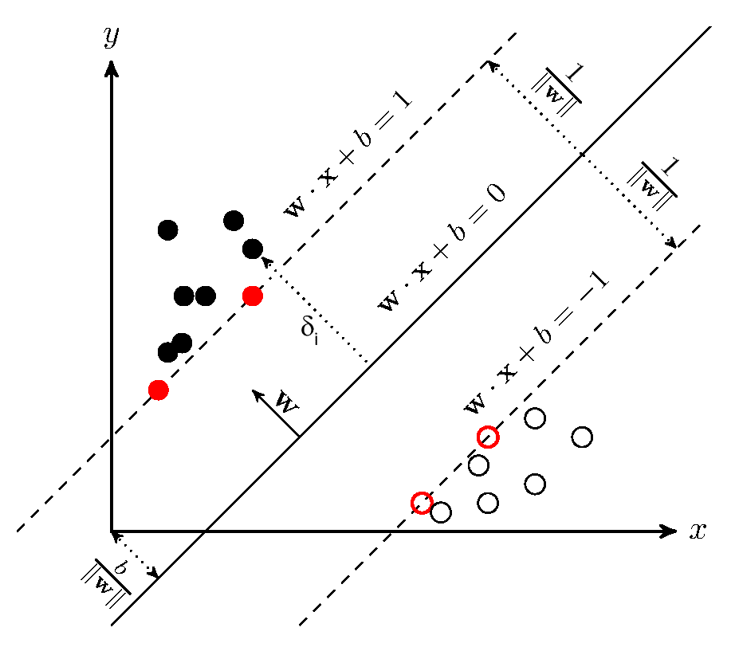
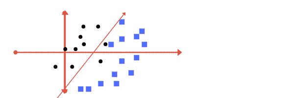
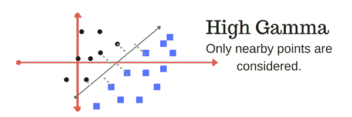
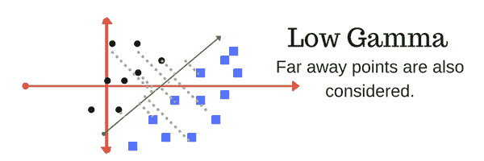
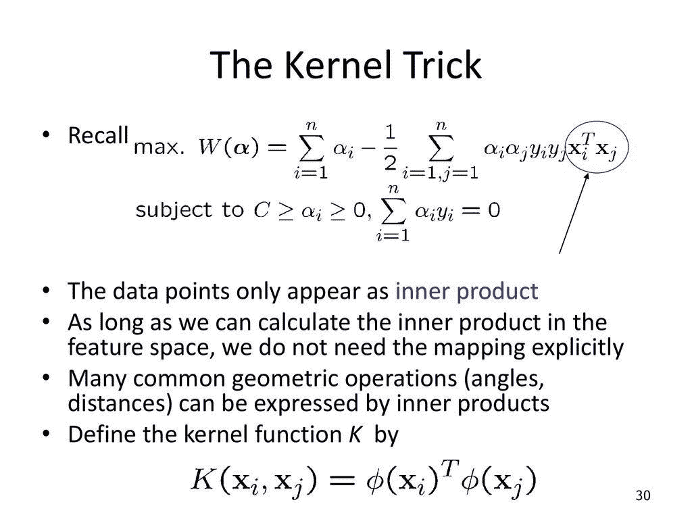

# 支持团队— SVM

> 原文：<https://towardsdatascience.com/the-support-team-svm-555d2c30b1b3?source=collection_archive---------30----------------------->

## 主题概述:理解支持向量机 2020

支持向量机(SVM)是一个非常强大和通用的机器学习模型。SVM 可用于分类或回归问题和异常值检测。它是机器学习中最受欢迎的模型之一，任何对机器学习感兴趣的数据科学家都应该在他们的工具箱中拥有它。支持向量机特别适合于对小型或中型复杂数据集进行分类；小型数据集可能只有两个类，而中型数据集可能不止两个类。您将了解 SVM 线性和非线性分类器以及一些数学知识，以便更好地理解支持向量机。

厉害吧！

## 线性支持向量机分类

当我们想到 SVM 分类器时，我们可以把它比作两条人行道之间的街道。SVM 分类器的人行道是两个不同的等级，街道越宽，差距越大。

在机器学习中，我们必须保持方差和偏差的良好平衡，以获得良好的拟合模型。如果使用 SVM 分类器减小边距，偏差将减小，方差将增大(反之亦然，边距的增大将导致偏差的增大和方差的减小)。请注意，在边距之外或“街道之外”添加更多实例根本不会影响决策边界(边距之间的线)。原因是它完全由位于街道边缘的实例(下图中的红色数据点)支持**。这些实例被称为**支持向量**。专业或技术的解释方式是，实例由**超平面**分隔，由于**边缘**的调整约束，超平面**是**最佳拟合**。

虚线边距表示约束条件

## 硬利润和软利润分类

如果我们将所有实例都放在街道右侧，这被称为*硬边界分类。*硬利润分类有两个主要问题。硬边界分类仅在数据可线性分离时有效，而且硬边界对异常值非常敏感。我们可以使用软利润分类来避免这些问题。为避免问题，建议使用更灵活的模型和软利润分类。相反，硬边界将导致允许零误差的模型的过度拟合。有时，考虑到训练集中的错误可能会有所帮助，因为当应用于新数据集时，它可能会产生更一般化的模型。强制严格的边界可以使模型在训练集中表现良好，但在应用于新数据集时可能会过度拟合/不太可概括。确定“成本”的最佳设置可能与您正在处理的特定数据集有关。

## 正规化

使用 Scikit-Learn 中的 C 超参数，我们可以调整约束 w *x + b = 1 和 w*x+b = -1，以创建软边界。确保使用*标准标量*缩放数据，并将*双参数*设置为**假**。使用较高的 C 值，分类器会产生较少的边界违规，但最终会产生较小的边界。相反，使用低 C 值时，裕度要大得多，但是许多实例都在超平面上结束。如果 SVM 模型过度拟合，您可以使用 C 超参数来调整它。

High C

Low C

顶部高 C，底部低 C

**伽马参数**是 RBF 核(高斯函数)的标准差的倒数，用作两点之间的相似性度量。直观上，小的伽玛值定义了具有大方差的高斯函数。在这种情况下，即使两个点相距很远，也可以认为是相似的。另一方面，较大的伽玛值意味着定义一个方差较小的高斯函数，在这种情况下，如果两个点彼此靠近，则认为它们是相似的。

## 非线性 SVM 分类器

尽管线性 SVM 分类器非常高效，并且在许多情况下工作得非常好，但是许多数据集甚至不接近线性可分。处理非线性数据集的一种方法是添加更多的要素。添加多项式特征易于实现，并且可以与各种机器学习算法配合使用。在低多项式次数下，它无法处理非常复杂的数据集，而在高多项式次数下，它会创建大量的要素，使模型太慢。

幸运的是我们有核技巧，核技巧是机器学习中的一种技术，用来避免一些算法中的一些密集计算，这使得一些计算从不可行变得太可行。在[机器学习](https://en.m.wikipedia.org/wiki/Machine_learning)中，核方法是一类用于[模式分析](https://en.m.wikipedia.org/wiki/Pattern_analysis)的算法，其最广为人知的成员是支持向量机(SVM)。模式分析的一般任务是发现和研究数据集中关系的一般类型(例如[聚类](https://en.m.wikipedia.org/wiki/Cluster_analysis)、[排名](https://en.m.wikipedia.org/wiki/Ranking)、主成分、[相关性](https://en.m.wikipedia.org/wiki/Correlation)、分类)。对于解决这些任务的许多算法，原始表示中的数据必须通过用户指定的*特征图*显式转换为特征向量表示:相比之下，核方法只需要用户指定的*核*，即原始表示中数据点对的相似性函数。

内核方法因使用内核函数而得名，这使它们能够在高维、*隐式*特征空间中操作，而无需计算该空间中数据的坐标，而是简单地计算特征空间中所有数据对的图像之间的内积。该操作通常比坐标的显式计算在计算上更便宜。这种方法被称为“内核技巧”。为序列数据、[图形](https://en.m.wikipedia.org/wiki/Graph_kernel)、文本、图像以及向量引入了核函数。

## 最后

我们已经充分讨论了什么是支持向量机，同时给出了数学的一小部分。在数据科学领域，SVM 是一个很好的工具。由于增加的维度，SVM 也会变得令人难以招架。这可能会导致维数灾难，难以描绘和解释。为了减少这种情况，我们将使用主成分分析(PCA)和线性判别分析(LDA)。支持向量机拥有巨大的力量。希望这个博客能帮助你更好地了解 SVM。