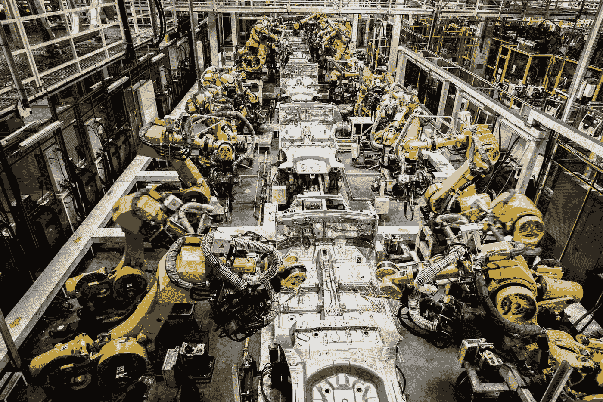

# 全球不平等和你的银行存款余额之间的人工智能联系

> 原文：<https://towardsdatascience.com/the-surprisingly-simple-relationship-between-ai-global-inequality-and-your-bank-balance-9cde1bf8bbdb?source=collection_archive---------22----------------------->

## 亚马逊上的每件商品都可能变得更便宜。但是代价是什么呢？

Photo: Getty Images

在人类对国际象棋和围棋的古老追求方面达到了新的高度，人工智能现在将颠覆人们喜爱的现代过去时光:购物。自动化最有意义的影响之一可能是商品成本的显著下降----使许多(如果不是全部)东西更便宜。

预测价格将下降的经济逻辑[相对简单](https://www.brookings.edu/blog/up-front/2018/12/13/the-robots-are-coming-lets-help-the-middle-class-get-ready/):目前由人类完成的自动化活动[提高了性能](https://www.mckinsey.com/~/media/mckinsey/featured%20insights/digital%20disruption/harnessing%20automation%20for%20a%20future%20that%20works/a-future-that-works-executive-summary-mgi-january-2017.ashx)，通常是由于更高的速度、更高的精度和消除了人为错误。换句话说，让人类离开工厂，用机器人取代他们，会导致生产率大幅提高，从而使制造商品的成本更低、速度更快。

自动化带来的生产率增长和更高的效率不仅意味着更低的价格，还意味着更快的经济增长，至少对于引领技术潮流的发达经济体来说是如此。一个相关的后果是，这些经济体的工资应该上涨。到目前为止，一切顺利！

不幸的是，这个明显的经济奇迹也有黑暗的一面。对富裕国家来说可能是经济福音的东西，对发展中国家来说可能预示着经济灾难。自动化的潜在优势是历史性的，但风险也是历史性的:毫不夸张地说，长期的全球不平等正岌岌可危。

机器人真的来了

为什么发展中经济体应该害怕自动化？人工智能和机器人技术的持续进步有可能彻底颠覆支撑其发展的经济模式。发展中国家不成比例地依赖最容易受到自动化影响的行业(因为它们涉及重复性/手工劳动)。例如，[麦肯锡建议](https://www.mckinsey.com/business-functions/operations/our-insights/human-plus-machine-a-new-era-of-automation-in-manufacturing)超过三分之二由人类完成的制造工作可以由机器来完成——节省超过一万亿美元的劳动力成本。

简而言之，如果将制造业外包给越南和孟加拉国等国家不再是最便宜的选择，企业就会停止这样做。随着人工智能和机器人技术的不断改进，越来越多的跨国公司将把它们在发展中国家的工厂替换为配备机器人的人工智能设施。毫无疑问:正在讨论中的“工业人工智能”的智能和能力正在快速扩张[。](https://www.cio.com/article/3309058/5-ways-industrial-ai-is-revolutionizing-manufacturing.html)

没有人会认为工厂工作或类似的工作是完美的。但另一种选择肯定更糟。以耐克在印度尼西亚的工厂为例，这些工厂雇佣了超过 10 万人。无论如何想象，这些工厂都不是理想的工作场所——工资低，工作时间长，健康和安全长期处于危险之中。但是，如果耐克将这些工厂自动化，让所有工人都成为多余的，他们将不是唯一一个寻找另一份工作的人——成千上万的其他人也会在同一时间、同一地点寻找工作。

一些专家认为，像制造业这样的整个行业的自动化，以及相应的工作岗位的减少，将与新的工作岗位相平衡。这种观点认为，就像其他技术革命一样，人工智能将产生一系列新职业——毕马威建议的人工智能伦理专家，或“人工智能建筑师”。我确信在某种程度上，这将会发生([仅科技巨头](https://www.radionz.co.nz/national/programmes/mediawatch/audio/2018686933/social-media-feels-the-heat-on-hate-after-crisis-in-christchurch)就可以使用更多的伦理专家)。

但是你可以想象，这些新的高科技职业对普通工厂工人来说没有多少安慰。新的人工智能工作极有可能流向美国或其他发达经济体受过教育的技术熟练工人，而不是孟加拉国的制造业工人。现有的研究表明，在自动化之后适应新的职业需要资源、进一步的教育和福利网络:这些都有利于富裕国家的失业者，而不是发展中经济体。

这一经济风险因发展中国家在管理自动化导致的大规模裁员的健康和福利后果方面明显准备不足而加剧。对于已经被贫困和腐败等结构性问题困扰的国家来说，帮助如此大量的失业工人是一个巨大的挑战。

这一切意味着什么？人工智能和机器人技术的浪潮可能会对最没有能力应对的国家造成最大的伤害。至少，新兴经济体在适应后人工智能时代的经济时，将面临一段艰难的中短期阵痛。甚至还不清楚这种调整会是什么样子——在数百万低工资工人没有工作的世界里，这些国家如何改善自己的地位？

无论最终的破坏仅仅是短期的破坏，还是新兴经济体真正可怕的长期瘫痪，全球不平等将会发生什么是毫无疑问的。技术先进的国家(也是世界上最富裕的国家)将在依赖制造业的国家遭受损失的同时获得经济上的好处。是的，生产率会提高，但仅限于发达国家——美国的经济增长对不堪重负的泰国毫无帮助。

机会是，这种两极分化的转变将有利于我和你。自动化将使亚马逊或 H&M 的购物狂欢变得更加实惠([如果不完全可取的话](https://grist.org/living/consumerism-plays-a-huge-role-in-climate-change/))。我们甚至可能获得比其他方式更大的加薪。

但正如我在这篇文章中试图展示的那样，导致这些经济运动的潜在技术转变——人工智能和自动化——带来了人力成本。更糟糕的是，人力成本是不均衡的:大部分经济痛苦将落在某些发展中国家身上，这使得损失更加集中，也更加难以管理。

尽管存在恶性后果，但没有什么可以阻止自动化的步伐——潜在的生产率提高使人工智能成为受利润驱动的公司不可抗拒的选择。鉴于支撑自动化的技术只会越来越好，这一点尤其重要。

在这种情况下，我们至少可以承认，对你我来说，较低的价格代表着资本主义激励和发展中国家经济利益之间的一种权衡。真正的人类会遭殃——AI 不再(仅仅)玩游戏了。