# 棒球图形的对称和不对称

> 原文：<https://towardsdatascience.com/the-symmetry-and-asymmetry-of-baseballs-graph-d2b18fd194d1?source=collection_archive---------20----------------------->

为了获得关于棒球的见解，许多分析师使用马尔可夫链模型来描述比赛。虽然建模者可以用无数种不同的方式来构建这样一个链，但一个常见且相对简单的选择是描述一个有 25 种状态的半局，以及这些状态之间无数种可能的转换。这些状态(也称为节点)和转移(也称为边)一起构成了所谓的马尔可夫链的*图*——在这种情况下，是“棒球图”，我们在下面一起和分段地对其进行了可视化。

25 个状态和“数不清”的跃迁从何而来？在关于比赛的所有细节中，规范模型只跟踪哪些垒上目前有跑垒员，以及之前在半局中发生了多少出局。当这些跟踪的细节中的一个或两个发生变化时，或者当两个保持不变时，尽管面糊发生变化，状态之间的转换发生在板外观之间。游戏规则决定了哪些转变可以合法发生，哪些不可以。

因为一个棒球场有 3 个垒位(不算本垒)，每个垒位可以容纳一个跑垒员，也可以不容纳，我们把 8 个可能的垒位标注为 **0** 、 **1** 、 **2** 、 **3** 、 **12** 、 **13** 、 **23** 、 **123** 。标签 **0** 表示底座为空。标签 **123** 表示装载的碱基。其他标签应该是不言自明的。我在联合统计会议的 *2017* *议事录中首次发表了这一批注。虽然还不是标准的，但我使用它，因为它和下面描述的附加符号一起，我觉得很容易阅读。*

出局数我也用了四个标签:*【空白】、* **X** 、 **XX** 、**XXX**:**X**的数字表示半局中之前出局的次数。例如， **13XX** 表示跑者在一垒和三垒(没有跑者在二垒)，两人出局。同样地， **123** 表示满垒，没有出局。因此，为了标记大多数状态，我们必须指定基本占用和 out 情况(包括*[空白]，*表示无 out，如果这样指示的话)。这个州仍然是这个组合符号的唯一例外:三人出局后，哪个垒有跑垒员不再重要，因为半局不会继续。当然，其他 out 情况，*【空白】*， **X** ， **XX** ，都拥有全部 8 个可能的基数占有率，所以状态数等于 8*3+1，即 25。

我用第一个状态的标签，一个冒号，然后是第二个状态的标签来表示转换。比如 **123:0** 表示大满贯本垒打，没有出局。转换可以回到相同的状态——0X:0X 表示本垒打，垒空，一个出局。试图计算“无数”的过渡会产生一个更棘手的问题，我在 2017 年的出版物中略有错误。一张图片抵得上 1000 个单词——尽管这张图片仍然很难理解:

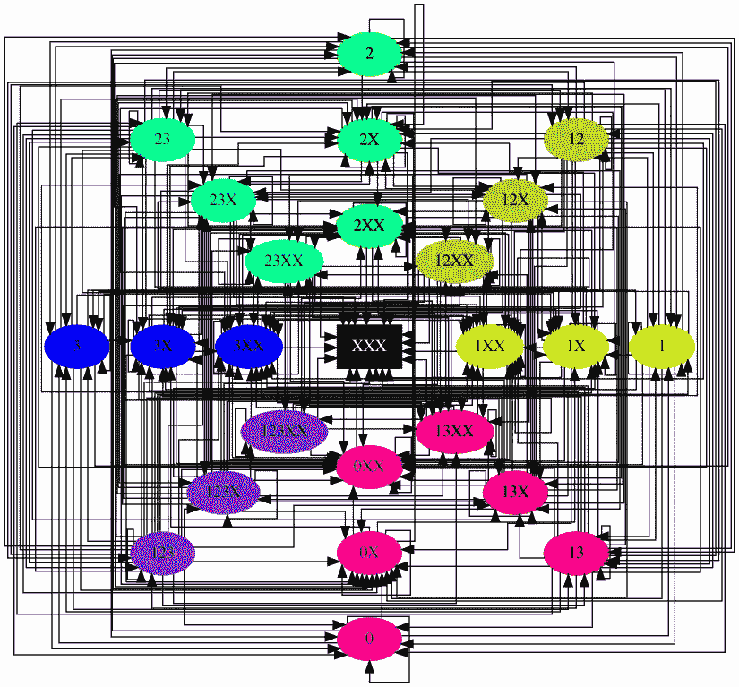

为了掌握允许转换的数量，我建议采用一种不同的策略，而不是费力地数这个图中的箭头。除了乏味之外，图形可视化中的工件可能会导致计数不准确。也就是说，我们将计算下面显示的 12 个更简单(也更有启发性)的子图中的箭头。

该模型有 25 个状态，但是其中只有 24 个可以导致另一个转换(具体地说，除了 **XXX** 之外的所有状态)。因此，有 600 种可能的转换:600=24*25，但是根据棒球的规则，这些假设的想象中有许多不可能发生。

我们可以通过从 600 个可能的跃迁中排除违反三个约束中任何一个的跃迁，精确地计算出允许的跃迁(通过计算机)。

我们可以从消除 192 个可能的跃迁开始，对于这些跃迁，输出数会减少。例如，我们可以通过这个规则去掉 **1XX:1X** ，因为半局不可能从比赛前的两次出局变成比赛后的一次出局。有 192=3*8*8 个可以想象的转换来断言这种滑稽。除去它们，剩下 408 个状态，当然，仍然需要通过应用另外两个规则来进一步删减。

接下来，我们要消除“分数”必须降低的转换。这条规则仍然不够直观。下面的公式可以帮助理解这个约束:(*跑垒人数的变化* ) = 1 — ( *出局人数的变化* ) — ( *得分的变化*)。为什么是公式？我们只能增加一名跑垒员(击球手)。包括击球手在内的所有跑垒员都可以出局、得分或留在垒上——总数必须平衡。

我们可以(通常)直接从过渡符号中推断出平衡方程中的所有量，除了分数的变化。有了记谱法的知识，sabermetrician 可以很快解决平衡方程的分数变化。然而，如果该增量分数低于零，则所指示的转变不能合法地发生。如果是这样的话，那就意味着太多的出局和/或太多的跑垒员停留在垒上，考虑到比赛开始时的垒位占用率。

当我们的记分牌显示半局已经到了最后状态时，这个程序就停止了。从以 **:XXX** 结尾的过渡标签中，我们不能总是推断出哪些垒上仍然有跑垒者，也不能推断出分数发生了什么变化。但是之后约束变成(*附加出局数* ) ≤ 1 + ( *跑垒员数，最初为*)。

例如，第二步消除的 112 个额外的不可能转换中的三个是 **0:123** 、 **1:XXX** 和 **0:0XX** 。为了在实际比赛中强制进行这些转换，与规则相反，我们可以想象让球员从替补席回到比赛中，让他们遭受额外的出局，或者留在垒上，但无论是哪种情况，当他们进入球场时，取消他们之前的得分。这些恶作剧只是给一个非法标签提供了一个幻想的场景，迫使负分数保持平衡。恶魔？幸运的是，据我所知，没有人这样打棒球。

移除违反第一或第二约束的转变留下 296 个可能的转变。

我公布了 296 作为我对 2017 年允许过渡的计数*。大约两年后，我有幸在美利坚大学与学生兼棒球爱好者杰克·伯比安共事。我们一起浏览了大量的数据，调查在游戏的历史记录中，实际上发生了哪些转变，以及哪些半局。我们的数据来自全面的*追溯表*数据库*，*涵盖了从该来源可获得的大部分(但不是全部)数据。*

在漫长的提取、转换和加载过程之后，我们查询了我们的数据库，以确定其中包含的转换数量。这个查询花了几分钟的时间运行，悬念建立起来了。答案是:由 *Retrosheet* 记录的 272 个转换(或者说，记录在我们几乎整个数据库的子集中)。我们进行了更多的测试，并确认我的 2017 代码确实认为记录中包含的所有 272 个转换都是可能的。也就是说，我们还发现另外四个也被认为是可能的过渡，仍然没有出现在*的回顾表*中。具体来说， **3:12** ， **3X:12X** ， **3XX:12XX** ， **3XX:23XX** 似乎从来没有在大联盟发生过，但我原本以为它们都有可能发生。

经过仔细观察，我们发现其中的三个转变(前三个，除了出局数之外都一样)确实违反了规则。它们不可能发生，因为在比赛中，三垒上的跑垒员必须退回到二垒。我们将规则添加到代码中，但是，哦，不可思议的错误！在这个过程中，我们发现这个规则的错误缺失只将*这三个(本质上等价的)转换添加到现在被错误认为可能的转换列表中。考虑到可以想象到的巨大数量的转变，这个结果让我们觉得很不寻常。*

四个缺失转场中的最后一个— **3XX:23XX** 又是怎么回事呢？有趣的是，本质上等价的转换 **3X:23X** 和 **3:23** 确实偶尔出现在*追溯表*记录中。所有这些不寻常的比赛都是从一个跑垒员开始的——在三垒上——尽管击球手上了二垒，但最初的跑垒员仍然在三垒上。显然很奇怪，但很明显，这种情况偶尔会发生，没有出局，或一人出局，但两人出局，跑在第三位的人永远不会原地不动。也许跑者得分了，也许跑者出去了，但是当初始状态是 **3XX** 时，最终状态从来不是，或者至少显然从来不是 **23XX** 。也就是说，规则明确允许这种过渡。因此，我们统计了棒球比赛中 293 次允许的转换，其中只有一次显然是史无前例的。

总共 293 个转变看起来太多了，难以想象，但是对称甚至惊人的不对称使得棒球的图表可以理解。我发现的诀窍是把图表分成几部分，揭示出潜在的模式。图的对称性指的是图与其自身(的子集)的一一对应关系保持了节点的连通性。

作为一个例子，我提出了一个替代游戏，我称之为*无止境棒球*。无尽的棒球有着惊人的对称性，在某种程度上类似于真实棒球中的类似模式。在这场比赛中，只有一个队上场击球，因为半局永不结束——出局数没有上限。人们可以想象贝比·鲁斯和乔·迪马吉奥不朽的灵魂在天堂被安排在击球队。

“无尽棒球”具有对称性，因为我们可以将每个状态对应(或映射)到一个伙伴状态——定义为拥有相同的基本占用率，但多出一个。反过来，合作伙伴映射到其他合作伙伴。连续重新应用地图会增加出局数，而不会改变哪些垒有跑垒员。映射定义了对称性，因为它保持了连通性——两个节点只有在它们的伙伴有边时才有边。所有状态都映射到一个伙伴，但是外环(“无输出”)不接收映射。出于这个原因，一对一的对应只与图中的一个*子集*相关——相似的对称性出现在分形中。基于我是如何绘制图表的，我把这种对称称为无尽棒球的“径向对称”。

这个游戏的普通版本也有类似的模式——可以说是径向对称。但是不对称打破了规则。不对称当然是三个上限，将无限游戏的无限图形修剪为三个环，加上中心的单个吸收态(见上图)。随着对称性的打破，凡人棒球不再拥有同样的一对一对应关系，因为有两个出局的州不再映射到唯一的合作伙伴，而中心州也不映射到任何地方。在这方面，棒球的“径向对称”就像下面讨论的其他对称一样，只是一种类似于替代游戏中对称的模式。

让我们通过形象化图表来讨论棒球的其他类似“对称”。我发现的分而治之的最好方法是从考虑三人战术开始，然后是双人战术、单人战术和清场战术。三重赛是击球队放弃三次出局的罕见情况；双杀放弃两次出局；单身，一个出局；一场干净的比赛是一场没有出局的比赛。据我所知，“三网合一”和“双网合一”是唯一常用的术语，但我们需要所有可能性的名称。

我将双人和单人戏剧进一步细分为五个子类别，标记为“从 **0** 、“从 R”、“从 RR”、“从 **123** 、“到 **XXX** ”每个细分(除了最后一个)收集具有相同初始跑垒员数量的过渡，但只包括导致一个或两个出局的过渡，而不是三个。标签“R”表示一个跑垒者；“RR”代表两个碱基——但符号并不表示哪个碱基被占据。最后一个子部分“to **XXX** ”结合了半局结束时各自类别(双人或单人游戏)中所有剩余的过渡。这一细分产生了 12 个数字，如下所示。如果划分和细分仍然不清楚，数字和它们的标题应该更好地阐明我的选择。

这些数字中的第一个显示了棒球中的三重播放转换。只有 9 个节点出现在图上:8 个，没有输出，组成完整图的外环，加上中心的单个节点，有三个输出。就目前而言，这 9 条就足够了，因为三网融合必须从无出局发展到三出局。在此图以及随后的 11 张图中，我们用彩色显示了考虑中的“起始州”，如果不同，则用灰色显示“终止州”。

尽管我们包括了所有 8 个零出局的状态，但三重播放只能从所示的四个节点发生——那些有两个或三个跑垒者的节点(即三个转换“从 RR 开始”，一个转换“从 **123** ”)。三重播放不能从所示的其他四个“从”节点发生(即从 **0** 和“从 R”的转换)。为什么？要放弃三次出局，至少要有两名跑垒员，加上击球手。因此，图中出现的一些转换可以根据规则发生，而其他的则不能。我们不是只显示合法转换，并为非法转换留出空白，而是用黑色箭头显示合法转换，用红色箭头显示非法转换。

The triple play transitions in baseball. Black: allowed by rules, red: disallowed.

接下来，我们有双重性—但是，如上所述，我们将这一类别细分为五个子类别。这五个中的第一个的图表显示了从空垒和无出局到有两个出局的 8“到状态”(灰色内环)的双杀。所有这样的转换都违反了比赛规则，因为在场上没有其他进攻球员的情况下，只有击球手会出局。因此，双游戏图“从 **0** 开始”中的所有箭头都显示为红色。

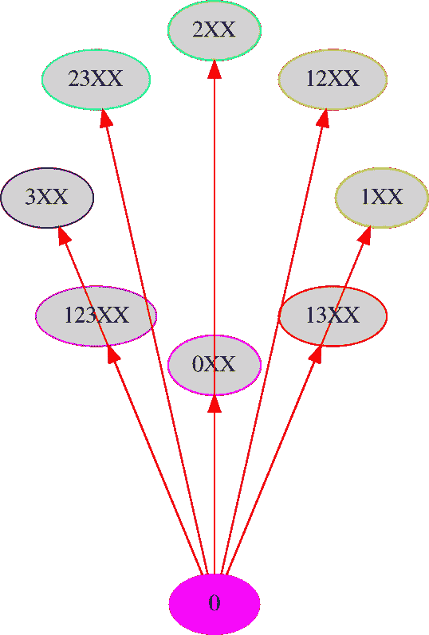

Double plays from bases empty and no outs. All such transitions violate the rules, so are shown as red.

接下来，我们有一个跑垒员的双杀，没有出局。考虑中的三个“来自状态”具有标签 **1** 、 **2** 和 **3** ，并且包括外环的子集，以颜色表示。另一方面，灰色的 8 个“to states”具有两个输出“ **XX** ”标签，构成了完整图的内环。注意，图中三个“自状态”中的每一个发出的单独的黑色箭头指向 **0XX** 。事实上，由于只有一名跑垒员在垒上，击球手和跑垒员都必须为防守方出局以获得双杀，比赛结束后总是留下空垒。因此，图中三个红色箭头指向每隔一个灰色节点。

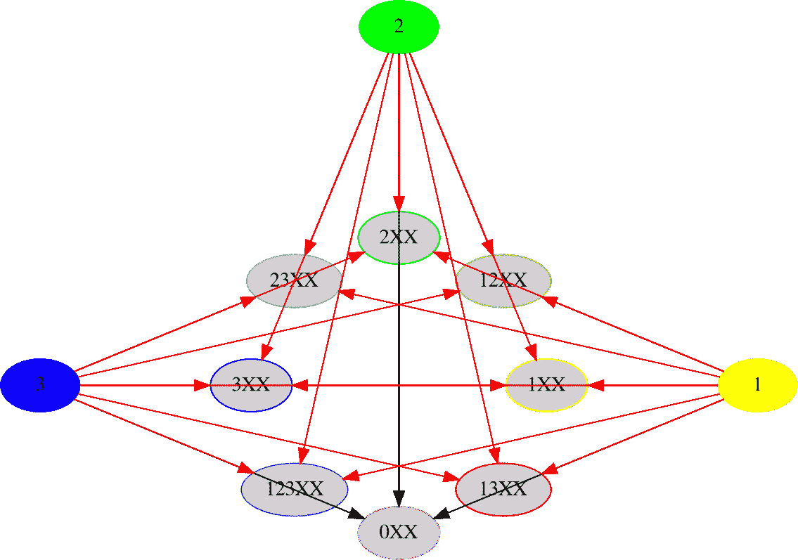

Double plays from one runner on base and no outs.

我们指出，在上述所有三幅图中，上垒人数的差异(之前和之后，或之前上垒人数，对于到 **XXX** 的过渡)决定了箭头的颜色。这个性质暗示了一种对称性——一种将被打破的对称性。

接下来，我们有两个跑垒员的双杀，没有出局。彩色的三个“从状态”有标签 **12** 、 **13** 和 **23** ，灰色的 8 个“到状态”有与上面相同的两个输出标签。所有 8 个最终状态各收到三个箭头，但是，这一次，四个状态收到所有黑色箭头，四个状态收到所有红色箭头。请再次注意，至少在这个图表中，跑垒员数量的增量决定了转换是否违反规则。具体来说，“从 RR 到 **0** ”和“从 RR 到 R”的双重播放可以发生，而“从 RR 到 RR”和“从 RR 到 **123** 的双重播放不能发生。违规行为的发生，不仅仅是因为开始比赛的人太少，也是因为太多人结束比赛。在这两种情况下，平衡 delta 分数低于零表示红色箭头。

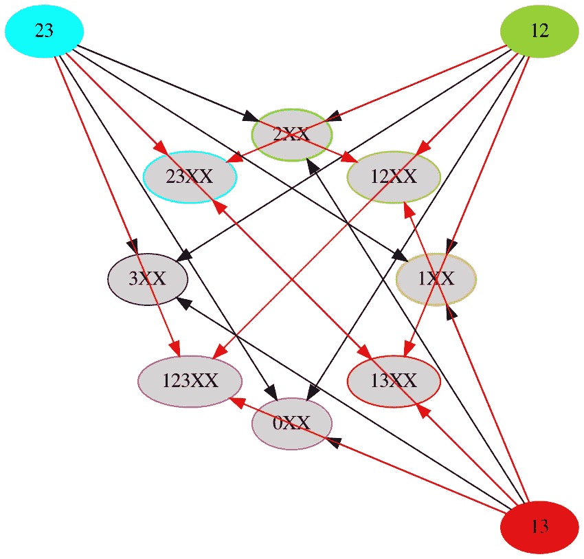

Double plays from two runners on base and no outs.

接下来，我们有三个跑垒员的双杀，满垒，没有出局。在这个类别中，存在一个被考虑的初始状态: **123** ，图中唯一的彩色节点。因此，每个“to state”只接收一个箭头。这 8 个箭头除了一个都是黑色的。指向 **123XX** 的单个红色箭头具有有趣的区别，因为它是完整图上 25 个可能的最终状态中唯一不允许从 **123** 转换的状态。(剩余的 23 个瞬态中)没有其他初始状态具有相同的灵活性。过渡区 **123:123XX** 与上面考虑的其他非法双杀一样，将指示负的 delta 分数，因为在保持满垒的同时遭受两次出局，额外的跑垒员(最初不在比赛中)将不得不上场。

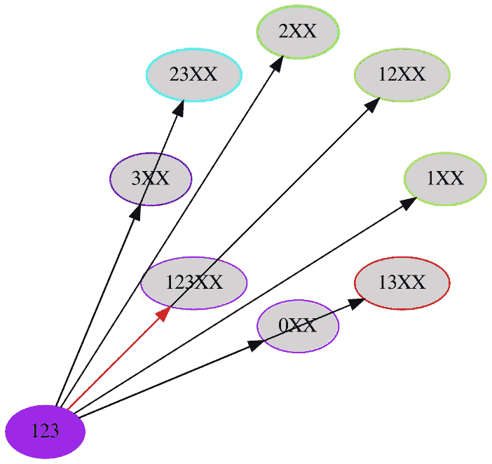

Double plays from bases loaded and no outs.

我们已经完成了外环双杀之旅。接下来，双播放到 **XXX** 。下一个例子显示了从一个 out 开始的转换，这就是为什么最终状态只能是 **XXX** 的原因。我们从来没有考虑过两人出局的初始状态下的双杀——显然，这是不可能的。因此，下一个数字，连同前面的四个数字，包含了所有可能的双杀。

从一出双玩图上唯一的红色箭头出现在 **0X** 处。为什么？双杀要求一名跑垒员放弃两次出局。另一方面，剩下的仍然是可能的，因为至少有一个跑垒员在垒上，击球手和其中一个跑垒员都可能出局。

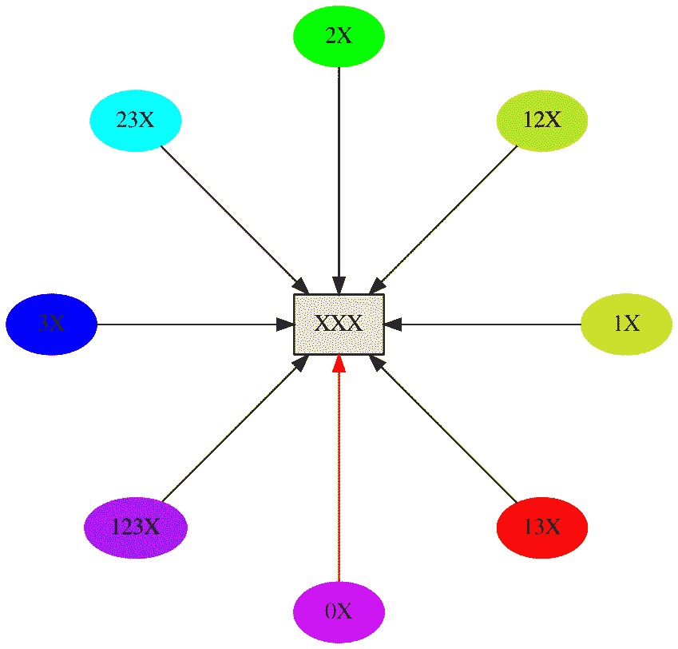

Double plays from one out to **XXX**.

我们现在开始我们的单人戏剧之旅。接下来，我们有空垒的单场比赛，没有出局——只有 **0** 是“从状态”从这个单独的彩色节点发出 8 个箭头——每个箭头指向中环 8 个灰色节点中的一个。这些箭头中有七个是红色的。剩下的一个黑色箭头声明了 **0:0X** 的唯一合法性。事实上，在空的垒上，必须有一个击球手出局，没有跑垒员继续占据垒位。

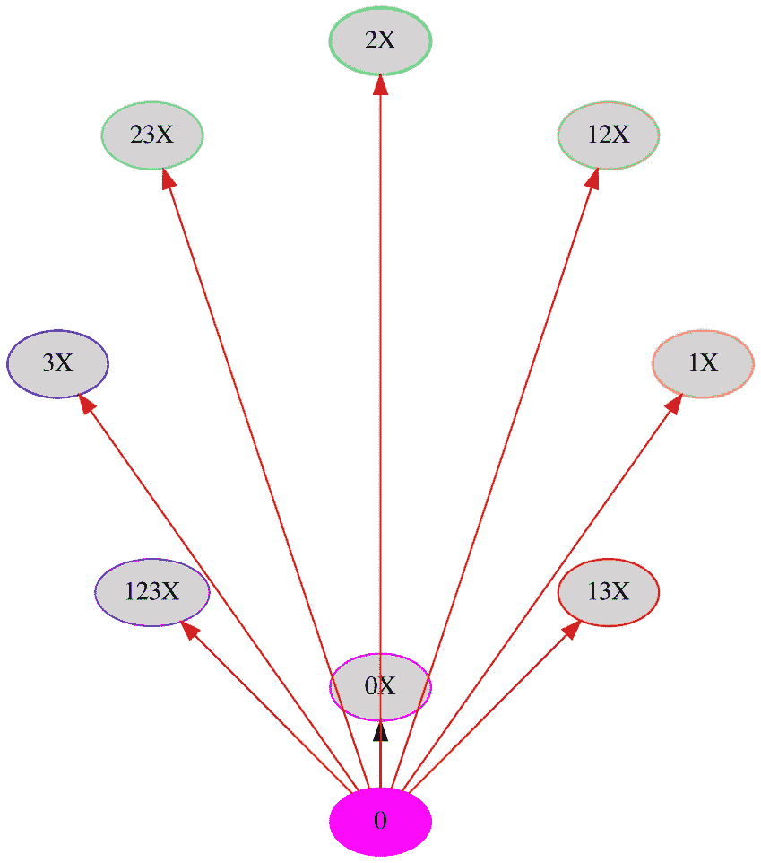

Single plays from bases empty and no outs.

接下来，我们有一个跑垒员的一垒打，没有出局。相应的图有三个“从状态”，用颜色显示，标记为 **1** 、 **2** 和 **3** 。因此，8 个灰色“目标状态”中的每一个都有三个箭头。“至状态”描述(忽略输出)为“至 **0** ”和“至 R”接收所有黑色箭头，而“至 RR”或“至 **123** ”接收所有红色箭头。与上面类似的模式一样，平衡等式中对正 delta 分数的需求解释了我们所看到的情况。

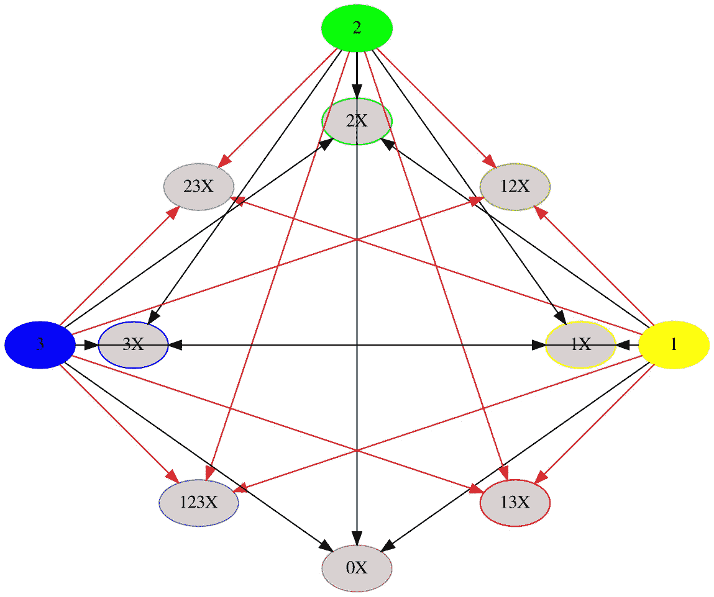

Single plays from one runner on base and no outs.

接下来，我们有两个跑垒员的一垒打，没有出局。再一次，平衡方程，以其尚未探索的对称性，决定了一个类似的模式。但是请注意一些有趣的事情:图之间的一些“对称”交换了箭头的颜色。

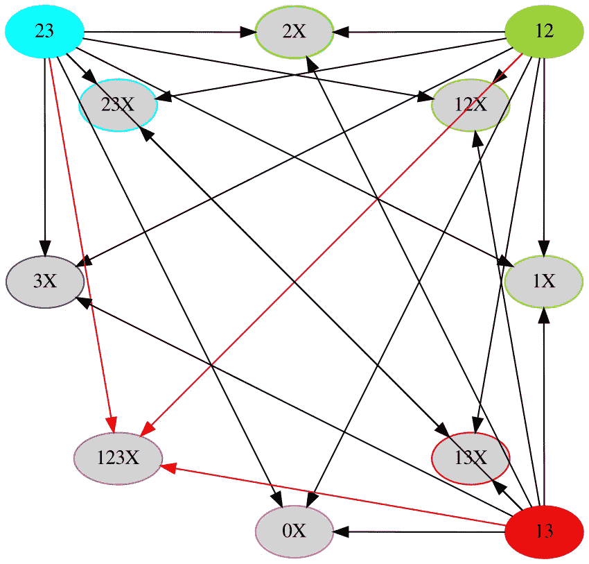

Single plays from two runners on base and no outs.

接下来，我们有满垒无出局的单场比赛。作为补充，从 **0** 开始的双杀都有红色箭头，从 **123** 开始的单杀都有黑色箭头。

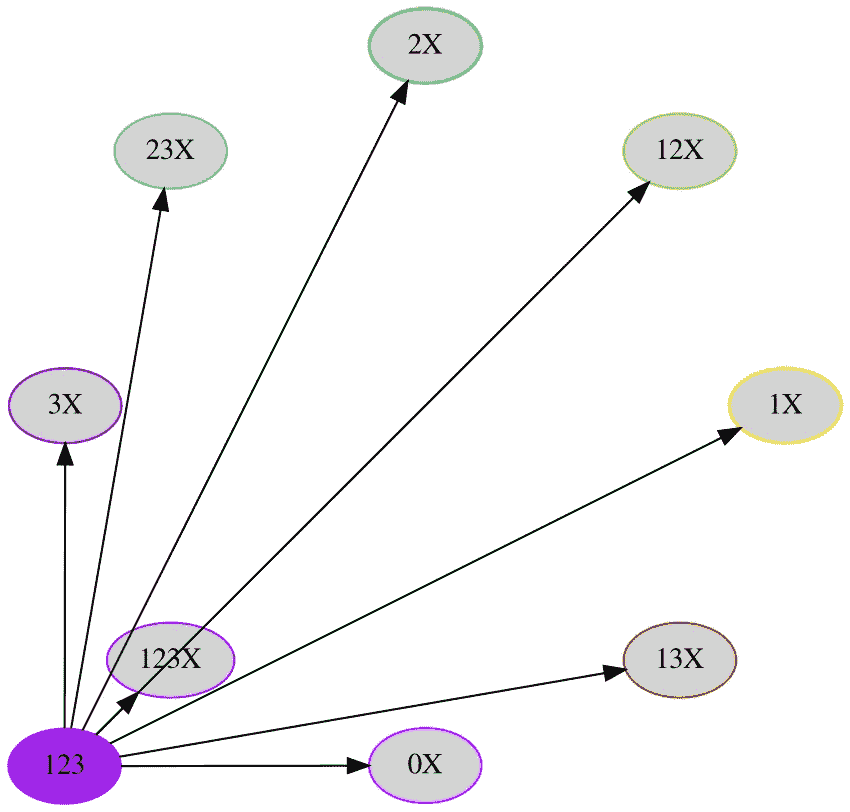

Single plays from bases loaded an no outs.

接下来，我们有两个出局的单打比赛(必须去 **XXX** )。我们把他们都放在一起，就像我们对一人双杀那样。下一张图将是我们的最后一部单剧，尽管仔细思考会发现我们从一出错过了单剧。我们省略的原因源于零输出和一输出之间的径向对称性:相应图表之间的唯一区别是标签中显示的 **X** 的数量。事实上，根据对称性，节点只有在它们的伙伴连接时才保持连接。相比之下，对于 double plays to **XXX** ，我们只发现一个非法过渡( **0X:XXX** )。对于到 **XXX** 的单个播放，我们发现没有:所有这样的转换都可能发生。

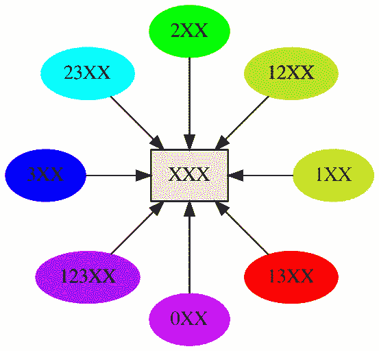

Single plays from states with two outs.

我们最后一张图展示了没有出局的干净利落的打法。像单个剧本一样，我的 12 个数字序列省略了径向对称图。具体来说，对于干净的比赛，我们忽略了那些有一两次出局的比赛。除了少数例外，大多数干净的箭头都是黑色的。有趣的是，所有 8 个节点(和它们的径向对称伙伴，即所有 24 个瞬态)都有一个黑色连接回到它们自己。也就是说，由“从 **0** 到 RR”、“从 **0** 到 **123** ”和“从 R 到 **123** 所描述的七个转换不会发生。这些情况违反了正分数平衡规则:没有足够的跑步者在垒上开始并保持在指定的最终状态。

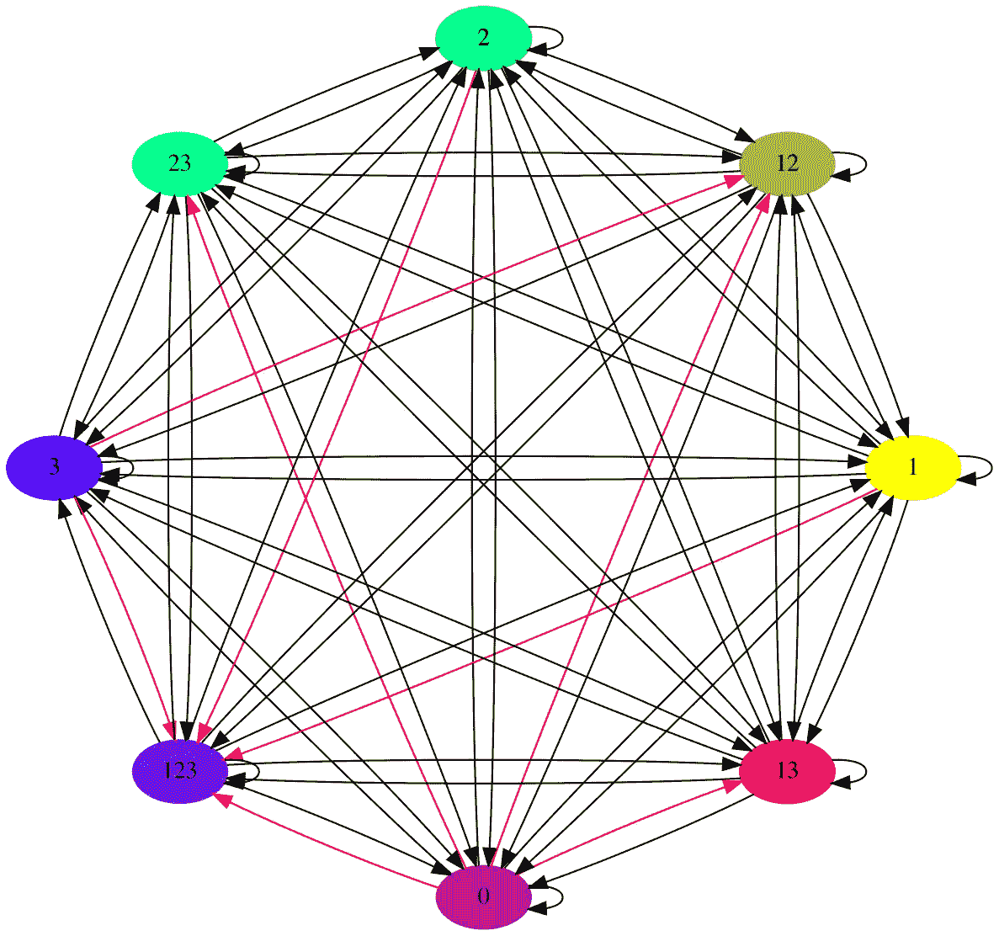

Clean plays from states with no outs.

我没有考虑干净转换图中的一个红色箭头。还记得 **3:12** 吗，我 2017 名单错过的那个真正不可能的过渡？根据要求，它显示为红色，但是，如前所述，它没有违反“余额为正数”的规定。那个过渡区(和它的两个径向对称的伙伴，未显示)是唯一被第三个修剪规则删除的——跑步者不能退到更低的垒。

有趣的是，我们对棒球过渡到 12 种情况的划分已经施加了出局数不能增加的限制(第一个修剪规则)。因此，被第一个修剪规则删除的转换不会出现在任何图中(没有黑色或红色箭头)。

因此，忽略 **3:12** (及其伙伴)，第二个修剪规则(与正分数平衡)确定显示或暗示的所有箭头的颜色(即，除了一个箭头之外的所有箭头，以及由对称性显示或暗示的 408 个箭头中的 405 个)。请记住，在第一个规则剔除了总共 600 个可能的转换中的 192 个之后，还剩下 408 个转换。

如果我们仔细研究棒球的对称性，我们应该只看平衡方程(及其对以 **XXX** 结束的比赛的扩展)，以及正 delta 分数规定:(*垒上跑垒员数量的变化* ) = 1 — ( *出局数的变化* ) — ( *分数变化*)。上面的论述表明，我们将发现“基排列”对称，以及“互补”对称。“碱基置换”就是我所说的改变碱基标签的映射。另一方面，我称之为“互补”对称的映射是交换黑色和红色箭头，因为它是棒球图和它的补图之间的对称。具体来说，图的补图与原始图具有相同的节点，但是这些节点仅在原始节点不连接(红色箭头)的地方连接(黑色箭头)。

显然，棒球平衡方程中的完美对称只在真实比赛中出现，因为很少应用“无退路规则”和“三出局法”。人们可以愉快地想象保持完美对称的替代游戏——然后想象天堂里不朽的棒球精神为了奖励或惩罚而玩这些游戏。

包含图像的代码(Python/Jupyter notebook/Graphviz):[https://github.com/seancarverphd/baseball_graph/](https://github.com/seancarverphd/baseball_graph/)。

2017 年论文(R/knitter/LaTeX)代码和手稿:[https://github.com/seancarverphd/klir/](https://github.com/seancarverphd/klir/.)。

我把这篇文章献给我的朋友和同事 Jacob Ward，他在短暂的一生中为对称性数学做出了许多贡献，还为一个职业队打过棒球。愿他安息。