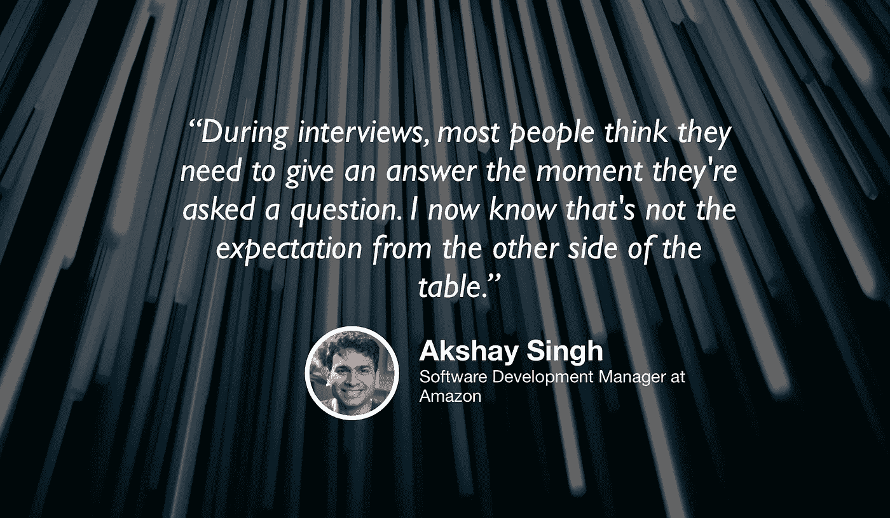

# 数据科学和数据工程之间的细微差别

> 原文：<https://towardsdatascience.com/the-thin-line-between-data-science-and-data-engineering-2e6bd922fe35?source=collection_archive---------16----------------------->

## [苹果](https://podcasts.apple.com/ca/podcast/towards-data-science/id1470952338?mt=2) | [谷歌](https://www.google.com/podcasts?feed=aHR0cHM6Ly9hbmNob3IuZm0vcy8zNmI0ODQ0L3BvZGNhc3QvcnNz) | [SPOTIFY](https://open.spotify.com/show/63diy2DtpHzQfeNVxAPZgU) | [其他](https://anchor.fm/towardsdatascience) | [剪辑](https://youtu.be/kA5LCMsr87w)

## 阿克谢·辛格在 TDS 播客[上](https://medium.com/towards-data-science/podcast/home)

*编者按:这是迈向数据科学播客“攀登数据科学阶梯”系列的第四集，由 Jeremie Harris、Edouard Harris 和 Russell Pollari 主持。他们一起经营一家名为*[*sharpes minds*](http://sharpestminds.com)*的数据科学导师创业公司。可以听下面的播客:*

如果你在过去几年一直关注数据科学的发展，你会知道这个领域自 2010 年代早期/中期的狂野西部阶段以来已经发生了很大的变化。那时候，几个 Jupyter 笔记本和半生不熟的建模项目可以让你在一家体面的公司找到工作，但事情已经发生了很大的变化。

如今，随着公司最终开始理解数据科学能够带来的价值，越来越多的人开始重视在生产系统中实施数据科学。由于这些实现需要能够在越来越大的数据集上实时执行的模型，大量数据科学问题已经成为工程问题。

这就是为什么我们采访了阿克谢·辛格，他曾在亚马逊、联盟和陈-扎克伯格计划(前身为 Meta.com)的数据科学团队工作并管理过。阿克谢在数据科学和数据工程的交叉领域工作，带领我们走过了数据分析和数据科学之间的微妙界限，该领域的未来，以及他对没有得到足够支持的最佳实践的想法。以下是我们的主要收获:

*   在数据工程中最容易犯的一个错误是没有仔细考虑你选择的工具。你为什么用 S3 作为你的数据仓库？为什么不是红移或者 BigQuery？强迫自己理解这些问题的答案，不接受给定的工具是一种很好的成长方式，如果你想给潜在雇主留下深刻印象，这是至关重要的。
*   永远假设你现在构建的任何东西都会在一年或更短的时间内被取代。生产系统不是静态的，你或其他人迟早会重新访问代码库的大部分。这就是为什么学习如何使用文档字符串，使用清晰的函数和变量名，以及理解内联注释的最佳实践是如此重要。
*   数据会随着时间的推移而漂移，对今天的数据有效的模型在下周可能就不再有效了。这可能是由多种因素造成的:季节性是其中之一，但用户行为也会因你而改变。阿克谢建议，即时收集用户反馈是解决这个问题的关键:如果你注意到他们的反馈出乎意料地变得消极，在你的系统中设置一个警报，让你知道有些事情不对劲。
*   大局是要记住的最重要的事情。人们很容易迷失在一个技术问题中，但伟大的数据科学家的标志是能够停下来问一问这个问题是否值得解决。你真的需要一个推荐系统吗，或者一个简单的基于规则的系统也可以吗？如果你无法获得监督学习模型所需的精确训练标签，你能拼凑出一个像样的代理吗？现实世界是混乱的，经常要求你用比 Kaggle 竞赛更有创造性的方式来处理数据科学问题。
*   随着时间的推移，随着越来越多的数据科学家的工作负载通过越来越强大的工具被抽象化，看到全局的重要性只会与日俱增。数据科学正在缓慢但肯定地成为一个产品角色。

## [TDS 播客—剪辑](https://youtu.be/kA5LCMsr87w)

如果你在推特上，随时欢迎和我联系 [@jeremiecharris](https://twitter.com/jeremiecharris) ！