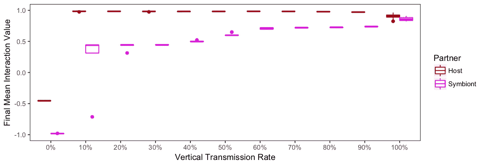
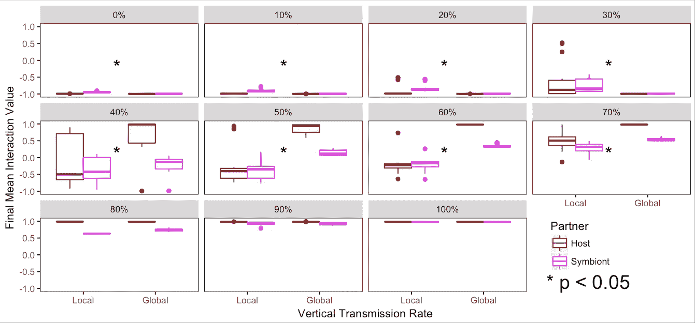

# 寄生虫和互惠互利者之间的细微差别

> 原文：<https://towardsdatascience.com/the-thin-line-between-parasites-and-mutualists-cbeab224fefe?source=collection_archive---------24----------------------->

Photo by [Pree Bissessur](https://unsplash.com/photos/nzBogfERXrw?utm_source=unsplash&utm_medium=referral&utm_content=creditCopyText) on [Unsplash](https://unsplash.com/search/photos/parasite?utm_source=unsplash&utm_medium=referral&utm_content=creditCopyText)

## 如何用基于主体的模拟来理解从互利共生到寄生的进化，反之亦然

“寄生虫”这个词让人想起绦虫和扁虱的形象，而“互惠者”这个词则让人想起在大草原上，干净的鱼在大鲨鱼的嘴里啃食，鸟儿骑在有蹄类动物的背上。很明显一个永远不会变成另一个，对吗？如果有一件事是大自然嘲笑的，那就是任何愚蠢的人类试图把一种情况描绘成非黑即白，从寄生到互利共生的光谱也没有什么不同。

直到最近，科学家们才抓住这一观点，即寄生虫可以变成互惠互利者，反之亦然。有很多可能的例子:人类向土壤中添加氮可能导致通常帮助植物(通过固定氮)的土壤微生物成为寄生物，因为即使植物不再需要它们的帮助，它们仍然想要它们的糖。大肠杆菌是一种可怕的肠胃流感，也是人体的正常居住者，这取决于地点。有些昆虫从植物的基部偷取花蜜，避免花粉沾到它们身上；它们可能最初是由传粉者进化而来的吗？

虽然似乎有例子表明严格的互惠主义者或寄生虫可以进化成另一个，但没有办法确切知道发生了什么或会发生什么(除非你在某个地方藏了一台时间机器)。然而，人类非常善于发现模式，即使实际上并不存在模式，所以我从来不满足于认为这样的解释是理所当然的。

因为我个人没有藏时间机器，所以我创造了一个模拟，可以模拟互利共生、寄生以及任何介于两者之间的情况。如其名，符号使用基于代理的建模概念工作。基本上，我编写了关于通用主机如何运行的代码和关于通用共生体如何运行的代码。(补充说明:共生体是一个事物与另一个事物共存的专有名词，可以是寄生的、互惠的或其他的。互利共生是一个事物与另一个事物共存的专有名词，它们相互受益。)宿主和共生体都需要收集一定数量的资源以便能够繁殖，并且它们的后代继承它们的行为并有机会变异。这个非常简单的设置是进化发生所必需的。我感兴趣的行为是他们如何对待彼此。一般的宿主和一般的共生体可以是完全合作的(互利者)和为了共同的利益分享它们所有的资源，也可以是完全对立的(宿主和寄生虫)，在这种情况下，宿主花费资源来保护自己，而寄生虫无论如何都要尽可能多的获取资源。关键是这是一个全谱，我可以创造大量的这些独立活动的宿主和共生体。通过这种方式，我能够在最高水平上模拟宿主生物和共生体群体在不同环境下可能如何进化。

现在有很多问题可以用这个软件来问(它是开源的，所以欢迎任何人来贡献)，但是科学就是每次专注于一个特定的问题。

首先，我问这样一个主机和共生体系统的简单表示是否能够做我们大多数人所期望的事情。预期的第一件事与垂直传输速率有关。在高层次上，垂直传输速率是指当主机复制时，共生体能够跟随的速率。高垂直传输率似乎与互利共生有关，这是有道理的:如果宿主繁殖时共生体将被繁殖，那么共生体应该帮助宿主繁殖。你的线粒体就是现在 100%依赖垂直传播的共生体的好例子；它们获得下一代的唯一途径是它们所在的人类细胞进行繁殖，使它们成为非常可靠的互惠互利者。低垂直传播率似乎自然地与寄生现象和另一种传播形式联系在一起:水平传播。导致你在电梯里打喷嚏的感冒病毒不太可能持续到你下一次繁殖，因此它需要自己传播，并会尽可能多地利用你的资源来传播。

事实证明，我现在可以证明在垂直传播率和共生体种群进化到何种程度之间存在因果联系:

Graph showing the interaction between the vertical transmission rate and the final mean interaction value of hosts and symbionts. At 0% vertical transmission rate, the host and symbiont are in a traditional parasitic relationship. At 100% vertical transmission rate, they are in a traditional mutualistic relationship. At intermediate rates, they are somewhat mutualistic. [2]

这是一个乍看起来很明显，因此很无聊的图表。然而，我必须强调的是，如果没有这种类型的模拟，这是一个很难测试的假设，而且科学中充满了似乎明显正确但最终证明完全错误的假设。然而，这个令人放心的结果为深入研究一些“看似明显但可能是错误的”问题奠定了基础。本文探讨了其他几个问题，包括当有两个任务需要完成，而主持人只能完成其中一个时会发生什么。但是最后证明是错误的那个是最有趣的，所以这是我接下来要重点讲的。

# 空间结构如何改变互利共生的进化

当我们探索合作和空间结构的话题时，请耐心听我说。众所周知，在单个物种的合作领域，空间结构有助于合作策略的成功[3]。为了理解这个想法背后的直觉，想想一种细菌。如果这种细菌倾向于努力释放周围细胞可以利用的资源，它就很容易受到空间结构的影响。如果这是一个开放的海洋，周围的细胞不太可能分享它的基因，那么它就是在分享资源，可能得不到任何回报，也无法繁殖。然而，如果它在一个粘性的表面上，因此它周围的所有细胞几乎都是精确的克隆，那么它产生的任何资源都将进入这些克隆。由于这些克隆体与我们的友好细菌共享大部分基因，它们也将努力释放我们的细菌将使用的资源。如果一个合作者被其他合作者包围，那么它就更有可能把它的基因传递下去。导致后代与父母保持亲密关系的空间结构促进了这种有利于合作者的环境。因此，众所周知，空间结构使得合作更有可能发展成为一种成功的战略。

事实证明，只有当你谈论单一物种时，这才是正确的。当宿主/共生体系统加入空间结构后，在一定的垂直传输速率下，共生体变得更加寄生！

A series of graphs comparing vertical transmission rate to the final mean interaction value when reproduction is local or global. At rates of 40–70% vertical transmission rate, the symbionts were more parasitic with spatial structure than without. [2]

这个结果太出乎意料了，当我第一次得到数据时，我和我的同事们都确定某个地方有 bug。只有在大量的测试和另一个实验室发表的预测这一结果的数学模型[4]之后，我才确信这实际上是正确的。这是一个相当不和谐的结果，因为几十年来对单一物种合作的研究已经指向了合作进化的空间结构。问题在于，世界上没有物种是完全与世隔绝的。到处都有细菌、病毒和真菌，它们对我们这些大生物的健康影响比我们想象的要大得多。通过一个基于智能体的模拟，我已经展示了我们对合作的理解变得更加复杂，只要我们把另外一个物种考虑进去。想象一下，当我们把以各种想象和不可想象的方式相互作用的数百种因素考虑在内时，我们会意识到什么！

参考资料:

[1] E. I. Jones 等人，[欺骗者必须繁荣:调和互惠主义中欺骗的理论和经验观点。](https://onlinelibrary.wiley.com/doi/full/10.1111/ele.12507)(2015)*生态快报*

[2] A. E. Vostinar 和 C. Ofria，[空间结构会降低共生合作。](https://www.mitpressjournals.org/doi/abs/10.1162/artl_a_00273)(2019)*人工生命*

[3] S. P. Diggle 等，[群体感应细菌种群中的合作与冲突。](https://www.nature.com/articles/nature06279) (2007 年)*性质*

[4]e . akay，[种群结构降低了互利共生中伙伴选择的收益。](https://www.biorxiv.org/content/10.1101/068445v1.abstract) (2016)，bioRxiv