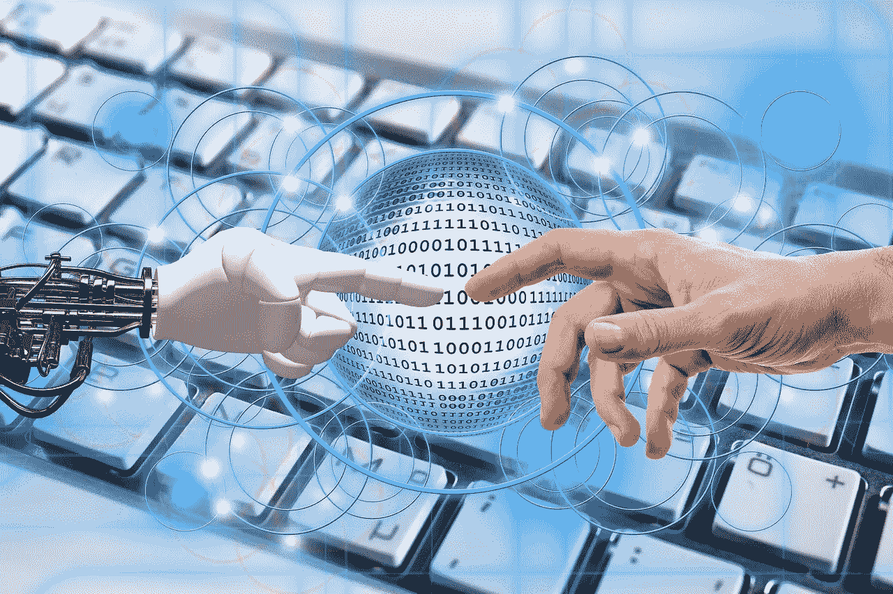

# 这件事不言自明

> 原文：<https://towardsdatascience.com/the-thing-speaks-for-itself-e075f026773?source=collection_archive---------23----------------------->

## 内部人工智能

## **为什么电脑撰写的法律摘要比你想象的要近**

Image by [Gerd Altmann](https://pixabay.com/users/geralt-9301/?utm_source=link-attribution&utm_medium=referral&utm_campaign=image&utm_content=3685829) from [Pixabay](https://pixabay.com/?utm_source=link-attribution&utm_medium=referral&utm_campaign=image&utm_content=3685829)

**这篇文章写起来花了太长时间。研究、概述、起草、编辑。*育雏*。几个月来，我苦思冥想，不知道这是不是一个好主意。在我炖的时候，我担心别人会抢在我前面。**

写作可能会让人筋疲力尽，但写法律摘要可能会非常痛苦。正如已故大法官斯卡利亚曾经承认的，“我不喜欢写作，但我喜欢写作。”我的原话。因此，在最真实的美国传统中，我梦想有一天我能把写作中最痛苦的部分自动化。

但这可能吗？一台机器能学会简短写作的艺术吗？而如果是这样，那种人工智能不就几代之遥了吗？

如果基础技术存在于今天会怎样？如果人工起草的辩护状已经出现会怎样？

我带来了消息。

2016 年，导演奥斯卡·夏普发布了一部名为*太阳之春*的九分钟科幻电影。 片头演职员表——在不祥的工业噪音中时隐时现的故障机器文本——确定了编剧:一台电脑。

*Sunspring* 是一项实验，灵感来自你每天放在口袋里的技术。多年来，智能手机一直在帮助我们编写文本，通过阅读我们键入的单词，预测我们的下一个单词是什么，并提出建议。夏普先生和他的工作人员使用类似的技术创作了《太阳之春》的剧本。

事情是这样的。首先，该团队“训练”了一个名为本杰明的软件程序。他们给本杰明提供了大约 150 个科幻电影剧本，让它消化和分析。然后，他们通过提供一个标题、一些示例对话和一些动作词给本杰明一个起点。

然后他们按下按钮。剧本辉煌地出现了:

> 在未来大规模失业的情况下，年轻人被迫卖血。这是我能做的第一件事。
> 
> H2:你应该看看那些男孩，然后闭嘴。我是那个要活到一百岁的人。
> 
> 我又见到他了。你被送到我这里的方式…那是一个诚实的想法。我不是一盏明灯。
> 
> 嗯，我得去看看头骨。我不知道。 *⁴*

这种华丽的废话坚持到底。

毫无疑问, *Sunspring* 是令人愉快的——但绝对不是因为它那噱头十足的编剧。归根结底，它的娱乐价值是老式人类汗水的产物。演员表演台词的方式，他们的面部表情，声音效果，电影摄影——它们都把你带离了语言的迷雾。你可能不知道为什么，但你可以告诉一些沉重的事情正在展开。这是一部外国电影抓住你的方式，即使你一个字也不懂。演员和工作人员把胡言乱语变成了现实。

本杰明使用的算法——被称为“长短期记忆递归神经网络”——并不写座谈会。它只是处理数据。为了生成*的《太阳泉》*，本杰明分析了 150 个剧本，并确定了单个单词出现在彼此附近的频率。然后，从夏普团队提供的种子词开始，本杰明开始组装对话。每当它选择一个单词时，它都会问自己一个问题:“鉴于目前我所看到的一切，下一个单词最有可能是什么？”然后，它选择下一个单词，并重复循环。一个剧本出来了。

库布里克这不是。没有潜在的想法被传达，没有指向对话。这实际上是一种统计学上的练习——比在字典里随意走一圈要好一点。没有方向，没有微妙之处，没有对歧义或上下文的欣赏，也没有有意的幽默。这是数学。但是一个好的演员和工作人员做了一些事情。

那么这是人工智能能做到的最好的吗？AI 的工作产品是否总是需要英雄式的干预才能有意义？大多数作家会嘲笑计算机会与人类作家竞争的想法——这对于我们这些短篇作家来说更是如此。在我们看来，我们的工作对人类智力的各个方面都提出了很高的要求。它需要主题知识、逻辑、说服力、简洁、风格、同理心和许多其他似乎难以捉摸的特质。很多律师都做不到。没有灵魂的机器肯定做不到这一点。

好吧。事实证明，电脑写作的发展比我们律师似乎意识到的要快得多。虽然往往很难将现实与炒作分开，但毫无疑问，艾以前在写作和说服方面的局限性正在稳步消失。这篇文章(还是花了太多时间来写)是我试图确定一些关于基于人工智能的写作的共同信念，并展示技术是如何反驳它们的。

“人工智能不能产生像样的散文。”尽管《T2》很有趣，但它的对话却是令人困惑的单词沙拉。你可能会由此得出结论，没有感知能力的机器根本无法持续地写出连贯的文本。但是这个结论是错误的。人工智能现在正在从头开始生成散文——它不仅连贯，而且实际上与人类的写作没有什么区别。事实上，很有可能你已经读了一些，甚至不知道它。

想想叙事科学，一家为 Forbes.com*和 T5*这样的客户制作在线新闻故事的芝加哥公司。为*Wired.com*，撰稿几年前，史蒂文·利维采访了叙事科学公司的员工，对他们的系统如何运作有了一些了解。⁵首先，机器吸收结构化信息——比如棒球统计数据或金融数据。然后，它应用一组规则和模板来了解这些数据的含义。例如，一场特殊的棒球比赛会增加胜利的几率(从而增加它的重要性)吗？股价突然上涨是否预示着商业突破？一旦系统识别出这个核心思想，它就会用简单的英语生成一个故事。

和 *Sunspring* 一样，这种简单的英语叙述来源于现有的书面作品。但与 *Sunspring* 不同，它是有意义的。这里有一个例子:

> 分析师预计，2015 年 7 月 24 日星期五，DTE Energy 将公布第二季度业绩，届时该公司的利润将会提高。普遍的估计是每股盈利 84 美分，比一年前的每股盈利 73 美分有所上升。
> 
> 过去一个月，市场普遍预期没有变化，但比三个月前的 1.10 美元有所下降。对于本财年，分析师预计每股收益为 4.61 美元。分析师预计，该季度收入将同比下降 7%，至 25.2 亿美元，而一年前为 27.0 亿美元。今年的收入预计为 112.3 亿美元。 *⁶*

这可能不会赢得普利策奖，但仍然。可以理解，有条理，讲的是一个连贯的故事。最棒的是，假设它是准确的，它不需要真正的编辑。

体育新闻甚至更好，也许是因为这个主题不那么枯燥。这里有一个由 Wordsmith 制作的例子，这是一个机器人新闻节目，由北卡罗来纳州一家名为 Automated Insights 的技术公司创建:

> 马库斯·佩吉在比赛还剩 9 秒时得分，让北卡罗莱纳州以 72 比 71 领先路易斯维尔。在韦恩·布莱克希尔错失三分球和特里·罗齐尔第二次尝试失败后，脚后跟以相同的比分赢得了胜利。
> 
> 佩吉的篮筐为焦油脚跟队带来了 13 分的反击，在比赛还剩 8 分 43 秒时布莱克希尔投出三分球后，焦油脚跟队以 63 比 50 落后。UNC 以 22-8 的比分结束了比赛，确保了胜利。在比赛还剩 39 秒时，布赖斯·约翰逊的一个篮筐让北卡罗莱纳州以 70 比 69 领先，罗齐尔以一个篮圈回应，让路易斯维尔在比赛还剩 26 秒时领先一分。 *⁷*

在这些文章发表后的短时间内，计算机写作变得越来越好。就在我写完这篇文章之前，埃隆·马斯克(Elon Musk)的 OpenAI 宣布，其 AI 平台现在可以根据基本提示生成虚构的“新闻”故事。给这个系统一个简单的句子——甚至只是一个片段——它就会消失。尽管接下来的故事完全是虚构的，但它们写得非常好，以至于一些观察家哀叹它们看起来多么可信。⁸

为什么相对于 *Sunspring* 有如此大的改进？一个很大的原因是结构。根据利维的说法，新闻故事往往遵循一个公式。程序员和监督者可以创建一个遵循这个食谱的框架，并可以开发一个包括体育迷和金融迷熟悉的行话的词汇表。*太阳泉*不涉及这种结构；这只是一个纯粹基于概率，像回形针一样将单词连接在一起的练习。

好的法律摘要也遵循可预测的结构。他们背诵法治，总结突出的事实，并认为这些事实决定了一个特定的结论。他们也可能继续反驳反驳。这可能比报道一场篮球赛要复杂得多，但并不总是如此。法律中确实存在简单的问题，比如撤销表面上违反了明确程序规则的传票，或者驳回被诉讼时效法规禁止的索赔。对于这些简单的事情，人工智能可能已经能够生成基本的简报。至于更复杂的问题，连贯的计算机写作只是时间问题；正如叙事科学、Wordsmith 和 OpenAI 所展示的，概念的证明已经存在。

与我们许多人可能相信的相反，底线是人工智能已经能够产生像样的散文，如果不是完全令人愉快的话。

从数字中生成公式化的散文是一回事。但 AI 无法可靠地分析非结构化的人类语言，并生成任何有价值的东西。”撰写体育和金融新闻的程序受益于高度结构化的数据，通常是数字。解析这种数据的方法已经存在了几个世纪，所以计算机能够从中提取意义也就不足为奇了。

然而，与统计学不同，人类语言本质上是“模糊的”,不可能现实地压缩成一套规则，硬编码到软件中或聚集到数据表中。当然，一台机器不能把法令、判例法和诉状简化成它能可靠分析的东西。

驯服语言信息肯定比处理数字更具挑战性。但同样，人工智能在从自然语言中提取意义方面取得了巨大进展。也许最突出的例子是 IBM Watson，它在 2011 年著名的《危险边缘》节目中击败了人类竞争对手！当出现问题时——通常是旨在欺骗参赛者的模糊问题——沃森的一屋子服务器开始进行一系列复杂的操作。在破译了英语问题后(在*的危险中被称为“线索”！*的说法)，沃森通过查询大约 2 亿页本地存储的信息，对检索到的信息应用数百种算法，并为每个可能的答案分配置信度得分，来确定可能的答案。只要最佳答案超过了某个置信度阈值，Watson 就会进来，用简单的英语宣布它的答案(至少是以问题的形式)。而且它做这一切的速度往往比它的人类同伴能想到的还要快。⁹

关于《T4 危险边缘》的沃森！很像 *Sunspring* ，它需要大量的人工干预。据报道，大约 20 名研究人员花了三年时间训练该系统玩 *Jeopardy！*与人类不相上下。⁰一路走来，沃森的许多练习答案都是可笑的错误。这意味着机器只是在遵循由它的处理程序强加的复杂规则，并在多次迭代中提炼。

这给律师带来了一个问题，因为管理规则在不断变化。但是，如果机器能够训练*本身*理解人类语言，并相应地更新其输出，那会怎么样呢？

由于“机器学习”的最新进展，这种自我训练系统已经广泛存在。看看谷歌翻译就知道了。在 2016 年 11 月之前，谷歌的翻译依赖于大量的数据表、规则和例外，这些都是由用户社区管理的，他们提供了稳定的改进。虽然这种强力系统通常是成功的，但它很少考虑上下文或微妙之处，并且经常产生与 *Sunspring* 中的对话一样有意义的翻译。

但在 2016 年 11 月，谷歌扳动了开关。用户不再收到基于离散众包规则的原始翻译。现在，机器自己训练自己。和以前一样，它消化了大量信息(谷歌有很多)。但这一次，它自己识别了语言模式，并编写了自己的规则。结果是一个更好的产品。

你和我不需要知道这一切是如何运作的。我们真正需要知道的是它*做*。人工智能现在可以在语言迷宫中导航，机器在处理非结构化信息时曾经面临的概念障碍已经在很大程度上被克服。多亏了机器学习算法，计算机现在可以近乎流利地模仿我们。

**“训练这些系统所需的数据极其昂贵。”这是一个很好的观点，但最终是一个稍纵即逝的观点。诚然，Westlaw、LEXIS 和 PACER 并不便宜，而且很少有人能负担得起谷歌用来开发和改进谷歌翻译的数据量。**

但随着低成本替代品的激增，这种信息寡头垄断已经开始消退。像 Justia.com、谷歌学术、RECAP 和许多其他网站现在提供免费或低价访问大量法律权威汇编和诉讼当事人提交的文件。一般经验表明，这种趋势只会继续下去。成本将会下降，免费数据库将会激增，数据积累将不再对任何有兴趣利用人工智能撰写法律摘要的人构成障碍。

**“电脑说服不了人。”我们大多数人认为，要说服人类，一个人必须是人类。这一观点很有道理:说服不仅需要逻辑，还需要移情、识别(并利用)偏见的能力以及对人性的基本把握等神秘品质。鉴于如此多的人缺乏这些特征，我们怎么能指望机器拥有它们呢？**

事实证明，他们不需要这么做。再一次，让我们考虑华生。2018 年 6 月，来自以色列的 IBM 研究人员前往旧金山展示了一款名为 Project Debater 的新产品。这场比赛让 IBM 的机器与两名人类辩手对决——不是任何辩手，而是两名以色列最优秀的辩手。利用典型的开场/反驳/总结形式，与会者就远程医疗和空间探索补贴的优点展开了辩论。所有这一切都是实时发生的:机器听取其人类对手的论点，剖析这些论点，并利用海量数据来制定和用声音表达简单英语的回应。它甚至会开玩笑。

但是说服了吗？似乎是这样。这些辩论是在人类观众面前进行的，他们评估这些论点，并判断哪个辩手的立场更有说服力。IBM 对谁“赢得”这场比赛讳莫如深，但这台机器确实改变了一些人的想法。它*说服了*，即使面对能力极强的对手。一些媒体已经建议，律师可以使用 Project Debater 的技术来识别和开发最能促进客户利益的法律论据。

计算机永远不会像律师一样思考，所以它们也不可能像律师一样写作按照目前的设想，人工智能机器不能像人类一样思考。事实上，它们根本不会思考——它们是没有知觉的设备。就有意识的思想而言，它们不比锤子更先进。

但是没有理由说机器必须像人一样思考才能在法律上成功。父子未来学家理查德和丹尼尔·萨斯金德写了大量关于计算机必须模仿人类创造者才能做人类所做的事情这一错误观念的文章。他们称之为“人工智能谬误”，错误地认为只有一种方法可以处理复杂的智力任务。⁴甚至谷歌的程序员显然也在努力克服这一谬误，并最终在他们重新发明谷歌翻译时战胜了它。正如谷歌的格雷格·科拉多(Greg Corrado)解释的那样，“机器‘知道’或‘理解’什么并不重要，重要的是它‘做什么’。。。."⁵

同样，计算机不需要听从金斯菲尔德教授来做律师的工作。只要黑匣子拿出一份好的简报，它是如何到达那里的，或者它是否“明白”自己在做什么都不重要。重要的是最终产品。像律师一样思考是不相关的。

**“你已经确定了许多必须拼凑在一起的独立系统，这很难。”你难倒我了。但关键是，这些东西*确实*存在，即使只是雏形，而且它们*可以*拼凑在一起。谁以高性价比的方式做到这一点，谁就会把一个产品推向市场。一旦这类产品站稳脚跟，简短写作行业将开始无情的演变。**

“在我的职业生涯中，这些都不会发生。”那还有待观察。但是，即使是那些接近退休的人也不应该过于自满。技术进步有一种悄悄接近你的方式。套用海明威的话，进步是逐渐发生的，然后突然发生。

作家雷·库兹韦尔预测，到 2050 年，“一千美元的计算将超过地球上所有人脑的处理能力。”⁶随你怎么争论这个问题，但核心观点依然存在:计算技术的进步是不可避免的。还有许多是不可预见的。正如《纽约时报》作家吉迪恩·刘易斯·克劳斯在他关于谷歌翻译的报告中所观察到的，“谷歌大脑在九个多月的时间里所做的事情只是一个例子，说明了大公司的一个小团队可以多么迅速地自动化一项没有人会与机器联系在一起的任务。”⁷为什么律师应该被豁免？

并非所有人都认同这种技术不断进步的愿景。一些专家看到了人工智能永远无法克服的理论砖墙，并认为当前的环境充斥着过度的炒作。也许是⁸。但是请记住，这篇文章中探讨的应用程序已经存在。时间会告诉我们他们能变得多能干，他们的工作能变得多复杂，以及他们是否能克服目前的局限。

不管怎样，门已经打开了。随着时间的推移，人工智能的能力和可用性将会增加，而其成本将会下降，所有这一切都在加速进行。随着客户看到人工智能生成可行草案的潜力，他们将坚持要求他们的律师要么采用这项技术，要么至少降低收费，以跟上他们机械化的竞争。随着人工智能开始超越初级律师(初级律师的原始工作往往需要大量的修改和重写)，律师们将屈服于他们客户的新要求。没错，我们还没到那一步。但这只是时间问题。

**那么，短篇作家注定要失败吗？**我无法用任何权威回答这个价值百万的问题；我只是报道我在地平线上看到的。所以我不会假装预测未来或者权衡 AI 的社会成本和收益。许多聪明人已经写了关于这些话题的文章，其中包括田纳西大学的法学教授本·巴顿·⁹和英国的理查德·萨斯金德·⁰夫妇。我比不上他们富有洞察力的作品。

尽管如此，无论它的价值，这里是我个人的和投机性的。简短写作既困难又费时。(我有没有提到我写这篇文章花了多长时间？)我欢迎有一天计算机能够完成生成初稿所需的繁重工作。当这种情况发生时，我们律师将能够以更低的成本写更多的摘要——而且可以说是更好的摘要——并且没有所有的斯卡利亚式的痛苦。我们将花更多的时间润色好的机器生成的草稿，而不是花更少的时间盯着空白页。如果更低的成本激励更多的诉讼当事人去尝试对不利的判决提起上诉，像我这样的上诉从业者将会受益。在这样一个世界里，自动化将会带来解放和利润。

即使人工智能达到了可以生成完美草稿——甚至是最终稿——的地步，我仍然不认为我们注定要失败。法律是动态的，新的问题和争论一直在出现。机器是否能够在没有人类指导的情况下，从零开始，在不断变化的环境中产生新的有吸引力的想法，还有待观察。然而，正如巴顿教授提醒我的那样，随着机器观察(并从中学习)我们对其工作进行微调的尝试，任何技能差距都可能会缩小。

不管怎样，法律的实践是高度规范的，仅限于那些能够获得执照并遵守道德规范的人。完全有能力犯严重错误的计算机缺乏责任感。只要这是真的，人工智能就需要人类的监督。如果不是为了保护公众，就需要有执照的律师进行专业干预。所以很难想象有一天我们真正的人情味会完全多余。

看着人工智能机器学习写作将会很有趣(也有点令人不安)。看看我们律师如何应对这一新兴技术也将是一件有趣的事情。不管怎样，我想我们会成功的。

**备注:**

[*罗布·卡蒂*](https://www.linkedin.com/in/robcarty/) *是与塞法思·肖·LLP 的搭档。他是该事务所上诉团队的联合主席，是美国法律作家学会的顾问委员会成员，并担任*布莱克法律词典*(第九版)和*加纳现代美国用法*(第三版)的批判性阅读小组成员。在进入法学院之前，Rob 发现了编码错误，并自学了多种编程语言。他从未完全康复。*

*感谢为本文慷慨提供宝贵意见的许多人:田纳西大学法学院本·巴顿教授；凯蒂·蒂尔尼，交响乐总汇；Pete Bausbacher，ProtoLink 公司；帕拉德普·贾万古拉，交响音乐总汇；以及计算机和法律学会 OBE FRSE 的 Richard Susskind。*

这句话出自布莱恩·加纳(Bryan Garner)著名的[最高法院采访系列](https://youtu.be/dnxiicQ8vLA?t=675)(2019 年 4 月 6 日访问)。

*Sunspring* 在 [YouTube](https://www.youtube.com/watch?v=LY7x2Ihqjmc) 上有(2019 年 4 月 6 日访问)。

维基百科投稿人，[*Sunspring*](https://en.wikipedia.org/wiki/Sunspring)(2019)，维基百科，自由百科(2019 年 4 月 6 日访问)。

⁴·亚历克斯·布兰南，[对太阳之春的深入分析(2016)，由计算机编写的短片](https://cinefilesreviews.com/2016/06/12/an-in-depth-analysis-of-sunspring-2016-the-short-film-written-by-a-computer/) (2016)，CineFiles 电影评论(2019 年 4 月 6 日访问)。

⁵·史蒂文·利维，[一个算法能写出比人类记者更好的新闻故事吗？](https://www.wired.com/2012/04/can-an-algorithm-write-a-better-news-story-than-a-human-reporter/) (2012)，Wired.com(2019 年 4 月 6 日到访)。

Forbes.com，⁶叙事科学， [DTE 能源收益预计增加](https://www.forbes.com/sites/narrativescience/2015/07/22/dte-energy-earnings-projected-to-increase/#3246f75bf4a1) (2015 年)(2019 年 4 月 6 日访问)。

BBC.com，⁷·斯蒂芬·贝克特[《机器人新闻:计算机如何描述一场体育比赛](https://www.bbc.co.uk/news/technology-34204052)》(2015 年)(2019 年 4 月 6 日访问)。

⁸·威尔·奈特，[写令人信服的散文的人工智能冒着大量生产假新闻的风险](https://www.technologyreview.com/s/612960/an-ai-tool-auto-generates-fake-news-bogus-tweets-and-plenty-of-gibberish/) (2019)，《麻省理工科技评论》(2019 年 4 月 6 日访问)。

⁹·乔·贝斯特，[IBM Watson:jeopardy 获奖超级计算机如何诞生的内幕，以及它接下来想做什么](https://www.techrepublic.com/article/ibm-watson-the-inside-story-of-how-the-jeopardy-winning-supercomputer-was-born-and-what-it-wants-to-do-next/) (2013)，techrepublic(2019 年 4 月 6 日访问)。

⁰·贝斯特*，同上*。

要深入了解谷歌翻译如何利用机器学习将其翻译提升到一个新的水平，*请参见*吉迪恩·刘易斯-克劳斯，[伟大的人工智能觉醒](https://www.nytimes.com/2016/12/14/magazine/the-great-ai-awakening.html) (2016)，纽约时报杂志(2019 年 4 月 6 日访问)。

YouTube 上有大量关于这一事件的视频。在 [IBM Research](https://www.youtube.com/watch?v=UeF_N1r91RQ) 、 [CNET](https://www.youtube.com/watch?v=naQujxmg9gg) 和[福克斯商业](https://www.youtube.com/watch?v=s_wgf75GwCM)上有三个简短的例子(均于 2019 年 4 月 6 日访问)。

比利·杜伯斯坦，IBM 的辩手:你的下一个律师？ (2018)，《杂色傻子》(2019 年 4 月 6 日访问)。

⁴ *参见*理查德·萨斯金德和丹尼尔·萨斯金德，*职业的未来* (2015)，牛津大学出版社。

⁵·路易斯·克劳斯，*同上*。

⁶·萨斯金德和萨斯金德住在 157 号。

⁷·路易斯·克劳斯，*同上*。

⁸·托马斯·尼尔德，[深度学习已经达到极限了吗？又一个人工智能的冬天来了吗？](/is-deep-learning-already-hitting-its-limitations-c81826082ac3) (2019)，走向数据科学(2019 年 4 月 6 日访问)。

⁹·本杰明·h·巴顿和斯蒂芬诺斯·比巴斯，*重启正义* (2017)，遭遇书；本杰明·h·巴顿(Benjamin H. Barton)，*半满的玻璃杯* (2015)，牛津大学出版社。

⁰·萨斯金德和萨斯金德，*同上*；理查德·萨斯金德(Richard Susskind)，*明日律师* (2013)，牛津大学出版社。