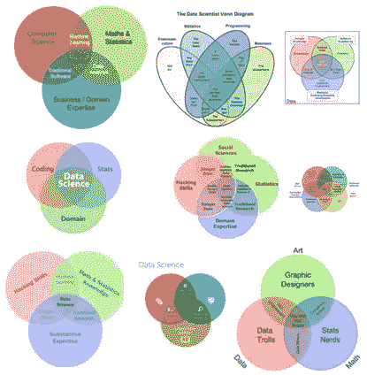
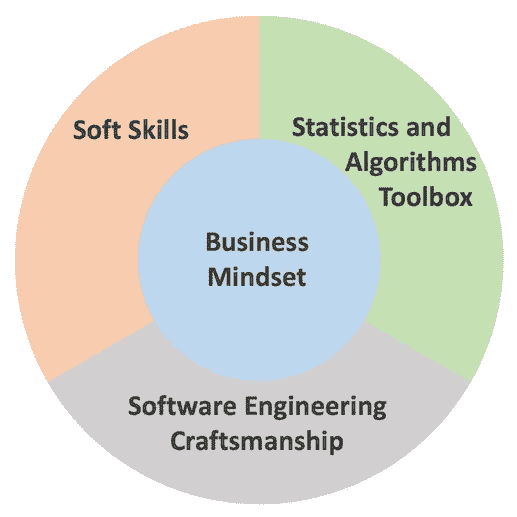

# 第三波数据科学家

> 原文：<https://towardsdatascience.com/the-third-wave-data-scientist-1421df7433c9?source=collection_archive---------3----------------------->

## 数据科学技能组合的更新

# 介绍

[Drew Conway 的数据科学技能集可视化](http://drewconway.com/zia/2013/3/26/the-data-science-venn-diagram)是一个经常被引用的经典。不同的观点和角色的多样性催生了[众多的变化](http://www.prooffreader.com/2016/09/battle-of-data-science-venn-diagrams.html):

Various data science Venn diagrams. Image courtesy of Google Images. Source: [https://sinews.siam.org/Details-Page/a-timely-focus-on-data-science](https://sinews.siam.org/Details-Page/a-timely-focus-on-data-science)

在数据科学技能集上似乎没有共识。此外，随着该领域的发展，缺点变得明显，新的挑战出现。我们该如何描述这种进化？

第一波**数据科学家**出现在数据变大之前，在数据科学成为现实之前(2010 年之前):统计学家和分析师一直都在，做着许多现代数据科学家正在做的事情，但伴随着较少的宣传。

**第二波**:大规模的数据收集创造了对聪明头脑的需求，这些聪明头脑能够施展魔法，将所有这些大数据变成大钱。公司仍在考虑雇佣什么样的人，通常会求助于理科毕业生。虽然第二波数据科学家做得很对，但他们精心制作的模型往往以概念证明告终，未能带来实际变化。

现在，在 2010 年代末，在围绕深度学习和人工智能的大肆宣传中，进入了第三波数据科学家**:实验和创新，有效地寻找商业价值和弥合部署差距，以创建伟大的数据产品。这里需要哪些技能？**

The skill portfolio of the third wave data scientist.

# 1.商业思维

业务思维是数据科学技能集的核心，因为它设定目标并应用其他技能来实现目标。Patrick McKenzie 在这篇[博客文章](https://www.kalzumeus.com/2011/10/28/dont-call-yourself-a-programmer/)中指出:

> **工程师是被雇佣来创造商业价值的，而不是用来编程的**:企业总是出于非理性和政治原因做事[……]，但总的来说，他们都致力于增加收入或降低成本。

同样，**数据科学家被雇佣来创造商业价值**，而不仅仅是建立模型。问问自己:**我的工作成果会如何影响公司的决策？**我要怎么做才能让这种效果最大化？凭借这种企业家精神，第三次浪潮数据科学家不仅产生**可操作的见解**，还寻求它们带来**真正的改变**。

**观察组织中的资金流向**—成本或收入最高的部门可能会提供最高的财务杠杆。然而，业务价值是一个模糊的概念:它超出了当前财年的成本和收入。**试验**和**创造创新的数据文化**将增加公司的长期竞争力。

**分清主次**你的工作和**知道什么时候停止**是**效率的关键。考虑收益递减:为了 0.2%的精确度，花费数周时间来调整一个模型值得吗？很多时候， ***足够好*才是真正的完美**。**

构成康威技能组合三分之一的领域专长绝不是可以忽视的——然而，你几乎在任何地方都不得不在工作中学习它。这包括你所在行业的知识，以及所有的公司流程、命名方案和特性。这些知识不仅为您的工作设定了框架条件，而且对于理解和解释您的数据也是不可或缺的。

## 简单点，笨蛋

注意容易摘到的果子和快速赢得的东西。对现有数据仓库的简单 SQL 查询可能会产生产品经理或高管不知道的有价值的见解。**不要陷入做“流行词驱动的数据科学”的陷阱**，专注于最先进的深度学习，其中一个漂亮简单的回归模型就足够了——而且构建、实施和维护的工作要少得多。**知道复杂的事情，但不要把事情过分复杂化。**

# 2.软件工程工艺

(第二波)数据科学家只需要“黑客技术”而不需要适当的软件工程的观念已经被反复批判。缺乏可读性、模块化或版本化会阻碍协作、可复制性和生产。

相反，向合适的软件工程师学习技术。测试你的代码并使用版本控制。遵循既定的编码风格(如 PEP8)，学习如何使用 IDE(如 PyCharm)。试试结对编程。模块化并记录你的代码，使用有意义的变量名并重构，重构，重构。

弥合数据产品敏捷原型的部署差距:学习使用日志和监控工具。知道如何构建一个 REST API(例如使用 Flask)来将你的结果提供给其他人。了解如何在 Docker 容器中运输您的作品，或者将其部署到 Heroku 这样的平台上。与其让你的模型在你的笔记本电脑上腐烂，不如将它们包装成数据驱动的服务，与你公司的 it 环境紧密结合。

# 3.统计和算法工具箱

数据科学家必须彻底理解统计学中的**基本概念，特别是**机器学习**(STEM 大学教育可能是获得这一基础的最佳方式)。关于什么是重要的，有大量的资源，所以我不打算在这里深入探讨。你经常需要向你的客户解释算法或概念，比如统计不确定性，或者因为相关性和因果关系之间的混淆而对某个观点发出警告。**

# 4.软技能

由于人际技能与技术技能对生产力同样重要，第三次浪潮数据科学家有意识地努力在这些领域进行改进。

## 与他人合作愉快

咨询你的同龄人——大多数人都很乐意提供帮助或建议。**平等对待他人**:你可能有一个很好的学位，了解复杂的算法，但别人有你没有的经验(这听起来像是基本的社交建议，但谁没遇到过傲慢的 IT 专业人士呢？).

## 了解你的客户

**问正确的后续问题。如果客户或你的老板想让你计算一些关键数字或制作一些图表，问“为什么？为什么你想达到什么目的？你会采取什么行动，取决于结果？”为了**更好的理解问题的核心**。然后想出如何一起到达那里——有没有比提议的方法更好的方法来达到这个目标？**

## 驾驭公司政治

**人脉**，不是因为你期望别人在事业上对你有利，而是因为你是一个平易近人的人。**和工作话题相似的人联系**。如果你的公司没有这样的平台，那就创建它们。确定关键利益相关者并找出**如何帮助他们**解决问题。尽早邀请他人，让他们成为变革过程的一部分。记住:一家公司不是一个理性的实体，而是一群通常不理性的人的集合。

## 传达您的结果

提升你的**视觉化和表达技巧**。从**客户的角度进行沟通**:我如何准确回答他们的问题？学会**不同层次的沟通**总结工作细节。人们很容易被花哨的多维图所吸引，但通常一个简单的条形图会更有效地传达一个信息。**展示你的成果:**当人们看到你在做什么，看到你做得很好，他们就会**信任**你。

## 评估你自己

**交流你的目标**和问题**并积极寻求建议**。在数据科学社区内外寻找**榜样**并向他们学习。

你错过什么了吗？完全不同意？请在评论中分享你的观点！