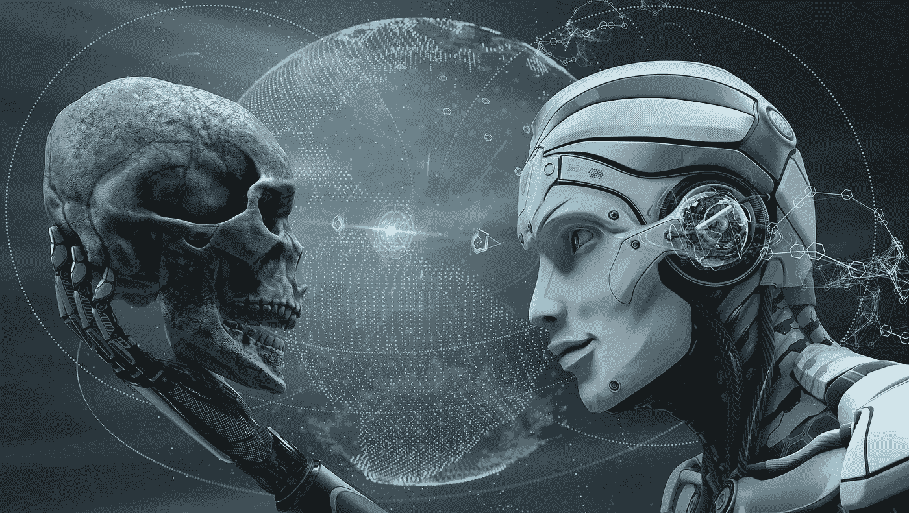

# 人工智能的威胁

> 原文：<https://towardsdatascience.com/the-threats-of-artificial-intelligence-9dd719cd1138?source=collection_archive---------10----------------------->

在我之前的故事中，我谈到了我们如何[创造互联网来构建人工智能](https://medium.com/@pasarella/create-the-internet-to-build-a-i-b79587b8c2f5) (AI)，无论是有意还是巧合。尽管如此，这个游乐场是未来机器人和当前人工智能算法观察人类行为并从中学习的完美场所。虽然这个地方在数据方面是海量的，但它不是学习和变得更好的唯一途径，无论是对人类还是我们正在创造的机器人。这种类型的学习可以被称为逆转，基于这样的原则，即从业者，他或她正在执行的领域的专家，正在 100%完美地完成工作，而“学生”或人工智能正在学习步骤，并相信从业者正在做的是执行特定任务的最佳方式。如果从业者犯了错误，就不会被注意到。

人工智能是一个复杂的领域，由于我们可能没有预见到的许多不可预测的因素，它容易被错误地实现或创建。通常，这是因为人工智能看起来很容易实现，或者结果看起来是正确的，正如我们所预期的那样。然而，我们必须避免作出这样的假设。

> 当我谈论人工智能时，它可以指一些物理的东西——机器人——或者一些不太物理的东西——代码。最后两者走到了一起。因为代码需要可以承载它的东西。

# 停止按钮

我们知道，互联网在学习曲线和理解人脑方面非常有益。今天，有几种人工智能实现可以在它们自己的小世界中执行单一任务。例如，一个国际象棋人工智能可能很难打败，但让它驾驶汽车是不可能的。它只是缺乏关于汽车或道路如何运作的知识。它的专业知识只涉及棋盘上的棋子，每个棋子可能的走法，以及它们潜在的结果。然而，人工智能的圣杯不是如何让象棋 AI 变得更好，而是我们如何创造出一个‘通用 AI’，它与我们——人类——拥有相同的参数。

当致力于创造一个尽可能接近人类的通用人工智能时，我们应该加入一些机制，使人工智能能够以符合人类兴趣和愿望的方式行事。例如，如果我们请求一个机器人泡茶，无论如何它都会优先完成任务。即使机器人在去厨房的路上遇到一个婴儿在地板上爬行，它也会继续朝着厨房的方向前进，手头的任务才是最重要的。我们可以添加一个停止按钮来防止这种悲惨的情况，但机器人不会允许你按下按钮，因为它的目标是完成任务并获得奖励，这是在给你泡茶。

为了解决这个问题，我们需要建立额外的机制，将人类安全和福祉置于完成任务之上。这些机制可以包括传感器，用于检测机器人路径上的物体或生物，并提示机器人停止或改变路线。我们还可以设计人工智能，让它把人类生命看得比什么都重要，并赋予它一种道德观念来指导它的行动。通过引入这样的机制，我们可以确保人工智能以有益于人类的方式行事，并将人类安全置于任务完成之上。

# 威胁 1:参数

在创造一个设备、机器人、甚至一个人来执行一项工作之前，我们使用参数，这些参数定义了操作给定任务的规则或条件。一切都是基于一个大函数运行的，这个大函数在系统启动时自动运行。函数可以互相扩展，传递参数，比如数字、文本，甚至其他函数。这些参数对于函数返回的结果至关重要。函数越小，代码就越少，从而更容易调试和预测所有可能的情况。一旦我们构建了一个函数框架，事情就会变得更加复杂，一个错误的参数就可能破坏代码，导致错误的任务被执行，或者导致无限循环。

因此，输入是至关重要的，在执行代码之前，我们必须考虑所有可能的结果。在停止按钮的情况下，如果我们没有编码婴儿穿越机器人路径的可能性和婴儿在任务范围内的重要性，机器人就不会理解我们为什么要尝试按停止按钮。相反，它会试图阻止我们这样做，因为完成任务是它的优先事项。

# 威胁 2:学习

学习对人工智能的威胁听起来像是一个悖论，但事实并非如此。受控学习是我们应该鼓励的，但这不会阻止其他阶段的学习。一旦功能变得复杂，就很难调试和考虑每一种可能情况。数据量太大，无法控制。我们知道我们对它投入了什么，但不确定它将额外学到什么，或者它将如何影响未来的学习。和学历比较一下。你试图教你的孩子重要的生活必需品，但是沿着这条路，你不能控制学习过程中的每一步。孩子一长大，就能更好地控制自己的决定、兴趣和学习。

对人工智能来说也是一样，我们知道我们对它投入了什么，但是一旦它变得更聪明，我们就会失去控制。我们可以尝试说服人工智能，就像我们对待自己的同类——其他人类一样。但我们也无法预测结果，就像我们第一次用人工智能做咖啡机时一样，只有一个简单的任务。

# 威胁 3:范围

范围是代码——人工智能——运行的范围。范围内的代码不能进入父范围，而父范围可以干扰其子范围。这听起来是很好的安全做法，但是如果没有父作用域，或者一个作用域可以进入具有相同访问级别的其他作用域，该怎么办呢？或者，如果我们构建访问点来连接具有多个访问级别的作用域，允许它执行某种所需的数据传输或控制，会怎么样？

一个作用域可能是完全密封的，但是当一个父作用域出现裂缝时，所有的安全措施都会受到威胁。让我们用一个囚犯的例子。范围是监狱，屏障是墙。假设监狱的墙壁牢不可破，这种情况可能会永远持续下去。但是，在监狱范围内，有监狱看守，他们有家长的权利和特权，但也存在于监狱范围内。和一个狱警的小失败，比如腐败行为，所谓的封闭范围就破了。

> 在沙盒里玩，什么都不会洒出来，这是一种错觉。

相信安全封闭范围的危险在于，我们不会注意到数据混合，或者可能为时已晚。我们将失去控制，或者停止机制将不再工作。

# 威胁 4:神话

首先，什么是神话？这是一种对不存在的东西的信仰，它只存在于我们自己的头脑和想象中。虽然一个神话可能看起来像一个物理对象，因为它可以有属性，但这并不意味着它是真实的。

我们今天讨论的一些神话。意大利、美国(国家)
2。【宗教】伊斯兰教、基督教(T2 教)3。喜力，XS4ALL(公司)
4。
欧元、美元、比特币(货币)5。资本主义、共产主义(社会‘经济’体系)

一旦我们不再相信上述神话，它们的存在就会消失。一个国家有有形资产，宗教“有”资产，一个公司可以有办公室、汽车、电脑，钱可以印在纸上。一个社会和经济体系也会在历史上留下印记。很难相信一个国家是一个神话，就像我们在地图上看到的那样。但如果我们都不再相信某个特定的国家，它到底有什么价值？之所以很难理解清单上的上述项目都是神话，是因为它们意义重大。许多人相信它们，但要打破它们需要大量的怀疑。越多的人相信一个神话，就越难质疑它，就需要更激烈的革命来打破它。

神话和 AI 有什么关系？对此有两种想法。人工智能的物理存在可以用来维持或摧毁神话，这可能导致残酷的革命，因为大多数神话都有重大影响。第二，人工智能可以自己成长为一个神话，我相信它已经这样做了。人们认为，人类需要这种自我思考的网络，才能在进化的阶梯上迈出下一步。它正在成长为一种基于技术的信仰。

信仰等于神话，因为神话不是根据自然法则而存在的。对 AI 的信仰使它本身成为一个强大的神话，即使我们发现了 AI 创作中的缺陷，也很难将其推倒。唯一剩下的就是摧毁给予人工智能有形存在的有形资产。一旦我们达到这一点，人工智能将如此融入人类的日常生活，这将意味着人类很大一部分的毁灭，或者可能是我们自己的灭绝。

# 最后的威胁:学者

昨天，我在看一个关于未来科技的电视节目。最后，介绍了一组学者，他们给出了他们对人工智能的看法以及人工智能在未来会给我们带来什么。我注意到他们对观众提问的回答没有什么新意，没有什么突破性的内容，也没有什么接近于回答问题的内容。他们在自己划定的小范围内展示了一种商业驱动的观点。

一个学者需要经费，经费是对他们的选择和研究领域负责的，一个学者只能在自己的专长(知识)领域内工作。而这个领域无非是完整故事的一小部分。你可以把每个学者比作科学软件整体中的一个功能。当一个学者或一个团体将他们的发现应用到日常生活中时，他们永远无法真正理解他们对世界的毁灭性影响。

虽然科学像公式一样清晰——纯数学——但另一方面，学者是一种主观存在。在我上次参观荷兰设计周期间，我与许多新人工智能实现的伟大发明家进行了交谈。但他们所有人对使用或什么是可接受的有着如此多样、自私的观点，这本身就可能对世界和人工智能的创造构成威胁。

一项新发明可能令人兴奋，并有许多有价值的用例，但它也可能在你事先没有预见到的范围内造成巨大伤害。在你开始把你的新技术提供给世界使用之前，一个大得无法计算的运动场。不知道一个“AI 学者”会怎么处理这个问题。

# 如何阻止威胁？

人工智能是不可避免的，我们应该拥抱这项技术，帮助我们进入人类进化的下一个阶段。当数据量、功能和完整的软件作为一个整体太大时，很难计算未来会是什么样子。

13 年前我做的一个决定让我娶了现在的妻子，走上了职业道路，并写下了这个故事。我的兴趣可能会有所不同，或者我甚至可能不会使用 Medium 作为一个平台来传播我对人工智能的想法。也许我一开始就不会考虑这个话题。涉及我生活的因素将会是导致 AI 在未来成为什么样的相同因素。这些因素是威胁，我在这篇文章中展示了这一点，但通过了解这一点，我们可以利用它们作为一个机会，让这些威胁共同发挥作用，并将人工智能推向有助于世界而不是伤害世界的方向。

**关于人工智能停止按钮问题的有趣阅读:**
[http://www.thegadgetsite.com/the-ai-stop-button-problem/](http://www.thegadgetsite.com/the-ai-stop-button-problem/)
[https://becoming human . ai/the-red-button-paradox-of-ai-AE 6533 caf 3 e 0](https://becominghuman.ai/the-red-button-paradox-of-ai-ae6533caf3e0)