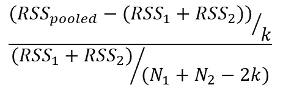
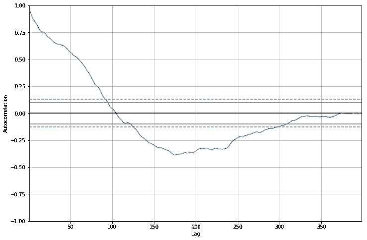

# 他们正在改变的时间序列:为什么所有好的模型最终都失败了

> 原文：<https://towardsdatascience.com/the-time-series-they-are-a-changing-why-all-good-models-eventually-fail-24a96a5f48d3?source=collection_archive---------14----------------------->

The natural logarithm of real oil prices and USD exchange rates indexed to January 2000

## 用 Chow 试验测试结构断裂

自从发表了这个故事，我已经把我的食物测试代码变成了一个包，可以在这里访问。

我写过一些关于预测[未来股票价格](/predicting-fang-stock-prices-ecac4ddd27c1)和[未来股票价格分布](/stock-price-prediction-intervals-using-monte-carlo-simulation-6b52b8ac9c27)的文章。我为我为这些文章建立的模型感到自豪，但它们最终不会比一只猴子向一块木板扔飞镖更有预测性。也许他们会表现得更差。

这将会发生，因为作为模型基础的系统将会改变。举一个极端的例子，一家我们试图模拟其股票的公司倒闭了。时间序列刚刚结束。举个更微妙的例子，我们来看看油价和美元汇率的关系。

我采用了从 1986 年 1 月到 2019 年 2 月的一篮子货币和石油价格(WTI)衡量的历史实际美元汇率，并将其指数化到 2000 年 1 月。然后，我对每个数据取自然对数(并进行通胀调整以获得实际油价)，因为如果我们对数据求差，这将给出实际增长率。

The natural logarithm of real oil prices and USD exchange rates indexed to January 2000

正如你所看到的，随着时间的推移，它们呈现出反比关系。一个上升，另一个下降。这是有道理的，因为当美国以外的人想要购买石油时，他们通常需要美元进行交易。油价上涨，他们需要兑换更多的本国货币来购买等量的石油。这反过来加强了美元，随着对美元需求的增加，汇率下降。(汇率为 1 意味着用 1 美元购买 1 单位的外币。如果是 2，买 1 单位外币需要 2 美元。如果是 0.5，1 美元买 2 单位的外币。).

但是，随着时间的推移，这种反比关系保持不变吗？相对于其他时间，是否有一个时期的运动与另一个时期的更大运动相对应？石油价格和美元汇率之间关系的这种变化可能有多种原因。例如，一个地区的重大货币危机可能会推高对相对安全的美元的需求，同时随着经济的疲软而减少对石油的需求。也许随着这些国家加入一个货币联盟，比如欧盟，一堆货币消失了，一个单一的主要货币形成了。

## 检测指定日期的可疑中断:食物测试

Chow 检验测试两个不同回归模型中的真实系数是否相等。无效假设是它们相等，另一个假设是它们不相等。另一种说法是，零假设是可能断点之前的模型与可能断点之后的模型相同。另一个假设是每个时期的模型是不同的。

它通过对下面的 Chow 统计数据执行 f 检验，对 k 和 N1+N2-2k 自由度进行正式测试。

Where RSS stands for residual sum of squares, k is the number of independent variables plus 1 for the constant, and N_i is the number of observations in the ith model.

每个周期中的模型(混合/全样本，1，2)必须具有均值为 0 的正态分布误差，以及独立的同分布误差，以满足高斯-马尔可夫假设。我用 python 从头开始实现了 Chow 测试，在文章的底部有一个代码链接。

1999 年 1 月引入欧元时，我使用了 Chow 检验来检验结构性断裂。这似乎是一个合理的可能的结构性突破。少数主要货币和一些次要货币消失了，欧元诞生了。欧元的诞生无疑是对外汇市场的一次重大冲击，或许也是对石油与美元关系的一次冲击。

将独立且同分布的残差要求翻译成英语，翻译成残差中没有序列相关性的恒定均值和方差。为了测试这一点，我测试了残差中的自相关性和异方差性。我对它们的增长率(自然对数的差异)做了同样的测试。我还绘制了残差并估计了它们的平均值。

自相关函数图强烈表明，简单 OLS 模型的残差具有很强的自相关性，而增长率 OLS 的残差不具有自相关性。

Auto-Correlation Function Plot for the OLS residuals on the full-sample period

Auto-Correlation Function Plot for the growth rate OLS residuals on the full-sample period

Breusch-Pagan 检验表明 OLS 模型中存在异方差。在 0.05 的显著性水平上，它也存在于增长率模型中，但没有那么严重。残差直方图显示了 OLS 模型残差的钟形曲线形状，查看增长率，其平均值约为 0。总之，增长率的 OLS 模型受到异方差的影响，并且在全样本期间存在非正态分布的误差。尽管如此，残差是均值为 0 的钟形，并且不是自相关的。在对前欧元时期和后欧元时期再次进行分析并获得令人满意的结果后，我继续进行我的分析。

Residuals from the growth rate OLS model on the full-sample period

Chow 试验得出的 p 值约为 0.0009。我们可以拒绝前欧元和后欧元模型相同的无效假设。

## 结束语

请记住，当使用时间序列模型来预测未来的系统可以改变。留意暗示基本面发生变化的信息，并定期测试结构性变化。还有一种在未知日期检测结构突变的方法。它值得自己的文章，所以我不会在这里覆盖它，但搜索“结构突变的残差累积和”了解更多。

预测愉快。

代码:[https://gist . github . com/JK clem/49aa 838585 a 8311 e 87 e 583 C3 e 322309 b](https://gist.github.com/jkclem/49aa838585a8311e87e583c3e322309b)