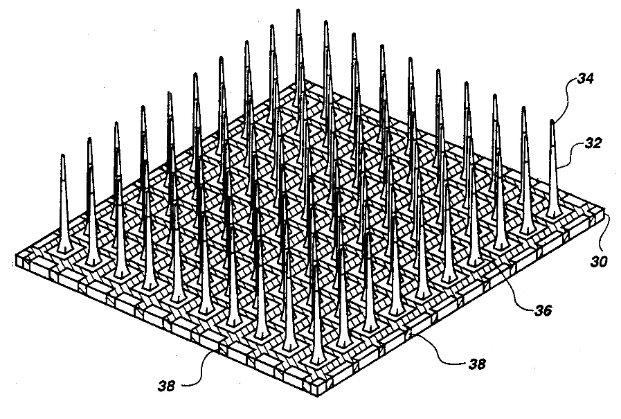
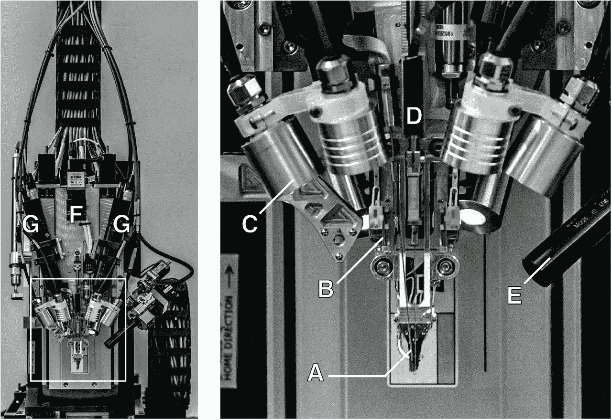
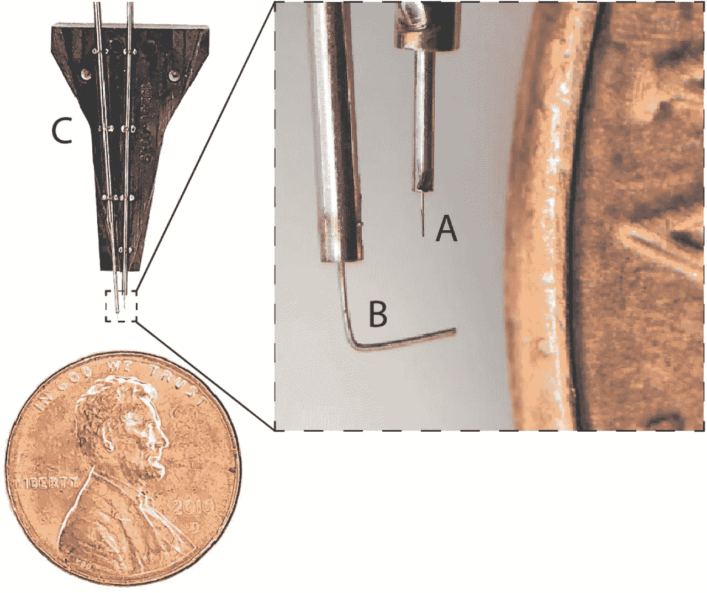
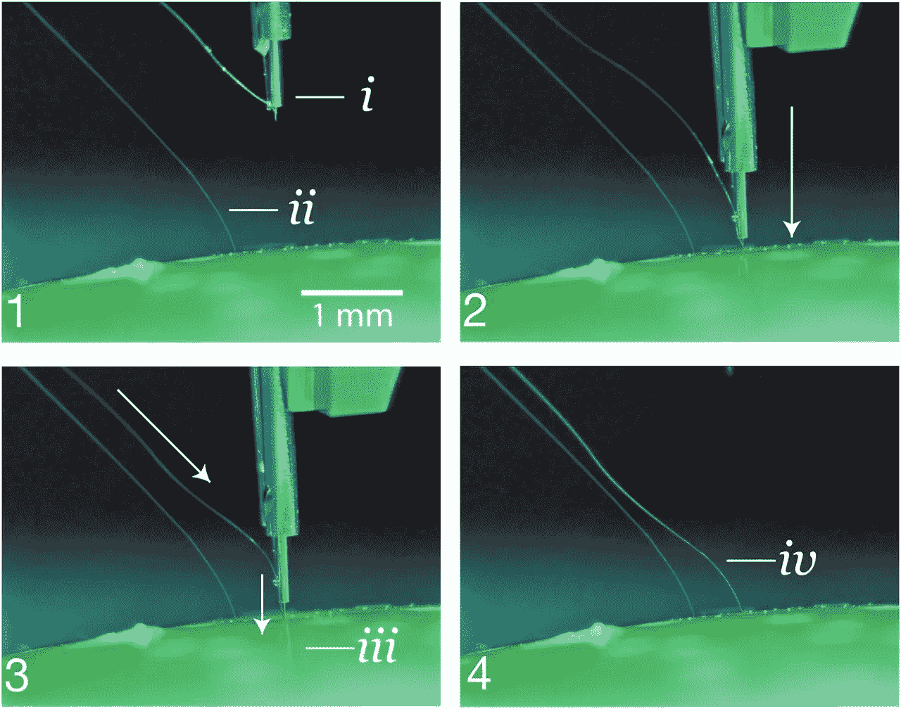
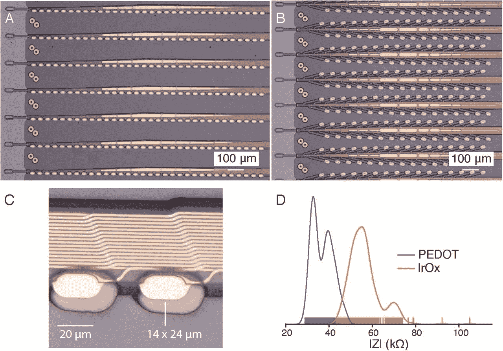
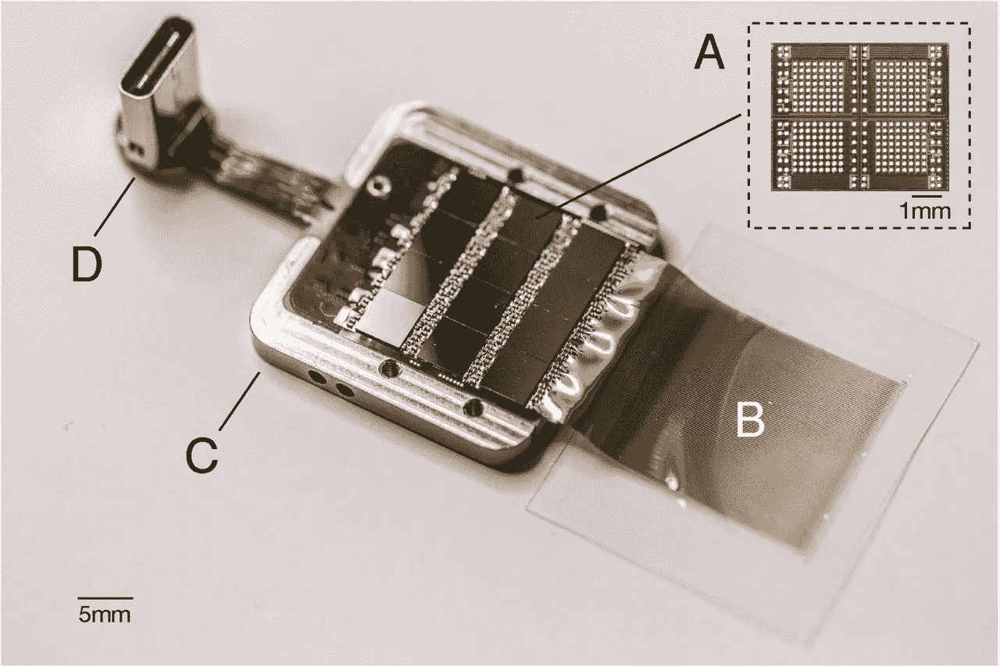

# TL；Neuralink 博士的首次新闻发布会

> 原文：<https://towardsdatascience.com/the-tl-dr-on-neuralinks-first-press-conference-11ba33b136f9?source=collection_archive---------23----------------------->

在这篇文章中，我将尝试涵盖公司的第一篇会议和研究论文中涉及的重要信息。

这是 Neuralink 大约两年前成立以来的第一次公开会议。到目前为止，人们对他们在脑机接口(BMIs)方面的进展知之甚少。

从长远来看，Neuralink 似乎将成为一种平台，比如应用程序商店，越来越多以身体质量指数为中心的技术将在这里随处可见。

从短期来看，他们已经取得了一些令人印象深刻的进步。如果你还没有看过，我强烈推荐你观看[直播](https://youtu.be/r-vbh3t7WVI)或者阅读[摘要](https://www.biorxiv.org/content/10.1101/703801v2)

以下是关键点:

# 首先回顾一下当前身体质量指数技术中的主要问题:

1。 **更高的精确度要求更具侵入性的技术。**

有能够处理来自大脑外部的神经元活动的 BMI，但是它们不是非常精确。迄今为止，即使是更精确的侵入性技术也受到了限制，因为它们只能取成千上万个动作电位的平均值，而不能记录大脑内部更深处的信号。

2。 **使用的材料不够坚固。**

BMI 使用[微电极](https://www.sciencedirect.com/topics/medicine-and-dentistry/microelectrode)作为金标准。例如，这是无处不在的犹他阵列的图像:

该阵列开发于 20 世纪 90 年代，只有 100 个电极，由贝莱德微系统公司制造。它一直是神经科学和临床研究中的关键设备，并获得 FDA 批准，具有最佳长期案例记录，时间为 [1000 天](https://iopscience.iop.org/article/10.1088/1741-2560/8/2/025027)。

对于长期 BMI，微电极阵列存在问题，因为:

*   它们由坚硬的金属或半导体组成。问题是，这种合金对于不同类型的大脑组织来说太硬了，导致免疫反应，限制了它们的功能和寿命。
*   它们的尺寸也太大了。这就限制了它们可以访问哪些神经元。

3。 **全无线电路是不可能的。**

用于这些设备的芯片不能用于大规模无线数据传输。

# 关于上述内容，Neuralink 取得了哪些进展:

1。 **一个专门的神经外科机器人**

这是 Neuralink 技术的一个核心部分。如上所述，虽然更柔韧的材料有利于到达大脑的不同部分，但这使得它们的植入很困难。

下面两张图片展示了机器人和大脑凝胶模型的植入过程。( **A)** 是两幅图像中的针头。

The robotic electrode inserter; enlarged view of the inserter-head shown in the inset. **A.** Loaded needle pincher cartridge. **B.**Low-force contact brain position sensor. **C.** Light modules with multiple independent wavelengths. **D.** Needle motor. **E.** One of four cameras focused on the needle during insertion. **F.** Camera with wide angle view of surgical field. **G.** Stereoscopic cameras.

Needle pincher cartridge (NPC) compared with a penny for scale. **A.** Needle. **B.** Pincher. **C.** Cartridge.

利用计算机视觉、立体摄像机和基于软件的单目扩展景深计算，机器人手臂的精确度令人难以置信，允许每个电极单独插入，而不是成阵列插入:

**1.** The inserter approaches the brain proxy with a thread. *i.* needle and cannula. *ii.* previously inserted thread. **2.** Inserter touches down on the brain proxy surface. **3**. Needle penetrates tissue proxy, advancing the thread to the desired depth. *iii.* inserting thread. **4.** Inserter pulls away, leaving the thread behind in the tissue proxy. *iv.* inserted thread.

这允许稳健的规划特征和在插入期间避免脉管系统的能力，这在以前是不可能的。

2。 **一种新型微电极“螺纹”**

由于聚合物探针设计和化学结构的改进，“线”可以瞄准大脑的特定部位。

下面是两种类型的探针( **A，B)** 的图像。它们相对于电极的表面积更有效地放大单个电极**(C)**，极大地提高了传输率( **D** )

Neuralink’s novel polymer probes. **A.** “Linear Edge” probes, with 32 electrode contacts spaced by 50 μm. **B.** “Tree” probes with 32 electrode contacts spaced by 75 μm. **C.** Increased magnification of individual electrodes for the thread design in panel A, emphasizing their small geometric surface area. **D.** Distribution of electrode impedances (measured at 1 kHz) for two surface treatments: PEDOT (*n* = 257) and IrOx (*n* = 588).

目前的版本使用了超过 1000 个电极，这比现有的任何产品都好一个数量级，但人类可用的版本应该有大约 10，000 个电极。每个电极产生大约 200 Mbps 的数据。

3。 **定制集成电路**

芯片设计的重大进步带来了 Neuralink 专用集成电路(ASIC ),它具有以下功能:

— 256 个独立可编程放大器(模拟像素)

—片内模数转换器(ADC)

这允许数据传输以 19.3 kHz、10 位分辨率进行采样，而整个芯片的功耗约为 6mW。下面是原型的照片:

A packaged sensor device. **A.** individual neural processing ASIC capable of processing 256 channels of data. This particular packaged device contains 12 of these chips for a total of 3,072 channels. **B.** Polymer threads on parylene-c substrate. **C.** Titanium enclosure (lid removed). **D.** Digital USB-C connector for power and data.

尽管仍处于原型阶段，无线版本将利用感应线圈，其中连接到线末端的芯片由电池/电子设备的组合供电，该电池/电子设备(1)感应传输功率，(2)计算传输的数据。

将会取得令人兴奋的新进展，首先是将其应用于四肢瘫痪者和那些患有瘫痪性神经疾病的人，如帕金森氏症和痴呆症，之后可以进行更广泛的应用，以利用电子设备合成神经元带宽。我们将看到 2020 年 FDA 批准后会发生什么！