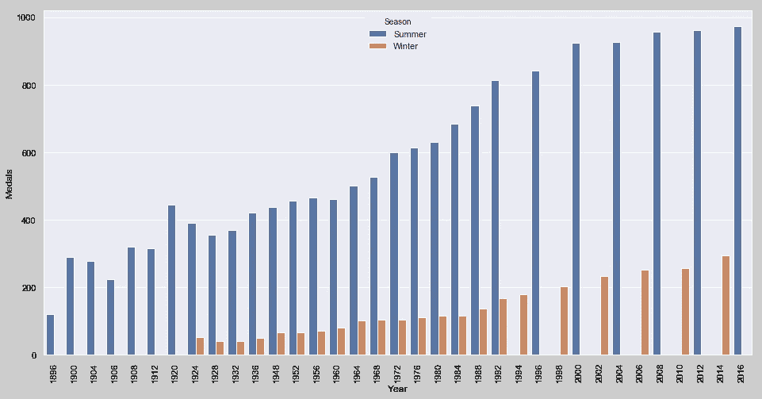
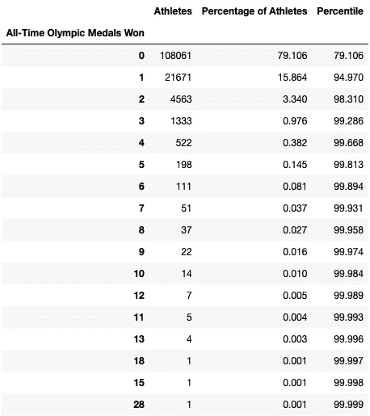
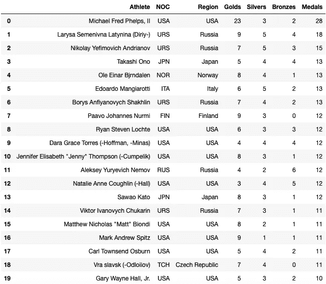
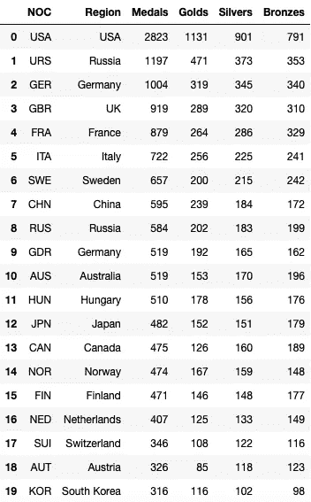
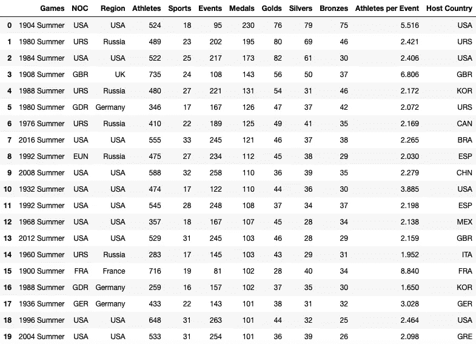
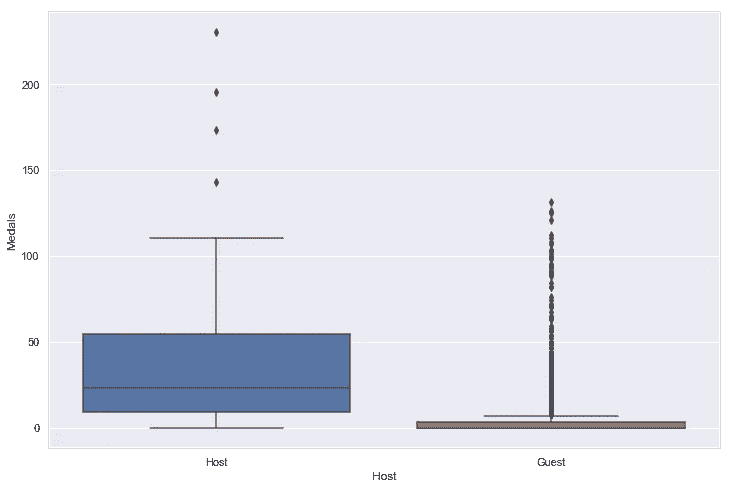
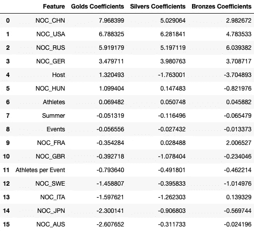
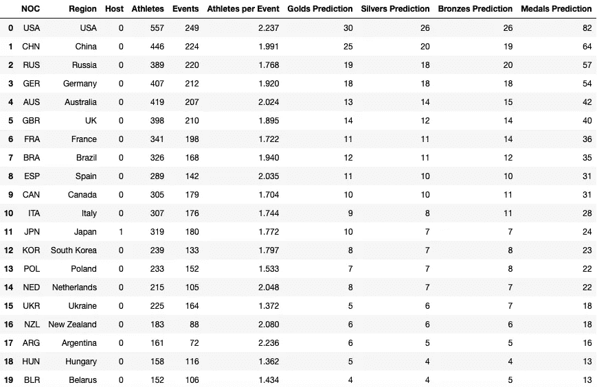

# 东京 2020 年奥运会冠军

> 原文：<https://towardsdatascience.com/the-tokyo-2020-olympic-champions-ad6bcc7fac72?source=collection_archive---------14----------------------->

## 回归建模

## 预测夏季奥运会奖牌榜

The Asahi Flame in Tokyo, Japan. Photo: Author

明年，2020 年 7 月 24 日，来自 206 个国家的 11091 名运动员将齐聚日本东京，参加第三十二届奥运会开幕式。他们将争夺 33 个项目 339 个项目的金牌、银牌和铜牌，以此来纪念现代奥运会的悠久传统。现代奥运会始于 1896 年的希腊雅典。

正如许多国际体育盛事一样，专业预测者和热情的粉丝喜欢预测奥运会的结果。国家奖牌榜是量化每个国家整体表现的常用指标，汇总了每个国家队运动员个人获得的金牌、银牌、铜牌和奖牌总数。

科罗拉多学院的经济学教授丹尼尔·约翰逊利用社会经济数据预测了 2000 年至 2008 年的全国奥运成绩。他的模型根据人均收入、人口、政治结构、气候、主场优势和地理邻近度，预测了 2008 年北京奥运会上每个国家的奖牌总数，准确率高达 94%。

2014 年索契奥运会的一个模型采用了经济贸易信息，即国家出口总值，以及地理数据，如土地面积和纬度。随后，2016 年里约奥运会以类似的国家信息为模型，包括国家财富的比较水平以及历届奥运会的历史表现。⁴

Randi Griffin 发布了一个完整的 Kaggle 数据集，其中包含了从 1896 年雅典奥运会到 2016 年里约奥运会的每个运动员和事件的记录。⁵有 271，116 条记录和 15 列，让我们建立自己的机器学习回归模型来预测东京 2020 年奥运会的奖牌榜，我们可以使用历史奥运记录来训练它！

# 奥林匹克运动会

我们的数据集包含每届奥运会的详细信息(*年*、*季*、*主办城市*)、每位运动员的身体特征(*性别*、*年龄*、*体重*、*身高*、团队识别(*国家奥委会*)以及每位运动员和每项赛事的结果(*体育项目*、*赛事*、【T20)让我们通过按国家汇总每届奥运会的个人运动记录来尝试可视化我们的数据集。

Historic national performance at the Olympic Games between 1896 and 2016\. Source: Author⁶

由于我们对预测每个国家在 2020 年东京奥运会上获得的奖牌总数感兴趣，因此每个国家队的规模(*运动员总数*)及其体育参与(*项目总数*)可能是重要的指标。我们也很容易看出夏季奥运会和冬季奥运会在奖牌可获得性上的差异。

Total medals awarded at the Summer and Winter Olympic Games between 1896 and 2016\. Image: Author

# 奥林匹克运动员

尽管 136，602 名运动员在 1896 年至 2016 年间参加了 271，116 次比赛，但 79%的人没有站在领奖台上就回家了。16%的运动员在他们的奥运生涯中赢得了一枚奖牌，而前 5%的运动员在多场比赛中获得奖牌。表现最好的人，在所有奥运冠军的第 99 个百分位数中，赢得了三枚或更多的奖牌。

Frequency distribution of all-time Olympic medals won by an individual athlete. Image: Author

以前的奥运会预测模型没有使用单个运动员的身体信息，因为它们与奖牌成绩的相关性很低。然而，像迈克尔·菲尔普斯这样的高水平运动员可以在一届奥运会上多次获得奖牌，这给他们的国家带来了优势。因此，让我们将每个事件的*名运动员视为我们模型中的一个交互特征。*

The top-20 Olympic medalists of all-time. Image: Author

# 奥林匹克国家

当我们按国家分组我们的个人运动记录时，我们看到美国以 2823 枚奖牌领先所有国家，比排名第 20 位的韩国多近 10 倍。我们可能会认为这些国家是离群值，将它们从我们的数据集中删除，以便我们的机器学习模型可以推广到看不见的数据，但我们也可以使用*国家*作为保留我们排行榜数据的特征。

The top-20 Olympic nations of all-time. Image: Author

我们可以按国家和年份对我们的数据集进行分组，按奖牌总数排序，找出有史以来表现最好的奥运队伍。前 20 名奥运代表队中有 15 支来自美国和俄罗斯。在只有 12 个国家参加的 1904 年奥运会上，美国独占鳌头，此后，1980 年的俄罗斯队和 1984 年的美国队在现代奥运会上获得了最多的奖牌。

美国领导 66 个国家抵制 1980 年奥运会，该届奥运会在冷战期间由莫斯科主办。作为报复，苏联领导 14 个国家抵制 1984 年洛杉矶奥运会。这些背靠背的奥运会展示了这些全球超级大国在决定奥运会奖牌榜结果方面的影响力。

值得注意的是，苏联解体后，俄国作为 EUN 和现在的 RUS(URS)参与了竞争。这也恰逢两年一度的夏季和冬季奥运会交错举行。既然我们意识到有重大的地缘政治变化和奥林匹克组织变化，让我们从 1992 年巴塞罗那奥运会开始限制我们回归模型的训练集。

The top-20 national teams of all-time at an individual Olympic Games. Image: Author

正如在以前的奥运会奖牌榜预测模型中观察到的那样，主办国在奥运会上的表现明显优于来访国。第 25 百分位数的主办国比第 75 百分位数的来访国赢得更多奖牌。此外，有史以来表现最好的四支球队都是主办国，所以让我们将*主办国*作为我们机器学习模型的一个特征。

The home-field advantage of host nation teams at the Olympic Games. Image: Author

# 奥运奖牌榜回归模型

既然我们已经确定了几个特征(*运动员*、*赛事*、*每项赛事运动员*、*夏季奥运会*、*异常国家*、*主办国*)用于预测一个国家在某届奥运会上的奖牌数，我们的数据需要为多元线性回归模型做准备。第一步是对国家进行虚拟编码，将它们转换成数字数据。

由于我们使用线性回归模型，我们决定将我们的训练数据限制在从 1992 年巴塞罗那奥运会开始的那些记录上，因为苏联解体之前的时代可能会有很大的不同。我们不需要缩放我们的特征，因为我们的目标变量的敏感性将被合并到特征的系数中。

我们希望我们的机器学习模型能够推广到东京 2020 年奥运会，因此我们应该将我们的数据记录分为训练集和测试集，以进行模型验证。这通常通过 80 比 20 的随机分割来执行，但我们也可以执行基于时间的分割。让我们用 1913 个团队记录中的 207 个来测试 2016 年里约奥运会。

我们的目标变量是每届奥运会上每个国家的奖牌总数，但是我们的数据集也包含金牌、银牌和铜牌的结果。因此，让我们创建三个回归模型来分别预测每种奖牌，而不是直接预测奖牌总数。然后，我们可以将金牌、银牌和铜牌相加，得出奖牌总数。

让我们把我们的特色国家限制在有史以来表现最好的 10 个国家以及 2020 年东京奥运会的主办国日本。我们现在可以训练三个回归模型中的每一个，获得可以由每个特征项的系数表示的方程。最后，我们可以使用我们训练的模型来预测以前看不到的数据的奖牌数。

Coefficient terms of the trained regression models for gold, silver and bronze medals. Image: Author

# 2016 年里约奥运会的模型验证

我们可以通过预测 2016 年里约奥运会的奖牌总数来评估我们的回归模型的性能，这是我们的坚持测试集。然后，我们的预测可以与真实情况相比较，真实情况是每个国家的实际奖牌数。一个完美的线性回归模型将被图形化地表示为一条 45 度角的直线。

Medal table prediction of the Rio 2016 Olympic Games. Source: Author⁷

我们创建训练和测试集，以平衡机器学习模型中偏差和方差之间的权衡。我们可以通过比较模型对训练集和测试集的方差的解释程度来测试我们的模型是过拟合还是欠拟合。类似地，基于我们预测的残差，我们期望两个数据集之间的误差水平是可比较的。

我们的回归模型的决定系数，或 R 平方，对于我们的训练集是 85%，对于我们的测试集是 82%。使用均方根误差(RMSE)计算的我们模型的误差是，对于我们的训练集，每个国家的奖牌总数为 4.43 块，对于我们的测试集，每个国家的奖牌总数为 5.44 块。因此，我们的回归模型是平衡的，解释了我们的数据，并显示低误差！

# 2020 年东京奥运会奖牌榜预测

为了使用我们的回归模型来预测东京 2020 年奥运会的奖牌榜，我们首先需要更新我们的模型特征的参数。我们可以把日本定为主办国，同时把季节定为夏季。每个国家的运动员和项目总数可以通过将北京 2008 年奥运会、伦敦 2012 年奥运会和里约 2016 年奥运会平均计算出来。

对 2020 年东京奥运会奖牌榜的预测已经被 published,⁸化了，因此我们可以将我们模型的输出与专业预测进行比较。公布的模型预测前六名的国家队是美国、中国、日本、俄罗斯、澳大利亚和英国。除了东道主日本，我们的模型预测的是同样的顶级国家队！

Medal table prediction of the top 20 national teams of the Tokyo 2020 Olympic Games. Image: Author

为这种分析编写的源代码可在 GitHub,⁹上获得，其中包括特征工程、探索性数据分析和机器学习模型，以预测单个奥运会的奖牌榜。我们可以通过进一步探索和扩充数据集以及试验新功能来不断改进我们的回归模型。

# 参考

1.  2020 年东京奥运会，[2019 年 https://tokyo2020.org/en](https://tokyo2020.org/en)。
2.  “预测奖牌的人”，*福布斯*，2010 年 1 月 19 日。
3.  J.斯特罗姆贝里，“统计模型能准确预测奥运会奖牌数吗？，“*史密森尼杂志*，2014 年 2 月 5 日。
4.  A.斯旺森，“如何在奥运会开始前预测奥运会结果”，*《华盛顿邮报》*，2016 年 7 月 22 日。
5.  R.格里芬，《120 年奥运史:运动员与成绩》，载于 Kaggle，[https://www . ka ggle . com/hee soo 37/120 年奥运史-运动员与成绩](https://www.kaggle.com/heesoo37/120-years-of-olympic-history-athletes-and-results)，2018。
6.  A.C. Dick，《奥运会历史奖牌榜》，Plotly，[https://chart-studio . plot ly . com/~ Adam . c . Dick/14/historical-metal-Table-of-the-Olympic-Games](https://chart-studio.plotly.com/~adam.c.dick/14/historic-medal-table-of-the-olympic-games)，2019。
7.  A.C. Dick，“里约 2016 夏季奥运会奖牌榜”，载于 Plotly，[https://chart-studio . plot ly . com/~ Adam . c . Dick/16/Medal-Table-of-the-Rio-2016-Summer-Olympic-Games](https://chart-studio.plotly.com/~adam.c.dick/16/medal-table-of-the-rio-2016-summer-olympic-games)，2019。
8.  “2020 年奥运会:美国预测奖牌榜第一，英国和澳大利亚第五”，*《卫报》*，2019 年 7 月 23 日。
9.  A.C. Dick，“东京 2020 年奥运会冠军”，GitHub，https://github.com/acdick/tokyo_2020_olympic_champions，2019。