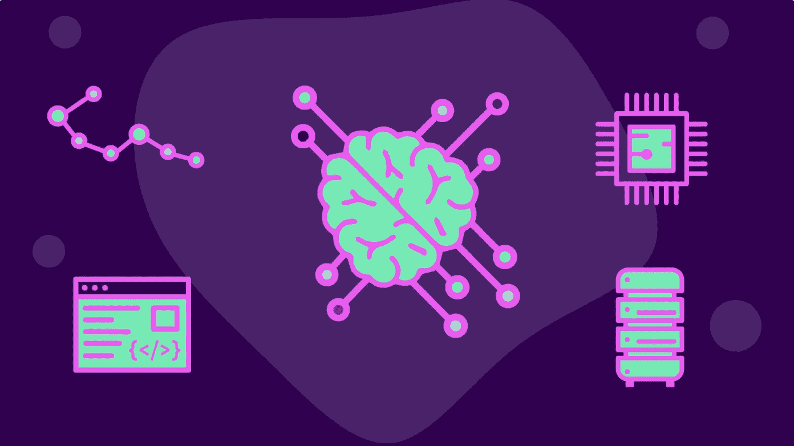
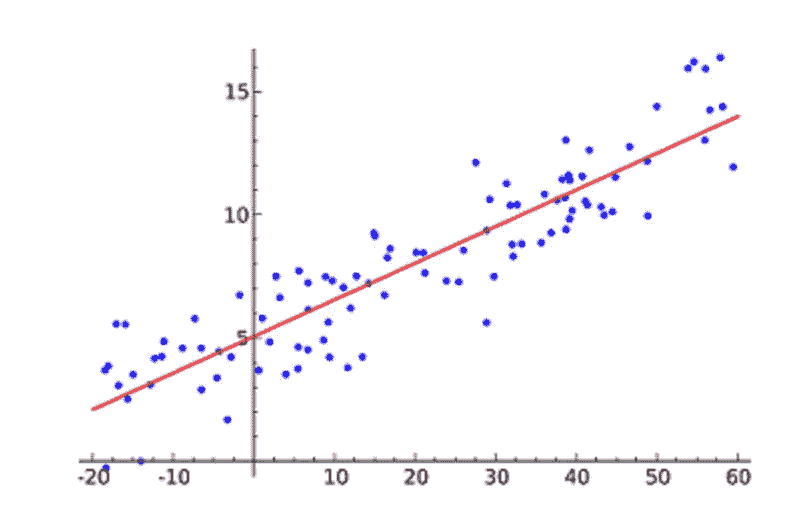
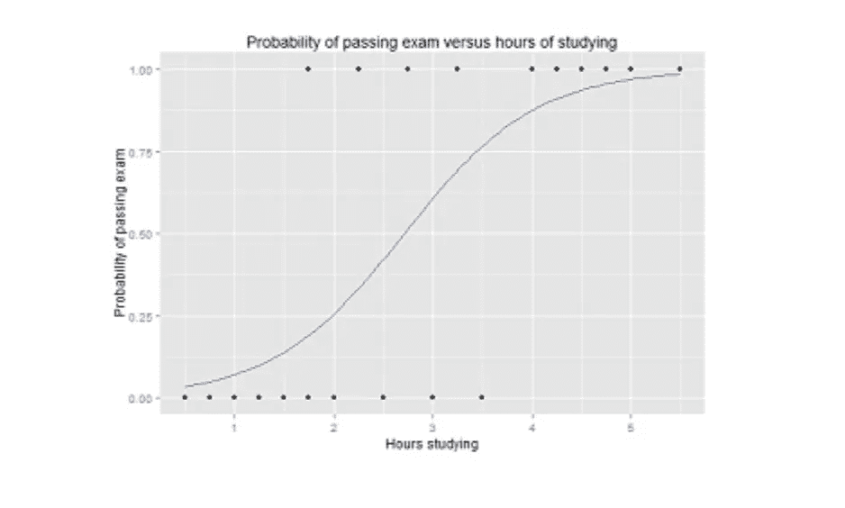
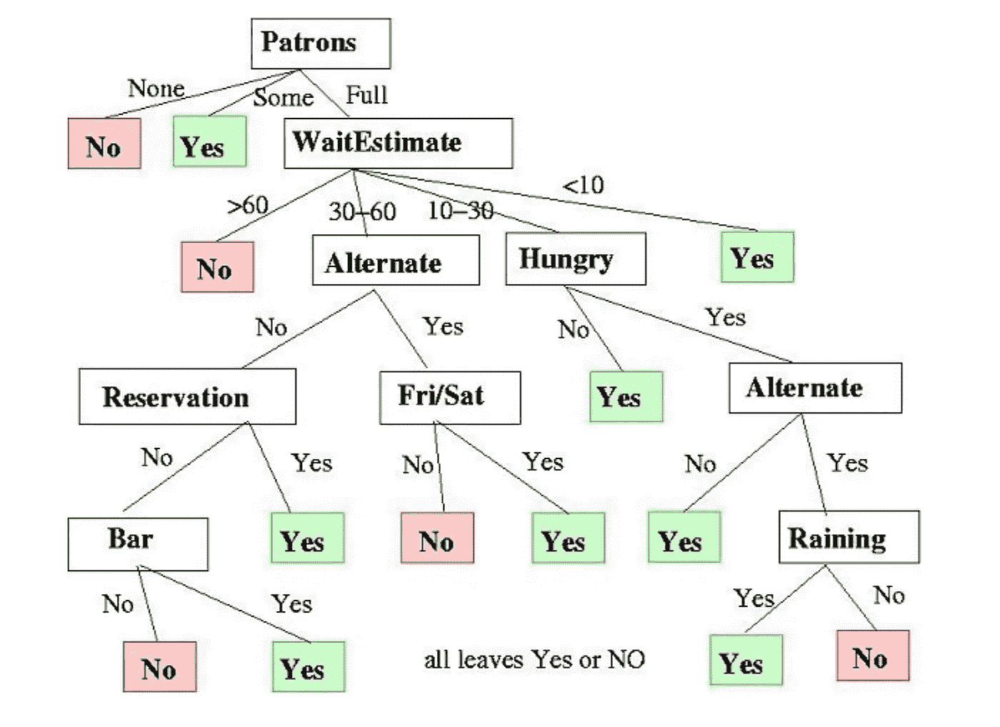
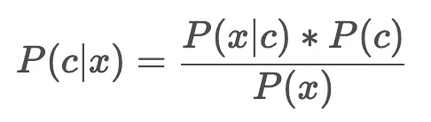
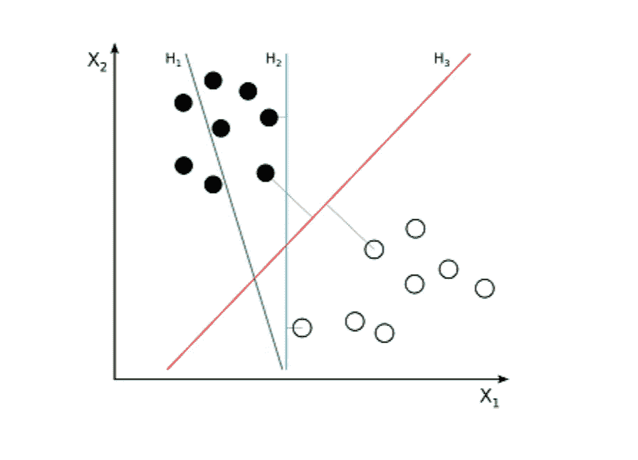
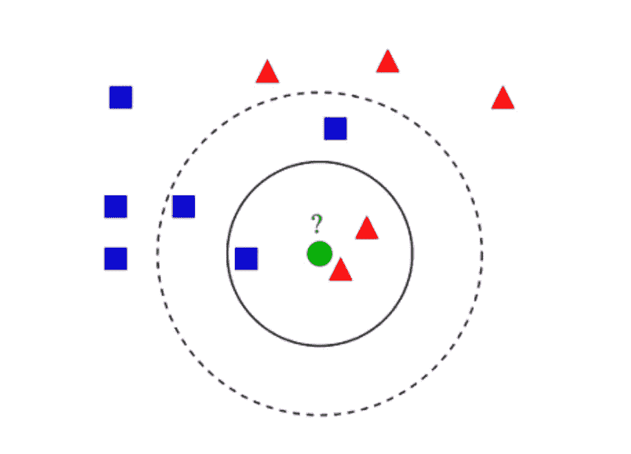
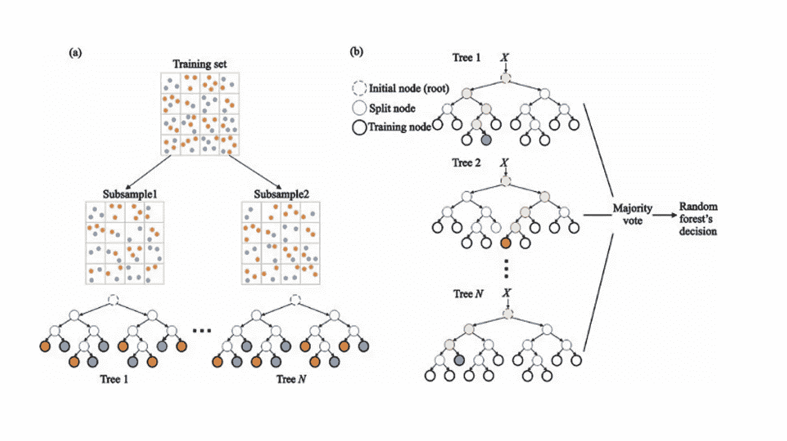
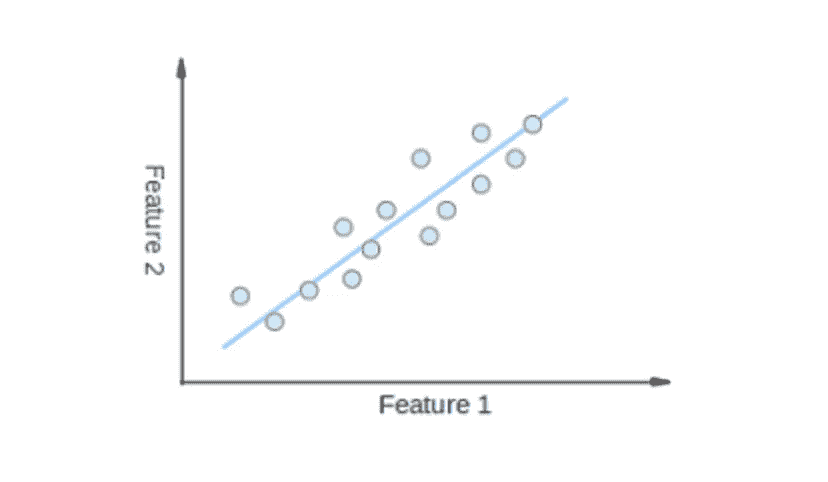
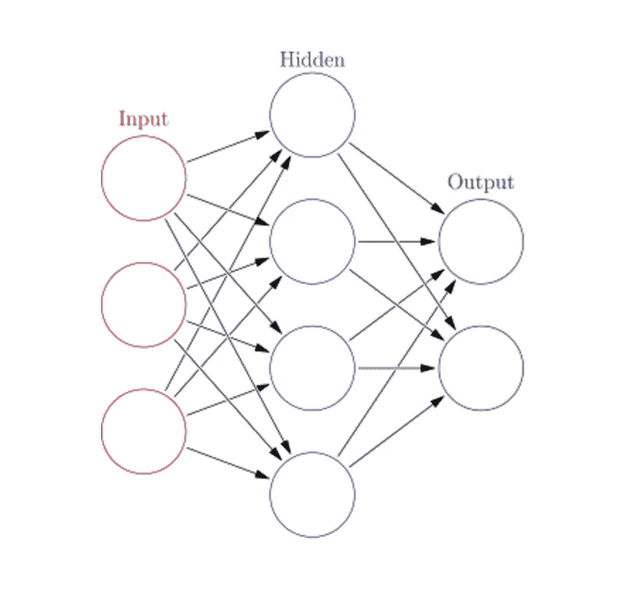

# 5 分钟内数据科学的 10 大 ML 算法

> 原文：<https://towardsdatascience.com/the-top-10-ml-algorithms-for-data-science-in-5-minutes-4ffbed9c8672?source=collection_archive---------35----------------------->

## 数据科学家最流行的机器学习算法介绍。

机器学习是业界一个创新的重要领域。我们为 ML 程序选择的算法类型根据我们想要实现的目标而变化。

有相当多的算法，所以对初学者来说可能会很难。今天，我们将简要介绍 10 种最受欢迎的学习算法，以便您可以轻松应对令人兴奋的机器学习世界！

**让我们开始吧！**

# 1.线性回归

线性回归很可能是*最流行的 ML 算法。线性回归找出最适合图表上分散数据点的直线。它试图通过拟合直线方程来表示自变量(x 值)和数值结果(y 值)之间的关系。这条线可以用来预测未来的值！*

*该算法最流行的技术是*最小二乘*。此方法计算最佳拟合直线，使直线上每个数据点的垂直距离最小。总距离是所有数据点的垂直距离(绿线)的平方和。想法是通过最小化这个平方误差或距离来拟合模型。*

**

*Ex. of simple linear regression, which has one independent variable (x-axis) and a dependent variable (y-axis)*

# *2.逻辑回归*

*逻辑回归类似于线性回归，但它用于输出为二进制的情况(即当结果只有两个可能值时)。这个最终输出的预测将是一个称为`logistic function, g()`的非线性 S 形函数。*

*该逻辑函数将中间结果值映射到具有范围从 0 到 1 的值的结果变量 Y 中。这些值可以解释为 y 出现的概率。S 形逻辑函数的属性使逻辑回归更适合分类任务。*

**

*Graph of a logistic regression curve showing probability of passing an exam versus hours studying*

# *3.决策树*

*决策树可用于回归和分类任务。*

*在该算法中，训练模型通过学习具有树表示的决策规则来学习预测目标变量的值。树由具有相应属性的节点组成。*

*在每一个节点，我们根据可用的特性询问一个关于数据的问题。左右分支代表可能的答案。最终节点，叶节点，对应于预测值。*

*每个特性的重要性是通过自顶向下的方法确定的。节点越高，其属性越重要。*

**

*An example decision tree that decides whether or not to wait at a restaurant*

# *4.朴素贝叶斯*

*朴素贝叶斯基于贝叶斯定理。它测量每个类别的概率，每个类别的条件概率给出 x 的值。该算法用于分类问题，以达到二元*是/否*结果。看看下面的等式。*

**

*   *p(c | x)= c 类事件的概率，给定预测变量 x，*
*   *p(x | c)= x 给定 c 的概率，*
*   *P(c) =类的概率，*
*   *P(x) =预测值的概率。*

*朴素贝叶斯分类器是一种用于过滤垃圾邮件的流行统计技术！*

# *5.支持向量机(SVM)*

*SVM 是一种用于分类问题的监督算法。SVM 试图在数据点之间画出两条最大间距的线。为此，我们将数据项绘制为 n 维空间中的点，其中 n 是输入要素的数量。在此基础上，SVM 找到了一个最佳边界，称为*超平面*，它通过分类标签最好地分离了可能的输出。*

*超平面和最近的类点之间的距离被称为*边缘*。*最优超平面*具有最大的余量，用于对点进行分类，以最大化最近数据点和两个类之间的距离。*

**

*Example where H1 does not separate the two classes. H2 does, but only with a small margin. H3 separates them with the maximal margin.*

# *6.k-最近邻(KNN)*

*KNN 算法非常简单。KNN 通过在整个训练集中搜索 k 个最相似的实例，即 k 个邻居，并将公共输出变量分配给所有这 k 个实例，来对对象进行分类。*

*k 的选择很关键:小的值会导致大量的噪声和不准确的结果，而大的值是不可行的。它最常用于分类，但对回归问题也很有用。*

*用于评估实例之间相似性的距离函数可以是欧几里德距离、曼哈顿距离或闵可夫斯基距离。欧几里德距离是两点之间的普通直线距离。它实际上是点坐标差的平方和的平方根。*

**

*Example of KNN classification*

# *7.k 均值*

*K-means 是通过对数据集进行分类来进行聚类。例如，该算法可用于根据购买历史将用户分组。它在数据集中找到 K 个聚类。K-Means 是用于无监督学习的，所以我们只使用训练数据 X 和我们想要识别的聚类数 K。*

*该算法基于它们的特征迭代地将每个数据点分配给 K 个组中的一个。它为每个 K 聚类挑选 K 个点，称为质心。基于相似性，新的数据点被添加到具有最近质心的聚类中。这个过程一直持续到质心停止变化。*

**

*Image credit: Wikipedia*

# *8.随机森林*

*随机森林是一种非常流行的集成 ML 算法。这种算法的基本思想是，多数人的意见比个人的意见更准确。在随机森林中，我们使用决策树的集合(见#3)。*

*为了对一个新对象进行分类，我们从每个决策树中选取一种投票，结合结果，并基于多数投票做出最终决定。*

**

*(a) In the training process, each decision tree is built based on a bootstrap sample of the training set. (b) In the classification process, decision for the input instance is based on the majority vote.*

# *9.降维*

*由于我们今天可以捕获的数据量巨大，机器学习问题变得更加复杂。这意味着训练极其缓慢，并且更难找到好的解决方案。这个问题通常被称为**维数灾难。***

*降维试图通过将特定的特征组合成更高层次的特征而不丢失最重要的信息来解决这个问题。主成分分析(PCA)是最流行的降维技术。*

*PCA 通过将数据集挤压到低维线或超平面/子空间上来降低数据集的维度。这尽可能多地保留了原始数据的显著特征。*

**

*Example where it is possible to achieve dimensionality reduction by approximating all the data points to a single line.*

# *10.人工神经网络*

*ANN 可以处理大型复杂的 ML 任务。神经网络本质上是一组互连的层，具有被称为*神经元*的加权边缘和节点。在输入和输出层之间，我们可以插入多个隐藏层。ANN 使用了两个隐藏层。除此之外，我们正在处理深度学习。*

*ANN 的工作原理类似于大脑的架构。一组神经元被分配一个随机权重，该权重决定神经元如何处理输入数据。通过对输入数据训练神经网络来学习输入和输出之间的关系。在训练阶段，系统可以获得正确的答案。*

*如果网络不能准确识别输入，系统会调整权重。经过充分的训练后，它会始终如一地识别正确的模式。*

**

*Each circular node represents an artificial neuron and an arrow represents a connection from the output of one artificial neuron to the input of another.*

# *下一步是什么？*

*现在你已经有了最流行的机器学习算法的基础介绍。您已经准备好学习更复杂的概念，甚至通过深入的实践来实现它们。如果你想知道如何实现这些算法，可以看看 Educative 的 [**探索数据科学**](https://www.educative.io/courses/grokking-data-science) 课程，该课程将这些令人兴奋的理论应用于清晰的现实世界中。*

**快乐学习！**

*更多阅读材料/学习材料:*

*   *[成为机器学习工程师](https://www.educative.io/m/become-a-machine-learning-engineer)*
*   *[机器学习 101 &数据科学:来自行业专家的提示](https://www.educative.io/blog/machine-learning-for-data-science)*
*   *[如何赢得下一次 ML 面试](https://www.educative.io/blog/ml-interview)*
*   *[如何用 Azure 机器学习部署机器学习模型](https://www.educative.io/blog/how-to-deploy-your-machine-learning-model)*
*   *[如何以及为什么成为机器学习工程师](https://www.educative.io/blog/how-and-why-to-become-a-machine-learning-engineer)*
*   *[软件工程师机器学习的实用方法](https://www.educative.io/blog/the-practical-approach-to-machine-learning-for-software-engineers)*
*   *[b/w 行业深度学习与大学课程的脱节](https://www.educative.io/blog/ml-industry-university)*
*   *[我在谷歌和微软从事 ML 工作的经历](https://www.educative.io/blog/ml-microsoft-and-google)*