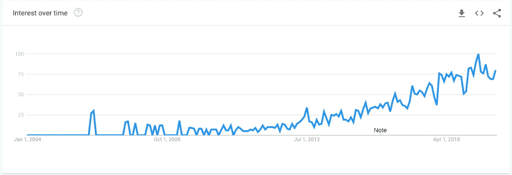

# 成功成为营销数据分析师的前三步

> 原文：<https://towardsdatascience.com/the-top-3-steps-for-a-successful-start-as-a-performance-marketing-data-analyst-f93412b6e940?source=collection_archive---------21----------------------->

Photo by [Stephen Dawson](https://unsplash.com/@srd844?utm_source=medium&utm_medium=referral) on [Unsplash](https://unsplash.com?utm_source=medium&utm_medium=referral)

## 在这篇文章中，我将介绍一些步骤，我发现这些步骤对想在营销分析领域发展的人来说非常有用。尽管这些要点以列表的形式呈现，但它们应该几乎同时执行。

# **1。了解你的同事和他们的期望**

通常，作为一名营销数据分析师，你将与营销经理合作进行付费广告。事实上，你必须为他们工作。他们的所有报告、仪表板和/或分析都将依赖于您。你的目标是以洞察的形式为他们带来价值，自动化他们的报告流程等。他们如何定义有价值的东西，这是你必须研究的话题。

然而，数据分析和营销分析(也称为数字营销分析)领域相对较新。

Source: [https://trends.google.com/trends/explore?date=all&q=Digital%20marketing%20analyst](https://trends.google.com/trends/explore?date=all&q=Digital%20marketing%20analyst)

这可能是为什么有些人甚至公司对营销数据分析师应该做什么有不同理解的原因之一。因此，我强烈建议您与所有利益相关方预约单独会议，并尝试回答其中一些问题:

*   对他们来说最重要的是什么？
*   他们如何定义成功？
*   他们的日常挑战是什么？
*   他们期望你解决什么问题？

这些问题越详细越好。当然，你也没必要只聊工作相关的话题。你应该利用这个机会更好地了解对方，最后但同样重要的是玩得开心。

# 2.**学习你需要的软件**

可能的情况是，公司使用的一些工具不是你所熟悉或了解的。此外，由于营销渠道的性质，一些营销经理喜欢不同的工具是绝对正常的。这并没有错。不要因为工具种类繁多而感到压力。

尝试识别团队正在使用的所有工具，如果没有关于它们的可用文档，您甚至可以开始创建一个。这肯定会帮助您更好地理解为什么有些工具比其他工具更受欢迎，您应该使用或避免哪些工具。以下是一些最常用的工具:

*   **数据归因工具:** [调整](https://www.adjust.com/)， [Firebase](https://firebase.google.com/) ，[谷歌分析](https://analytics.google.com/analytics/web/)，[脸书分析](https://analytics.facebook.com/)
*   **数据聚合工具:** [Supermetrics](https://supermetrics.com/) ，[漏斗. io](https://funnel.io/) ，[细分](https://segment.com/)
*   **数据探索工具:** [Tableau Prep](https://www.tableau.com/products/prep) ， [DataGrip](https://www.jetbrains.com/datagrip/) ， [DBeaver](https://dbeaver.io/)
*   **数据可视化工具:** [Tableau Desktop](https://www.tableau.com/products/desktop) ， [Google Data Studio](https://datastudio.google.com/) ， [Qlik](https://www.qlik.com/)

根据你以前的经验、公司规模和行业，你可能会处于一个不得不在这些工具之间周旋的位置。如果您缺乏使用某些工具的经验，您可以查看他们的内部学习资源(视频、文档、课程等)。它们很容易找到，而且大部分时间都是免费的，绝对够用。

# 3.开始挖掘数据

这可能是最有趣的一步。至少对我来说是这样。然而，我不鼓励你在没有任何目标的情况下随意探索数据库或浏览文档*(如果有的话)*。事实上，最好是向你的经理或其他团队成员要求一项简单的任务。这可以是创建报告、仪表板，甚至是执行分析/比较。例如，您可以尝试回答一个简单的问题，如-关于特定渠道或渠道组，2019 年 6 月的主要 KPI 表现如何？

这将有助于您理解数据架构的基础知识，引发其他问题，识别潜在的低挂果实和您可以工作的未来项目。弄清楚一些事情，比如:

*   数据实际上是从哪里来的，如何来的？
*   不同渠道的跟踪效果如何？
*   是否应用了定制的归因模型？如果是，是否适用于所有渠道？

应该为您提供在您加入的任何公司中作为绩效营销数据分析师成功起步所需的知识。

# 加分点:积极主动，多走一步

Photo by [Bruno Nascimento](https://unsplash.com/@bruno_nascimento?utm_source=medium&utm_medium=referral) on [Unsplash](https://unsplash.com?utm_source=medium&utm_medium=referral)

我一直想确定的一件事是，我不会根据不正确的数据向我的团队提供不正确的见解。在许多大中型公司中，营销数据管理被委托给另一个团队。例如，这个团队可以隶属于 CMO *(首席营销官)*或首席技术官*(首席技术官)*。每个公司都有自己的侧重点，都有不同的挑战。所以，因为 X，Y 或者 Z 而依赖无效数据并不能让你成为一个好的营销分析师。

因此，我更愿意多走一步，尝试一下跟踪/聚合/数据管理的后端流程，以便:

*   了解数据的准确性和一致性；
*   扩大我的专业领域；
*   能够在发生数据事件时找到解决方法。

> 如果你觉得这篇文章有用，你不同意其中的一些观点，有问题或建议，请不要犹豫，在下面给我留言。
> 
> 非常感谢您的反馈！
> 
> **LinkedIn:** [圭纳科夫](https://www.linkedin.com/in/kyunakov/)

*本文仅在*[towardsdatascience.com](https://towardsdatascience.com/)有售