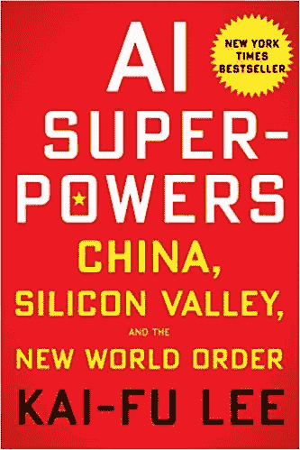
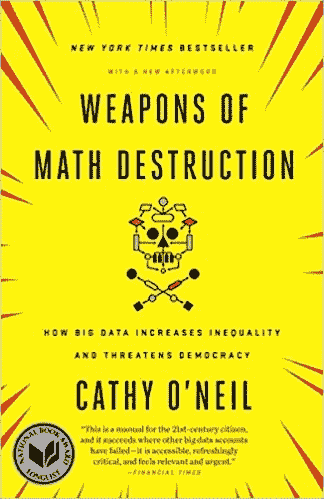
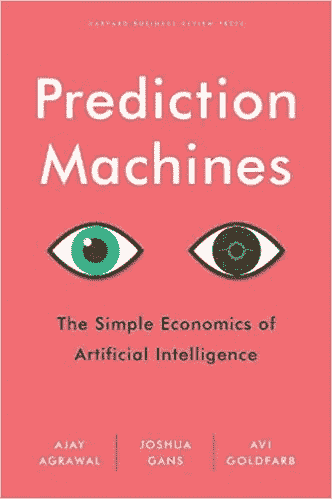

# 2020 年顶级人工智能书籍

> 原文：<https://towardsdatascience.com/the-top-ai-books-in-2019-3fa48fe5bc41?source=collection_archive---------9----------------------->

虽然人工智能(AI)在历史上一直局限于电影类型的科幻部分，但它最近开始在现实世界中加速发展。2018 年，[风投向人工智能初创公司](https://www.bloomberg.com/news/articles/2019-01-08/vcs-plowed-a-record-9-3-billion-into-ai-startups-last-year)注入了 93 亿美元，与前一年相比，资金增加了 72%。世界上最有价值的初创公司商汤科技(SenseTime)在成立三年后让[扭亏为盈](https://fortune.com/2018/04/09/sensetime-alibaba-ai-startup-600-million/)，这三年的年均收入增长率为 400%。

然而，随着这种爆炸式的增长，跟上人工智能领域的创新似乎令人生畏。在花了一个夏天的时间阅读了几篇文献后，我列出了三本顶尖的人工智能书籍，它们可以为你提供关于该行业的全面视角，它的发展方向以及它将产生的影响。这些书中包含的信息之所以有价值，是因为它们不只是解释什么是人工智能，而是从不同的角度为你提供关于世界技术轨迹的更一般的知识(即使是在人工智能之外)。

这三本书是李开复的 [*人工智能超能力*](https://www.amazon.com/gp/product/132854639X/ref=as_li_tl?ie=UTF8&camp=1789&creative=9325&creativeASIN=132854639X&linkCode=as2&tag=kennymuli-20&linkId=d2622eb2b0e72bce5f077049b14d55cb) 、凯茜·奥尼尔的 [*数学毁灭武器*](https://www.amazon.com/gp/product/0553418831/ref=as_li_tl?ie=UTF8&camp=1789&creative=9325&creativeASIN=0553418831&linkCode=as2&tag=kennymuli-20&linkId=4d9b963c0b158d9cfd3a548c16509f7d) 以及阿贾·阿格拉瓦尔、约书亚·甘斯和阿维·戈德法布的*预测机器*。下面，我列出了每本书，提供了为什么它们应该在你的阅读清单上的理由，并且给出了三个相关的引用来说明理由。

# [AI 超能力](https://www.amazon.com/gp/product/132854639X/ref=as_li_tl?ie=UTF8&camp=1789&creative=9325&creativeASIN=132854639X&linkCode=as2&tag=kennymuli-20&linkId=d2622eb2b0e72bce5f077049b14d55cb)李开复

Source: [Amazon](https://www.amazon.com/gp/product/132854639X/ref=as_li_tl?ie=UTF8&camp=1789&creative=9325&creativeASIN=132854639X&linkCode=as2&tag=kennymuli-20&linkId=d2622eb2b0e72bce5f077049b14d55cb)

《人工智能的超能力》是目前人工智能行业事实上的书，作者是该领域的资深人士李开复。它让你看到了美国和中国这两个无可争议的世界巨人之间的人工智能竞赛。

这本书的独特之处在于，它让你一窥发生在中国的人工智能创新。李开复花时间引导你了解中国企业家的心态和商业心态——这一视角不仅对理解人工智能创新，而且对整个国家的心态都很有价值。通过阅读这本书，你会对人工智能竞赛的另一半:中国有一个更清晰的了解。

## 三个令人难忘的人工智能超能力语录

> 几个世纪以来，人类通过工作来充实他们的日子:用他们的时间和汗水来换取住所和食物。我们已经围绕这种交流建立了根深蒂固的文化价值观，我们中的许多人已经习惯于从日常工作中获得自我价值感。人工智能的崛起将挑战这些价值观，并有可能在极短的时间内削弱这种生活目的感。
> 
> 中国公司首先是受市场驱动的。他们的最终目标是赚钱，他们愿意创造任何产品，采用任何模式，或者进入任何能够实现这一目标的行业。这种心态导致了商业模式和执行中难以置信的灵活性，这是硅谷经常称赞的“精益创业”模式的完美升华。
> 
> 随着人工智能渗透到更广泛的经济领域，这个时代将奖励优秀工程师的数量，而不是精英研究人员的质量。人工智能实施时代的真正经济实力不会仅仅来自少数推动研究边界的精英科学家。它将来自一群训练有素的企业家，将这些发现转化为改变游戏规则的公司。中国正在训练这样一支军队。

# [摧毁数学的武器](https://www.amazon.com/gp/product/0553418831/ref=as_li_tl?ie=UTF8&camp=1789&creative=9325&creativeASIN=0553418831&linkCode=as2&tag=kennymuli-20&linkId=4d9b963c0b158d9cfd3a548c16509f7d)凯西·奥尼尔

Source: [Amazon](https://www.amazon.com/gp/product/0553418831/ref=as_li_tl?ie=UTF8&camp=1789&creative=9325&creativeASIN=0553418831&linkCode=as2&tag=kennymuli-20&linkId=4d9b963c0b158d9cfd3a548c16509f7d)

人工智能席卷了整个世界，但很少有人停下来思考它可能带来的负面影响。这种负面影响的一个来源是它的人类创造者在算法层面上的局限性。

归根结底，人工智能是通过训练优化的代码产品。如果训练有问题(比如用于训练的数据的局限性)，那么结果可能会导致性别和种族偏见。这可能会导致失业，因为有缺陷的算法会对人们做出不公平的判断，这些算法不准确地低估了某些员工的价值(本书将详细探讨)。数学毁灭武器并不是 AI 特有的；相反，它专注于算法和数据，这是人工智能的核心。通过阅读这本书，你会更加关注你未来遇到的人工智能项目的潜在副作用。

## 《数学毁灭武器》中三句令人难忘的引言

> 推动数据经济的数学应用程序是基于易犯错误的人类所做的选择。毫无疑问，其中一些选择是出于好意。然而，这些模型中的许多将人类的偏见、误解和偏见编码到了日益管理我们生活的软件系统中。
> 
> …模型本质上是简化的。没有一个模型能够包含真实世界的所有复杂性或人类交流的细微差别。不可避免地，一些重要的信息被遗漏了…为了创建一个模型，然后，我们选择什么足够重要来包括…模型，尽管它们以公正著称，反映了目标和意识形态。当我排除了每餐都吃果酱馅饼的可能性时，我是在把我的意识形态强加给膳食模式。
> 
> 正如我们在累犯量刑模型和掠夺性贷款算法中看到的那样，穷人预计将永远是穷人，并受到相应的待遇——被剥夺机会，更频繁地被监禁，并被骗取服务和贷款。

# 《预测机器》,作者 Ajay Agrawal、Joshua Gans 和 Avi Goldfarb

Source: [Amazon](https://www.amazon.com/gp/product/1633695670/ref=as_li_tl?ie=UTF8&camp=1789&creative=9325&creativeASIN=1633695670&linkCode=as2&tag=kennymuli-20&linkId=eb541e0e00a8f8e3de4fb3f3397a73a3)

[预测机器](https://www.amazon.com/gp/product/1633695670/ref=as_li_tl?ie=UTF8&camp=1789&creative=9325&creativeASIN=1633695670&linkCode=as2&tag=kennymuli-20&linkId=eb541e0e00a8f8e3de4fb3f3397a73a3)补充了基本的经济理论来解释人工智能的好处，从而完善了另外两种解读。

虽然这听起来可能会让任何不精通经济学的人感到害怕，但作者在以脚踏实地的方式解释一切方面做得很好，用实际例子来证明他们认为人工智能可以在劳动力和我们周围的任何地方体现出来。

## 来自预测机器的三句令人难忘的名言

> 当某种基本商品的价格大幅下跌时，整个世界都会发生变化。想想光…在 19 世纪早期，同样数量的光的价格是现在的 400 倍…新的人工智能技术会让什么变得如此便宜？预测。因此，正如经济学告诉我们的，我们不仅将开始使用更多的预测，而且我们将看到它出现在令人惊讶的新地方。
> 
> 有时，人类和机器的结合会产生最好的预测，彼此互补对方的弱点。2016 年，哈佛/麻省理工学院的人工智能研究人员团队赢得了 Camelyon Grand Challenge，这是一项基于计算机从活检切片中检测转移性乳腺癌的竞赛。该团队获胜的深度学习算法的正确预测率为 92.5%，而人类病理学家的正确预测率为 96.6%。虽然这似乎是人类的胜利，但研究人员更进一步，将他们的算法和病理学家的预测结合起来。结果准确率达到了 99.5%。也就是说，人为错误率从 3.4%下降到 0.5%。错误下降了 85%。
> 
> 数据收集比以往任何时候都更便宜、更容易。这些数据是有价值的。数十亿次搜索意味着数十亿行数据，谷歌可以利用这些数据来改善服务。有人称数据为“新石油”。预测机器依赖于数据。更多更好的数据带来更好的预测。从经济学角度来说，数据是预测的重要补充。随着预测变得更便宜，它变得更有价值。

总的来说，这三本关于人工智能的顶级书籍(*人工智能超能力*、*数学毁灭武器*和*预测机器*)提供了一个关于如何思考人工智能的全面视角，以及在当今世界使用数据的一般方法。数据一直是强大的，但以前从未像今天这样被应用，对世界决策产生如此大的影响。

这三本书中的任何一本都足以让你深刻理解人工智能是如何应用的，因为它们都给出了很好的例子。每一本书都是由各自领域的专家撰写的，所以你将能够更深入地了解全球方法、潜在的负面影响和/或经济学，这取决于你决定挑选哪些顶级人工智能书籍。