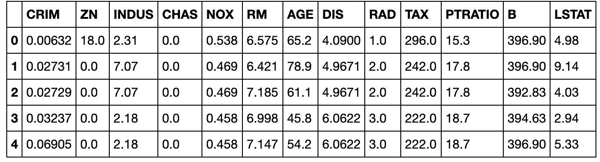
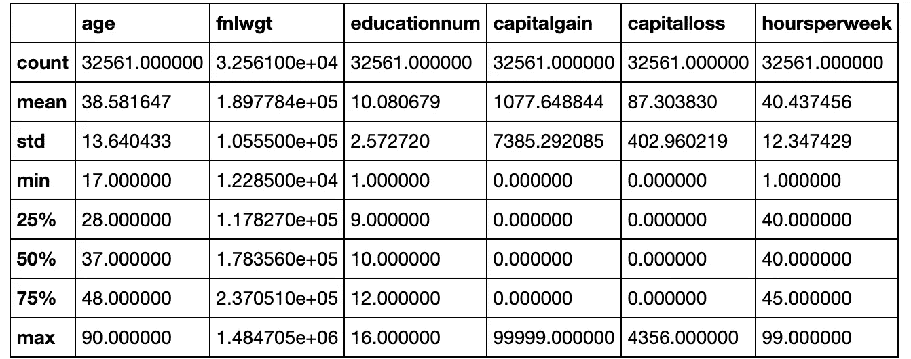
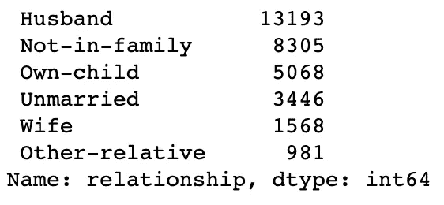
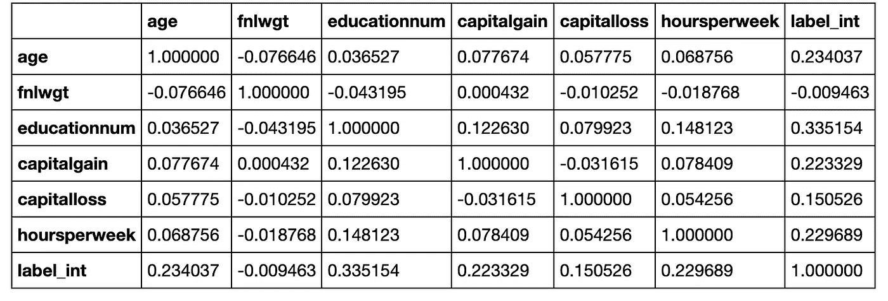
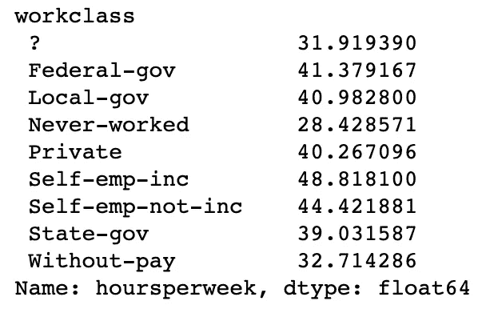

# 熊猫中最有用的五个命令

> 原文：<https://towardsdatascience.com/the-top-five-most-useful-commands-in-pandas-4390d4e165a5?source=collection_archive---------11----------------------->

## 我每天都在用


Photo by [Jason ZZ](https://unsplash.com/@fznn?utm_source=medium&utm_medium=referral) on [Unsplash](https://unsplash.com?utm_source=medium&utm_medium=referral)

您刚刚开始学习数据科学，您已经将数据放在一个数据框架中，**现在什么是**？

我很乐意向您介绍我在 Pandas 中使用最多的命令，以帮助您更快地发现数据中的见解。我假设你的代码中有一个名为 **df** 的数据帧。

# 头

每次我将数据读入 Pandas 时，我做的第一件事就是使用 head 命令查看前 5 行数据。这将产生类似于以下内容的输出:



你用 **df.head()** 运行这个命令。

我发现这非常有价值，因为它允许我检查数据是否被正确读入，查看我有哪些列，并快速了解各个列的值。这个命令的缺点是它不能很好地适应包含许多列的数据集。

# 形容

使用 head 命令后，我要使用的下一个命令是 describe。Describe 将给出所有数字列的平均值、标准偏差和各种百分位数。下面是一个输出示例:



就像 head 命令一样，用 **df.describe()** 运行这个命令。

这是了解所有数值数据分布的快速方法。这通常也会使任何严重的异常值或数据问题变得明显。例如，如果我们的最大年龄大于 125，那么我们就会知道我们有某种类型的数据问题。

# 值计数

因为 describe 只适用于数值数据，所以我通常使用 value_counts 命令来更好地理解分类列。如果有一个名为“relationship”的列，可以使用以下命令获得值计数:

```
df['relationship'].value_counts()
```

它会产生如下输出:



由此，我们可以看到我们的关系列的值的计数。我们有许多丈夫的亲戚，但很少有其他亲戚。这不仅有助于我们理智地检查我们的数据，而且有助于理解我们所拥有的数据。

# Corr

现在我对我的数据有了一个概念，我通常转向 corr 命令来理解我有什么相关性。在数据框中包含您试图预测的值尤其有用，这样您就可以看到潜在要素与标注之间的相关性。

当运行 **df.corr()** 时，您会得到数据帧中所有列之间的相关性，如下所示:



在上面的输出示例中，我们的标签是“label_int”我们可以看到“educationnum”是最正相关的变量，因此可能会成为一个很好的特征。另一方面，“Fnlwgt”与我们的标签几乎没有关联。

# 分组依据

最后，我倾向于发现使用 groupby 命令按组分割数据非常有用。例如，如果我想按工作类别查看每周平均工作时间，我可以运行以下命令:

```
train_df.groupby(['workclass'])['hoursperweek'].mean()
```

这将产生:



我们可以看到，“自我雇佣”组平均工作时间最长，而“从不工作”组工作时间最少。我不知道一个从未工作过的小组是如何工作的，但这是以后的讨论了。

# 去探索你的数据

我希望这篇文章已经帮助你理解了我最常用的熊猫指令，以及我为什么这么经常使用它们。如果你想了解更多关于这些命令或其他命令的信息，请务必查看熊猫的[文档](https://pandas.pydata.org/pandas-docs/stable/index.html)！

这篇文章也可以在[这里](https://learningwithdata.com/posts/tylerfolkman/the-top-five-most-useful-commands-in-pandas-4390d4e165a5/)找到。

**加入我的** [**邮箱列表**](https://mailchi.mp/86690f2e72bb/tyler_folkman) **保持联系。**