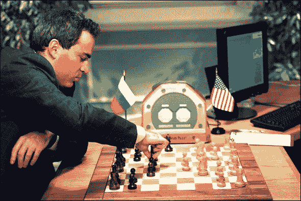
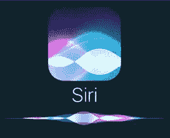

# 2019 年即将举行的顶级人工智能会议

> 原文：<https://towardsdatascience.com/the-top-upcoming-ai-conferences-in-2019-3c3eb6f4c515?source=collection_archive---------16----------------------->

> 想获得灵感？快来加入我的 [**超级行情快讯**](https://www.superquotes.co/?utm_source=mediumtech&utm_medium=web&utm_campaign=sharing) 。😎

# 通用机器学习和人工智能

## ICML——机器学习国际会议

**主题:**机器学习的所有领域，包括经典和最新的深度学习技术。主要是数学和理论概念

地点:美国长滩

**会议日期:**6 月 10 日至 15 日

**提交截止日期:**1 月 19 日

## 遗传和进化计算会议

**主题:**遗传编程、蚁群优化和群体智能

**地点:**捷克共和国布拉格

**会议日期:**7 月 13 日至 19 日

提交截止日期:2 月 6 日

## 学习理论会议

**主题:**学习算法:监督、半监督、非监督、优化、贝叶斯、博弈论、深度学习、强化学习

地点:美国凤凰城

会议日期:6 月 25 日至 28 日

提交截止日期:2 月 1 日

## AAAI——人工智能

**主题:**通用人工智能

**地点:**美国夏威夷

**会议日期:**1 月 27 日—2 月 1 日

**提交截止日期:**2018 年 9 月 5 日

# 计算机视觉

## CVPR —计算机视觉和模式识别

**主题:**图像和视频的分类、对象检测、场景分割、形状、纹理和其他视觉技术

地点:美国长滩

会议日期:6 月 16 日至 20 日

**提交截止日期:**2018 年 11 月 16 日

## ICCV——计算机视觉国际会议

**主题:**图像和视频的分类、对象检测、场景分割、形状、纹理和其他视觉技术——与 CVPR 非常相似，但国际化

**地点:**韩国首尔

**会议日期:**10 月 27 日—11 月 3 日

提交截止日期:4 月 22 日

## IROS——智能机器人和系统国际会议

**主题:**机器人学包括机器人设计、控制、导航、规划、网络、视觉和智能

**地点:**中国澳门

会议日期:11 月 3 日至 8 日

提交截止日期:3 月 1 日

## ICIP——图像处理国际会议

**主题:**图像处理，包括分析、增强、恢复、变换以及系统和多媒体应用

**地点:**台湾台北

**会议日期:**9 月 22 日至 25 日

提交截止日期:1 月 31 日

# 自然语言和言语

## 国际声学、语音和信号处理会议

**主题:**语音/音频处理、信号处理和自然语言处理

**地点:**英国布莱顿

**会议日期:**5 月 12 日至 17 日

**提交截止日期:**2018 年 10 月 29 日

## 计算语言学协会

**主题:**语言理解、机器翻译、语义和分析

**地点:**意大利佛罗伦萨

会议日期:8 月 28 日—9 月 2 日

提交截止日期:4 月 4 日

## EMNLP —自然语言处理中的经验方法

**主题:**语言理解、机器翻译、语义、分析，非常类似于 ACL

**地点:**中国香港

会议日期:11 月 3 日至 7 日

提交截止日期:5 月 21 日

# 喜欢学习？

在推特[上关注我，我会在这里发布所有最新最棒的人工智能、技术和科学！](https://twitter.com/GeorgeSeif94)