# 变形金刚:注意力是你所需要的

> 原文：<https://towardsdatascience.com/the-transformer-attention-is-all-you-need-322199721720?source=collection_archive---------20----------------------->

在撰写本文时(2019 年 8 月 14 日)，变压器论文“关注是你所需要的全部”是 Arxiv Sanity Preserver 的第一篇论文。这篇论文表明，单独使用注意机制，有可能在语言翻译方面取得最先进的成果。基于 Transformer 构建的后续模型(例如 [BERT](https://arxiv.org/abs/1810.04805) )在广泛的自然语言处理任务上取得了优异的性能。

在这篇文章中，我混合使用了自定义图形、从原始论文修改的图形、等式、表格和代码，以尽可能清晰地解释 Transformer。在本文结束时，您应该理解了 Transformer 模型的所有不同部分:

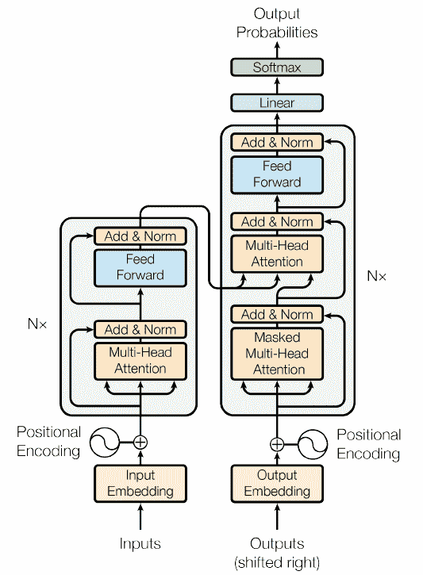

Figure 1 from the Transformer paper

## **论文**

[瓦斯瓦尼 A，沙泽尔 N，帕尔马 N，乌兹科雷特 J，琼斯 L，戈麦斯安，凯泽日，波洛舒欣 I .你需要的只是关注。NeurIPS 2017(第 5998–6008 页)。](https://arxiv.org/abs/1706.03762)

这篇文章中所有的引用都来自报纸。

## **代码**

对于 Transformer 模型的 Pytorch 实现，请参见[“带注释的 Transformer”](http://nlp.seas.harvard.edu/2018/04/03/attention.html)，这是一个 iPython 笔记本，其中包含 Transformer 纸质文本，并穿插有 Pytorch 工作代码。在这篇文章中，我将引用注释转换器中的代码，并详细解释代码的某些部分。

请注意，我们在这里讨论转换器各部分的顺序不同于原始论文或带注释的转换器中的顺序。在这里，我已经根据通过模型的数据流组织了所有内容，例如，从英语句子“我喜欢树”开始，通过 Transformer 处理到西班牙语翻译“Me gustan los arboles”

这里使用的超参数是变压器基本模型的超参数，如变压器论文表 3 中的摘录所示:

这些是在函数“make_model(src_vocab，tgt_vocab，N=6，d_model=512，d_ff = 2048，h=8，dropout=0.1)”的代码中使用的相同超参数

# 表示输入和输出

对于英语-西班牙语翻译，变换器的输入是英语句子(“我喜欢树”)，输出是该句子的西班牙语翻译(“Me gustan los arboles”)。

## **代表输入**

我们首先使用一个热点向量来表示输入句子的每个单词。独热向量是这样的向量，其中每个元素都是“零”，除了单个元素是“一”:

每个独热向量的长度由词汇的大小预先确定。如果我们想要表示 10，000 个不同的单词，我们需要使用长度为 10，000 的 one-hot 向量(这样我们就有一个唯一的槽来表示每个单词的“1”。)有关 one-hot vectors 的更多背景信息，请参见帖子[为神经网络准备表格数据(包含代码！)](https://glassboxmedicine.com/2019/06/01/everything-you-need-to-know-about-preparing-tabular-data-for-machine-learning-code-included/),“表示分类变量:一个热点向量”一节

## **词语嵌入**

我们不想给 Transformer 提供简单的一个热点向量，因为它们稀疏、庞大，并且没有告诉我们任何关于单词的特征。因此，我们学习“单词嵌入”,它是单词的较小的实值向量表示，携带关于单词的一些信息。我们可以使用[神经网络来实现。在 Pytorch 中嵌入](https://pytorch.org/docs/stable/_modules/torch/nn/modules/sparse.html#Embedding)，或者，更一般地说，通过将我们的独热向量乘以一个学习过的权重矩阵 w。

nn。嵌入由权重矩阵 W 组成，权重矩阵 W 将把独热向量转换成实值向量。权重矩阵具有形状(num _ embeddings，embedding_dim)。num_embeddings 就是词汇表的大小——词汇表中的每个单词都需要一个嵌入。embedding_dim 是您希望实值表示的大小；你可以选择任何你想要的值——3、64、256、512 等等。在变压器论文中，他们选择 512(超参数 d_model = 512)。

人参考 nn。作为“查找表”嵌入，因为您可以将权重矩阵想象成仅仅是单词的实值向量表示的堆栈:

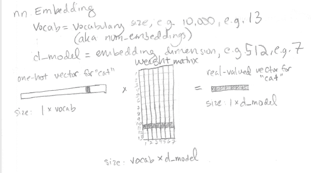

对付 Pytorch nn 有两个选择。嵌入权重矩阵。一种选择是用预先训练好的嵌入来初始化它，并保持固定，在这种情况下，它实际上只是一个查找表。另一种选择是随机初始化它，或者用预先训练好的嵌入来初始化，但是保持它是可训练的。在这种情况下，单词表示将在整个训练过程中得到改进和修改，因为权重矩阵将在整个训练过程中得到改进和修改。

转换器使用权重矩阵的随机初始化，并在训练期间改进这些权重，即它学习自己的单词嵌入。

在带注释的转换器中，单词“嵌入”是使用“嵌入”类创建的，而“嵌入”类又利用了 nn。嵌入:

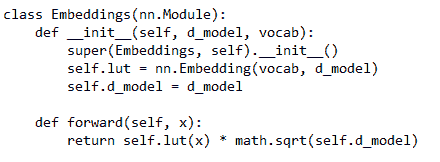

## **位置编码**

我们可以只输入句子中每个单词的单词嵌入，并以此作为我们的输入表示。然而，单词嵌入本身并不携带关于单词在句子中的相对顺序的任何信息:

*   “我喜欢树”和“树长大了”都包含“树”这个词
*   单词“trees”具有完全相同的单词嵌入，不管它是句子中的第三个单词还是第二个单词。

在 RNN 中，可以在任何地方对单词“trees”使用相同的向量，因为 RNN 按顺序处理输入的句子，一次一个单词。然而，在转换器中，输入句子中的所有单词都被同时处理——没有固有的“单词排序”,因此也没有固有的位置信息。

Transformer 的作者建议增加一个“位置编码”来解决这个问题。位置编码使得转换器可以使用关于单词顺序的信息。位置编码使用捕获排序信息的实值向量序列。句子中的每个单词根据其在句子中的位置用特定的位置编码向量相加:

“位置向量”到底是如何携带位置信息的？作者探索了创建位置编码向量的两种选择:

*   选项 1:学习位置编码向量(需要可训练的参数)，
*   选项 2:使用等式计算位置编码向量(不需要可训练的参数)

他们发现两个选项的性能相似，所以他们选择了后一个选项(计算)，因为它不需要参数，而且即使在训练期间看不到的句子长度上，也可能允许模型很好地工作。

这是他们用来计算位置编码的公式:

在这个等式中，

*   词性是单词在句子中的位置(例如，“2”代表句子中的第二个单词)
*   I 索引到嵌入维度，即它是沿着位置编码向量维度的位置。对于长度 d_model = 512 的位置编码向量，我们将 I 的范围设为从 1 到 512。

为什么要用正弦和余弦？引用作者的话，“位置编码的每个维度对应一个正弦曲线。[……]我们选择了这个函数，因为我们假设它可以让模型很容易地学习通过相对位置来参与。”

在[注释转换器](http://nlp.seas.harvard.edu/2018/04/03/attention.html)中，使用类“positional encoding”创建位置编码并将其添加到单词嵌入中:

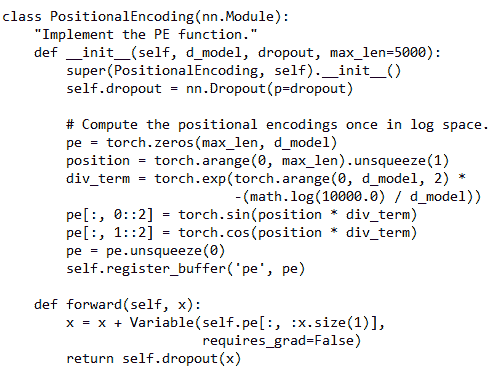

## **输入的摘要**

现在我们有了我们的输入表示:一个英语句子，“我喜欢树”被转换成三个向量(每个词一个向量):

我们的输入表示中的每个向量都捕获了单词的含义和单词在句子中的位置。

我们将执行完全相同的过程(单词嵌入+位置编码)来表示输出，在本例中是西班牙语句子“Me gustan los arboles”

现在，我们已经介绍了 Transformers 论文中图 1 的底部:输入和输出句子在输入到模型的其余部分之前是如何处理的(不要与顶部的“输出概率”混淆，这是另外一回事):

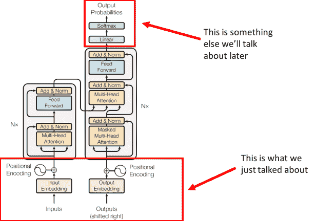

Modified from Transformer paper Figure 1

在嵌入和位置编码之后，输入张量(和输出张量)的形状是[nbatches，L，512]，其中“nbatches”是批量大小(遵循带注释的变换器的变量名)，L 是序列的长度(例如，对于“我喜欢树”，L = 3)，512 是嵌入维度/位置编码维度。请注意，批次是精心创建的，因此单个批次包含相似长度的序列。

# 编码器

现在是编码器处理我们句子的时候了。这是编码器的样子:

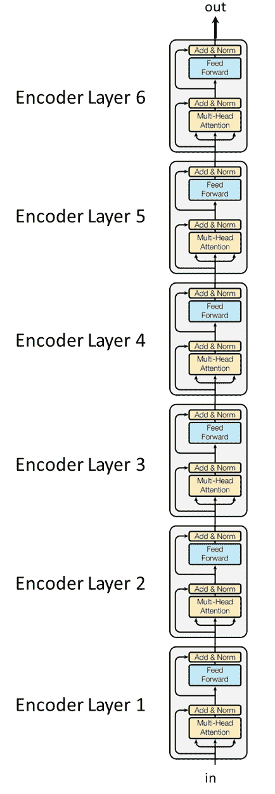

Modified from Transformer paper Figure 1.

如图所示，编码器由 N = 6 个相同的层堆叠而成。

对于英语到西班牙语的翻译，“in”是一个英语句子，例如“我喜欢树”，用我们刚刚谈到的“单词嵌入+位置编码”格式表示。“出来”的是这句话的不同表述。

六个编码器层中的每一层都包含两个子层:

*   第一个子层是“多头自我关注机制”
*   第二子层是“一个简单的、按位置全连接的前馈网络”

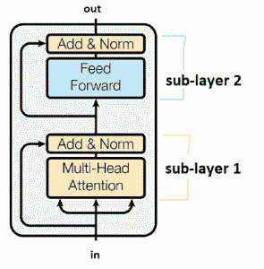

Modified from Transformer paper Figure 1.

我们将讨论这些子层的作用。但是首先，这里是来自[带注释的转换器](http://nlp.seas.harvard.edu/2018/04/03/attention.html)的代码，展示了编码器是如何构建的:

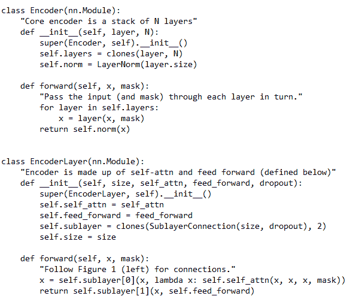

“编码器”类接收一个<layer>，并将其堆叠<n>次。它接受的<layer>是类“编码者”的一个实例</layer></n></layer>

用<size>、<self_attn>、<feed_forward>和<dropout>初始化类“EncoderLayer”:</dropout></feed_forward></self_attn></size>

*   <size>是 d_model，是基础模型中的 512</size>
*   <self_attn>是类“MultiHeadedAttention”的实例这对应于子层 1。</self_attn>
*   <feed_forward>是类“positionwise 前馈”的实例这对应于子层 2。</feed_forward>
*   <dropout>是辍学率，例如 0.1</dropout>

## **编码器子层 1:多头注意机制**

Cerberus the multi-headed dog ([Image Source](https://commons.wikimedia.org/wiki/File:Hercules_and_Cerberus_LACMA_65.37.151.jpg))

为了理解变形金刚，理解多头注意力机制是至关重要的。在编码器和解码器中都使用多头注意力机制。首先，我将根据论文中的等式写一个高度概括，然后我们将深入代码的细节。

**注意力的高级口头总结:键、查询和值**

让我们将注意力机制的输入称为“x”。在编码器的开头，x 是我们的初始句子表示。在编码器的中间，“x”是前一个编码器的输出。例如，EncoderLayer3 从 EncoderLayer2 的输出中获取其输入“x”。

我们使用 x 来计算键、查询和值。使用不同的线性图层从 x 计算键、查询和值:

其中对于特定的编码器层，linear_k、linear_q 和 linear_v 是从维度 512 到维度 512 (d_model 到 d_model)的独立前馈神经网络层。)Linear_k、linear_q 和 linear_v 具有彼此不同的权重，它们是单独学习的。如果我们使用相同的图层权重来计算键、查询和值，那么它们将彼此完全相同，我们不需要为它们取不同的名称。

一旦我们有了键(K)、查询(Q)和值(V ),我们就按如下方式计算关注度:

这是变压器论文中的等式(1)。让我们仔细分析一下这是怎么回事:

首先，我们取查询和键之间的点积。如果我们同时对许多查询和键执行此操作，我们可以将点积写成矩阵乘法，如下所示:

这里 Q 是一堆查询 Q，K 是一堆键 K。

取点积后，除以 d_k 的平方根:

除以 sqrt(d_k)有什么意义？作者解释说，他们通过 sqrt(d_k)来缩放点积，以防止点积随着 d_k(向量长度)的增加而变大。

示例:向量[2，2]和[2，2]的点积是 8，但向量[2，2，2，2，2]和[2，2，2，2，2]的点积是 20。如果我们选择一个巨大的向量长度，我们不希望点积很大，所以我们除以向量长度的平方根来减轻这种影响。巨大的点积值是不好的，因为它会“将 softmax 函数推入具有极小梯度的区域”

这使我们进入下一步——应用 softmax，将数字压缩到(0，1)范围内:

关于 softmax 函数的讨论，请参见本文。

在这一点上我们有什么？此时，我们有一堆介于 0 和 1 之间的数字，可以认为是我们的注意力权重。我们将这些注意力权重计算为 softmax(QK^T/sqrt(d_k)).

最后一步是对值 V 进行加权求和，使用我们刚刚计算的注意力权重:

这就是整个等式！

**代码为**的多头注意力的更详细描述

这部分引用了来自[的注释转换器](http://nlp.seas.harvard.edu/2018/04/03/attention.html)的代码，因为我认为查看代码是理解正在发生的事情的好方法。

首先，这里是带有一些注释的相关代码。不要担心所有这些注释，我将在下面的文本中描述关键点。(如果您想阅读注释，根据您的浏览器，您可能需要在新窗口中打开图像，以便文本足够大，便于阅读。)

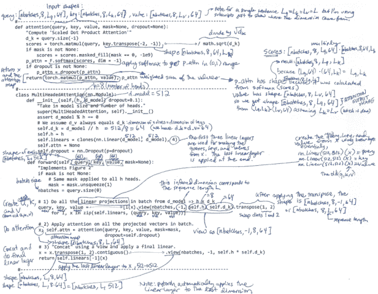

在[带注释的转换器](http://nlp.seas.harvard.edu/2018/04/03/attention.html)中，多头注意力通过类 MultiHeadedAttention 实现:

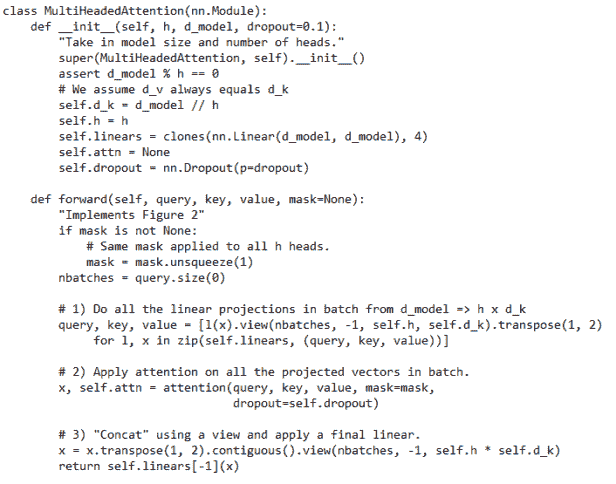

这个类别的执行个体是以下列方式初始化的:

*   <h>= 8，“人头”的数量变压器基本模型中有 8 个头。</h>
*   <d_model>= 512</d_model>
*   <dropout>=辍学率= 0.1</dropout>

键的维数 d_k 的计算方法是 d_model/h，所以在这种情况下，d_k = 512/8 = 64。

让我们更详细地看一下 MultiHeadedAttention 的 forward()函数:

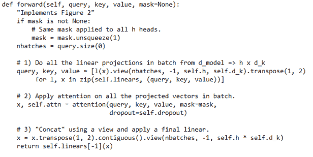

我们可以看到 forward()的输入是查询、键、值和掩码。暂时忽略面具。查询、键和值来自哪里？它们实际上是从 EncoderLayer 中重复出现三次的“x ”(见黄色高亮部分):

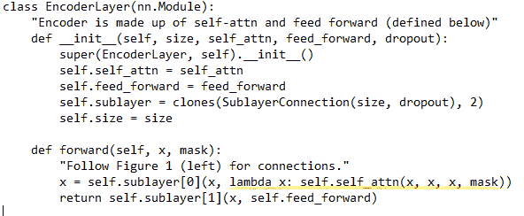

x 来自前一个 EncoderLayer，或者如果我们在 EncoderLayer1，x 是我们最初的句子表示。(注意，类 EncoderLayer 中的 self.self_attn 是 MultiHeadedAttention 的一个实例。)

在 MultiHeadedAttention 类中，我们将获取旧查询(旧 x)、旧键(也是旧 x)和旧值(也是旧 x)，并生成彼此不同的新查询、键和值。

注意“查询”输入的形状是[nbatches，L，512]其中 nbatches 是批量大小，L 是序列长度，512 是 d_model。“键”和“值”输入也具有形状[nbatches，L，512]。

**步骤 1)** 在 MultiHeadedAttention forward()函数中声明，“从 d_model = > h x d_k 开始批量进行所有线性投影。”

*   我们将在形状[nbatches，L，512]的相同张量上进行三种不同的线性投影，以获得形状[nbatches，L，512]的每个新查询、键和值。(从线性图层 512 -> 512 开始形状就没变过)。
*   然后，我们将把输出整形为 8 个不同的头。例如，查询是 shape [nbatches，L，512],并使用 view()将其重新整形为[nbatches，L，8，64],其中 h=8 是头的数量，d_k = 64 是密钥大小。
*   最后，我们将使用转置来交换维度 1 和 2，以获得形状[nbatches，8，L，64]

**步骤 2)** 在代码状态中，“批量应用所有投影向量的注意。”

*   具体行是 x，self.attn = attention(查询，键，值，mask =掩码，dropout=self.dropout)
*   下面是我们使用 attention()函数实现的等式:

为了计算分数，我们首先在 query [nbatches，8， **L，64** 和 key transposed [nbatches，8， **64，L** ]之间做一个矩阵乘法。这是方程式中的 QK^T。分数的最终形状为[nbatches，8， **L，L** ]。

接下来，我们通过对分数应用 softmax 来计算注意力权重 p_attn。如果适用，我们还将[下降](http://jmlr.org/papers/volume15/srivastava14a.old/srivastava14a.pdf)应用于注意力权重。因此，p_attn 对应于上式中的 softmax(QK^T/sqrt(d_k)。p_attn 的形状是[nbatches，8， **L，L** ，因为对分数应用 softmax 和 dropout 不会改变形状。

最后，我们执行注意力权重 p_attn [nbatches，8， **L，L** ]与值[nbatches，8， **L，64** ]之间的矩阵乘法。结果就是我们注意力函数的最终输出，形状为[nbatches，8， **L，64** 。我们从函数中返回这个，以及注意力权重本身 p_attn。

注意，在我们对注意力函数的输入和注意力函数的输出中，我们有 8 个头(张量的维度 1，例如[nbatches， **8** ，L，64】。)我们为八个头中的每一个做了不同的矩阵乘法。这就是“多头”注意力的含义:额外的“头”维度允许我们拥有多个“表征子空间”它给了我们八种不同的方式来考虑同一个句子。

**步骤 3)** (在 MultiHeadedAttention 类中，因为我们现在已经从 Attention()函数中返回)是使用 view()连接，然后应用最终的线性层。

步骤 3 的具体行是:

x = x.transpose(1，2)。连续()。视图(nbatches，-1，self.h * self.d_k)

return self.linears[-1](x)

*   x 是从注意力函数返回的:我们的八头表示[nbatches，8，L，64]。
*   我们转置它得到[nbatches，L，8，64]，然后用 view 整形得到[nbatches，L，8 x 64] = [nbatches，L，512]。这个使用 view()的整形操作基本上是 8 个头的连接。
*   最后，我们应用 self.linears 的最后一个线性层，这个线性层从 512 -> 512。注意，在 Pytorch 中，如果一个多维张量被赋予一个线性层，则该线性层仅被应用于最后一个维度。所以 self.linears[-1](x)的结果还是有形状的[nbatches，L，512]。
*   请注意，[nbatches，L，512]正是我们需要放入另一个多头张力层的正确形状。
*   …但在此之前，我们还有最后一步，即编码器子层 2，我们将在查看 Transformer 白皮书中的图 2 后讨论它。

这是变压器论文中的图 2:

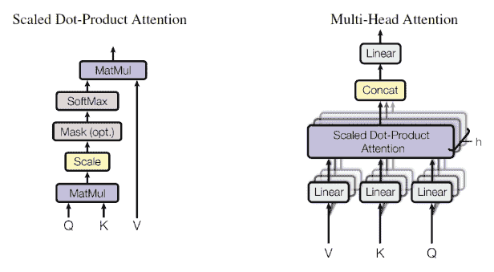

Transformer paper Figure 2

在左边，在“缩放的点积注意力”下，我们有一个 Attention()函数计算结果的可视化描述:softmax(QK^T/sqrt(d_k))V.它之所以“缩放”是因为被 sqrt(d_k)除，它之所以“点积”是因为 QK^T 表示一组堆叠查询和一组堆叠键之间的点积。

在右边的“多头注意力”下，我们有一个关于多头注意力类的可视化描述。现在，您应该可以识别该图的各个部分:

*   在底部是旧的 V、K 和 Q，它们是我们从前一个 EncoderLayer 输出的“x ”(或我们来自 EncoderLayer1 的输入句子表示的 x)
*   接下来，我们应用一个线性层(“线性”框)来计算处理过的 V、K 和 Q(没有明确显示)
*   我们将处理过的 V、K 和 Q 输入到我们的 8 个头的点积注意力中。这就是 attention()函数。
*   最后，我们连接 8 个头部的 attention()函数的结果，并应用最后一个线性层来产生我们的多头注意力输出。

## **编码器子层 2:位置式全连接前馈网络**

我们现在几乎已经理解了整个 EncoderLayer！回想一下，这是单个 EncoderLayer 的基本结构:

Modified from Transformer paper Figure 1

我们已经学习了子层 1，即多头注意力。现在我们来看看第 2 子层，即前馈网络。

子层 2 比子层 1 更容易理解，因为子层 2 只是一个前馈神经网络。下面是子层 2 的表达式:

换句话说，我们应用权重为 W1、偏差为 b1 的全连接层，执行 ReLU 非线性(最大值为零)，然后应用权重为 W2、偏差为 b2 的第二个全连接层。

下面是带注释的转换器的相应代码片段:

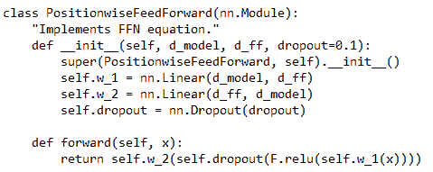

总之，编码器由 6 个编码器组成。每个编码器有 2 个子层:子层 1 用于多头注意力，子层 2 只是一个前馈神经网络。

# 解码器

既然我们理解了编码器，解码器就更容易理解了，因为它和编码器很相似。这又是图 1，有一些额外的注释:

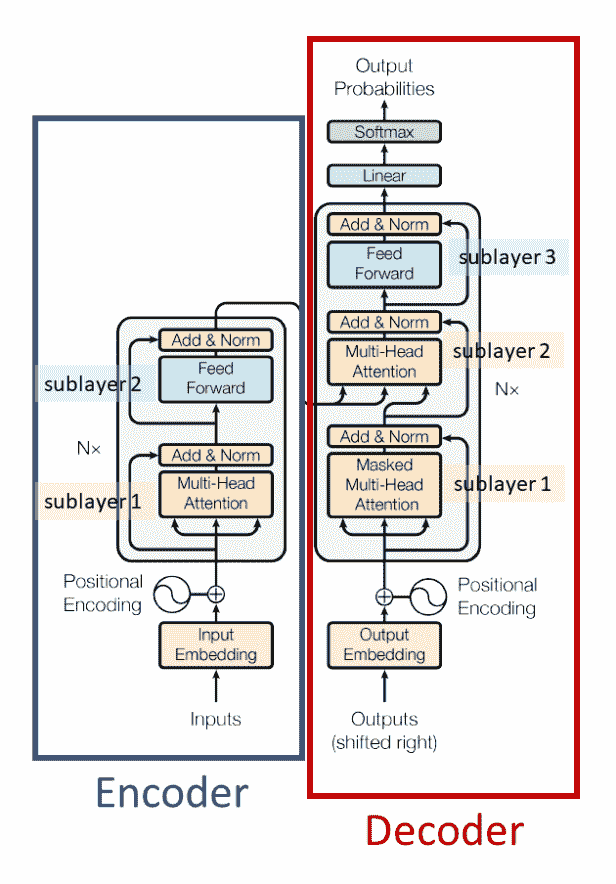

Modified from Transformer paper Figure 1

解码器和编码器之间有三个主要区别:

*   解码器子层 1 使用“屏蔽的”多头注意力来防止非法“预见未来”
*   解码器有一个额外的子层，在上图中标为“子层 2”。这一子层就是“编码器-解码器多头注意。”
*   存在应用于解码器输出的线性层和 softmax，以产生指示下一个预测字的输出概率。

让我们来谈谈每一件作品。

## **解码器子层 1:被屏蔽的多头注意力**

[The Crystal Ball by John William Waterhouse](https://commons.wikimedia.org/wiki/File:John_William_Waterhouse_-_The_Crystal_Ball.JPG)

多头注意力层中的掩蔽点是防止解码器“预见未来”，即我们不希望任何水晶球内置到我们的模型中。

掩码由 1 和 0 组成:

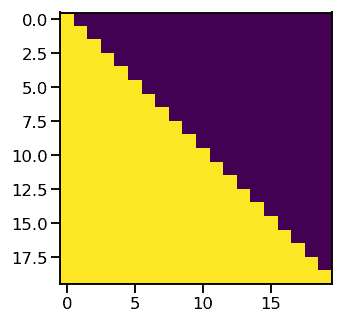

Mask example ([Image Source](http://nlp.seas.harvard.edu/2018/04/03/attention.html)).

attention()函数中使用掩码的代码行如下:

如果掩码不为无:

scores = scores . masked _ fill(mask = = 0，-1e9)

[masked_fill(mask，value)函数](https://pytorch.org/docs/stable/tensors.html)用[value]填充[self]张量的元素，其中[mask]为真。[遮罩]的形状必须是[可广播的](https://pytorch.org/docs/stable/notes/broadcasting.html#broadcasting-semantics)与基本张量的形状所以，基本上，我们使用屏蔽来“清除”分数张量中对应于我们不应该看到的未来单词的部分。

引用作者的话，“我们[……]修改解码器堆栈中的自我关注子层，以防止位置关注后续位置。这种屏蔽与输出嵌入偏移一个位置的事实相结合，确保了对位置 I 的预测只能依赖于小于 I 的位置处的已知输出。”

## **解码器子层 2:编码器-解码器多头关注**

以下是解码器的代码:

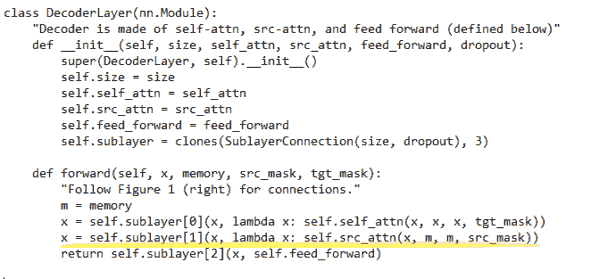

黄色下划线定义了“编码器-解码器注意事项”:

x = self.sublayer[1](x，lambda x: self.src_attn(x，m，m，src_mask))

self.src_attn 是 MultiHeadedAttention 的实例。输入是 query = x，key = m，value = m，mask = src_mask。这里，x 来自前一个 DecoderLayer，而 m 或“内存”来自编码器的输出(即 EncoderLayer6 的输出)。

(注意黄色那条线上面的线，x = self.sublayer[0](x，lambda x: self.self_attn(x，x，x，tgt_mask))，定义了我们刚才讲的解码器子层 1 的解码器自我关注。除了额外的屏蔽步骤之外，它的工作方式与编码器自我关注完全相同。)

## **旁白:变压器中注意力的完整总结**

我们现在已经讨论了变形金刚中的三种注意力。这是作者从 Transformer 的论文中总结的关于注意力在他们的模型中使用的三种方式:

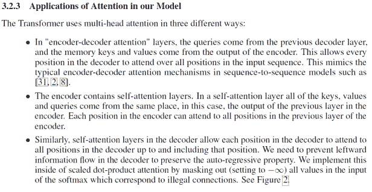

## **解码器最终输出:线性和 Softmax 产生输出概率**

在解码器堆栈的末端，我们将解码器的最终输出输入到一个线性层，然后是 softmax，以预测下一个令牌。

我们运行编码器一次，得到编码器栈的输出，代表英文输入句子“I like trees”；现在我们将多次运行解码器，以便它可以预测西班牙语翻译“Me gustan los arboles”中的多个单词

最后一个线性层将解码器堆栈的输出扩展成一个巨大的向量，其长度等于词汇表的大小。softmax 意味着我们将选择这个巨大向量中概率最高的一个元素(“贪婪解码”)，它对应于我们西班牙语词汇中的一个单词。

训练完网络后(即当我们执行推理时)，我们将执行以下步骤(注意，编码器输出被计算一次，然后被使用几次):

1.  将我们的编码器输出(代表完整的英文句子“I like trees”)和一个特殊的句子开头标记输入到解码器底部的“输出句子”槽中。解码器将产生一个预测的单词，在我们的例子中应该是“我”(我们的西班牙语翻译的第一个单词。)
2.  将我们的编码器输出、句子开头标记和解码器刚刚产生的单词提供给解码器——即，将编码器输出和" Me "提供给解码器在这一步中，解码器应该产生预测的单词“gustan”
3.  把我们的编码器输出和“ Me gustan”馈送给解码器在这一步中，解码器应该产生预测的字“los”
4.  将我们的编码器输出和" Me gustan los "馈送给解码器在这一步中，解码器应该产生预测的单词“arboles”
5.  给解码器输入我们的编码器输出和“我喜欢 los arboles。”在这个步骤中，解码器应该产生句子结束标记，例如“”
6.  因为解码器已经产生了一个句子结束标记，我们知道我们已经完成了这个句子的翻译。

训练期间呢？在训练过程中，解码器可能不是很好，所以它可能会对下一个单词产生不正确的预测。如果解码器产生垃圾，我们不想把垃圾反馈给解码器进行下一步。所以，在训练中我们使用了一个叫做“老师强制”的过程( [ref1](https://dzone.com/articles/what-is-a-transformer-inside-machine-learning) ， [ref2](https://github.com/tensorflow/tensorflow/issues/30852) ， [ref3](https://machinelearningmastery.com/teacher-forcing-for-recurrent-neural-networks/) )。

在教师强制中，我们利用我们知道正确的翻译应该是什么的事实，并且我们向解码器提供它*应该*已经预测到的符号。请注意，我们不希望解码器只是学习一个复制任务，所以我们将只在应该预测单词“arboles”的步骤中输入“< /s > Me gustan los”这是通过以下方式实现的:

*   我们之前谈到的掩蔽，其中未来的单词被置零(即，当解码器应该预测“gustan”时，不要输入解码器“los arboles”)，以及
*   右移，使得“当前”字也不输入(即，当解码器应该预测“gustan”时，不输入解码器“gustan”)

然后，使用解码器实际产生的可能的下一个字的概率分布(例如[0.01，0.01，0.02，0.7，0.20，0.01，0.05])相对于它应该产生的概率分布(如果我们使用一个热点矢量作为基本事实，则该概率分布是[0，0，0，0，0，1，0，0]以及“arboles”槽中的“1”)。)

请注意，我刚刚描述的方法(在每个解码步骤选择概率最高的单词)被称为“贪婪解码”另一种方法是波束搜索，在每个解码步骤中保持一个以上的预测字(更多细节见[这篇文章](http://jalammar.github.io/illustrated-transformer/))。)

下面是用于最终线性层和 softmax 的 Pytorch 生成器类:

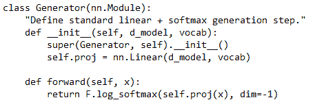

# 更有趣

祝贺您，您已经完成了变压器模型的关键部分！转换器内置了一些额外的概念，我将在这里快速概述一下:

**压差**:压差用于整个变压器的几个不同的地方。在这种技术中，在每次向前/向后传递期间，忽略随机的神经元子集，以帮助防止过度拟合。想了解更多关于辍学的信息，请看[这篇文章](https://medium.com/@amarbudhiraja/https-medium-com-amarbudhiraja-learning-less-to-learn-better-dropout-in-deep-machine-learning-74334da4bfc5)。

**残差连接和层归一化**:在编码器的每个子层周围和解码器的每个子层周围都有一个残差连接，然后是层归一化。

*   剩余连接:如果我们计算某个函数 f(x)，一个“剩余连接”产生输出 f(x)+x。换句话说，我们将原始输入加回到我们刚刚计算的输出上。更多详情见[本文](/residual-blocks-building-blocks-of-resnet-fd90ca15d6ec)。
*   图层归一化:这是一种跨要素归一化输入的方法(与跨批次归一化要素的批次归一化相反。)更多详情见[本文](https://mlexplained.com/2018/11/30/an-overview-of-normalization-methods-in-deep-learning/)。

在下面的 EncoderLayer 图中，我将相关部分涂成红色:箭头和“添加和规范”框一起表示剩余连接和层规范化:

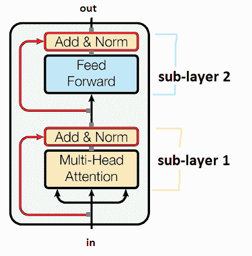

Modified from Transformer paper Figure 1

引用，“每个子层的输出是 LayerNorm(x + Sublayer(x))，其中 Sublayer(x)是子层本身实现的函数。为了促进这些剩余连接，模型中的所有子层以及嵌入层产生维度 dmodel = 512 的输出。

对于 Pytorch 实现，请参见带注释的 Transformer 类“LayerNorm”以及应用 LayerNorm、Dropout 和 residual 连接的类“SublayerConnection”。

**Noam 优化器**:使用 [Adam 优化器](https://arxiv.org/abs/1412.6980)训练变压器。作者报告了一个在整个训练过程中改变学习率的具体公式。首先，对于一定数量的训练步骤，学习率线性增加。之后，学习率与步数的平方根倒数成比例降低。这个学习率计划在带注释的 Transformer 类“NoamOpt”中实现

**标签平滑**:最后，作者应用了标签平滑技术。本质上，标签平滑采用一个热编码的“正确答案”并平滑它们，以便大部分概率分布在“1”所在的位置，而剩余部分分布在所有为“0”的位置更多详情参见[本文](https://arxiv.org/pdf/1906.02629.pdf)。有关实现，请参见带注释的转换器类“LabelSmoothing”

# 大总结！

*   转换器由一个编码器和一个解码器组成。
*   输入句子(例如“我喜欢树”)和输出句子(例如“Me gustan los arboles”)各自使用单词嵌入加每个单词的位置编码向量来表示。
*   编码器由 6 个编码器组成。解码器由 6 个解码器组成。
*   每个 EncoderLayer 有两个子层:多头自注意和前馈层。
*   每个解码器层有三个子层:多头自关注、多头编码器-解码器关注和前馈层。
*   在解码器的末端，对解码器输出应用线性层和 softmax 来预测下一个字。
*   编码器运行一次。解码器运行多次，在每一步产生一个预测字。

## **参考文献**

*   [瓦斯瓦尼 A，沙泽尔 N，帕尔马 N，乌兹科雷特 J，琼斯 L，戈麦斯安，凯泽日，波洛舒欣 I .“你所需要的只是关注。”NeurIPS 2017(第 5998–6008 页)。](https://papers.nips.cc/paper/7181-attention-is-all-you-need.pdf)
*   哈佛 NLP 的注释变压器。这是一个 iPython 笔记本，它一步一步地介绍了 Pytorch 代码。
*   [演练:变压器架构【第 1/2 部分】](https://www.lesswrong.com/posts/qscAeYE67GoSffDDA/walkthrough-the-transformer-architecture-part-1-2)作者 Matthew Barnett。变压器中基本概念的概述，没有过多的细节。
*   [演练:变压器架构【第 2/2 部分】](https://www.lesswrong.com/posts/McmHduRWJynsjZjx5/walkthrough-the-transformer-architecture-part-2-2)作者马修·巴尼特。关于变压器如何工作的细节。这篇文章解释了查询、键和值到底是什么。
*   杰·阿拉玛的《变形金刚》
*   [变压器教程— DGL 0.3 文档](https://docs.dgl.ai/en/latest/tutorials/models/4_old_wines/7_transformer.html)。包括解码器/编码器的有趣图示
*   理查德·索彻的《CS224N 变压器网络》
*   [用于语言理解的转换器模型](https://www.tensorflow.org/beta/tutorials/text/transformer)来自 Tensorflow Core。包括 Tensorflow 示例代码。

## **关于特色图片**

特色图片是约翰·威廉姆·沃特豪斯的画作[“水晶球”的一部分。](https://en.wikipedia.org/wiki/Crystal_ball#/media/File:John_William_Waterhouse_-_The_Crystal_Ball.JPG)

*原载于 2019 年 8 月 15 日*[*http://glassboxmedicine.com*](https://glassboxmedicine.com/2019/08/15/the-transformer-attention-is-all-you-need/)*。*