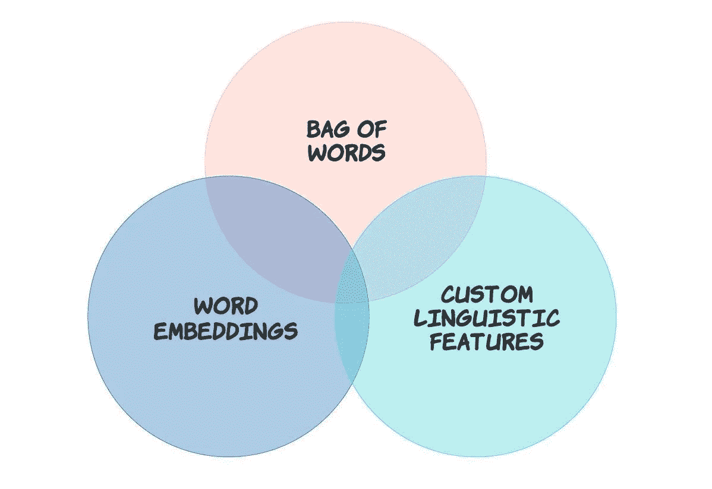
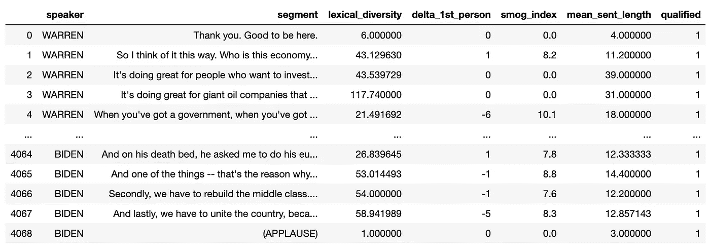
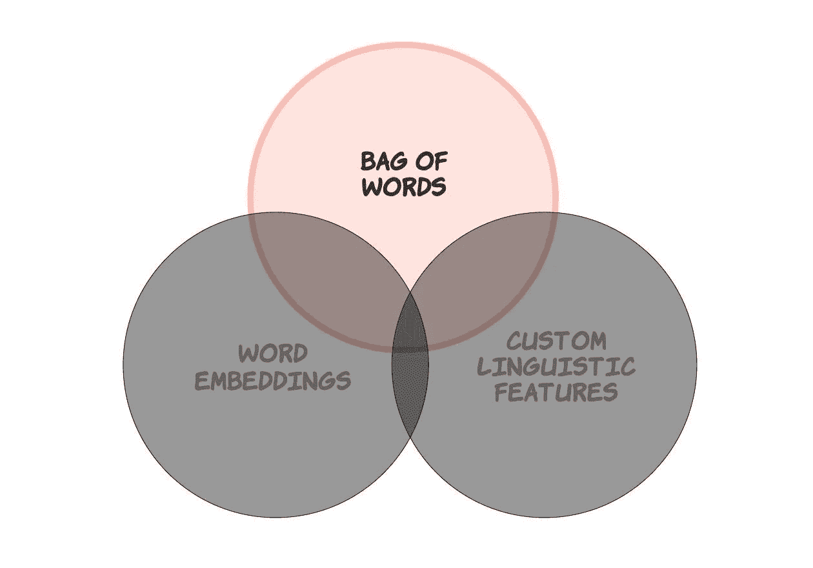
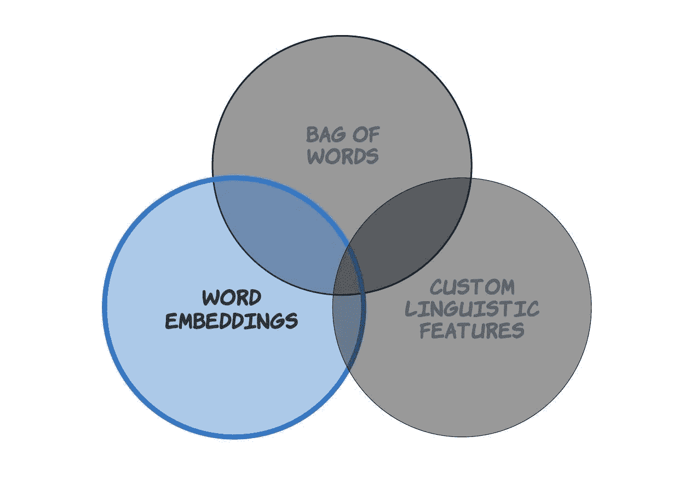
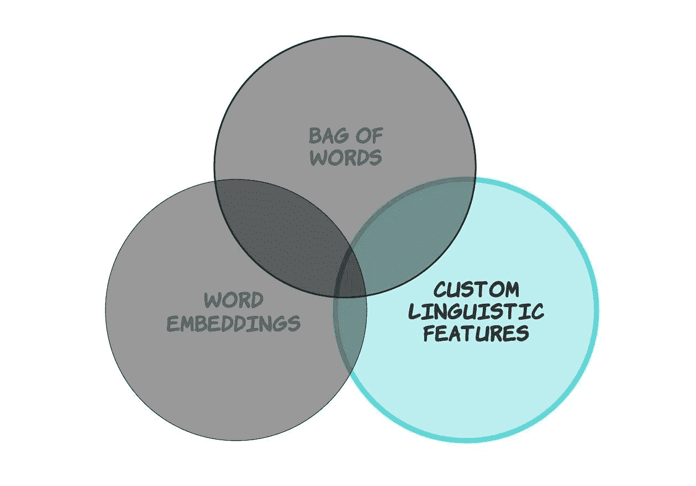
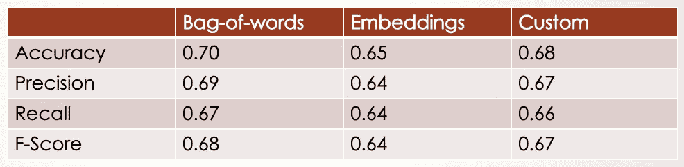
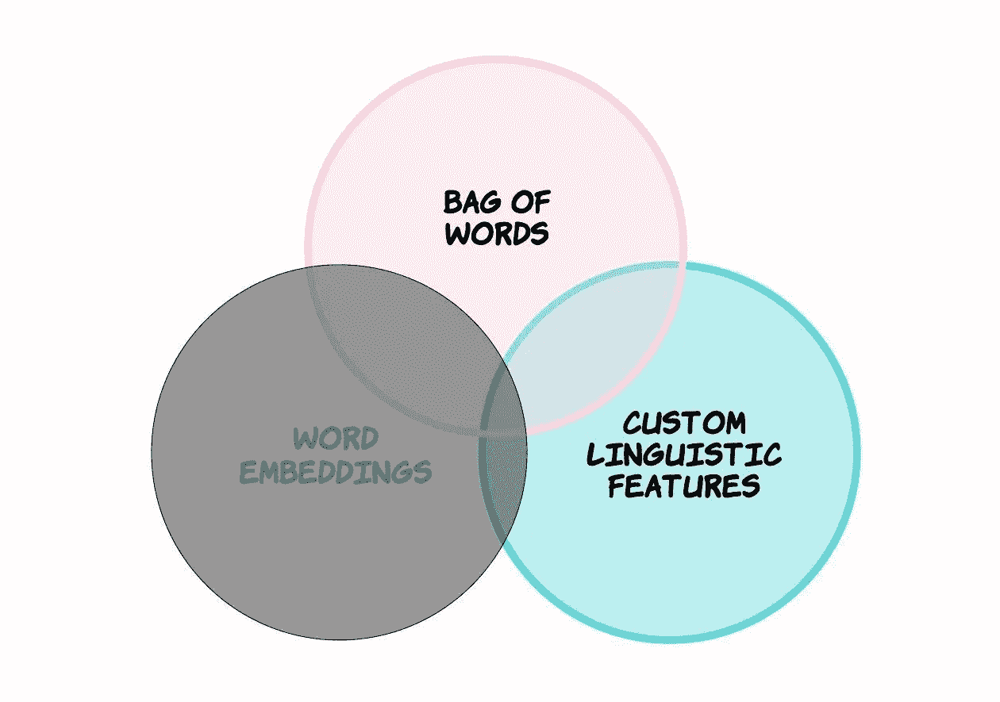
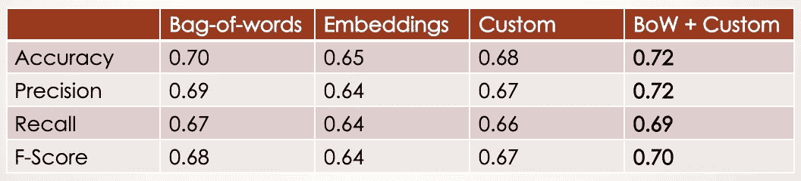

# 基于 Scikit-Learn 流水线的文本特征提取

> 原文：<https://towardsdatascience.com/the-triune-pipeline-for-three-major-transformers-in-nlp-18c14e20530?source=collection_archive---------15----------------------->

## 使用 2020 年初选辩论记录


Image [Source](https://www.looper.com/122484/best-worst-movies-blockbuster-franchises/)

# 这篇文章的目的是双重的。

**首先**，如我所承诺的，我将跟进之前的[帖子](/which-presidential-candidate-talks-like-that-b2b16060ff8b?source=friends_link&sk=521c1d6609bdfb96e41fa2439d5b18d1)，在那篇帖子中，我比较了 2020 年 21 位民主党初选总统候选人的演讲特性。我确定了一系列语言特征，这些特征将在描述层面上区分我们的总统候选人。

在这篇文章中，我想使用这些特征来建立一个分类模型，可以预测谁将有资格参加 12 月 19 日的辩论。当然，我们现在知道谁有资格参加辩论，但我想这项任务背后的真正动机是更全面地了解一个人以某种方式说话(在辩论舞台上)对于作为总统候选人被认真对待(并被允许进入下一轮)有多重要。

**第二个**(也是更重要的一个)在构建这个模型的过程中，我想分享一些我最近在 scikit-learn 的世界中非常高兴地发现的事情:`Pipeline`(我知道我已经迟到了。:)**这个非常强大的类使我的整个 ML 工作流程——从预处理到评估——变得更加容易处理、更加健壮，并且更少受到猜测的影响**，尤其是在超参数调优阶段。正如我的一位同事所说，它真的应该成为每一个基于 sklearn 的 ML 项目的一部分！下面是它的功能描述:

> 顺序应用一列**变换**和一个**最终** **估计器**。管道的中间步骤必须是“转换”，也就是说，它们必须实现 fit 和 transform 方法。最终的估计器只需要实现 fit。*[*1*](https://scikit-learn.org/stable/modules/generated/sklearn.pipeline.Pipeline.html)*

**如果你想要更多的背景信息和深入描述性分析的结果，请参考我之前的文章，但是在这篇文章中，我将直接利用文章来构建所谓的三位一体管道🔱，其组件管道可以将原始文本转换为 NLP 任务的三个主要特征构建块:**

****

**Three types of feature representation in NLP**

**根据您正在处理的特定任务或模型，维恩图中的一个或多个特征类型可能对您的模型的性能特别重要，例如，单词嵌入伴随着一些自定义语言特征的子集。要了解哪些重叠或不重叠的要素集是最重要的，我们需要设置一个训练流来测试每种要素类型的影响。这就是`Pipeline`来拯救我们的地方。**

# **但首先要做的是。**

**使用前一篇[文章](/which-presidential-candidate-talks-like-that-b2b16060ff8b)中准备好的数据帧，我们想为目标变量`qualified`添加一列(1 或 0 表示是或否)，它表示谁有资格参加 12 月的辩论。八名候选人有资格参加辩论(包括退出的哈里斯):**

```
**import numpy as np
import pandas as pd**QUALIFIED_CANDIDATES** = ["BIDEN", "WARREN", "SANDERS", "BUTTIGIEG", "HARRIS", "KLOBUCHAR", "STEYER", "YANG"]CANDIDATE_TO_TARGET = {}
[CANDIDATE_TO_TARGET.update({c: 1}) if c in QUALIFIED_CANDIDATES else CANDIDATE_TO_TARGET.update({c: 0}) for c in ALL_CANDIDATE_NAMES]# add the target variable column 
qualified = df['speaker'].apply(lambda x: CANDIDATE_TO_TARGET[x] if x in CANDIDATE_TO_TARGET else np.NaN)
df['qualified'] = qualified**
```

****

**A dataframe containing the features and target variable (not all features shown)**

**然后，我们将数据集分为训练集和测试集:**

```
**from sklearn.model_selection import train_test_splittrain_df, test_df = train_test_split(df, test_size=0.1)train_data = train_df["segment"]
train_target = train_df["qualified"]test_data = test_df["segment"]
test_target = test_df["qualified"]**
```

**现在我们准备好了有趣的部分！**

# **设置三位一体管道。**

**`**Pipeline**` **提供了一种方便直观的方式来构建我们的 ML 流程，其特征在于一系列可预测的核心任务**，包括预处理、特征选择、标准化/规范化和分类。`Pipeline`通过连续调用每个估算器上的`fit`，将`transform`应用到输入，并将转换后的输入传递到下一步，来自动化拟合/转换过程的多个实例。这意味着`Pipeline`中的每个估计器(除了最后一个)都必须有一个`transform`方法[ [2](https://scikit-learn.org/stable/modules/compose.html#notes) ]，就像这个友好的 sklearn transformer `TfidfVectorizer`:**

```
**class TfidfVectorizer(CountVectorizer):
    ... def fit(self, raw_documents, y=None):
        *# Learn vocabulary and idf from training set.*self._check_params()
        X = super().fit_transform(raw_documents)
        self._tfidf.fit(X)
        return self        def **transform**(self, raw_documents, copy=True):
        *# Transform documents to document-term matrix.*check_is_fitted(self, '_tfidf', 'The tfidf vector is not fitted')

        X = super().transform(raw_documents)
        return self._tfidf.transform(X, copy=False)**
```

**`Pipeline`中的最后一个估计器不一定是转换器(即有一个`transform`方法)，但可以是(通常是)一个分类器，像`SVC`。这种结构将允许您在整个安装好的管道上调用`predict`。**

## **管道 I:使用 tfidf 矢量器的单词包**

****

**以我们的辩论记录文本为例，我们创建了一个简单的`Pipeline`对象，该对象(1)将输入数据转换为 TF-IDF 特征矩阵，以及(2)使用随机森林分类器对测试数据进行分类:**

```
****bow_pipeline** = Pipeline(
    steps=[
        ("tfidf", TfidfVectorizer()),
        ("classifier", RandomForestClassifier()),
    ]
)bow_pipeline.fit(train_data, train_target)
y_pred = bow_pipeline.predict(test_data)
cr = classification_report(test_target, y_pred)**
```

**然后我们可以在整个管道上调用`fit`,在测试数据上调用`predict`。正如您所看到的，除了提供有序的估计量之外，没有什么别的了。当然，您可以通过在`“classifier”`步骤之前添加一个规范化或标准化步骤来扩展管道。(您将在下一个管道中看到一个降维步骤的示例。)**

**在下面的分类报告中，`0`代表“没有资格参加 12 月的辩论”，`1`代表“有资格”。我们看到，仅使用辩论记录数据— **而不了解候选人的其他信息**(例如他们的投票状况、性别、受欢迎程度和政治经验水平)—我们能够以 70%的准确率预测谁将参加或不参加下一场辩论。他们在辩论舞台上说的话真的很重要，与他们如何说无关(第三条管道将在下面讨论)，也与他们是谁无关。**

```
**# tf-idf features only precision    recall  f1-score   support

           0       0.66      0.54      0.59       165
           1       0.72      0.81      0.76       242

    accuracy                           **0.70 **      407
   macro avg       0.69      0.67      0.68       407
weighted avg       0.70      0.70      0.69       407**
```

## **管道 II:使用定制转换器的单词嵌入**

****

**第二个管道需要创建一个**自定义转换器**，它基于单词嵌入将文本转换成数字向量。有几种方法可以做到这一点，包括从[这里](https://nlp.stanford.edu/projects/glove/)下载预先训练好的手套单词向量，并编写一个自定义函数来加载模型，如下所示:**

```
**path_to_word_vectors = "/Users/jlee/glove.6B.50d.txt"def load_glove(path_to_word_vectors):
    f = open(path_to_word_vectors, "r")
    word2vec = {}
    for line in f:
        split_line = line.split()
        word = split_line[0]
        embedding = np.array([float(val) for val in split_line[1:]])
        model[word] = embedding
    return word2vecword2vec = load_glove(path_to_word_vectors)**
```

**或者，您可以使用 spaCy 的内置单词向量模型，可以通过下面的`.vector`属性访问。下面我加载了`"en_core_web_md"`模型，它提供了 685k 个键和 20k 个唯一向量(300 维)。这个模型被存储为`SpacyVectorTransformer`的一个属性，这是一个返回向量平均值的定制转换器。**

```
**import spacy 
from sklearn.base import BaseEstimator, TransformerMixinnlp = spacy.load("en_core_web_md")  # this model will give you 300Dclass **SpacyVectorTransformer**(BaseEstimator, TransformerMixin):
    def __init__(self, nlp):
        self.nlp = nlp
        self.dim = 300

    def fit(self, X, y):
        return self

    def transform(self, X):
        # Doc.vector defaults to an **average** of the token vectors.
        # https://spacy.io/api/doc#vector
        return [self.nlp(text).vector for text in X]**
```

**一旦我们得到 300 维的平均嵌入，我们可以选择使用`TrancatedSVD`来降低这些特征的维数。**

```
****embeddings_pipeline** = Pipeline(
    steps=[
        ("mean_embeddings", SpacyVectorTransformer(nlp)),
        ("reduce_dim", TruncatedSVD(50)),
        ("classifier", RandomForestClassifier()),
    ]
)embeddings_pipeline.fit(train_data, train_target)
y_pred = embeddings_pipeline.predict(test_data)
cr = classification_report(test_target, y_pred)**
```

**结果是:**

```
**# embeddings only               precision    recall  f1-score   support

           0       0.56      0.61      0.58       165
           1       0.72      0.67      0.69       242

    accuracy                           **0.65 **      407
   macro avg       0.64      0.64      0.64       407
weighted avg       0.65      0.65      0.65       407**
```

**我们看到结果不如更简单的 TF-IDF 模型的结果好。**

## **管道三:定制语言功能管道**

****

**所谓“自定义语言特征”，我指的是那种你可以通过对你的数据应用一些规则来手动提取的特征。在这个例子中，我使用空间依赖解析器提取特性`number of words before the main verb`:**

**An example of a custom rule-extracted linguistic feature**

**更多基于规则的定制语言特性的例子可以在以下两篇文章中找到:**

**[](/linguistic-rule-writing-for-nlp-ml-64d9af824ee8) [## 为自然语言处理编写语言规则

### 用 spaCy 提取问题类型的指南

towardsdatascience.com](/linguistic-rule-writing-for-nlp-ml-64d9af824ee8) [](/which-presidential-candidate-talks-like-that-b2b16060ff8b) [## 超越演讲时间:民主党总统辩论分析

### 使用真实世界数据进行预测建模的数据准备和特征工程

towardsdatascience.com](/which-presidential-candidate-talks-like-that-b2b16060ff8b) 

第三个管道需要一个定制的转换器，就像上一个一样；`CustomLinguisticFeatureTransformer`采用一个`fit`方法(它返回自身)和一个`transform`方法。后者返回`featurize`的输出，这是我创建的另一个名为`SegmentFeaturizer`的类的方法。

```
segment_featurizer = SegmentFeaturizer()  # more on this belowclass CustomLinguisticFeatureTransformer(BaseEstimator, TransformerMixin):
    def __init__(self):
        pass def fit(self, x, y=None):
        return self def transform(self, data):
        return **segment_featurizer.featurize**(data)
```

`SegmentFeaturizer`定义用于提取一组语言特征的方法。下面是它的基本结构，其中一些特征提取函数后面是返回特征字典列表的主`featurize`函数:

(要了解更多关于`featurize`的信息，请看这篇[帖子](/how-to-build-a-reusable-nlp-code-pipeline-with-scikit-learn-with-an-emphasis-on-feature-504f8aa14699?source=friends_link&sk=135abfa127e7094b1a17963b254ab678)。)然后，`transform`的输出作为流水线的下一个部件，即`DictVectorizer`的输入。完整的管道如下:

```
manual_pipeline = Pipeline(
    steps=[
        ("stats", CustomLinguisticFeatureTransformer()),
        ("dict_vect", DictVectorizer()),
        ("classifier", RandomForestClassifier()),
    ]
)manual_pipeline.fit(train_data, train_target)
y_pred = manual_pipeline.predict(test_data)
cr = classification_report(test_target, y_pred)
```

结果:

```
# manual linguistic features only precision    recall  f1-score   support

           0       0.62      0.56      0.59       165
           1       0.72      0.77      0.74       242

    accuracy                           **0.68**       407
   macro avg       0.67      0.66      0.67       407
weighted avg       0.68      0.68      0.68       407
```

不如词袋模型好，但比平均嵌入要好。下面是三个管道指标的对比汇总表:



(显示了[宏](https://scikit-learn.org/stable/modules/model_evaluation.html#from-binary-to-multiclass-and-multilabel)的精确度、召回率和 f 分数的平均值。)

# 在一起更好。

已经看到单词袋管道和自定义语言特征管道独立地产生最佳结果，我想知道如果我们创建一个结合两者特征的新管道会有什么效果。幸运的是，有一个简单的方法可以做到这一点！

## 管道四:组合功能



组合特征集由`**FeatureUnion**`完成:

> [FeatureUnion](https://scikit-learn.org/0.16/modules/generated/sklearn.pipeline.FeatureUnion.html#sklearn.pipeline.FeatureUnion) 将几个 transformer 对象组合成一个新的 transformer，该 transformer 将它们的输出进行组合。FeatureUnion 接受一个 transformer 对象列表。在拟合期间，**每一个都独立地拟合到数据**。为了转换数据，转换器被并行应用**，并且它们输出的样本向量被**首尾相连**成更大的向量。**

**下面，`"classifier"`步骤已经从每个管道中删除，因为该步骤需要在我们应用了`FeatureUnion`之后出现。**

```
# individual pipelines minus the estimator step: **bow_pipeline** = Pipeline(
    steps=[
        ("tfidf", TfidfVectorizer()),
    ]
)**manual_pipeline** = Pipeline(
    steps=[
        ("stats", ManualTransformer()),
        ("dict_vect", DictVectorizer()),
    ]
)
```

**最终管道由通过`FeatureUnion`和最终分类器连接的组合特征组成:**

```
combined_features = FeatureUnion(
    transformer_list=[
        ("bow", bow_pipeline),
        ("manual", manual_pipeline),
    ]
)**final_pipeline** = Pipeline(
    steps=[
        ("combined_features", combined_features),
        ("classifier", RandomForestClassifier()),
    ]
)
```

**此时，我们可以拟合`final_pipeine`并计算指标，但是为了更好地测量，我将对拟合的随机森林分类器的参数执行随机搜索。(您也可以运行网格搜索，但这需要更长时间。)**

```
from sklearn.model_selection import RandomizedSearchCV# the keys can be accessed with **final_pipeline.get_params().keys()**
params = {
    "combined_features__bow__tfidf__use_idf": [True, False],
    "combined_features__bow__tfidf__ngram_range": [(1, 1), (1, 2)],
    "classifier__bootstrap": [True, False],
    "classifier__class_weight": ["balanced", None],
    "classifier__n_estimators": [100, 300, 500, 800, 1200],
    "classifier__max_depth": [5, 8, 15, 25, 30],
    "classifier__min_samples_split": [2, 5, 10, 15, 100],
    "classifier__min_samples_leaf": [1, 2, 5, 10]
}search = RandomizedSearchCV(final_pipeline, params)
search.fit(train_data, train_target)
y_pred = search.predict(test_data)
classification_report(test_target, y_pred)
```

**酷！结果*比*更好，具有特征统一和网格搜索支持的参数优化！**

```
# combined features + randomized search               precision    recall  f1-score   support

           0       0.70      0.55      0.61       165
           1       0.73      0.84      0.78       242

    accuracy                           **0.72**       407
   macro avg       0.72      0.69      0.70       407
weighted avg       0.72      0.72      0.71       407
```

**在每项指标上，混合渠道的得分都高于表现最佳的单个渠道:**

****

**作为正确的下一步，您可以尝试组合所有三个特性集，看看会发生什么，从而创建一个真正的“triune”(三合一)管道。🔱**

# **结束了。**

**在这篇文章中，我演示了如何建立三位一体管道来预测总统候选人有资格参加下一场辩论的可能性。他们是:**

1.  **使用标准**字袋**模型的管道**
2.  **使用**字嵌入的管道****
3.  **一条管道使用**手动(自定义)功能****

**每个组件管道包括一个转换器，它输出 NLP 中的主要特征类型/表示。我还展示了我们可以组合来自不同管道的不同特性集来获得更好的结果，尤其是与`RandomizedSearchCV`结合使用时。我认为另一个很好的收获是结合 ML 驱动和基于规则的方法来提升模型性能的价值。**

**我确实发现，候选人的演讲特性*本身——不受任何其他人口统计特征或候选人政治成就信息的影响*——*能够相当准确地预测某人是否有资格参加下一场辩论，这是预测我们下一任总统的众多预测因素之一。***

***如果你想要不那么罗嗦的东西:***

***[](https://medium.com/swlh/randomized-or-grid-search-with-pipeline-cheatsheet-719c72eda68) [## 管道随机(或网格)搜索超级快速指南

### 使用 scikit 的五个步骤-学习

medium.com](https://medium.com/swlh/randomized-or-grid-search-with-pipeline-cheatsheet-719c72eda68)*****