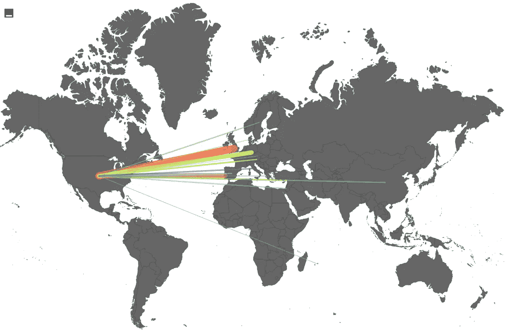

# 用分类为故事片增色不少——第一部分

> 原文：<https://towardsdatascience.com/the-trouble-with-classification-312cc6fe8b79?source=collection_archive---------26----------------------->

## 为什么你最好在“人数据”中留下空白，而不去管分类。

当你去看电影的时候，你是否曾经希望你可以按下一个按钮，跳过故事，看着片尾字幕滚动而过？如果你回答“不”，你是正常的。演职员表*很无聊*。

但是我们认为电影结尾的致谢是理所当然的；毕竟，演职员表的顺序是电影放映时间的一部分。再考虑一下演职员表，我们用演职员表这样一种枯燥的形式给一部电影(一种使用戏剧性的视觉和修辞来唤起内心反应的艺术形式)封顶，这似乎很奇怪。当然，演职员表已经在电影中赢得了一席之地，作为向创作者表达敬意的传统方式，有时甚至伴随着主题剪辑，以使最后的过渡不那么明显。演职员表之前的一切都是为了被动地欣赏，而之后的一切几乎都不像之前的艺术——传统的格式建议你阅读一份名单，并在电影淡出人们的视野之前，对每个人在电影制作中所扮演的角色表示敬意。只有随着时间和重复，普通的电影观众才学会将名字(尤其是线下的名字)与风格、精神气质和特权联系起来。

演员更有优势。由于他们的脸被高细节地投影，而他们的声音从环绕立体声扬声器中投射出来，你可以很快熟悉演员阵容；但是，如果你第二次看一部电影，我敢打赌你不会注意到所有船员角色的名字都被打乱了。

为了缩小“熟悉度差距”，我想如果我能在名字中找到帮助人们识别它们的元素，我就能让演职员表对人们更有吸引力。就我个人而言，当我与人们分享经验时，我会更好地记住他们的名字。这是第一个复杂的问题:人们永远也不会见到大多数名字在他们面前的人。下一个显而易见的解决方案将是用围绕这些人建立的公共档案来轰炸人们，例如，动态地改变信贷序列的视频，并为每个被信贷的人注入 IMDB 传记。这看起来很有效，但是太麻烦了。

“that” = reading the life story of every writer, sound designer, and costume writer of Transformers 7

接下来，我考虑了身份。如果职业和专业知识不足以吸引人们留下来获得学分，我认为共同的背景会吸引他们。当美国人遇到拥有共同国籍的人时，即使他们的祖先是 5 代前移民的，他们似乎也会高兴起来。我遵循这个真理，决定给我能找到的每一个有信用的人贴上他们的国籍标签。然后，我想，我会考虑到，即使是典型的电影观众，他们也不在乎超越影院体验去“了解”被信任的人。

“Oh my god, *I’m* Irish, too! “

我想，既然“典型的电影观众”不可能知道演职员表中每个成员的种族背景，那么标记过程应该反映出同样天真的观点，并根据名字本身做出受过教育的地理估计。我想错了，但是在我解释为什么之前，我将向你展示在我的过程有缺陷变得非常明显之前，我凭直觉走了多远。

我遵循人们用来假设他们从未见过的人的种族和性别的直觉，并转向机器学习模型，使用调查、人口普查和民意测验数据将姓名与地点关联起来。

“Assume,” “ethnicity,” and “gender” have been used in the same sentence. Exercise caution.

有许多工具可以将标识符附加到姓名上，即 [NamSor](https://namsor.com) ，它利用大规模数据集，仅根据姓名来提供对某人性别和种族的最佳猜测。尽管 NamSor 已经被设计得非常复杂，并且咨询了许多[经济学家](https://en.wikipedia.org/wiki/Onomastics)、语言学家和人类学家，但它(以及任何一个)人工智能分类器都无法以 100%的准确率运行。这是不可能的，原因有二:

1.  名称序列不够长。
    举个例子，给一个故事贴上体裁标签的类似问题。如果故事是“那个人走了”，你会同样不自信地把它放入任何类型。但是如果故事继续下去，“女孩强迫特雷皮德走向迪丹吉庄园，”你会认为这是一个恐怖故事的前兆，原因有很多，至少是庄园*只有*房子邪恶。
2.  名字比种族更重要，种族也比某人的名字更重要。就像一个人不会只看自己的名字来决定如何识别自己一样，从外向内分配标识符也不是了解一个群体的有效方法。

最终，我赋予*个人*名字比出现在屏幕上的名字更多价值的计划，在正确代表人们的责任下失败了。我认为我的意图是正确的，但我的方法是完全错误的。我想，“这个项目需要真正好的猜测”，而不是寻找人们如何识别自己，从而忽略了更好的解决方案。分类，尽管看起来很客观，但当应用于定性的人类特征时，却是有问题的。

在我的下一篇文章中，我将展示 NamSor 如何通过在散居地(电影创作者最有可能来自的地方)方面用细粒度的属性(如种族)来增加个人数据。我还将展示这与基本事实信息的关系。敬请期待！