# 2019 年印度尼西亚大选的推特故事(Pemilu)

> 原文：<https://towardsdatascience.com/the-twitter-tale-of-indonesian-election-2019-pemilu-fb75cd084a32?source=collection_archive---------11----------------------->

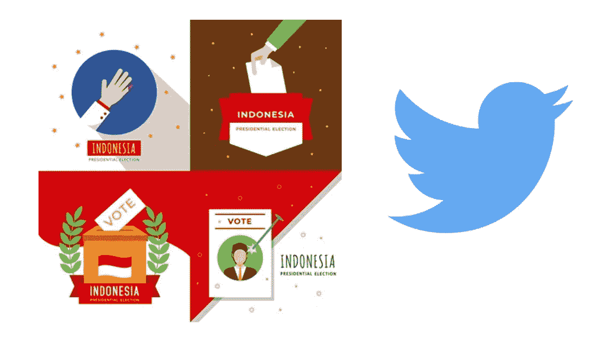

Indonesian Election 2019 and Twitter Analysis

在印尼总统选举期间，佐科维和普拉博沃成为最受关注的候选人。印度尼西亚总统初选成为新闻热点。许多新闻和社交媒体引发了关于谁将赢得总统大选的热潮。现在，在 2019 年，我们将通过 Twitter 的眼睛尝试和分析印度尼西亚总统选举的故事。

Github ( [链接到 Jupyter 笔记本](https://github.com/VincentTatan/PythonAnalytics/blob/master/Youtube/Indonesian%20Election%20Social%20Text%20Analysis%20(Social%20Media%20Trend%20-%20Twitter-%20Media-%20Big%20Data).ipynb) ) —源代码请访问:

**免责声明**

这一分析只是我个人的项目，决不能作为政治观点的可靠来源。请小心使用！

**本分析的一些弱点和假设如下:**

1.  有限的数据流范围(请查看数据源)
2.  Tweepy API 和 Google Translate API 的访问受限(请看数据源)
3.  限制对其他外部数据源的访问，以验证结果的可靠性(快速统计列表数据、地理分割等)

# 数据源

数据源来自 Twitter Tweepy API，该 API 从 2019 年 4 月 19 日开始传输数据。总的来说，我拥有的流媒体 Twitter 帖子是 20509，这花了我几个小时，并存储在 dataset/pemilu-data-2019.json 中，以便快速检索。关于如何获取 Twitter 历史数据(过去一周多)的更多信息。请随意从[这里](https://blog.gnip.com/tag/historical-twitter-data/)检索

如果你想看我是如何流的，请在 Github 上打开我的 Jupyter 笔记本。在那里，你将能够看到我的代码，并在您指定的开始日期复制结果。

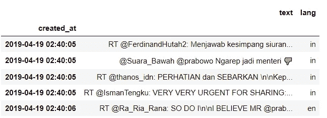

Pandas Data object for Twitter Posts

# 数据清理和争论

## 删除空文本 twitter

一些文本是不同的文本格式(一些无法在 gettext(tweet)上传递的中文字符。元素)。因此，由于它不需要太多的行，我们将忽略这些行

## **将印尼语翻译成英语**

大多数语言是印尼语。这意味着，为了分析这个问题，我们需要将帖子翻译成英文，以供感伤或其他非印度尼西亚支持的图书馆使用。

在这种情况下，我们将使用 TextBlob translate 将印度尼西亚帖子翻译成英语。这可以简单地用下面的代码来完成。TextBlob 将访问 Google 翻译 API 来生成翻译

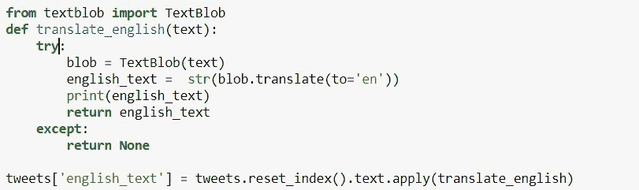

TextBlob Translate

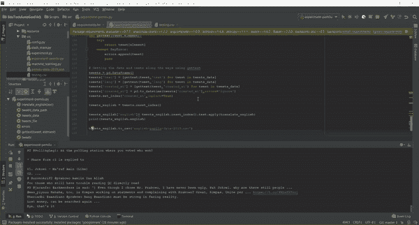

Translation Running on PyCharm IDE

不幸的是，Google API translate 有一些限制，所以我们不能翻译所有的东西。我们将使用那些可以在 translation.txt 中翻译成单独数据集的子集进行情感分析。

## 提取每个总统候选人的相关职位

为了找到这些相关的帖子，我们会在句子中搜索某个单词。例如，推文中提到了佐科维还是普拉博沃，推文属于哪一个？

例如:

*   佐科维和普拉博沃
*   佐科维对贾瓦人的看法(佐科维 1，普拉博沃 0)
*   Prabowo terlalu cepat senang(佐科威 0，Prabowo 1)

这将有助于我们对哪个帖子提到了哪个总统候选人进行编码。以下是 Python Pandas Lambda 函数，用于迭代序列中的每个条目，并对候选项应用提取方法。

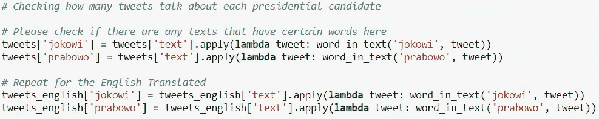

Code to apply word_in_text method to extract Jokowi and Prabowo in the text

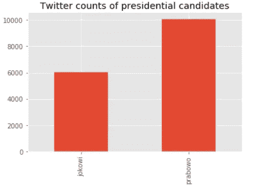

Prabowo is the most cited candidates out of all the streamed Twitter posts

# 分析

## **公众对两位总统候选人的总体看法如何？(Python 文本 Blob 情感分析)**

## 什么是情感分析

> 情感分析是指采用自然语言来识别和提取主观信息的过程。你可以获取文本，在 TextBlob 中运行，程序会通过分析文本中使用的语言，判断文本是阳性、中性还是阴性。

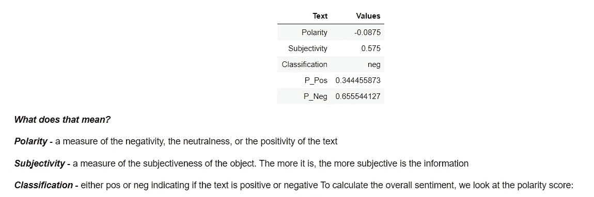

TextBlob Sentimental Analysis

## 编写情感分析

我们将为每个英文帖子生成极性和主观性。作为最终结果，我们将收到熊猫数据帧结果如下。

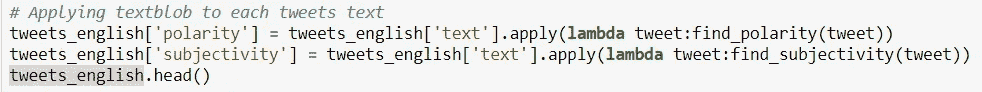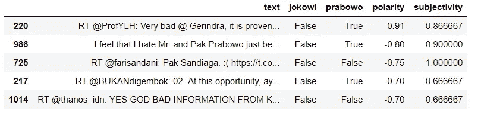

Sentimental Analysis

## 为佐科维和普拉博沃分析公众情绪

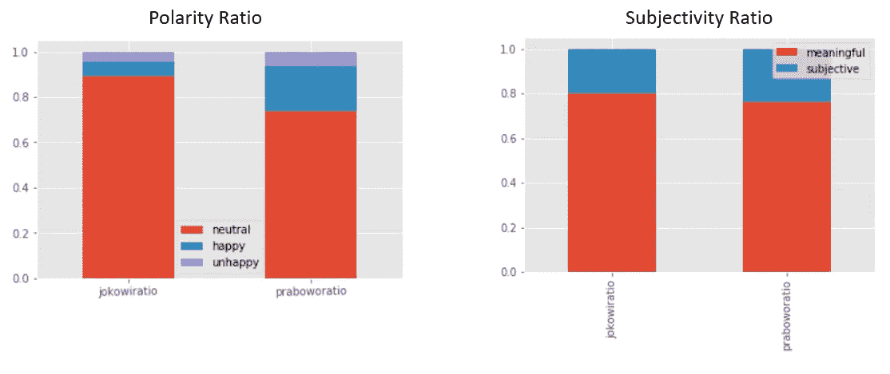

Happier Posts for Prabowo with most meaningful posts for both candidates

推特上的总体情绪是支持普拉博沃的。在进一步挖掘数据后，有一些关于普拉博沃的有意义的/信息丰富的评论。就主观性而言，围绕普拉博沃和佐科威已经有了大量有意义的观点(与轻声有关)。

## 新闻传媒怎么样？两个候选人的覆盖范围是什么？

下一个分析是关于新闻报道。新闻报道可以巩固公众对总统候选人的看法，从而极大地影响选举结果。[甚至有人提到新闻报道巩固了川普赢得美国总统候选人资格](https://www.poynter.org/reporting-editing/2016/journalists-helped-cement-donald-trumps-candidacy-according-to-a-new-report/)。因此，我们必须分析主要新闻渠道对他们的报道。

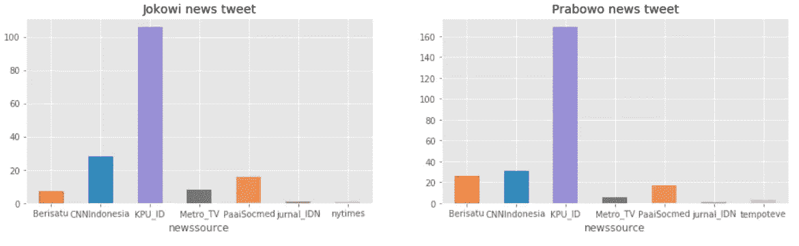

News Coverage for Prabowo and Jokowi are around the same, except that KPU_ID has more coverages for Prabowo

与其他主要社交媒体渠道相比，KPU ID(选举帖子)多次提到普拉博沃。两位候选人的覆盖面大致相同。

# 两位候选人的共同话题是什么？(NMF 和 LDA 的主题摘录)

## 主题摘录

本节说明了如何用 Python 进行近似主题建模。我们将使用一种称为非负矩阵分解(NMF)的技术，它非常类似于潜在的狄利克雷分配(LDA ),后者用于从单词包(单词列表)中寻找提取主题

## 通过将文本制作成单词包来为主题提取准备数据

> **单词袋**模型是来自**自然语言处理**或 **NLP** 的一种从文本中提取特征的技术。它通过计算文档中单词的频率来做到这一点。一个文档可以根据你的需要来定义，可以是一句话，也可以是整个维基百科。单词袋模型的输出是一个**频率向量**。(InsightsBot)

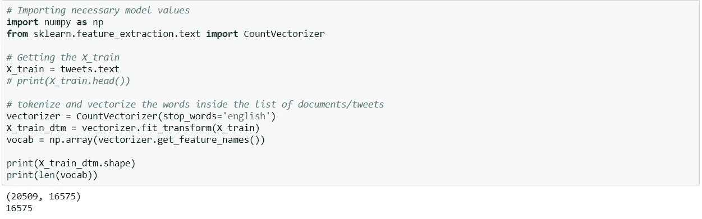

Generating bags of words with dimensions of 16575 unique words from 20509 posts

## 通过分解模型生成主题

与 LDA 类似，我们将使用 NMF 来获得文档-主题矩阵(这里的主题也称为“组件”)和每个主题的热门单词列表。我们将通过使用相同的变量名:doctopic 和 topic_words 来进行类比

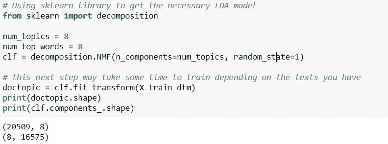

Generating 8 topics with 8 words within each topic. doctopic for each document, and clf.components for each unique word

然后，基于文档主题和 clf.components，我们可以对系数列表进行排序，并检索具有最大系数的索引，该索引指示单词与主题的接近程度。我们会发现 8 个主题是这样的

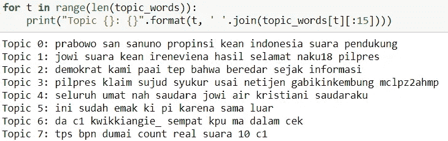

Topics extractions for Jokowi and Prabowo Tweets

## 分析选举期间佐科维和普拉博沃的共同话题

通过前面的主题摘录，我们找到了每个帖子的主要主题，并将其可视化如下:

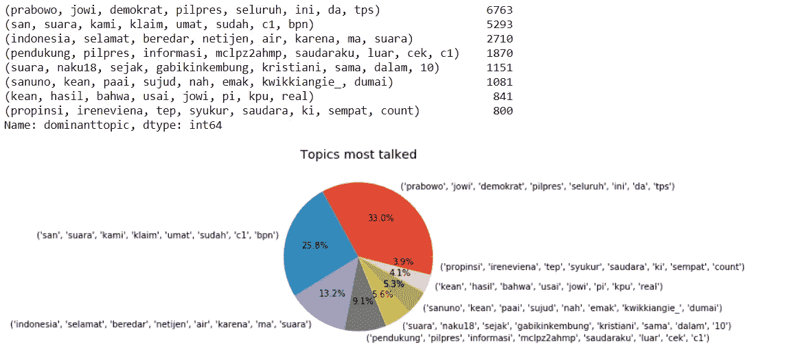

Topics most talked for Prabowo and Jokowi Candidacy

第一个话题是关于普拉博沃和佐科维与民主党的关系，民主党是印尼一个非常大的社会党，与印尼前总统苏西洛·班邦·尤多约诺(SBY)的形象密切相关

我们看到的第二个话题是，网民们提到了与 BPN 争夺 c1 的问题，后者代表国家队，与普拉博沃-桑迪队关系密切。我们需要进一步分析，找出与 BPN 提及 c1 形式的确切内容。

其余的主题显示了投票和快速计票后当前选举阶段的情况。有一些地区语言混淆了，可以进一步清理。

# 那么，我们学到了什么，得出了什么结论？

1.  公众对普拉博沃和佐科维的看法相似。提到了对普拉博沃候选人资格的满意。
2.  来自 KPU (Komisi Pemilihan Umum)和其他新闻对两位总统候选人的报道不相上下，对普拉博沃的报道略多一些。
3.  我们从 Twitter 帖子中提取的主题展示了选举阶段，C1 表格与普拉博沃-桑迪配对以及两位候选人与民主党的简单关系。

当然，在这个结论中，有一些假设，包括选择偏差，并不是所有的选民都会主动发微博。这个分析没有考虑 Twitter 之外的范围。另一个假设是分析社会情绪的两个步骤的准确性，即使用 Google API 进行翻译，然后使用 TextBlob 进行分析。这可能会损害情感分析的准确性。更好的方法是使用情感分析的母语，巴哈萨语，但是当我写这篇文章的时候，我还没有找到一个可靠的和可访问的库。也许你可以填补这个空白:)…最后，目前，这种分析采用了一种非常幼稚的方法，即汇总所有帖子的情感分数，我们可以先按用户 ID 分组，然后按用户数量汇总分数。这也最好地模拟了一个人只能投票一次的情况。

简而言之，仍然很难确定谁会赢，但是仅根据我们的 Twitter 分析，普拉博沃在帖子数量和百分比方面比佐科维更受欢迎(包括正面情绪)。

然而，这与最近的快速计票结果大相径庭，佐科威的得票率为 45%对 55%。因此，这种分析的范围仍然很窄，需要更大的时间序列数据集才能找到可靠的结果。然而，由于我的目标是向你介绍一些技巧，并从 Twitter 观点复述印度尼西亚候选人的一瞥，所以我的文章很有用。

# 那么，下一步是什么？

由于每次分析都会产生更多的问题，未来我们将通过以下方式改进分析:

1.  将推特用户的情感分析按地区分组，然后与每个地区的快速计数分析进行比较。这将建立模型有效性测试的初始阶段。
2.  有许多关于假新闻的研究有助于塑造公众对总统候选人的看法。我们可以查看它们的内容以及它给快速计数结果带来的关联。
3.  建立更多可能的独立变量，如假新闻的可能性、推特用户年龄、人口统计数据等。

如果有时间，我将继续改进这一分析，并解决一些假设。我真诚地感谢我的数据 Whatsapp 小组的友好和建设性的反馈。我从他们的评论中学到了很多。

我希望这一分析将打开许多其他问题和见解，这将有助于您更好地了解我们的国家印度尼西亚。

请通过我的 [LinkedIn](http://www.linkedin.com/in/vincenttatan/) 联系我，并订阅我的 [Youtube 频道](https://www.youtube.com/user/vincelance1/videos)

请在下面留言，寻求建议和反馈。

快乐编码:)