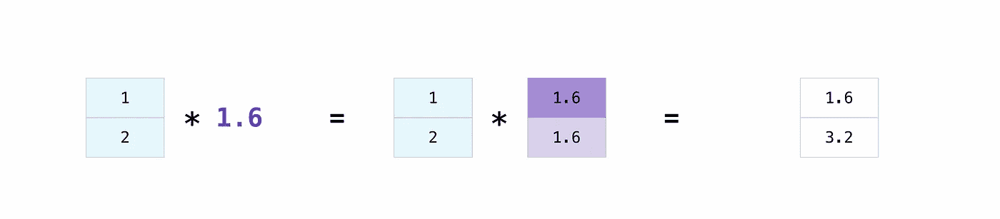
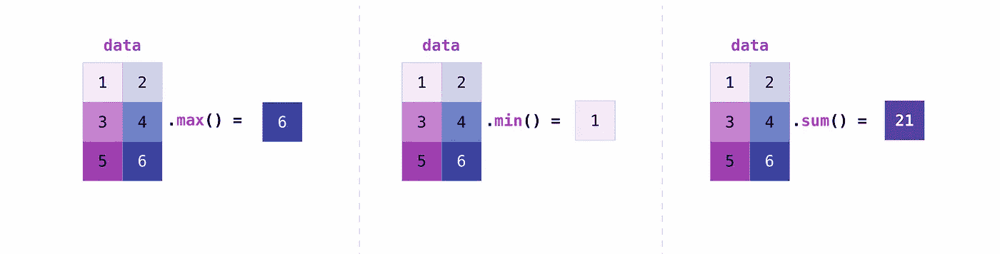
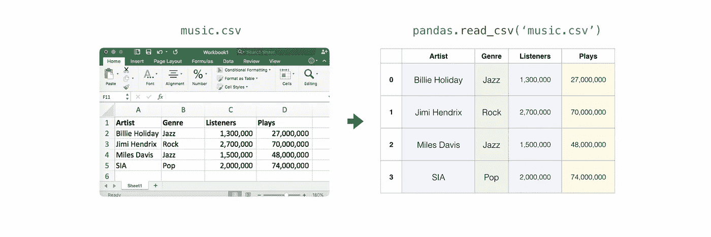
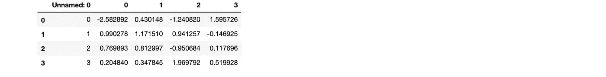

# NumPy 初学者终极指南

> 原文：<https://towardsdatascience.com/the-ultimate-beginners-guide-to-numpy-f5a2f99aef54?source=collection_archive---------0----------------------->

## [入门](https://towardsdatascience.com/tagged/getting-started)

## 开始使用 NumPy 需要知道的一切


Photo by [Skitterphoto](https://www.pexels.com/@skitterphoto?utm_content=attributionCopyText&utm_medium=referral&utm_source=pexels) from [Pexels](https://www.pexels.com/photo/close-up-photo-of-cat-s-face-1331822/?utm_content=attributionCopyText&utm_medium=referral&utm_source=pexels)

**世界靠数据运转，每个人都应该知道如何使用数据。**

很难想象一个现代的、懂技术的企业不使用数据分析、数据科学、机器学习或某种形式的人工智能。NumPy 是所有这些领域的核心。

虽然不可能确切地知道有多少人正在学习分析和处理数据，但一个非常安全的假设是，成千上万(如果不是数百万)的人需要了解 NumPy 以及如何使用它。正因为如此，[我花了三个月的时间整理了我希望是迄今为止最好的 NumPy 入门指南](/what-do-you-want-to-see-in-the-numpy-docs-de73efb80375)！

如果你想看本教程中包含的任何内容，请在评论中留言或随时联系我们！

想看 NumPy 上的这个教程？[看一看](https://10332-908607-gh.circle-artifacts.com/0/home/circleci/repo/doc/build/html/user/absolute_beginners.html)！

## 一点背景:

我被 [NumPy](https://numpy.org/) 通过 [Google Season of Docs](https://developers.google.com/season-of-docs) 选中，为绝对初学者创建一个 NumPy 入门教程。看到所有的幕后活动并与一些关键人物一起工作是令人着迷的。我有机会深入研究了现有的文档，了解了与这个项目相关的各个层面的工作情况。我也有机会和其他一些伟大的作家一起工作，他们在 SciPy 为文档而努力工作。

如果你有兴趣参与 NumPy 或 Google Season of Docs，我强烈推荐。如果你是开源项目的新手，你可能需要一点学习曲线来设置你的工作站，熟悉 NumPy 的[贡献指南](https://docs.scipy.org/doc/numpy/dev/)，并了解[的来龙去脉。rst](http://docutils.sourceforge.net/rst.html) 和[斯芬克斯](http://www.sphinx-doc.org/en/master/#)，但是太值得了。如果你以前没有做过，这肯定很有挑战性，但要坚持下去。一旦你确定了这些细节，你就可以开始享受真正的乐趣了！

永远记住:NumPy 和 SciPy 背后的人是优秀的，他们希望你成功。

请随意查看 GitHub 上的绝对初学者教程的 [pull 请求，了解成功修改 NumPy 文档的过程和所有相关内容。如果你想通读教程，只需继续滚动中等友好的版本！否则，您可以在 GitHub](https://github.com/numpy/numpy/pull/14546) 上找到该文档的永久副本。

如果你以前从未使用过 Git 和 GitHub，你可能想看看这个教程！

[](/getting-started-with-git-and-github-6fcd0f2d4ac6) [## Git 和 GitHub 入门:完全初学者指南

### Git 和 GitHub 基础知识，供好奇和完全困惑的人使用(加上最简单的方法来为您的第一次公开…

towardsdatascience.com](/getting-started-with-git-and-github-6fcd0f2d4ac6) 

**如果你是数据分析的新手，这是为你准备的。**


Photo by [Lucas Pezeta](https://www.pexels.com/@lucaspezeta?utm_content=attributionCopyText&utm_medium=referral&utm_source=pexels) from [Pexels](https://www.pexels.com/photo/person-playing-guitar-2322726/?utm_content=attributionCopyText&utm_medium=referral&utm_source=pexels)

# NumPy 的绝对初学者指南


## 欢迎来到 NumPy！

NumPy(**Num**erical**Py**thon)是一个开源 Python 库，几乎在科学和工程的每个领域都有使用。这是在 Python 中处理数值数据的通用标准，也是科学 Python 和 PyData 生态系统的核心。NumPy 的用户包括所有人，从初级程序员到从事最新科学和工业研发的有经验的研究人员。NumPy API 广泛应用于 Pandas、SciPy、Matplotlib、scikit-learn、scikit-image 和大多数其他数据科学和科学 Python 包中。

NumPy 库包含多维数组和矩阵数据结构(您将在后面的章节中找到更多相关信息)。它为 ndarray(一个同构的 n 维数组对象)提供了有效操作它的方法。NumPy 可用于对数组执行各种数学运算。它为 Python 添加了强大的数据结构，保证了使用数组和矩阵的高效计算，并提供了一个庞大的高级数学函数库，可对这些数组和矩阵进行运算。

[在这里了解更多关于 NumPy 的信息](https://docs.scipy.org/doc/numpy-1.17.0/user/whatisnumpy.html)！

gif via [giphy](https://giphy.com/gifs/DyMdtBZGtrSzS/html5)

# 安装 NumPy

要安装 NumPy，我强烈建议使用科学的 Python 发行版。如果你正在寻找在你的操作系统上安装 NumPy 的完整说明，你可以[在这里找到所有的细节](https://www.scipy.org/install.html)。

如果您已经有了 Python，您可以用

```
conda install numpy
```

或者

```
pip install numpy
```

如果你还没有 Python，你可以考虑使用 [Anaconda](https://www.anaconda.com/) 。这是最简单的入门方式。获得这个发行版的好处是，您不需要太担心单独安装 NumPy 或您将用于数据分析的任何主要软件包，如 pandas、Scikit-Learn 等。

如果你需要更多关于安装的细节，你可以在 scipy.org 找到所有的信息。

[](https://www.scipy.org/install.html)

Photo by [Adrienn](https://www.pexels.com/@adrienn-638530?utm_content=attributionCopyText&utm_medium=referral&utm_source=pexels) from [Pexels](https://www.pexels.com/photo/photo-of-woman-behind-door-1459558/?utm_content=attributionCopyText&utm_medium=referral&utm_source=pexels)

如果您在安装 Anaconda 时遇到问题，您可能想看看这篇文章:

[](/how-to-successfully-install-anaconda-on-a-mac-and-actually-get-it-to-work-53ce18025f97) [## 如何在 Mac 上成功安装 Anaconda(并让它实际工作)

### 正确安装 Anaconda 和修复可怕的“找不到 conda 命令”错误的快速而简单的指南

towardsdatascience.com](/how-to-successfully-install-anaconda-on-a-mac-and-actually-get-it-to-work-53ce18025f97) 

# 如何导入 NumPy

任何时候你想在你的代码中使用一个包或者库，你首先需要使它可被访问。

为了开始使用 NumPy 和 NumPy 中所有可用的功能，您需要导入它。这可以通过以下 import 语句轻松完成:

```
import numpy as np
```

(我们将“numpy”缩写为“np ”,以便节省时间，同时保持代码的标准化，这样任何使用您的代码的人都可以容易地理解和运行它。)

# Python 列表和 NumPy 数组有什么区别？

NumPy 为您提供了大量快速有效的数字相关选项。虽然 Python 列表可以在单个列表中包含不同的数据类型，但是 NumPy 数组中的所有元素都应该是同质的。如果数组不是同构的，那么应该在数组上执行的数学运算就不可能实现。

**为什么要用 NumPy？**


Photo by [Pixabay](https://www.pexels.com/@pixabay?utm_content=attributionCopyText&utm_medium=referral&utm_source=pexels) from [Pexels](https://www.pexels.com/photo/people-running-during-daytime-33703/?utm_content=attributionCopyText&utm_medium=referral&utm_source=pexels)

NumPy 数组比 Python 列表更快更紧凑。数组消耗的内存更少，使用起来也更方便。NumPy 使用更少的内存来存储数据，并且它提供了一种指定数据类型的机制，这使得代码可以进一步优化。

# 什么是数组？

数组是 NumPy 库的中心数据结构。它是一个数值网格，包含关于原始数据、如何定位元素以及如何解释元素的信息。它有一个元素网格，可以用各种方式索引。这些元素都是相同的类型，称为**数组 dtype** (数据类型)。

数组可以通过非负整数元组、布尔、另一个数组或整数进行索引。数组的**秩**是维数。数组的**形状**是一个整数元组，给出了数组在每个维度上的大小。

我们可以初始化 NumPy 数组的一种方法是从嵌套的 Python 列表中初始化。

```
a = np.array([[1 , 2, 3, 4], [5, 6, 7, 8], [9, 10, 11, 12]])
```

我们可以使用方括号来访问数组中的元素。当你访问元素时，记住 NumPy 中的**索引从 0** 开始。这意味着如果你想访问数组中的第一个元素，你将访问元素“0”。

```
print(a[0])
```

**输出:**

```
[1 2 3 4]
```

# 关于数组的更多信息

```
1D array, 2D array, ndarray, vector, matrix
```

您可能偶尔会听到被称为“ndarray”的数组，它是“ **N 维数组**”的简写一个 N 维数组就是一个任意维数的数组。你可能还会听到**一维**，或者一维数组、**二维**，或者二维数组等等。NumPy ndarray 类用于表示矩阵和向量。一个**向量**是一个单列的数组，而一个**矩阵**指的是一个多列的数组。

**数组的属性是什么？**

数组通常是由相同类型和大小的项目组成的固定大小的容器。数组中的维数和项数由其形状决定。数组的形状是一组非负整数，指定每个维度的大小。

在 NumPy 中，尺寸被称为**轴**。这意味着如果你有一个 2D 数组，看起来像这样:

```
[[0., 0., 0.],
 [1., 1., 1.]]
```

您的数组有两个轴。第一轴的长度为 2，第二轴的长度为 3。

就像在其他 Python 容器对象中一样，可以通过索引或切片数组来访问和修改数组的内容。不同的阵列可以共享相同的数据，因此在一个阵列上进行的更改可能在另一个阵列上可见。

数组属性反映了数组本身固有的信息。如果需要在不创建新数组的情况下获取甚至设置数组的属性，通常可以通过数组的属性来访问数组。

[在这里](https://docs.scipy.org/doc/numpy/reference/arrays.ndarray.html)阅读更多关于数组属性的内容，在这里了解[数组对象。](https://docs.scipy.org/doc/numpy-1.17.0/reference/arrays.html)

gif via [GIPHY](https://giphy.com/gifs/animated-gif-daily-aCWAl0dkEH14s)

# 如何创建基本数组

```
np.array()
np.zeros()
np.ones()
np.empty()
np.arange()
np.linspace()
dtype
```

要创建一个 NumPy 数组，可以使用函数 **np.array()** 。

要创建一个简单的数组，你需要做的就是向它传递一个列表。如果您愿意，还可以指定列表中的数据类型。你可以在这里找到更多关于数据类型的信息。

```
import numpy as npa = np.array([1, 2, 3])
```

您可以这样想象您的阵列:


除了从一系列元素中创建一个数组，您还可以轻松地创建一个填充了**0**的数组:

**输入:**

```
np.zeros(2)
```

**输出:**

```
array([0., 0.])
```

或者用**1**填充的数组:

**输入:**

```
np.ones(2)
```

**输出:**

```
array([1., 1.])
```

甚至是一个**空**阵！函数 *empty* 创建一个数组，其初始内容是随机的，并且取决于内存的状态。

**输入:**

```
# Create an empty array with 2 elements
np.empty(2)
```

您可以创建包含一系列元素的数组:

**输入:**

```
np.arange(4)
```

**输出:**

```
array([0, 1, 2, 3])
```

甚至是包含一系列均匀间隔的数组。为此，您将指定**第一个**编号、**最后一个**编号和**步长**。

**输入:**

```
np.arange(2,9,2)
```

**输出:**

```
array([2, 4, 6, 8])
```

您还可以使用 **np.linspace()** 创建一个数组，其中的值以指定的间隔线性排列:

**输入:**

```
np.linspace(0,10,5)
```

**输出:**

```
array([ 0\. ,  2.5,  5\. ,  7.5, 10\. ])
```

**指定您的数据类型**

虽然默认的数据类型是浮点型(float64)，但是您可以使用 dtype 显式地指定您想要的数据类型。

**输入:**

```
array = np.ones(2, dtype=int)
array
```

**输出:**

```
array([1, 1])
```

[在此了解有关创建阵列的更多信息](https://docs.scipy.org/doc/numpy-1.17.0/user/quickstart.html#array-creation)。


Photo by [Godisable Jacob](https://www.pexels.com/@godisable-jacob-226636?utm_content=attributionCopyText&utm_medium=referral&utm_source=pexels) from [Pexels](https://www.pexels.com/photo/woman-in-blue-spaghetti-strap-top-posing-for-photo-944762/?utm_content=attributionCopyText&utm_medium=referral&utm_source=pexels)

# 添加、移除和排序元素

```
np.append()
np.delete()
np.sort()
```

如果从这个数组开始:

```
arr = np.array([1, 2, 3, 4, 5, 6, 7, 8])
```

您可以随时使用 **np.append()** 向数组中添加元素。确保指定要包含的数组和元素。

**输入:**

```
np.append(arr, [1,2])
```

**输出:**

```
array([1, 2, 3, 4, 5, 6, 7, 8, 1, 2])
```

可以用 **np.delete()** 删除一个元素。如果要删除数组中位置 1 的元素，可以运行:

**输入:**

```
np.delete(arr, 1)
```

**输出:**

```
array([1, 3, 4, 5, 6, 7, 8])
```

[在这里阅读更多关于添加数组](https://docs.scipy.org/doc/numpy/reference/generated/numpy.append.html)和[在这里删除元素](https://docs.scipy.org/doc/numpy/reference/generated/numpy.delete.html)的信息。

使用 **np.sort()** 对元素进行排序很简单。调用函数时，可以指定轴、种类和顺序。[在此阅读更多关于数组排序的信息](https://docs.scipy.org/doc/numpy/reference/generated/numpy.sort.html)。

如果从这个数组开始:

```
arr = np.array([2, 1, 5, 3, 7, 4, 6, 8])
```

您可以使用以下命令快速对数字进行升序排序:

**输入:**

```
np.sort(arr)
```

**输出:**

```
array([1, 2, 3, 4, 5, 6, 7, 8])
```

除了返回数组的排序副本的 sort 之外，您还可以使用: **argsort** ，它是沿指定轴的[间接排序；**lex sort**，它是对多个键](https://docs.scipy.org/doc/numpy-1.17.0/reference/generated/numpy.argsort.html#numpy.argsort)的[间接稳定排序；**search sorted**，它将](https://docs.scipy.org/doc/numpy-1.17.0/reference/generated/numpy.lexsort.html#numpy.lexsort)[在排序数组](https://docs.scipy.org/doc/numpy-1.17.0/reference/generated/numpy.searchsorted.html#numpy.searchsorted)中查找元素；以及**分区**，它是[部分排序](https://docs.scipy.org/doc/numpy-1.17.0/reference/generated/numpy.partition.html#numpy.partition)

# 你如何知道一个数组的形状和大小？

```
ndarray.ndim()
ndarray.size()
ndarray.shape()
```

ndarray.ndim 会告诉你数组的轴数，或者维度。

ndarray.size 会告诉你数组的元素总数。这是数组形状元素的*乘积*。

**ndarray.shape** 将显示一个整数元组，表示数组的每个维度上存储的元素数量。例如，如果您有一个 2 行 3 列的 2D 数组，则数组的形状为(2，3)。

例如，如果创建此数组:

```
array_example = np.array([[[0, 1, 2, 3]
                           [4, 5, 6, 7]], [[0, 1, 2, 3]
                            [4, 5, 6, 7]], [0 ,1 ,2, 3]
                            [4, 5, 6, 7]]])
```

要查找数组的维数，请运行:

**输入:**

```
array_example.ndim
```

**输出:**

```
3
```

要查找数组中元素的总数，请运行:

**输入:**

```
array_example.size
```

**输出:**

```
24
```

要找到数组的形状，请运行:

**输入:**

```
array_example.shape
```

**输出:**

```
(3,2,4)
```

[点击此处](https://docs.scipy.org/doc/numpy/reference/generated/numpy.ndarray.ndim.html)、[尺寸点击此处](https://docs.scipy.org/doc/numpy/reference/generated/numpy.ndarray.size.html)和[形状点击此处](https://docs.scipy.org/doc/numpy/reference/generated/numpy.ndarray.shape.html)了解更多信息。

# 你能重塑一个数组吗？

```
np.reshape()
```

**是的！**

gif via [giphy](https://giphy.com/gifs/IKNKv9s7HlBIs/html5)

使用**NP . shape()**将在不改变数据的情况下给数组一个新的形状。请记住，当您使用 reshape 方法时，您想要生成的数组需要具有与原始数组相同数量的元素。如果你从一个有 12 个元素的数组开始，你需要确保你的新数组也有 12 个元素。

如果从这个数组开始:

```
a = np.arange(6)
print(a)
```

**输出:**

```
[0 1 2 3 4 5]
```

你可以使用 **reshape()** 来重塑你的数组。例如，您可以将此数组调整为三行两列的数组:

**输入:**

```
b = a.reshape(3,2)
print(b)
```

**输出:**

```
[[0 1]
 [2 3]
 [4 5]]
```

使用**NP . shape**，您可以指定一些可选参数:

**输入:**

```
numpy.reshape(a, newshape, order)
```

**a** 是要整形的数组。

新形状是你想要的新形状。您可以指定一个整数或一组整数。如果指定整数，结果将是该长度的数组。该形状应该与原始形状兼容。

**顺序**:“C”表示使用类似 C 的索引顺序读写元素，“F”表示使用类似 Fortran 的索引顺序读写元素，“A”表示如果 A 在内存中是 Fortran 连续的，则使用类似 Fortran 的索引顺序读写元素，否则使用类似 C 的顺序。(这是可选参数，不需要指定。)

[在此了解更多关于形状操作的信息](https://docs.scipy.org/doc/numpy-1.17.0/user/quickstart.html#shape-manipulation)。

# 如何将 1D 数组转换成 2D 数组(如何在数组中添加一个新轴)

```
np.newaxis
np.expand_dims
```

您可以使用 **np.newaxis** 和 **np.expand_dims** 来增加现有数组的维数。

使用一次后，使用 **np.newaxis** 将使你的数组增加一个维度。这意味着一个 **1D** 数组将变成一个 **2D** 数组，一个 **2D** 数组将变成一个 **3D** 数组，以此类推。

例如，如果从这个数组开始:

```
a = np.array([1, 2, 3, 4, 5, 6])
a.shape
```

**输出:**

```
(6,)
```

您可以使用 np.newaxis 来添加新轴:

**输入:**

```
a2 = a[np.newaxis]
a2.shape
```

**输出:**

```
(1, 6)
```

您可以使用 **np.newaxis** 显式转换带有行向量或列向量的 1D 数组。例如，通过沿第一维插入一个轴，可以将 1D 数组转换为行向量:

**输入:**

```
row_vector = a[np.newaxis, :]
row_vector.shape
```

**输出:**

```
(1, 6)
```

或者，对于列向量，可以沿第二维插入一个轴:

**输入:**

```
col_vector = a[:, np.newaxis]
col_vector.shape
```

**输出:**

```
(6, 1)
```

您也可以通过使用 **np.expand_dims** 在指定位置插入新轴来扩展数组。

例如，如果从这个数组开始:

**输入:**

```
a = np.array([1, 2, 3, 4, 5, 6])
a.shape
```

**输出:**

```
(6,)
```

您可以使用 **np.expand_dims** 在索引位置 1 添加一个轴:

**输入:**

```
b = np.expand_dims(a, axis=1)
b.shape
```

**输出:**

```
(6, 1)
```

您可以使用以下命令在索引位置 0 添加轴:

**输入:**

```
c = np.expand_dims(a, axis=0)
c.shape
```

**输出:**

```
(1, 6)
```

[点击此处](https://docs.scipy.org/doc/numpy/reference/arrays.indexing.html#index-1)了解更多关于 newaxis 的信息，点击此处[了解更多关于 expand_dims 的信息](https://docs.scipy.org/doc/numpy/reference/generated/numpy.expand_dims.html)。


Photo by [mentatdgt](https://www.pexels.com/@mentatdgt-330508?utm_content=attributionCopyText&utm_medium=referral&utm_source=pexels) from [Pexels](https://www.pexels.com/photo/woman-wearing-white-and-pink-hijab-1122679/?utm_content=attributionCopyText&utm_medium=referral&utm_source=pexels)

# 索引和切片

您可以像对 Python 列表切片一样对 NumPy 数组进行索引和切片。

**输入:**

```
data = np.array([1,2,3])print(data[0])
print(data[1])
print(data[0:2])
print(data[1:])
print(data[-2:])
```

**输出:**

```
1
2
[1 2]
[2 3]
```

你可以这样想象:


您可能希望获取数组的一部分或特定数组元素，以便在进一步的分析或附加操作中使用。为此，您需要对数组进行子集化、切片和/或索引。

如果您想从数组中选择满足特定条件的值，NumPy 很简单。

例如，如果从这个数组开始:

```
a = np.array([[1 , 2, 3, 4], [5, 6, 7, 8], [9, 10, 11, 12]])
```

您可以轻松地打印出数组中所有小于 5 的值。

**输入:**

```
print(a[a<5])
```

**输出:**

```
[1 2 3 4]
```

例如，您也可以选择等于或大于 5 的数字，并使用该条件对数组进行索引。

**输入:**

```
five_up = (a >= 5)
print(a[five_up])
```

**输出:**

```
[ 5  6  7  8  9 10 11 12]
```

您可以选择可被 2 整除的元素:

**输入:**

```
divisible_by_2 = a[a%2==0]
print(divisible_by_2)
```

**输出:**

```
[ 2  4  6  8 10 12]
```

或者可以使用 **&** 和 **|** 运算符选择满足两个条件的元素:

**输入:**

```
c = a[(a > 2) & (a < 11)]
print(c)
```

**输出:**

```
[ 3  4  5  6  7  8  9 10]
```

虽然对于这个数组来说效率非常低，但是您也可以使用逻辑运算符 **&** 和 **|** 来返回布尔值，这些值指定数组中的值是否满足特定条件。这对于包含名称或其他分类值的数组非常有用。

**输入:**

```
five_up = (array > 5) | (array == 5)
print(five_up)
```

**输出:**

```
[[False False False False]
 [ True  True  True  True]
 [ True  True  True  True]]
```

还可以使用 **np.where()** 从数组中选择元素或索引。

从此阵列开始:

**输入:**

```
a = np.array([[1 , 2, 3, 4], [5, 6, 7, 8], [9, 10, 11, 12]])
```

您可以使用 **np.where()** 来打印元素的索引，例如，小于 5:

**输入:**

```
b = np.where(a<5)
print(b)
```

**输出:**

```
(array([0, 0, 0, 0]), array([0, 1, 2, 3]))
```

在这个例子中，返回了一个数组元组:每个维度一个数组。第一个数组表示找到这些值的行索引，第二个数组表示找到这些值的列索引。

如果希望生成元素所在的坐标列表，可以压缩数组，遍历坐标列表，并打印出来。例如:

**输入:**

```
list_of_coordinates= list(zip(b[0], b[1]))for cord in list_of_coordinates:
    print(cord)
```

输出:

```
(0, 0)
(0, 1)
(0, 2)
(0, 3)
```

您也可以使用 **np.where()** 来打印数组中小于 5 的元素:

**输入:**

```
print(a[b])
```

**输出:**

```
[1 2 3 4]
```

如果你寻找的元素不在数组中，那么返回的索引数组将为空。例如:

**输入:**

```
not_there = np.where(a == 42)
print(not_there)
```

**输出:**

```
(array([], dtype=int64), array([], dtype=int64))
```

[在这里](https://docs.scipy.org/doc/numpy-1.17.0/user/quickstart.html#indexing-slicing-and-iterating)和[这里](https://docs.scipy.org/doc/numpy-1.17.0/user/basics.indexing.html)了解更多关于索引和切片的信息。

[点击此处](https://docs.scipy.org/doc/numpy-1.15.1/reference/generated/numpy.where.html)阅读更多关于使用 where 函数的信息。


Photo by [Dazzle Jam](https://www.pexels.com/@dazzle-jam-374075?utm_content=attributionCopyText&utm_medium=referral&utm_source=pexels) from [Pexels](https://www.pexels.com/photo/monochrome-photo-of-man-winking-2020992/?utm_content=attributionCopyText&utm_medium=referral&utm_source=pexels)

# 如何从现有数据创建数组

```
slicing and indexingnp.vstack()
np.hstack()
np.hsplit().view()
.copy()
```

您可以轻松地使用从现有数组的一部分创建新数组。假设您有这样一个数组:

```
array([ 1,  2,  3,  4,  5,  6,  7,  8,  9, 10])
```

您可以通过指定要分割阵列的位置，随时从阵列的一部分创建新阵列。

**输入:**

```
arr1 = array[3:8]
arr1
```

**输出:**

```
array([4, 5, 6, 7, 8])
```

这里，您从索引位置 3 到索引位置 8 抓取了数组的一部分。

您还可以垂直和水平堆叠两个现有数组。假设您有两个数组:

**a_1:**

```
array([[1, 1],
     [2, 2]])
```

还有 **a_2:**

```
array([[3, 3],
     [4, 4]])
```

您可以使用 **vstack** 垂直堆叠它们:

**输入:**

```
np.vstack((a_1, a_2))
```

**输出:**

```
array([[1, 1],
     [2, 2],
     [3, 3],
     [4, 4]])
```

或者用 **hstack** 水平堆叠:

**输入:**

```
np.hstack((a_1, a_2))
```

**输出:**

```
array([[1, 1, 3, 3],
     [2, 2, 4, 4]])
```

您可以使用 hsplit 将一个数组拆分成几个更小的数组。您可以指定要返回的相同形状数组的数量，或者指定应该进行除法运算的列之后的*。*

假设您有这样一个数组:

```
array([[ 1,  2,  3,  4,  5,  6,  7,  8,  9, 10, 11, 12],
     [13, 14, 15, 16, 17, 18, 19, 20, 21, 22, 23, 24]])
```

如果您想将这个数组分成三个形状相同的数组，您应该运行:

**输入:**

```
np.hsplit(array,3)
```

**输出:**

```
[array([[ 1,  2,  3,  4],
      [13, 14, 15, 16]]), array([[ 5,  6,  7,  8],
      [17, 18, 19, 20]]), array([[ 9, 10, 11, 12],
      [21, 22, 23, 24]])]
```

如果您想在第三列和第四列之后拆分数组，您应该运行:

**输入:**

```
np.hsplit(array,(3,4))
```

**输出:**

```
[array([[ 1,  2,  3],
      [13, 14, 15]]), array([[ 4],
      [16]]), array([[ 5,  6,  7,  8,  9, 10, 11, 12],
      [17, 18, 19, 20, 21, 22, 23, 24]])]
```

[在此了解更多关于堆叠和拆分数组的信息](https://docs.scipy.org/doc/numpy-1.17.0/user/quickstart.html#stacking-together-different-arrays)。

您可以使用 view 方法创建一个新的数组对象，该对象查看与原始数组相同的数据(一个*浅层拷贝*

假设您创建了这个数组:

**输入:**

```
a = np.array([[1 , 2, 3, 4], [5, 6, 7, 8], [9, 10, 11, 12]])
```

您可以使用以下命令创建一个查看相同数据的新数组对象:

**输入:**

```
b = a.view()
```

使用 copy 方法将制作数组及其数据的完整副本(一个*深度副本*)。要在您的阵列上使用它，您可以运行:

**输入:**

```
c = a.copy()
```

[在此了解更多关于副本和视图的信息](https://docs.scipy.org/doc/numpy-1.17.0/user/quickstart.html#copies-and-views)。

# 基本数组操作

```
Addition, subtraction, multiplication, division, and more!
```

一旦创建了数组，就可以开始使用它们了。例如，假设您创建了两个数组，一个名为“数据”，另一个名为“1”


您可以用加号将数组相加。

```
data + ones
```


当然，你可以做的不仅仅是加法！

```
data - ones
data * data
data / data
```


NumPy 的基本操作很简单。如果你想得到一个数组中元素的和，你可以使用 sum()。这适用于 1D 阵列、2D 阵列和更高维的阵列。

**输入:**

```
a = np.array([1, 2, 3, 4])# Add all of the elements in the array
a.sum()
```

**输出:**

```
10
```

要在 2D 数组中添加行或列，需要指定轴。

如果从这个数组开始:

**输入:**

```
b = np.array([[1, 1], [2, 2]])
```

您可以使用以下方式对行求和:

**输入:**

```
b.sum(axis=0)
```

**输出:**

```
array([3, 3])
```

您可以用以下公式对列求和:

**输入:**

```
b.sum(axis=1)
```

**输出:**

```
array([2, 4])
```

[在此了解更多基本操作](https://docs.scipy.org/doc/numpy-1.17.0/user/quickstart.html#basic-operations)。

# 广播

有时候你可能想在一个数组和一个单一的数字之间执行运算(也称为*一个向量和一个标量*之间的运算)，或者在两个不同大小的数组之间执行运算。例如，您的数组(我们称之为“数据”)可能包含以英里为单位的距离信息，但是您希望将该信息转换为千米。您可以使用以下命令执行此操作:

```
data * 1.6
```



NumPy 知道每个细胞都应该增殖。这个概念叫做广播。广播是一种允许 NumPy 对不同形状的数组执行操作的机制。数组的维数必须兼容，例如，当两个数组的维数相等或其中一个为 1 时。如果尺寸不兼容，您将得到一个值错误。

[在这里了解更多关于广播的信息](https://docs.scipy.org/doc/numpy-1.17.0/user/basics.broadcasting.html)。

# 更有用的数组操作

```
Maximum, minimum, sum, mean, product, standard deviation, and more
```

NumPy 还执行聚合功能。除了 **min** 、 **max** 和 **sum** 之外，您还可以轻松运行 **mean** 来获得平均值、 **prod** 来获得元素相乘的结果、 **std** 来获得标准偏差，等等。

```
data.max()
data.min()
data.sum()
```


让我们从这个数组开始，叫做“A”

```
[[0.45053314 0.17296777 0.34376245 0.5510652]
[0.54627315 0.05093587 0.40067661 0.55645993]
[0.12697628 0.82485143 0.26590556 0.56917101]]
```

想要沿着一行或一列进行聚合是很常见的。默认情况下，每个 NumPy 聚合函数都将返回整个数组的聚合。要查找数组中元素的总和或最小值，请运行:

**输入:**

```
A.sum()
```

或者

```
A.min()
```

**输出:**

```
# Sum
4.8595783866706# Minimum
0.050935870838424435
```

您可以指定希望在哪个轴上计算聚合函数。例如，通过指定 axis=0，可以找到每列中的最小值。

**输入:**

```
A.min(axis=0)
```

**输出:**

```
array([0.12697628, 0.05093587, 0.26590556, 0.5510652 ])
```

上面列出的四个值对应于数组中的列数。对于一个四列数组，您将得到四个值作为结果。

[在此阅读更多关于函数的信息](https://docs.scipy.org/doc/numpy/reference/arrays.ndarray.html)和[计算的信息](https://docs.scipy.org/doc/numpy-1.17.0/reference/arrays.ndarray.html#calculation)。

# 如何检查 NumPy 数组的大小和形状

```
np.shape()
np.size()
```

您可以随时使用 **ndarray.shape** 获得 NumPy 数组的维数。NumPy 将以元组的形式返回数组的维数。

例如，如果创建此数组:

**输入:**

```
np_arr = np.array([[1 , 2, 3, 4], [5, 6, 7, 8], [9, 10, 11, 12]])
```

你可以使用 **np.shape** 找到你的数组的形状。

**输入:**

```
np_arr.shape
```

**输出:**

```
(3, 4)
```

这个输出告诉您，您的数组有三行四列。

您可以通过指定[0]来查找行数:

**输入:**

```
num_of_rows = np_arr.shape[0]print('Number of Rows : ', num_of_rows)
```

**输出:**

```
Number of Rows :  3
```

或者通过指定[1]仅指定列数:

**输入:**

```
num_of_columns = np_arr.shape[1]print('Number of Columns : ', num_of_columns)
```

**输出:**

```
Number of Columns :  4
```

找到数组中元素的总数也很容易:

**输入:**

```
print(np_arr.shape[0] * np_arr.shape[1])
```

**输出:**

```
12
```

您也可以将 **np.shape()** 用于 1D 数组。如果创建此阵列:

**输入:**

```
arr = np.array([1, 2, 3, 4, 5, 6, 7, 8])
```

您可以打印数组的形状和长度。

```
print('Shape of 1D array: ', arr.shape)
print('Length of 1D array: ', arr.shape[0])
```

**输出:**

```
Shape of 1D array:  (8,)
Length of 1D array:  8
```

你可以使用 **np.size()** 得到一个数组的维数。

**输入:**

```
# get number of rows in array
num_of_rows2 = np.size(np_arr, 0)# get number of columns in 2D numpy array
num_of_columns2 = np.size(np_arr, 1)print('Number of Rows : ', num_of_rows2)
print('Number of Columns : ', num_of_columns2)
```

**输出:**

```
Number of Rows :  3
Number of Columns: 4
```

您也可以打印元素的总数:

**输入:**

```
print('Total number of elements in  array : ', np.size(np_arr))
```

**输出:**

```
Total number of elements in  array :  12
```

这也适用于 3D 阵列:

**输入:**

```
arr3D = np.array([ [[1, 1, 1, 1], [2, 2, 2, 2], [3, 3, 3, 3]],
               [[4, 4, 4, 4], [5, 5, 5, 5], [6, 6, 6, 6]] ])
```

你可以很容易地打印出轴的尺寸:

**输入:**

```
print('Axis 0 size : ', np.size(arr3D, 0))
print('Axis 1 size : ', np.size(arr3D, 1))
print('Axis 2 size : ', np.size(arr3D, 2))
```

**输出:**

```
Axis 0 size :  2
Axis 1 size :  3
Axis 2 size :  4
```

您可以打印元素总数:

**输入:**

```
print(np.size(arr3D))
```

**输出:**

```
24
```

您还可以将 **np.size()** 用于 1D 数组:

**输入:**

```
# Create a 1D array
arr = np.array([1, 2, 3, 4, 5, 6, 7, 8])# Determine the length
print('Length of 1D numpy array : ', np.size(arr))
```

**输出:**

```
Length of 1D numpy array :  8
```

请记住，如果你检查你的数组的大小，它等于 0，你的数组是空的。

在这里了解更多关于[寻找数组的大小](https://docs.scipy.org/doc/numpy/reference/generated/numpy.ndarray.size.html)和[数组的形状](https://docs.scipy.org/doc/numpy/reference/generated/numpy.ndarray.shape.html)。

# 创建矩阵

您可以传递 Python 列表来创建一个矩阵，用 NumPy 表示它们。

```
np.array([[1,2],[3,4]])
```


处理矩阵时，索引和切片操作非常有用:

```
data[0,1]
data[1:3]
data[0:2,0]
```


您可以像聚集向量一样聚集矩阵:

```
data.max()
data.min()
data.sum()
```



您可以聚合矩阵中的所有值，也可以使用 axis 参数跨列或行聚合这些值:

```
data.max(axis=0)
data.max(axis=1)
```


一旦创建了矩阵，如果有两个大小相同的矩阵，就可以使用算术运算符将它们相加和相乘。

```
data + ones
```


您可以对不同大小的矩阵进行这些算术运算，但前提是一个矩阵只有一列或一行。在这种情况下，NumPy 将使用其广播规则进行操作。

```
data + ones_row
```


请注意，当 NumPy 打印 N 维数组时，最后一个轴循环最快，而第一个轴最慢。这意味着:

**输入:**

```
np.ones((4,3,2))
```

会像这样打印出来:

**输出:**

```
array([[[1., 1.],
      [1., 1.],
      [1., 1.]], [[1., 1.],
      [1., 1.],
      [1., 1.]], [[1., 1.],
      [1., 1.],
      [1., 1.]], [[1., 1.],
      [1., 1.],
      [1., 1.]]])
```

在很多情况下，我们希望 NumPy 初始化数组的值。NumPy 为这些实例提供了类似于**1()**、**0()、**和 **random.random()** 的方法。您所需要做的就是传递您希望它生成的元素的数量。

```
np.ones(3)
mp.zeros(3)
np.random.random((3)
```


阅读更多关于用[1 在这里](https://docs.scipy.org/doc/numpy/reference/generated/numpy.ones.html)，用[0 在这里](https://docs.scipy.org/doc/numpy/reference/generated/numpy.zeros.html)，用[初始化空数组在这里](https://docs.scipy.org/doc/numpy/reference/generated/numpy.empty.html)来初始化数组的值。

# 生成随机数

随机数生成的使用是机器学习算法的配置和评估的重要部分。无论您需要在人工神经网络中随机初始化权重，将数据分成随机集，还是随机洗牌，能够生成随机数(实际上是可重复的伪随机数)都是必不可少的。

使用 NumPy 生成随机数时，您有许多选择。**随机发生器**是 NumPy 对 **RandomState** 的替代。它们之间的主要区别在于，生成器依赖于一个附加的位生成器来管理状态并生成随机位，随机位被转换为随机值。

使用 **Generator.integers** ，您可以生成从低(记住这包括 NumPy)到高(不包括)的随机整数。您可以设置*end point = True*使高数值包含在内。

你可以用 0 到 4 之间的随机整数生成一个 2 x 4 的数组

**输入:**

```
rng.integers(5, size=(2, 4))
```

**输出:**

```
array([[4, 0, 2, 1],
     [3, 2, 2, 0]])
```

您还可以使用**one()**、 **zeros()** 和 **random()** 方法创建一个数组，前提是您给它们一个描述矩阵维数的元组。

```
np.ones(3,2)
mp.zeros(3,2)
np.random.random((3,2)
```


[在这里阅读更多关于随机发生器的信息](https://docs.scipy.org/doc/numpy/reference/random/generator.html)。

# 如何获得唯一的项目和计数

```
np.unique()
```

使用 **np.unique** 可以很容易地找到数组中唯一的元素。

例如，如果从这个数组开始:

**输入:**

```
a = np.array([11, 11, 12, 13, 14, 15, 16, 17, 12, 13, 11, 14, 18, 19, 20])
```

可以用 **np.unique**

**输入:**

```
unique_values = np.unique(a)
print(unique_values)
```

**输出:**

```
[11 12 13 14 15 16 17 18 19 20]
```

要获取 NumPy 数组中唯一值的索引(数组中唯一值的第一个索引位置的数组)，只需传递 **np.unique()** 中的 return_index 参数以及您的数组。

**输入:**

```
indices_list = np.unique(a, return_index=True)
print(indices_list)
```

**输出:**

```
[ 0  2  3  4  5  6  7 12 13 14]
```

您可以将 **np.unique()** 中的`return_counts`参数与您的数组一起传递，以获得 NumPy 数组中唯一值的频率计数。

**输入:**

```
unique_values, occurrence_count = np.unique(a, return_counts=True)
print(occurrence_count)
```

**输出:**

```
[3 2 2 2 1 1 1 1 1 1]
```

这也适用于 2D 阵列。如果从这个数组开始:

```
a2D = np.array([[1, 2, 3, 4] ,[5, 6, 7, 8] , [9, 10, 11, 12],  [1, 2, 3, 4]])
```

您可以通过以下方式找到唯一值:

**输入:**

```
unique_values = np.unique(a2D)
print(unique_values)
```

**输出:**

```
[ 1  2  3  4  5  6  7  8  9 10 11 12]
```

如果 axis 参数没有通过，您的 2D 数组将被展平。

要获得唯一的行或列，请确保传递轴参数。要查找唯一的行，请指定`axis=0`，对于列，请指定`axis=1`。

**输入:**

```
unique_rows = np.unique(a2D, axis=0)
print(unique_rows)
```

**输出:**

```
[[ 1  2  3  4]
 [ 5  6  7  8]
 [ 9 10 11 12]]
```

要获得唯一的行、出现次数和索引位置，可以使用:

**输入:**

```
unique_rows, occurence_count, indices = np.unique(a2D, axis=0, return_counts=True, return_index=True)
print('Unique Rows: ', '\n', unique_rows)
print('Occurrence Count:', '\n', occurence_count)
print('Indices: ', '\n', indices)
```

**输出:**

```
Unique Rows:
 [[ 1  2  3  4]
 [ 5  6  7  8]
 [ 9 10 11 12]]
Occurrence Count:
 [0 1 2]
Indices:
 [2 1 1]
```

[在此了解更多关于寻找数组中唯一元素的信息](https://docs.scipy.org/doc/numpy/reference/generated/numpy.unique.html)。

# 转置和重塑矩阵

```
np.reshape()
np.transpose()
np.T()
```

需要旋转矩阵是很常见的。NumPy 数组有属性 **T** 允许你转置一个矩阵。


您可能还需要切换矩阵的维度。例如，当您的模型需要不同于数据集的特定输入形状时，就会发生这种情况。这就是整形方法有用的地方。您只需要为矩阵传递您想要的新维度。

```
data.reshape(2,3)
data.reshape(3,2)
```


您也可以使用 **np.transpose** 根据您指定的值反转或更改数组的轴。

如果从这个数组开始:

```
arr = np.arange(6).reshape((2,3))
arr
```

**输出:**

```
array([[0, 1, 2],
      [3, 4, 5]])
```

可以用 **np.transpose()** 转置你的数组。

**输入:**

```
np.transpose(arr)
```

**输出:**

```
array([[0, 3],
     [1, 4],
     [2, 5]])
```

[在这里了解更多关于转置矩阵的信息](https://docs.scipy.org/doc/numpy/reference/generated/numpy.transpose.html)和[在这里重塑矩阵](https://docs.scipy.org/doc/numpy/reference/generated/numpy.reshape.html)。

# 如何反转一个数组

```
np.flip
```

NumPy 的 **np.flip()** 函数允许你沿着一个轴翻转或者反转一个数组的内容。使用 **np.flip** 时，指定要反转的数组和轴。如果不指定轴，NumPy 将沿着输入数组的所有轴反转内容。

**逆转 1D 阵**

如果你从这样的 1D 数组开始:

```
arr = np.array([1, 2, 3, 4, 5, 6, 7, 8])
```

您可以使用以下方法将其反转:

```
reversed_arr = np.flip(arr)
```

如果要打印反转的数组，可以运行:

**输入:**

```
print('Reversed Array: ', reversed_arr)
```

**输出:**

```
Reversed Array:  [8 7 6 5 4 3 2 1]
```

**反转 2D 阵列**

2D 阵列的工作方式大致相同。

如果从这个数组开始:

**输入:**

```
arr2D = np.array([[1 , 2, 3, 4], [5, 6, 7, 8], [9, 10, 11, 12]])
```

您可以使用以下命令反转所有行和所有列中的内容:

**输入:**

```
reversed_arr = np.flip(arr2D)print('Reversed Array: ')
print(reversed_arr)
```

**输出:**

```
Reversed Array:
[[12 11 10  9]
 [ 8  7  6  5]
 [ 4  3  2  1]]
```

您可以通过以下方式轻松地仅反转行:

**输入:**

```
reversed_arr_rows = np.flip(arr2D, axis=0)print('Reversed Array: ')
print(reversed_arr_rows)
```

**输出:**

```
Reversed Array:
[[ 9 10 11 12]
 [ 5  6  7  8]
 [ 1  2  3  4]]
```

或者仅使用以下内容反转列:

**输入:**

```
reversed_arr_columns = np.flip(arr2D, axis=1)print('Reversed Array columns: ')
print(reversed_arr_columns)
```

**输出:**

```
Reversed Array columns:
[[ 4  3  2  1]
 [ 8  7  6  5]
 [12 11 10  9]]
```

您也可以只反转一列或一行的内容。例如，您可以反转索引位置 1 处的行(第二行)的内容:

**输入:**

```
arr2D[1] = np.flip(arr2D[1])print('Reversed Array: ')
print(arr2D)
```

**输出:**

```
Reversed Array:
[[ 1  2  3  4]
 [ 5  6  7  8]
 [ 9 10 11 12]]
```

您也可以反转索引位置 1 处的列(第二列):

**输入:**

```
arr2D[:,1] = np.flip(arr2D[:,1])print('Reversed Array: ')
print(arr2D)
```

**输出:**

```
Reversed Array:
[[ 1 10  3  4]
 [ 5  6  7  8]
 [ 9  2 11 12]]
```

[在这里阅读更多关于反转数组的内容](https://docs.scipy.org/doc/numpy/reference/generated/numpy.flip.html)。

# 重塑和展平多维数组

```
.flatten()
.ravel()
```

有两种流行的展平数组的方法:**。flatten()** 和**。拉威尔(**)。两者的主要区别在于，使用 **ravel()** 创建的新数组实际上是对父数组的引用。这意味着对新阵列的任何更改也会影响父阵列。由于 **ravel** 不创建副本，它的内存效率。

如果从这个数组开始:

```
array = np.array([[1 , 2, 3, 4], [5, 6, 7, 8], [9, 10, 11, 12]])
```

你可以使用**展平**将你的数组展平成 1D 数组。

**输入:**

```
array.flatten()
```

**输出:**

```
array([ 1,  2,  3,  4,  5,  6,  7,  8,  9, 10, 11, 12])
```

当您使用**展平**时，对新数组的更改不会更改父数组。

例如:

**输入:**

```
a1 = array.flatten()
a1[0] = 100
print('Original array: ')
print(array)
print('New array: ')
print(a1)
```

**输出:**

```
Original array:
[[ 1  2  3  4]
 [ 5  6  7  8]
 [ 9 10 11 12]]
New array:
[100   2   3   4   5   6   7   8   9  10  11  12]
```

但是当您使用 rank 时，您对新数组所做的更改将会影响父数组。

例如:

**输入:**

```
a2 = array.ravel()
a2[0] = 101
print('Original array: ')
print(array)
print('New array: ')
print(a2)
```

**输出:**

```
Original array:
[[101   2   3   4]
 [  5   6   7   8]
 [  9  10  11  12]]
New array:
[101   2   3   4   5   6   7   8   9  10  11  12]
```

点击这里阅读更多关于展平的信息和[的信息](https://docs.scipy.org/doc/numpy/reference/generated/numpy.ravel.html)。

# 如何访问 docstring 以获取更多信息

```
help()
?
??
```

说到数据科学生态系统，Python 和 NumPy 都是以用户为中心构建的。最好的例子之一就是内置的文档访问。每个对象都包含对一个字符串的引用，这个字符串称为 docstring。在大多数情况下，这个 docstring 包含了对对象及其使用方法的快速而简明的总结。Python 有一个内置的 **help()** 函数，可以帮助你访问这些信息。这意味着几乎任何时候你需要更多信息，你都可以使用 **help()** 快速找到你需要的信息。

举个例子，

```
help(max)
```

会回来的

```
Help on built-in function max in module builtins:max(...)
    max(iterable, *[, default=obj, key=func]) -> value
    max(arg1, arg2, *args, *[, key=func]) -> value With a single iterable argument, return its biggest item. The
    default keyword-only argument specifies an object to return if
    the provided iterable is empty.
    With two or more arguments, return the largest argument.
```

因为访问附加信息非常有用，所以 IPython 使用了**？**字符作为访问本文档及其他相关信息的简写。

举个例子，

```
max?
```

会回来的

```
Docstring:
max(iterable, *[, default=obj, key=func]) -> value
max(arg1, arg2, *args, *[, key=func]) -> valueWith a single iterable argument, return its biggest item. The
default keyword-only argument specifies an object to return if
the provided iterable is empty.
With two or more arguments, return the largest argument.
Type:      builtin_function_or_method
```

您甚至可以将这种符号用于对象方法和对象本身。

假设您创建了这个数组:

```
a = np.array([1, 2, 3, 4, 5, 6])
```

运转

```
a?
```

会返回很多有用的信息。

```
Type:            ndarray
String form:     [1 2 3 4 5 6]
Length:          6
File:            ~/anaconda3/lib/python3.7/site-packages/numpy/__init__.py
Docstring:       <no docstring>
Class docstring:
ndarray(shape, dtype=float, buffer=None, offset=0,
        strides=None, order=None)An array object represents a multidimensional, homogeneous array
of fixed-size items.  An associated data-type object describes the
format of each element in the array (its byte-order, how many bytes it
occupies in memory, whether it is an integer, a floating point number,
or something else, etc.)Arrays should be constructed using `array`, `zeros` or `empty` (refer
to the See Also section below).  The parameters given here refer to
a low-level method (`ndarray(...)`) for instantiating an array.For more information, refer to the `numpy` module and examine the
methods and attributes of an array.Parameters
----------
(for the __new__ method; see Notes below)shape : tuple of ints
    Shape of created array.
dtype : data-type, optional
    Any object that can be interpreted as a numpy data type.
buffer : object exposing buffer interface, optional
    Used to fill the array with data.
offset : int, optional
    Offset of array data in buffer.
strides : tuple of ints, optional
    Strides of data in memory.
order : {'C', 'F'}, optional
    Row-major (C-style) or column-major (Fortran-style) order.Attributes
----------
T : ndarray
    Transpose of the array.
data : buffer
    The array's elements, in memory.
dtype : dtype object
    Describes the format of the elements in the array.
flags : dict
    Dictionary containing information related to memory use, e.g.,
    'C_CONTIGUOUS', 'OWNDATA', 'WRITEABLE', etc.
flat : numpy.flatiter object
    Flattened version of the array as an iterator.  The iterator
    allows assignments, e.g., ``x.flat = 3`` (See `ndarray.flat` for
    assignment examples; TODO).
imag : ndarray
    Imaginary part of the array.
real : ndarray
    Real part of the array.
size : int
    Number of elements in the array.
itemsize : int
    The memory use of each array element in bytes.
nbytes : int
    The total number of bytes required to store the array data,
    i.e., ``itemsize * size``.
ndim : int
    The array's number of dimensions.
shape : tuple of ints
    Shape of the array.
strides : tuple of ints
    The step-size required to move from one element to the next in
    memory. For example, a contiguous ``(3, 4)`` array of type
    ``int16`` in C-order has strides ``(8, 2)``.  This implies that
    to move from element to element in memory requires jumps of 2 bytes.
    To move from row-to-row, one needs to jump 8 bytes at a time
    (``2 * 4``).
ctypes : ctypes object
    Class containing properties of the array needed for interaction
    with ctypes.
base : ndarray
    If the array is a view into another array, that array is its `base`
    (unless that array is also a view).  The `base` array is where the
    array data is actually stored.See Also
--------
array : Construct an array.
zeros : Create an array, each element of which is zero.
empty : Create an array, but leave its allocated memory unchanged (i.e.,
        it contains "garbage").
dtype : Create a data-type.Notes
-----
There are two modes of creating an array using ``__new__``:1\. If `buffer` is None, then only `shape`, `dtype`, and `order`
   are used.
2\. If `buffer` is an object exposing the buffer interface, then
   all keywords are interpreted.No ``__init__`` method is needed because the array is fully initialized
after the ``__new__`` method.Examples
--------
These examples illustrate the low-level `ndarray` constructor.  Refer
to the `See Also` section above for easier ways of constructing an
ndarray.First mode, `buffer` is None:>>> np.ndarray(shape=(2,2), dtype=float, order='F')
array([[ -1.13698227e+002,   4.25087011e-303],
       [  2.88528414e-306,   3.27025015e-309]])         #randomSecond mode:>>> np.ndarray((2,), buffer=np.array([1,2,3]),
...            offset=np.int_().itemsize,
...            dtype=int) # offset = 1*itemsize, i.e. skip first element
array([2, 3])
```

这也适用于您创建的函数和其他对象。只需记住使用字符串文字(文档中的 **""" """** 或**' ' ' '**)在函数中包含 docstring 即可。

例如，如果创建此函数:

```
def double(a):
  '''Return a * 2'''
  return a * 2
```

您可以运行:

```
double?
```

它将返回:

```
Signature: double(a)
Docstring: Return a * 2
File:      ~/Desktop/<ipython-input-23-b5adf20be596>
Type:      function
```

通过阅读您感兴趣的对象的源代码，您可以获得另一个层次的信息。使用双问号(**？？**)允许您访问源代码。

例如，运行:

```
double??
```

将返回:

```
Signature: double(a)
Source:
def double(a):
    '''Return a * 2'''
    return a * 2
File:      ~/Desktop/<ipython-input-23-b5adf20be596>
Type:      function
```

如果问题中的对象是用 Python 以外的语言编译的，使用**？？**将返回与**相同的信息？**。您会发现这与许多内置对象和类型有关，例如:

```
len?
```

**输出:**

```
Signature: len(obj, /)
Docstring: Return the number of items in a container.
Type:      builtin_function_or_method
```

和

```
len??
```

**输出:**

```
​Signature: len(obj, /)
Docstring: Return the number of items in a container.
Type:      builtin_function_or_method
```

具有相同的输出，因为它们是用 Python 之外的编程语言编译的。

# 使用数学公式

实现在数组上工作的数学公式是 NumPy 在科学 Python 社区中如此受重视的原因之一。

例如，这是均方误差公式(在处理回归的监督机器学习模型中使用的中心公式):


在 NumPy 中实现这个公式简单明了:


这种方法之所以如此有效，是因为预测和标签可以包含一个或一千个值。它们只需要大小相同。

你可以这样想象:


在这个例子中，预测和标签向量都包含三个值，这意味着 **n** 的值为三。在我们进行减法运算后，向量中的值被平方。然后 NumPy 将这些值相加，您的结果就是该预测的误差值和模型质量的得分。


# 如何保存和加载 NumPy 对象

```
np.save()
np.savez()
np.savetxt()
np.load()
np.loadtxt()
```

在某些时候，您可能希望将数组保存到磁盘上，并在无需重新运行代码的情况下加载它们。幸运的是，有几种方法可以用 Numpy 保存和加载对象。使用处理普通文本文件的 **loadtxt** 和 **savetxt** 函数、处理带有. npy 文件扩展名的 NumPy 二进制文件的 **load** 和 **save** 函数以及处理带有. npz 文件扩展名的 NumPy 文件的 **savez** 函数，可以将 ndarray 对象保存到磁盘文件中或从磁盘文件中加载。

的。npy 和。npz 文件存储数据、形状、数据类型和重建 ndarray 所需的其他信息，即使文件位于另一台具有不同体系结构的机器上，也能正确检索数组。

如果您想要存储单个 ndarray 对象，使用 **np.save** 将其存储为. npy 文件。如果您想在一个文件中存储多个 ndarray 对象，使用 **np.savez** 将其保存为. npz 文件。您还可以[使用 np.savez_compressed 将几个数组保存到一个压缩的 npz 格式的文件中](https://docs.scipy.org/doc/numpy/reference/generated/numpy.savez_compressed.html)。

用 **np.save()** 很容易保存加载和数组。只需确保指定要保存的数组和文件名。例如，如果创建此数组:

```
a = np.array([1, 2, 3, 4, 5, 6])
```

您可以使用以下命令将其保存为“filename.npy”

```
np.save('filename',a)
```

你可以使用 **np.load()** 来重构你的数组。

```
b = np.load('filename.npy')
```

如果您想检查您的阵列，您可以运行:

**输入:**

```
print(b)
```

**输出:**

```
[1 2 3 4 5 6]
```

您可以将 NumPy 数组保存为纯文本文件，如. csv 或。带有 **np.savetxt** 的 txt 文件。

例如，如果创建此数组:

```
csv_arr = np.array([1, 2, 3, 4, 5, 6, 7, 8])
```

您可以轻松地将其保存为. csv 文件，文件名为“new_file.csv ”,如下所示:

```
np.savetxt('new_file.csv', csv_arr)
```

您可以使用 **loadtxt()** 快速轻松地加载您保存的文本文件:

**输入:**

```
np.loadtxt('new_file.csv')
```

**输出:**

```
array([1., 2., 3., 4., 5., 6., 7., 8.])
```

**savetxt()** 和 **loadtxt()** 函数接受额外的可选参数，如页眉、页脚和分隔符。虽然文本文件更容易共享。npy 和。npz 文件检索起来更快。如果您需要对文本文件进行更复杂的处理(例如，如果您需要处理包含缺失值的行)，您将需要使用 [**genfromtxt** 函数](https://docs.scipy.org/doc/numpy/reference/generated/numpy.genfromtxt.html#numpy.genfromtxt)。

使用 **savetxt** ，您可以指定页眉、页脚、注释等等。[在这里阅读更多关于 savetxt 的内容](https://docs.scipy.org/doc/numpy/reference/generated/numpy.savetxt.html)。

你可以在这里阅读更多关于 [**保存**](https://docs.scipy.org/doc/numpy/reference/generated/numpy.save.html) ，保存 [**保存**](https://docs.scipy.org/doc/numpy/reference/generated/numpy.savez.html) ，加载 [**在这里。你可以在这里阅读更多关于**](https://docs.scipy.org/doc/numpy/reference/generated/numpy.load.html)**[**save txt**](https://docs.scipy.org/doc/numpy/reference/generated/numpy.savetxt.html)**的内容，在这里阅读 [loadtxt](https://docs.scipy.org/doc/numpy/reference/generated/numpy.loadtxt.html) 。****

**点击了解更多关于[输入和输出程序的信息。](https://docs.scipy.org/doc/numpy/reference/routines.io.html)**

**请注意，使用 **np.load()** 加载包含对象数组的文件会使用 pickle 模块，该模块无法抵御错误或恶意构建的数据。考虑传递`allow_pickle=False`来加载已知不包含对象数组的数据，以便更安全地处理不受信任的源。**

# **导入和导出 CSV**

**读取包含现有信息的 CSV 很简单。最好也是最简单的方法就是使用熊猫。**

```
import pandas as pd# If all of your columns are the same type:
x = pd.read_csv('music.csv').values# You can also simply select the columns you need:
x = pd.read_csv('music.csv', columns=['float_colname_1', ...]).values
```

****

**使用熊猫来导出你的数组也很简单。如果您不熟悉 NumPy，您可能希望从数组中的值创建一个 Pandas 数据帧，然后将该数据帧写入包含 Pandas 的 CSV 文件。**

**如果你创建了这个数组 a**

```
[[-2.58289208,  0.43014843, -1.24082018,  1.59572603],
[ 0.99027828,  1.17150989,  0.94125714, -0.14692469],
[ 0.76989341,  0.81299683, -0.95068423,  0.11769564],
[ 0.20484034,  0.34784527,  1.96979195,  0.51992837]]
```

**你可以创建一个熊猫数据框架**

```
df = pd.DataFrame(a)
print(df)
```

****

**你可以很容易地保存你的数据帧**

```
df.to_csv('pd.csv')
```

**阅读您的 CSV 文件**

```
pd.read_csv('pd.csv')
```

****

**您也可以使用 NumPy“save txt”方法保存数组。**

```
np.savetxt('np.csv', a, fmt='%.2f', delimiter=',', header=" 1,  2,  3,  4")
```

**使用以下命令随时读取保存的 CSV 文件**

****输入:****

```
cat np.csv
```

****输出:****

```
#  1,  2,  3,  4
-2.58,0.43,-1.24,1.60
0.99,1.17,0.94,-0.15
0.77,0.81,-0.95,0.12
0.20,0.35,1.97,0.52
```

**如果你有兴趣了解更多关于熊猫的信息，看看官方的[熊猫](https://pandas.pydata.org/index.html)网站。通过[官方熊猫安装信息](https://pandas.pydata.org/pandas-docs/stable/install.html)了解如何安装熊猫。**

# **用 Matplotlib 绘制数组**

**如果您需要为您的值生成一个绘图，使用 [Matplotlib](https://matplotlib.org/) 非常简单。**

**例如，您可能有这样一个数组:**

```
A = np.array([2, 1, 5, 7, 4, 6, 8, 14, 10, 9, 18, 20, 22])
```

**如果已经安装了 Matplotlib，可以用**

```
import matplotlib.pyplot as plt
# If you're using Jupyter Notebook, you may also want to run the following line of code
 to display your code in the notebook
%matplotlib inline
```

**你需要做的就是运行来绘制你的值**

****输入:****

```
plt.plot(A)
plt.show()
```

****输出:****

****

**例如，您可以像这样绘制一个 1D 数组:**

****输入:****

```
x = np.linspace(0, 5, 20)
y = np.linspace(0, 10, 20)
plt.plot(x, y, 'purple') # line
plt.plot(x, y, 'o')      # dots
```

****

**使用 Matplotlib，您可以访问大量的可视化选项。**

```
from mpl_toolkits.mplot3d import Axes3Dfig = plt.figure()
ax = Axes3D(fig)
X = np.arange(-5, 5, 0.15)
Y = np.arange(-5, 5, 0.15)
X, Y = np.meshgrid(X, Y)
R = np.sqrt(X**2 + Y**2)
Z = np.sin(R)ax.plot_surface(X, Y, Z, rstride=1, cstride=1, cmap='viridis')plt.colorbar()
```

****

**要阅读更多关于 Matplotlib 及其功能的信息，请看一下官方文档。有关安装 Matplotlib 的说明，参见官方[安装章节](https://matplotlib.org/users/installing.html)。**

**你成功了！恭喜你！！！**

**感谢阅读！如果你觉得这里应该包括什么，请告诉我。欢迎在下面留下你的评论，或者随时在 [LinkedIn](https://www.linkedin.com/in/contentsimplicity/) 或 [Twitter](https://twitter.com/annebonnerdata) 上联系。如果你想看更多我的教程，看看我在 Medium 上的简介:[安妮·邦纳](https://medium.com/u/a71060a2ef24?source=post_page-----f5a2f99aef54--------------------------------) ❤️**

****

**Photo by [Asya Cusima](https://www.pexels.com/@asya-cusima-1614702?utm_content=attributionCopyText&utm_medium=referral&utm_source=pexels) from [Pexels](https://www.pexels.com/photo/photo-of-two-persons-holding-hands-3097302/?utm_content=attributionCopyText&utm_medium=referral&utm_source=pexels)**