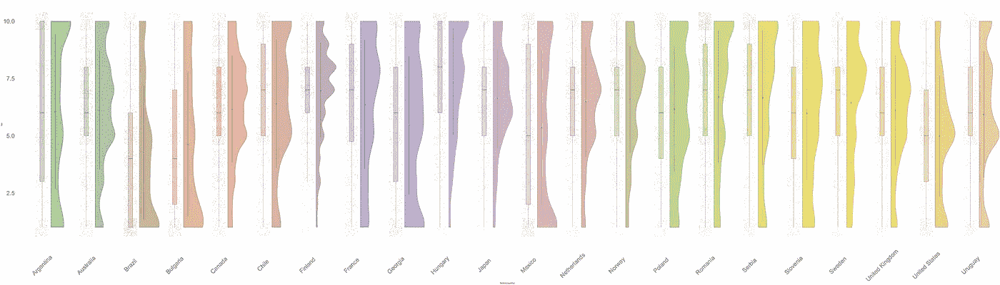
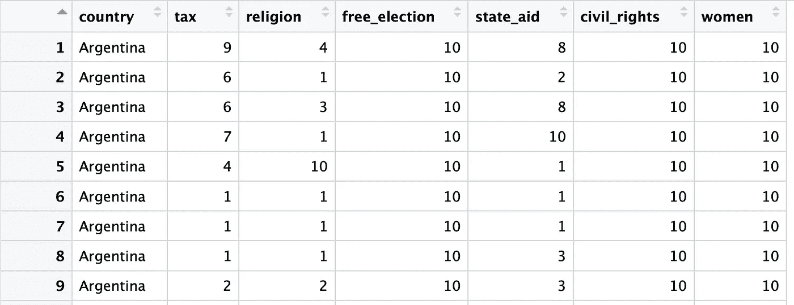
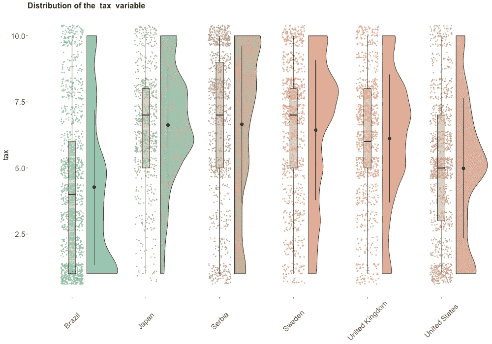
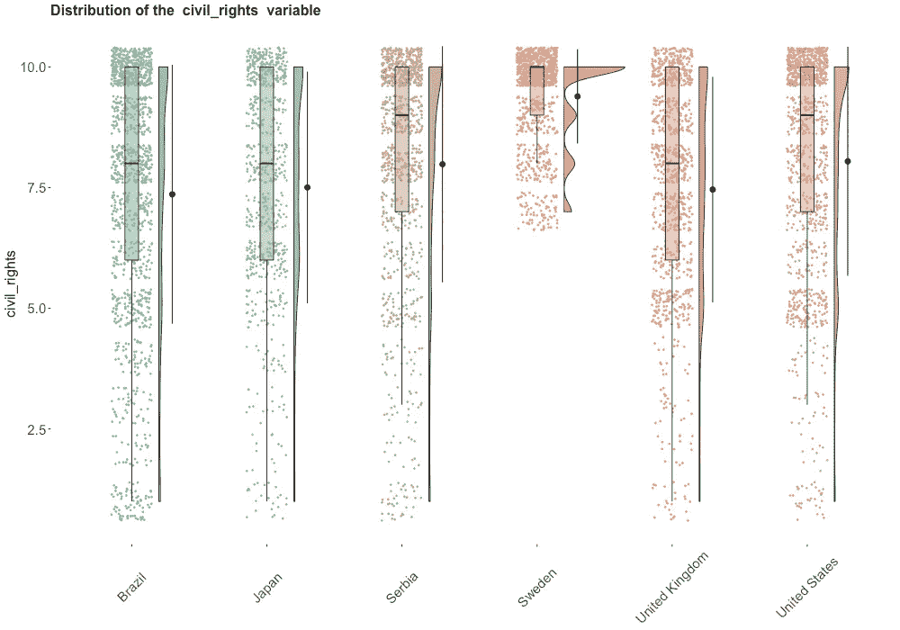
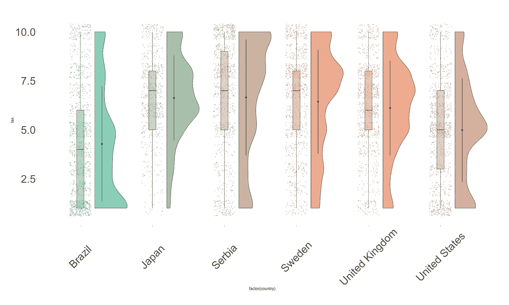
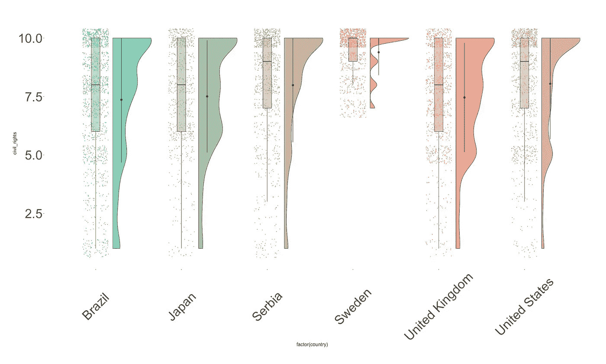

# R 中的终极 EDA 可视化

> 原文：<https://towardsdatascience.com/the-ultimate-eda-visualization-in-r-e6aff6afe5c1?source=collection_archive---------13----------------------->

## 清除创建雨云情节的障碍

# 介绍

最近我在为一个研究项目做 EDA(探索性数据分析)。同事给我介绍了一个情节，叫雨云情节。它是点状图、盒状图和核心密度的结合(或者你可以把它想成半小提琴图)，它确实以一种视觉愉悦的方式传达了无数的信息(因此很多时候我们错误地称它为彩虹图:)。下面是该图的一个示例:



Rain cloud plot for a comparative politics project

看起来很神奇，不是吗？尽管我成功了，但我还是被剧情的最终结局惊呆了！

请注意，这篇文章是基于[宝拉·安德里亚·马丁内兹](https://orchid00.github.io/tidy_raincloudplot)、[米卡·艾伦](https://micahallen.org/2018/03/15/introducing-raincloud-plots/)和[大卫·罗宾逊](https://gist.github.com/dgrtwo/eb7750e74997891d7c20)的伟大工作。因此，我不会通过展示所有的细节来重新发明情节；相反，我将介绍一些你可能需要的技巧，以使这样的情节符合你的需要。

# 准备

我将使用来自[世界价值调查第五波](http://www.worldvaluessurvey.org/WVSDocumentationWV5.jsp)的数据集作为例子。我已经清理了数据集，您可以从这里简单地 git 克隆。这里是数据集的一瞥:



国家列有 22 个唯一的国家值:

*阿根廷、澳大利亚、巴西、保加利亚、加拿大、智利、芬兰、法国、格鲁吉亚、匈牙利、日本、墨西哥、荷兰、挪威、波兰、罗马尼亚、塞尔维亚、斯洛文尼亚、瑞典、英国、美国和乌拉圭。*

其余各栏对应于受访者对与民主的基本特征相关的 6 个问题的回答，得分为 1-10 分。例如，对于上面的每个变量，都有这样的问题提示:

> 许多事情可能是可取的，但并不是所有的事情都是民主的本质特征。请告诉我，对于以下各项，您认为它作为民主的一个特征有多重要。
> 
> *【①政府* ***税收*** *富人补贴穷人；*
> 
> *(2)* ***宗教*** *权威解释法律；*
> 
> …
> 
> 使用此量表，其中 1 表示“根本不是民主的基本特征”，10 表示肯定是“民主的基本特征”

为了创造情节，你需要的另一个东西是 R 包 [RColorBrewer](http://cran.r-project.org/web/packages/RColorBrewer/index.html) 。

> [RColorBrewer](https://moderndata.plot.ly/create-colorful-graphs-in-r-with-rcolorbrewer-and-plotly/) 是一个 R 包，它允许用户使用预先制作的调色板创建彩色图表，以清晰可辨的方式可视化数据。有 3 类调色板:定性，发散，顺序。

# 问题 1

如果您没有包含许多组(在本例中为国家)的大型数据集，以上链接中提供的代码示例在大多数情况下都适用。但是，当你有“很多”组的时候，它就一定会断。截止值大约是 8–12，取决于您选择的特定调色板，并放入以下代码中。

```
# borrowed from [Paula Andrea Martinez](https://orchid00.github.io/tidy_raincloudplot)'s post mentioned above
g <- 
  ggplot(data = name_of_your_data, 
         aes(x = EmotionCondition, y = Sensitivity, fill = EmotionCondition)) +
  geom_flat_violin(position = position_nudge(x = .2, y = 0), alpha = .8) +
  geom_point(aes(y = Sensitivity, color = EmotionCondition), 
             position = position_jitter(width = .15), size = .5, alpha = 0.8) +
  geom_point(data = sumld, aes(x = EmotionCondition, y = mean), 
             position = position_nudge(x = 0.3), size = 2.5) +
  geom_errorbar(data = sumld, aes(ymin = lower, ymax = upper, y = mean), 
                position = position_nudge(x = 0.3), width = 0) +
  expand_limits(x = 5.25) +
  guides(fill = FALSE) +
  guides(color = FALSE) +
  coord_flip() + 
 **scale_color_brewer(palette = "Spectral") +
  scale_fill_brewer(palette = "Spectral") +**
  theme_bw() +
  raincloud_theme
```

因此，如果您有一个像我们这里的例子这样的数据集，这在实际的分析设置中会有很多次，上面的 R 代码会中断并产生令人讨厌的错误:

```
> g
Error: Insufficient values in manual scale. 22 needed but only 1 provided.
```

您会看到这一点，因为 ggplot 无法从我们为 22 个组/国家选择的调色板(在本例中为“光谱”)中获取足够的颜色。然而，所有的默认调色板只有 8-12 种颜色。因此，我们需要将调色板“切割”成更小的间隔，从而创造更多的颜色来适应我们的群体。我们可以通过手工“剪切”默认调色板并通过`colorRampPalette`函数创建一个新的调色板来实现

```
getPalette = colorRampPalette(RColorBrewer::brewer.pal(8, "Set2"))(22) # I set (26) when creating the plot above for better transition of colors.
```

这将削减我们原来的调色板介绍 22 小间隔，并提取相应的颜色。我尝试了一些默认的调色板，我最喜欢调色板“Set2”。我实际上创建了 26 种颜色，而不是 22 种，因为这将允许最后几组有更明亮和更饱和的颜色。

尝试最让你满意的不同调色板和颜色组合:)

# 问题 2

这是一个更微妙的问题，只有在数据失真的情况下才会变得明显。其微妙的原因是，代码不会抱怨任何事情，并按照您的要求生成丰富多彩的情节。然而，在你把它投入生产和报告后，你可能会被问到“为什么它们看起来不像是在同一个规模上？”

让我给你看一个例子。请比较以下数字，第一张图中以*税*为绘制变量，第二张图中以*民权*为绘制变量。



Figure 1

图 1 看起来和预期的一样，我们看到了数据分布的一个很好的描述。



Figure 2

图 2 看起来很诡异，不是吗？密度图看起来又细又扁，似乎与图 1 不在同一尺度上。但是让我告诉你，生成这两个数字的代码是完全一样的，没有任何错误！

问题在于数据的分布和密度图的特殊性。图 2 中的*公民权利*变量比*税收*变量更偏向顶端，这意味着更多的人认为保护公民权利绝对是民主的一个基本特征；他们认为政府向富人征税来补贴穷人是民主的本质特征。某个国家在*公民权利*变量中的中位数几乎是 9。这种偏度直接导致 pdf 拍摄的密度估计超出 10 的范围，甚至扩展到 12！但是，雨云图默认将密度限制/修剪为 10，从而导致密度区域超出 10 的范围，导致密度图看起来像是被挤压和压缩的。

到目前为止，还没有一个好的解决方案将面积损失附加到顶值 10。然而，在研究了一点之后，我发现雨云图中有一个参数可以帮助我们解释这个图。

```
g <- 
  ggplot(data = name_of_your_data, 
         aes(x = factor(country), y = tax, fill = factor(country))) +
  **geom_flat_violin(position = position_nudge(x = .2, y = 0), trim = TRUE, alpha = .8, scale = "width")** +
  geom_point(aes(y = tax, color = factor(country)), 
             position = position_jitter(width = .15), size = .5, alpha = 0.8) +
  geom_boxplot(width = .1, outlier.shape = NA, alpha = 0.5) +
  geom_point(data = sumld, aes(x = factor(country), y = mean), 
             position = position_nudge(x = 0.3), size = 2.5) +
  geom_errorbar(data = sumld, aes(ymin = lower, ymax = upper, y = mean), 
                position = position_nudge(x = 0.3), width = 0)+
  expand_limits(x = 5.25) +
  guides(fill = FALSE) +
  guides(color = FALSE) +
  scale_color_manual(values = getPalette) +
  scale_fill_manual(values = getPalette) +
  #coord_flip() + # flip or not
  theme_bw() +
  raincloud_theme +
  theme(axis.title = element_text(size = 42),
        axis.text=element_text(size=42))
```

这里的关键是参数`scale = "width"`。该参数记录在[这里的](https://rdrr.io/github/GuangchuangYu/gglayer/man/geom_flat_violin.html)中。根据这份文件:

> 如果是“面积”(默认)，所有的小提琴都有相同的面积(在修剪尾部之前)。如果为“计数”，面积将与观察次数成比例缩放。如果“宽度”，所有的小提琴都有相同的最大宽度。

如果我们设置`scale = "width"`，这两个数字看起来会是这样的:



Figure 3: Adjusted plot for the **tax** variable



Figure 4: Adjusted plot for the **civil_rights** variable

我们可以看到这些图，尤其是图 4，不再像图 2 那样压缩，每个国家内变量的分布变得更加明显。这正是我们想要的，了解每个国家的分布情况。这里需要注意的一点是，由于我们将最大密度宽度配置为相同，因此密度的面积并不相同(尽管图 2 中没有显示，因为各国的修剪面积并不相同)。这一缺点在瑞典尤为明显，如图 4 所示。然而，鉴于我们的目标是查看国家内部而不是国家之间的分布情况，我认为调整后的版本更适合我们。

# 结论

我希望这篇文章能扫清你在尝试制作令人惊奇的雨云情节时可能遇到的障碍。我可以想象它在学术界和工业界会有更广泛的存在，因为它在浓缩大量信息方面很优雅。

最后说明一下，雨云图在 Python 和 Matlab 中的实现也可以在[这里](https://github.com/RainCloudPlots/RainCloudPlots)找到。

希望这篇文章对你的生活有用。请随时让我知道你是否有更多关于雨云情节的问题:)

编码快乐！