# A/B 测试终极指南。第 2 部分:数据分布

> 原文：<https://towardsdatascience.com/the-ultimate-guide-to-a-b-testing-part-2-data-distributions-5ed429abbce?source=collection_archive---------15----------------------->

A/B 测试是一种非常流行的技术，用于检查产品中的细微变化，而不会错误地考虑由外部因素引起的变化。在这一系列的文章中，我将尝试给出一个简单的关于如何设计、运行和评估 a/b 测试结果的操作手册，这样你就可以得到这些惊人的统计显著结果了！

[在上一集](https://medium.com/swlh/the-ultimate-guide-to-a-b-testing-part-1-experiment-design-8315a2470c63)中，我们已经讨论了在进行 a/b 测试之前对样本大小的估计。下一步是考虑我们实现的检查测试结果统计显著性的确切方法。

但是在进入不同的统计测试之前，处理一点概率分布是很重要的，为什么我们需要知道我们的数据是如何形成的。也就是说这篇文章会比其他的更理论化，所以坚持住！但是这些知识对于下一步很重要:为每种类型的分布选择正确的统计检验。

***注意:我这里不做概率分布的理论解释，所以如果你不熟悉这个概念，最好从*** [***这里***](https://en.wikipedia.org/wiki/Probability_distribution) ***)开始。***

# 当涉及到 a/b 测试用户行为时，我们最有可能观察到几种类型的分布:

*   二项分布
*   正态分布
*   t 分布
*   卡方分布

当然，还有很多，但是我们将集中讨论这四个，因为它们应该涵盖了你在实践中遇到的 99%的情况。

# 二项分布

这种情况发生在每次试验中只有两种可能的结果，并且这些试验已经重复了一定的次数。二项式分布的例子:用户搅动/返回，赢得/输掉游戏，等等。

***你可以确定存在一个二项分布，如果以下所有都成立:***

*   有 n 次试验
*   每个试验都是独立的，即一个试验的结果对另一个试验没有影响
*   每次试验只有两种可能的结果:成功和失败，概率分别为 p 和(1-p)

已知成功概率(p)、试验次数(n)和成功次数(x)，我们可以使用以下公式绘制二项式分布:

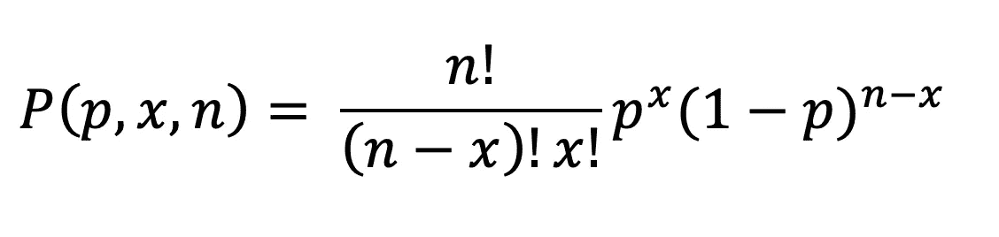

基本上，它的意思是，知道了成功的概率(p)和试验的次数(n ),我们就能够计算出在 n 次试验中获得一定成功次数(x)的概率。

还记得第一篇文章中的那个游戏吗？让我们回到那个例子，假设我们有 100 个用户(n=100)，其中只有 30 人在安装游戏后的第二天返回(x=30)。此外，我们知道，在我们的案例中，用户返回的概率(即保留率)是 70% (p=0.7)。那么，从 100 个返回者中只得到 30 个返回者的概率是多少呢？

使用二项分布的公式，我们得到:

概率接近于零，这意味着这是一个极不可能的情况。所以这个结果是检查产品是否有问题的好理由。

如果我们用不同的概率 p 绘制二项式分布，图表看起来会像这样:

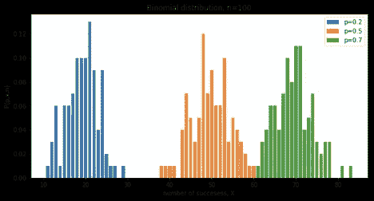

平均值和标准偏差可使用以下公式计算:

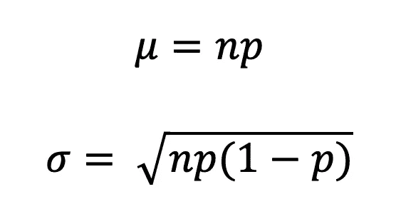

二项式分布是离散的，而不是连续的分布。因为变量 x 是 n 次试验的成功次数，所以它只能取数字 0，1，2，3，4…..名词（noun 的缩写）

# 正态分布

我们列表中的下一站是正态分布:就可识别性而言，这是其他分布中的佼佼者，许多统计测试都基于测试数据是正态分布的假设。

这种分布的广泛流行并非偶然，因为出于某种原因，许多真实世界的数据集近似正态分布。这里的例子可以是人的身高或年薪，以及更多。

***如果所有的检查点都被填满，你可以确定存在正态分布:***

*   分布的均值、中值和众数都相等
*   曲线在中心对称(即围绕平均值μ)
*   所有的值围绕平均值对称分布(正好一半的值在中心的左边，正好一半的值在右边)
*   曲线下的总面积等于 1(即总 p = 100%)

这种分布的一个更重要的特征是，知道了标准差和平均值，你就可以说得到精确值的概率。这来自曲线的形状:

*   68%的数据在平均值的一个标准偏差范围内
*   95%的数据落在平均值的两个标准偏差内
*   99.7%的数据在平均值的三个标准偏差范围内

为了描述这种分布，统计学家使用以下公式:

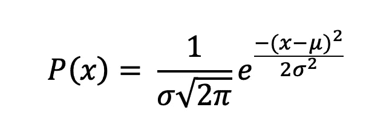

因此，P(x)完全由两个变量描述:均值μ(也称为中位数和众数)和标准差σ。这两个值可以用以下公式计算:

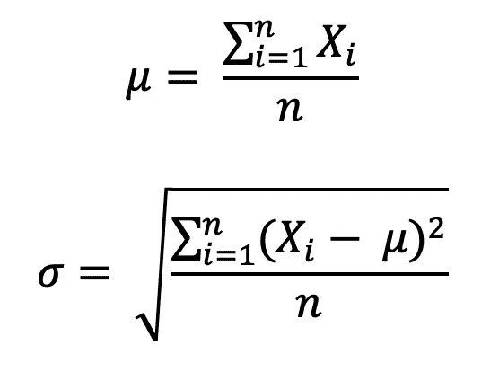

如果μ = 0 且σ= 1，正态分布也可称为**标准正态分布(又名 Z 分布)**。

您可以使用公式轻松地将任何正态分布转换为 Z 分布:

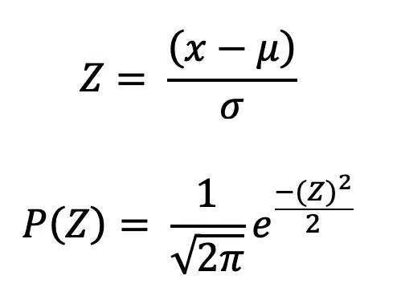

其中 Z 被称为“Z 得分”,这是一个非常重要的显著性检验统计数据，因此我们将会经常用到它。

# 学生的 t 分布

t 分布是正态分布的近亲。稍微矮一点胖一点的表弟。

当您有小样本(通常在实践中少于 30)时，使用 t 分布代替正态分布。样本越大，t 分布就越像正态分布。事实上，对于大于 30 的样本大小(例如，更多的自由度)，分布几乎完全遵循正态曲线的形状。

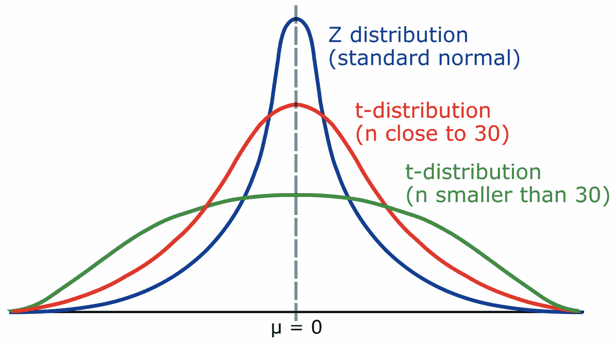

为了描述 t 分布，我们使用以下公式:

其中γ是 gamma-function，ν是自由度的个数(简单来说就是样本数减 1)。

均值和标准差也类似于它的正常表亲，只是略有不同:对于 t 分布，我们通常假设给定数据是来自某个总体的一个**样本**，这意味着均值(μ)和标准差(σ)被认为是样本均值和样本标准差。在实践中，所有的变化是，我们使用自由度的数量(ν = n-1)而不是样本数量(n)来计算标准偏差，并且我们还使用其他字母来表示这两个指标:

T 分布也有自己的 Z 得分版本，称为 T 得分，在统计测试中大量使用:

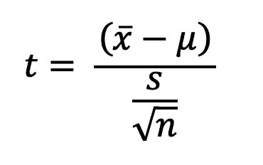

# 卡方分布

最后，但不是最不重要的，是卡方分布。这种方法广泛用于分类数据的统计测试。

卡方分布是伽马分布的一种特殊情况(就像 T 分布一样)，并且只有一个参数:自由度(ν)，就像可能类别的数量减一一样简单。分布只有正值，而且是右旋的。其形状因ν而异:从ν很低的非常不对称的形状，到ν很高的几乎正常的形状(当ν接近无穷大时，卡方分布变为正态分布)

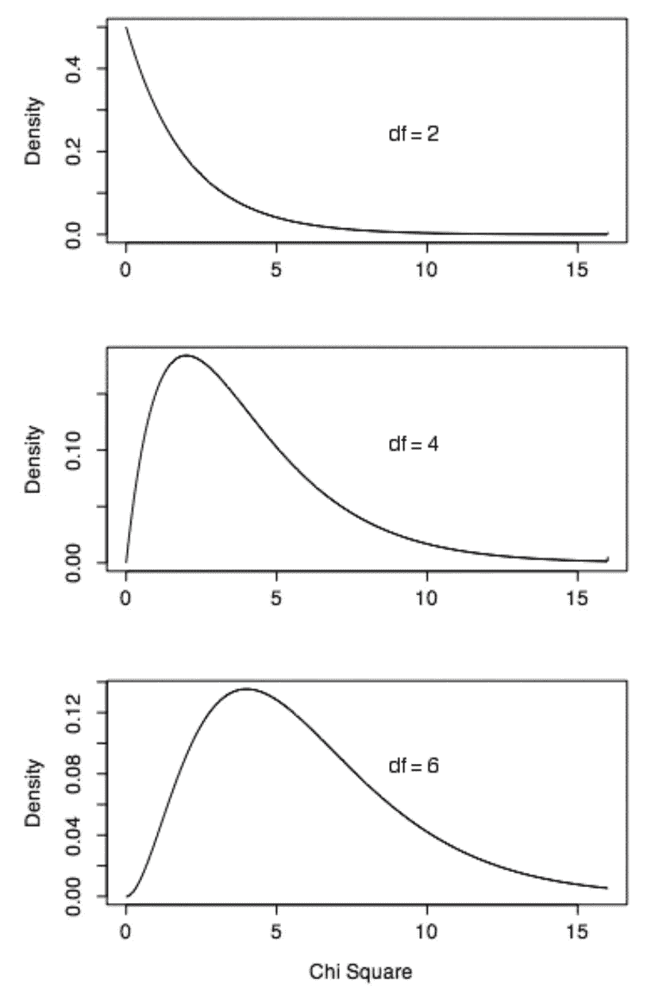

分布的平均值等于自由度的数量:

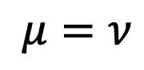

标准差等于自由度数量的两倍的平方根:

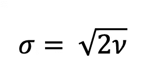

就像前两个一样，卡方也有自己的度量标准用于统计测试:

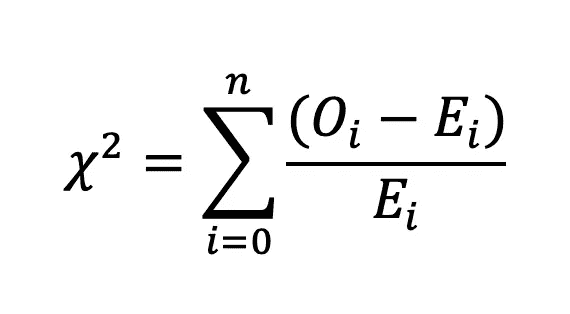

其中 Oi 是样本中 I 类出现的次数(观察频率)，Ei–是样本中 I 类出现次数的假设(预期频率)。这个假设是我们在进行测试时要检查的。

*所以，这些是你在开始测试你的数据时能找到的最常见的分布。下一次将讨论每种情况下的具体统计检验，也就是为什么不应该对卡方分布数据应用 t 检验。*