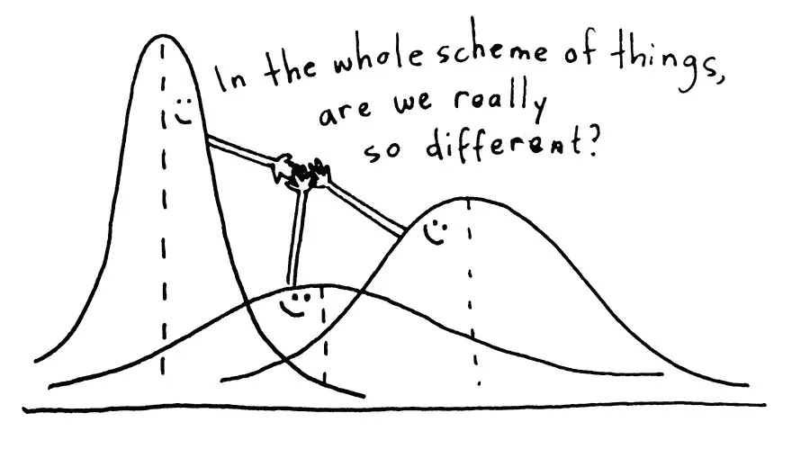
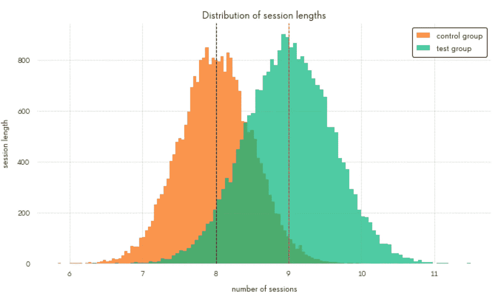
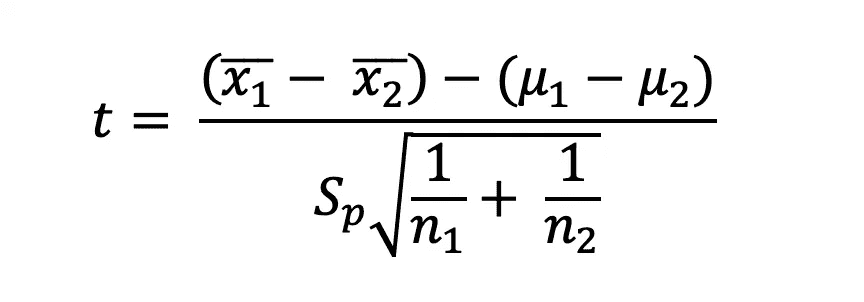
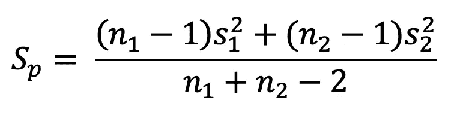
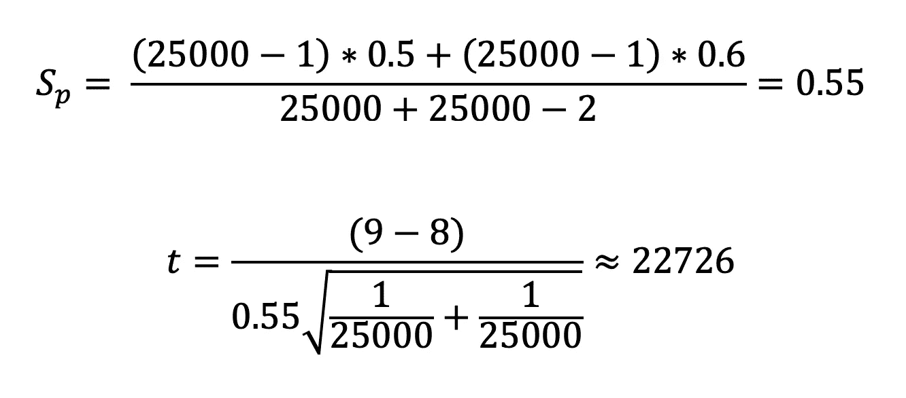

# A/B 测试终极指南。第 3 部分:参数测试

> 原文：<https://towardsdatascience.com/the-ultimate-guide-to-a-b-testing-part-3-parametric-tests-2c629e8d98f8?source=collection_archive---------7----------------------->

A/B 测试是一种非常流行的技术，用于检查产品中的细微变化，而不会错误地考虑由外部因素引起的变化。在这一系列的文章中，我将尝试给出一个简单的关于如何设计、运行和评估 a/b 测试结果的操作手册，这样你就可以得到这些惊人的统计显著结果了！

*在部分* [***中，一个***](https://medium.com/swlh/the-ultimate-guide-to-a-b-testing-part-1-experiment-design-8315a2470c63) *和* [***两个***](/the-ultimate-guide-to-a-b-testing-part-2-data-distributions-5ed429abbce) *中，我们已经讨论了在运行 a/b 测试之前样本大小的估计和最常见的概率分布，它们实际上描述了您的数据是如何形成的。现在是时候再做一步了:选择正确的统计检验，并最终使用它！*

所有的统计检验可以分为两大类:**参数**和**非参数**。这两个群体都致力于解决或多或少相同的问题，但在不同的情况下解决问题:

*   仅当假设正态(或接近正态)分布时，才使用参数检验。最广泛使用的测试是 **t 检验**和 **ANOVA**
*   当连续数据不是正态分布或者数据是离散的时，使用非参数检验。其中有代表性的有**卡方**和**费雪精确** **检验**，**曼恩-惠特尼 U 检验**

为了让所有这些理论更接近现实生活中的问题，让我们来看一个例子:

> 因此，我们在过去几年里一直在开发这款令人惊叹的街机游戏，事情似乎进展得很好:保留率很稳定，转化为购买和 LTV(终身价值)使我们能够通过获得付费流量将游戏的活跃观众保持在一定水平。换句话说，我们正在驾驶一辆沃尔沃汽车:虽然它不是法拉利，但它足够可靠，可以在合理的时间内以合理的价格将乘客从 A 点带到 B 点。
> 
> 但是，当然，总有改进的空间(*旁注:作者不是法拉利赞助的，也没有说服你购买任何跑车*):社区要求添加合作模式已经有一段时间了，经过长时间的激烈讨论，游戏团队决定投入一些时间和资源进行开发。
> 
> 现在我们在这里:6 个月之后，一个已经完成并经过测试的功能，激动而准备好的 t̵o̵ ̵r̵o̵c̵k̵！̵!在面向全体观众推出之前，̵将对其进行 A/B 测试。

我们暂时不讨论实验设计和样本量估计的话题(如果你感兴趣，请查看系列的第一篇文章[),然后直接开始估计结果:](https://medium.com/swlh/the-ultimate-guide-to-a-b-testing-part-1-experiment-design-8315a2470c63)

对于有 2500 名用户的测试组(与对照组的规模相同)，我们得到了这些数字:

*   平均会话时间从 8 分钟增加到 9 分钟
*   第一天的保留率从 40%增加到 45%
*   同时，转化率从 2%下降到 1.7%(哦哦)

所以对于平均来说。会话长度与对照组相比，测试组有**巨大的**(根据产品经理)**1 分钟的进度**！第一天的保留率更高(5%)!

但是董事会却没有同样的热情。从他们的角度来看，合作模式吸引了更多的玩家，但同时，它分散了他们对核心游戏的注意力，而核心游戏是所有盈利的所在。

产品经理强烈反对这种解释，他说，我们的会话长度增长了 11%，留存率增长了 5%，转化率仅下降了 0.3%，这可能只是一个概率问题。

经过 3 个小时的反复讨论，他们决定给数据人员打电话。这是我们最终登上舞台的时刻:通过调用获胜案例(测试或控制)来收集所有数据并挽救局面！

首先，我们查看了指标分布，并决定了合适的统计方法:

平均会话长度是正态分布的，因此我们可以使用**参数测试**来检查差异的显著性

第一天的保留率和转换率是二项式分布(两种情况都有两种结果:退货/退货、转换/未转换)，这意味着我们需要使用**非参数测试**

(如果您想了解发行版的更多细节，请查看本系列的第二篇文章

# 参数测试

“参数”这个名称意味着这些测试是基于数据具有某种形式的(正态或 t 分布)的****分布的假设，因此我们可以使用该分布**(平均值，标准差)的某些**参数** **来比较测试组。****

**这种类型最流行的代表是 **Z-test** 、**学生 T-test** 或 **ANOVA** (方差分析)。**

**对于我们的例子，让我们选择 **T-test** 来检查平均会话长度的增加是否像产品经理声称的那样令人兴奋。**

# **T 检验(学生的 T 检验)**

**t 检验测量两组之间的差异有多显著。我们所说的“不同”是指。:)**

> **换句话说，如果我们有两个均值不同的样本，这种差异可能只是偶然存在的吗，这两个样本来自同一个总体，或者这实际上是来自不同分布的两组？**

**我们首先绘制两组中每节课的时长:**

****

**要使用双样本 T 检验，我们需要每个分布的三个参数:样本均值(x1，x2)、标准偏差(s1，s2)和每组中的观察次数(n1，n2)。我在上一篇文章中已经描述了如何计算它，所以这里我们将只使用现成的数字:**

**对照组(橙色组)的平均值为 x1 = 8，而测试组的平均值为 x2 = 9。各组的标准偏差为 s1 = 0.5，s2 = 0.6。控制组和测试组的会话数为 n1=n2=25000(每个玩家在 A/B 测试期间进行了 10 次会话)。**

**知道这些数字后，可以使用以下公式计算 T 值:**

****

**其中 **Sp** 为样本分组方差，由下式给出:**

****

****μ1** 和 **μ2** 是两个种群的实均值。但是我们只有样本均值 **x1** 和**x2**…那么如何处理这个呢？**

**嗯，整个测试的主要目标是证明μ1 和μ2 之间存在显著差异，正因为如此，x2 高于 x1。或者换句话说，证明两个样本来自同一总体(μ1 = μ2)的零假设是错误的。**

**诀窍就在这里:在测试中，我们实际上假设零假设为真，μ1 = μ2，并检查在这种情况下测试组和对照组获得如此不同结果的可能性。而如果μ1 = μ2，那么(μ1 — μ2)=0。**

**我们案例的最终计算如下:**

****

**结果，我们得到了一个相当高的 t 值！**

**最后一步是检查，p = 0.05 的临界 t 值是多少(只是一个关于 p 值的快速提醒:这是错误地认为两个样本之间存在显著差异的概率，而事实并非如此。因此，尽管 5%通常就足够了，但有时人们会为了更保守的结果而选择 1%的 p 值。**

**根据临界值表(你可以很容易地在网上找到)，对于我们的样本量和 p = 0.05，当 t>1.96 时，可以拒绝零假设。我们远远超过了这个值，因此我们可以说平均会话长度增加 1 分钟是有意义的。**

**看起来我们证明了产品经理对敬业度的乐观看法是正确的，这太棒了！但其他问题仍然存在:我们的货币化指标下降了吗？这 5%的保留率增长有意义吗？**

**为了回答这两个问题，我们需要使用**非参数测试**，但是这些家伙值得一篇单独的文章。敬请关注！**