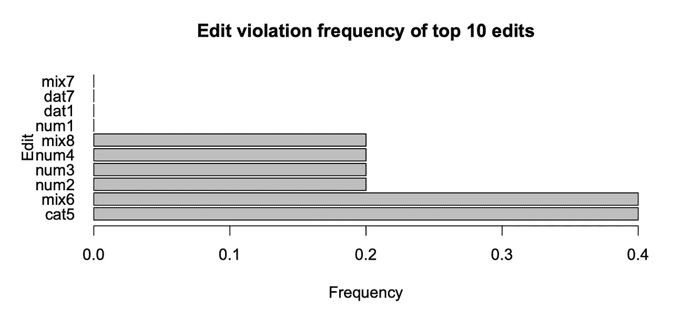
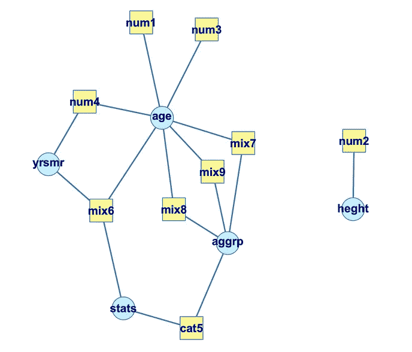
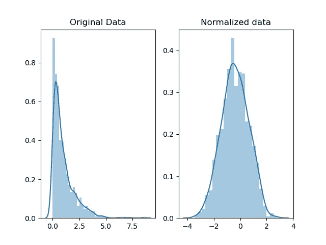
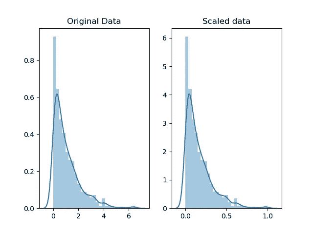

# 数据清理的终极指南

> 原文：<https://towardsdatascience.com/the-ultimate-guide-to-data-cleaning-3969843991d4?source=collection_archive---------0----------------------->

## 当数据是垃圾的时候


[source](https://ecomyths.files.wordpress.com/2014/08/garbage-disposals-ecomyths-cartoon-web.png)

我花了几个月的时间分析来自传感器、调查和日志的数据。不管我制作了多少图表，算法有多复杂，结果总是误导人。

对数据扔一个随机的森林，就跟给它注射病毒一样。一种病毒，除了损害您的洞察力之外别无其他意图，就好像您的数据是垃圾一样。

更糟糕的是，当你向首席执行官展示你的新发现时，哎呀，你猜怎么着？他/她发现了一个缺陷，一些闻起来不对劲的东西，你的发现与他们对领域的理解不匹配— *毕竟，他们是领域专家，比你，作为分析师或开发人员的你*更了解。

立刻，血液涌上你的脸，你的手在颤抖，片刻的沉默，然后，可能是道歉。

那一点也不差。如果你的发现被当作一种保证，而你的公司最终根据它们做出了决定，那会怎么样？。

你摄入了一堆脏数据，没有清理干净，你告诉你的公司对这些结果做一些事情，结果证明是错误的。你会有大麻烦的！。

不正确或不一致的数据会导致错误的结论。因此，您对数据的清理和理解程度对结果的质量有很大的影响。

在[维基百科](https://en.wikipedia.org/wiki/Data_cleansing#Motivation)上给出了两个真实的例子。

> 例如，政府可能希望分析人口普查数据，以决定哪些地区需要在基础设施和服务方面进一步支出和投资。在这种情况下，获得可靠的数据以避免错误的财政决策是非常重要的。
> 
> 在商业世界中，不正确的数据可能代价高昂。许多公司使用客户信息数据库来记录联系信息、地址和偏好等数据。例如，如果地址不一致，公司将承受重新发送邮件的成本，甚至失去客户。

> 垃圾进，垃圾出。

事实上，一个简单的算法可以胜过一个复杂的算法，只是因为它被给予了足够多和高质量的数据。

> 高质量的数据胜过花哨的算法。

由于这些原因，有一个逐步的指导方针，一个备忘单，通过要应用的质量检查是很重要的。

但是首先，我们要达到的目标是什么？。优质数据是什么意思？。质量数据的衡量标准是什么？。在采取任何行动之前，理解你试图完成的目标，你的最终目标是至关重要的。

## 索引:

*   [数据质量(有效性、准确性、完整性、一致性、统一性)](/the-ultimate-guide-to-data-cleaning-3969843991d4#6058)
*   [工作流程(检查、清洁、核实、报告)](/the-ultimate-guide-to-data-cleaning-3969843991d4#dff3)
*   [检查(数据分析、可视化、软件包)](/the-ultimate-guide-to-data-cleaning-3969843991d4#3def)
*   [清理(无关数据、重复数据、类型转换。，语法错误，6 更)](/the-ultimate-guide-to-data-cleaning-3969843991d4#b498)
*   [验证](/the-ultimate-guide-to-data-cleaning-3969843991d4#d05b)
*   [报告](/the-ultimate-guide-to-data-cleaning-3969843991d4#2380)
*   [最后的话](/the-ultimate-guide-to-data-cleaning-3969843991d4#751c)

# 数据质量

坦率地说，除了维基百科上的那个解释，我找不到更好的解释了。所以，我在这里总结一下。

## 有效期

数据符合定义的业务规则或约束的程度。

*   ***数据类型约束:*** 特定列中的值必须是特定的数据类型，如布尔、数值、日期等。
*   ***范围约束:*** 通常情况下，数字或日期应该在一定的范围内。
*   ***强制约束*** *:* 某些列不能为空。
*   ***唯一约束:*** 一个字段或字段组合在整个数据集中必须是唯一的。
*   ***集合成员约束* :** 列的值来自一组离散值，例如枚举值。例如，一个人的性别可能是男性，也可能是女性。
*   ***外键约束* :** 与在关系数据库中一样，外键列不能有不存在于被引用主键中的值。
*   **正则表达式模式:**必须采用特定模式的文本字段。例如，电话号码可能需要具有(999)999–9999 的模式。
*   **跨字段验证:**跨多个字段的某些条件必须成立。例如，患者的出院日期不能早于入院日期。

## 准确(性)

数据接近真实值的程度。

虽然定义所有可能的有效值可以很容易地发现无效值，但这并不意味着它们是准确的。

一个有效的街道地址可能实际上并不存在。一个*有效的*人的眼睛颜色，比如蓝色，可能是有效的，但不是真实的(不代表现实)。

另一个需要注意的是准确度和精确度的区别。说你生活在地球上，实际上是真的。但是，不精确。究竟在哪里？。说你住在特定的街道地址更准确。

## 完全

所有必需数据的已知程度。

由于各种原因，数据会丢失。如果可能的话，你可以通过质疑原始资料来缓解这个问题，比如重新采访对象。

很有可能，这个主题要么给出一个不同的答案，要么将很难再次触及。

## 一致性

同一数据集内或跨多个数据集的数据一致性程度。

当数据集中的两个值相互矛盾时，就会出现不一致。

一个有效的年龄，比如 10 岁，可能与婚姻状况不符，比如离婚。一个客户记录在两个不同的表中，有两个不同的地址。

哪个是真的？。

## 同样

使用相同度量单位指定数据的程度。

重量可以用磅或公斤来记录。日期可能遵循美国格式或欧洲格式。货币有时是美元，有时是日元。

因此数据必须转换成单一的测量单位。

# 工作流程

该工作流程由三个步骤组成，旨在产生高质量的数据，并考虑到我们谈到的所有标准。

1.  **检测:**检测意外的、不正确的和不一致的数据。
2.  **清理:**修复或清除发现的异常。
3.  **验证:**清洗后，检查结果以验证正确性。
4.  **报告:**记录有关所做更改和当前存储数据质量的报告。

你所看到的连续过程实际上是一个迭代的、无止境的过程。当检测到新的缺陷时，可以从验证到检查。

# 检查

检查数据非常耗时，并且需要使用多种方法来探索底层数据以进行错误检测。以下是其中的一些:

## 数据剖析

关于数据的**汇总统计**，称为数据剖析，对于给出数据质量的一般概念非常有帮助。

例如，检查特定的列是否符合特定的标准或模式。数据列是记录为字符串还是数字？。

缺少多少个值？。一列中有多少个唯一值，以及它们的分布情况？。这个数据集与另一个数据集有联系或有关系吗？。

## 形象化

通过使用统计方法(如平均值、标准偏差、范围或分位数)分析和可视化数据，可以找到意想不到的错误值。

例如，通过可视化各国的平均收入，人们可能会看到一些[](https://medium.com/omarelgabrys-blog/statistics-probability-exploratory-data-analysis-714f361b43d1#a7e5)*****(链接有图片)*。有些国家的人比其他任何人挣得都多。这些异常值值得研究，不一定是不正确的数据。****

## ****软件包****

****您的语言中有几个可用的软件包或库，可以让您指定约束并检查违反这些约束的数据。****

****此外，它们不仅可以生成违反了哪些规则以及违反了多少次的报告，还可以创建一个图表，显示哪些列与哪些规则相关联。****

****************

****[source](https://cran.r-project.org/doc/contrib/de_Jonge+van_der_Loo-Introduction_to_data_cleaning_with_R.pdf)****

****比如年龄不能是负数，身高也不能是负数。其他规则可能涉及同一行或跨数据集的多列。****

# ****清洁****

****根据问题和数据类型，数据清理涉及不同的技术。可以应用不同的方法，每种方法都有自己的利弊。****

****总的来说，不正确的数据要么被删除，纠正，或估算。****

## ****无关数据****

****不相关的数据是那些实际上不需要的，并且不适合我们试图解决的问题的上下文的数据。****

****例如，如果我们正在分析关于人口总体健康状况的数据，电话号码就没有必要了— *列式*。****

****同样，如果你只对一个特定的国家感兴趣，你不会想包括所有其他国家。或者，只研究那些去做手术的患者，我们不会包括每个人— *按行排列*。****

******只有当**你确定某个数据不重要的时候，你才可以丢弃它。否则，探索特征变量之间的相关矩阵。****

****即使你注意到没有相关性，你也应该向领域专家请教。你永远不知道，一个看似不相关的特性，从某个领域的角度，比如从临床的角度，可能是非常相关的。****

## ****复制****

****重复数据是数据集中重复的数据点。****

****这种情况经常发生，例如****

*   ****来自不同来源的数据被组合在一起****
*   ****用户可能会按两次提交按钮，认为表单并没有真正提交。****
*   ****提交了两次在线预订请求，以更正第一次意外输入的错误信息。****

****一个常见的症状是两个用户拥有相同的身份号码。或者说，同一篇文章报废了两次。****

****因此，它们应该被简单地移除。****

## ****类型转换****

****确保数字存储为数字数据类型。日期应该存储为 date 对象，或者 Unix 时间戳(秒数)，等等。****

****如果需要，分类值可以与数字相互转换。****

****通过查看摘要中每一列的数据类型，可以很快发现这一点(我们已经在上面讨论过)。****

****需要注意的是，不能转换为指定类型的值应该转换为 NA 值(或任何值)，并显示警告。这表明该值不正确，必须修正。****

## ****语法错误****

******删除空格:**应该删除字符串开头或结尾多余的空格。****

```
**"   hello world  " => "hello world**
```

******填充字符串:**字符串可以用空格或其他字符填充到一定宽度。例如，一些数字代码通常用前置零表示，以确保它们总是具有相同的位数。****

```
**313 => 000313 (6 digits)**
```

******修复错别字:**字符串可以用许多不同的方式输入，难怪会有错误。****

```
****Gender**
m
Male
fem.
FemalE
Femle**
```

****这个分类变量被认为有 5 个不同的类，而不是预期的 2 个:男性和女性，因为每个值都不同。****

> ****一个[条形图](https://medium.com/omarelgabrys-blog/statistics-probability-exploratory-data-analysis-714f361b43d1#5f54)有助于可视化所有的唯一值。人们可以注意到一些价值是不同的，但确实指的是同一个东西，即“信息技术”和“IT”。或者，也许只是大写的不同，即“其他”和“其他”。****

****所以我们的职责就是从上面的数据中识别出每个值是男是女。我们如何做到这一点？。****

****第一种解决方案是手动将**的每个值映射到**的“男性”或“女性”。****

```
**dataframe['gender'].map({'m': 'male', fem.': 'female', ...})**
```

****第二种解决方案是使用**模式匹配**。例如，我们可以在字符串开头的性别中查找 M 或 M 的出现。****

```
**re.sub(r"\**^m**\$", '**Male**', '**male**', flags=re.**IGNORECASE**)**
```

****第三个解决方案是使用**模糊匹配**:一种识别预期字符串和每个给定字符串之间距离的算法。它的基本实现是计算将一个字符串转换成另一个字符串需要多少次操作。****

```
****Gender   male  female**
m         3      5
Male      1      3
fem.      5      3
FemalE    3      2
Femle     3      1**
```

****此外，如果您有一个城市名称这样的变量，您怀疑拼写错误或类似的字符串应该被同样对待。比如“里斯本”可以输入为“里斯本”、“里斯本”、“里斯本”等。****

```
****City     Distance from "lisbon"** lisbon       0
lisboa       1
Lisbon       1
lisbona      2
london       3
...**
```

****如果是这样的话，那么我们应该用一个唯一的值来代替所有意义相同的值。在这种情况下，用“lisbon”替换前 4 个字符串。****

> ****注意像“0”、“不适用”、“NA”、“None”、“Null”或“INF”这样的值，它们可能意味着相同的事情:值丢失。****

## ****使标准化****

****我们的职责不仅是识别错别字，还要将每个值放入相同的标准化格式中。****

****对于字符串，确保所有值都是小写或大写。****

****对于数值，请确保所有值都有特定的度量单位。****

****例如，高度可以用米和厘米来表示。1 米的差异被认为与 1 厘米的差异相同。所以，这里的任务是将高度转换成一个单位。****

****对于日期，美国版本与欧洲版本不同。将日期记录为时间戳(毫秒数)不同于将日期记录为 date 对象。****

## ****缩放/转换****

****缩放意味着转换数据，使其符合特定的比例，如 0–100 或 0–1。****

****例如，学生的考试分数可以重新调整为百分比(0-100)，而不是 GPA(0-5)。****

****它还可以帮助[使某些类型的数据更容易绘制](https://medium.com/omarelgabrys-blog/statistics-probability-exploratory-data-analysis-714f361b43d1#cd13)。例如，我们可能希望减少偏斜度来帮助绘图(当有这么多异常值时)。最常用的函数是对数、平方根和倒数。****

****具有不同测量单位的数据也可以进行缩放。****

****学生在不同考试中的成绩，比如 SAT 和 ACT，是无法比较的，因为这两种考试的规模不同。1 次 SAT 成绩的差异被视为与 1 次 ACT 成绩的差异相同。在这种情况下，我们需要[重新调整 SAT 和 ACT 分数](https://medium.com/omarelgabrys-blog/statistics-probability-probability-distribution-35818d301cf4#fbef)来取数字，比如说，在 0-1 之间。****

****通过缩放，我们可以绘制和比较不同的分数。****

## ****正常化****

****虽然归一化也会将值重新调整到 0-1 的范围内，但这里的目的是转换数据，使其呈正态分布。*为什么？*****

****在大多数情况下，如果我们要使用依赖于正态分布数据的统计方法，我们会对数据进行归一化。*如何？*****

****可以使用日志功能，或者[使用这些方法中的一种](https://en.wikipedia.org/wiki/Normalization_(statistics)#Examples)。****

> ****根据使用的缩放方法，数据分布的形状可能会发生变化。例如，“[标准 Z 分数](https://en.wikipedia.org/wiki/Standard_score)”和“[学生的 t 统计量](https://en.wikipedia.org/wiki/Student%27s_t-statistic)”(在上面的链接中给出)保留了形状，而 log 函数可能不会。****

****************

****Normalization vs Scaling (using [Feature scaling](https://en.wikipedia.org/wiki/Feature_scaling)) — [source](https://kharshit.github.io/blog/2018/03/23/scaling-vs-normalization)****

## ****缺少值****

****鉴于缺失的价值观是不可避免的，这就给我们留下了一个问题，当我们遇到它们时该怎么办。忽略缺失的数据就像在船上挖洞一样；它会下沉。****

****有三种或者更多的方法来处理它们。****

## ****—一个。放下。****

****如果一列中的缺失值很少发生并且是随机发生的，那么最简单和最直接的解决方案是删除有缺失值的观察值(行)。****

****如果该列的大部分值都丢失了，并且是随机发生的，那么通常的决定是删除整个列。****

****这在进行统计分析时特别有用，因为填充缺失值可能会产生意外或有偏差的结果。****

## ****—两个。估算。****

****它意味着根据其他观察值计算缺失值。有很多方法可以做到这一点。****

******—首先是**，一个是使用**统计值**，如平均值、中位数。然而，这些都不能保证数据的无偏性，尤其是在有许多缺失值的情况下。****

****当原始数据没有[偏斜](https://medium.com/omarelgabrys-blog/statistics-probability-exploratory-data-analysis-714f361b43d1#92d4)时，平均值最有用，而[中值更稳健](https://medium.com/omarelgabrys-blog/statistics-probability-exploratory-data-analysis-714f361b43d1#7e7b)，对异常值不敏感，因此在数据偏斜时使用。****

****在正态分布的数据中，可以得到平均值的两个标准偏差以内的所有值。接下来，通过在`(mean — 2 * std) & (mean + 2 * std)`之间生成随机数来填充缺失值****

```
**rand = np.random.randint(average_age - 2*std_age, average_age + 2*std_age, size = count_nan_age)dataframe["age"][np.isnan(dataframe["age"])] = rand**
```

******—第二个**。使用**线性回归**。基于现有的数据，我们可以计算出两个变量之间的最佳拟合线，比如说，房价与面积 m。****

****值得一提的是，线性回归模型对异常值很敏感。****

******—第三个**。**热卡**:从其他类似记录中复制数值。只有当您有足够的可用数据时，这才有用。并且，它可以应用于数值和分类数据。****

****我们可以采用随机方法，用一个**随机**值来填充缺失值。将这种方法更进一步，可以首先根据某种特征，比如性别，将数据集分成**两组(strata)** ，然后随机地分别填充不同性别的缺失值。****

****在**顺序**热卡插补中，根据[辅助变量(s](https://www.iriseekhout.com/missing-data/auxiliary-variables/) )对包含缺失值的列进行排序，以便具有相似辅助变量的记录顺序出现。接下来，用第一个可用记录的值填充每个缺失值。****

****更有趣的是，还可以使用 **𝑘最近邻插补，该插补将相似的记录分类并放在一起。然后通过首先找到最接近具有缺失值的记录的𝑘记录来填充缺失值。接下来，从𝑘最近邻中选择(或计算出)一个值。在计算的情况下，可以使用像平均值(如前所述)这样的统计方法。******

## ****—三个。旗帜。****

****一些人认为，无论我们使用什么样的估算方法，填充缺失值都会导致信息的丢失。****

****这是因为说数据丢失本身就是信息性的，算法应该知道这一点。否则，我们只是通过其他功能来强化已经存在的模式。****

****当丢失的数据不是随机发生时，这一点尤其重要。以一项调查为例，来自特定种族的大多数人拒绝回答某个问题。****

****缺失的**数字数据**可以用比如说 0 来填充，但是在计算任何统计值或绘制分布图时必须忽略这些零。****

****而**分类数据**可以用比如说“缺失”来填充:一个新的类别，它表明这段数据缺失。****

## ****—考虑到…****

****缺失值与默认值不同。例如，零可以解释为缺失或缺省，但不能同时解释为缺失和缺省。****

****缺失值不是“未知”。一项进行的研究表明，一些人不记得他们是否在学校被欺负过，应该被视为未知，而不是失踪。****

****每次我们丢弃或估算价值时，我们都在丢失信息。因此，萎靡不振可能会有所帮助。****

## ****极端值****

****它们是与所有其他观察结果显著不同的值。任何数据值[距离 Q1 和第三季度四分位数](https://medium.com/omarelgabrys-blog/statistics-probability-exploratory-data-analysis-714f361b43d1#48f7)超过(1.5 * IQR)都被视为异常值。****

****在被证明有罪之前，局外人是无辜的。也就是说，除非有充分的理由，否则不应删除它们。****

****例如，可以注意到一些不太可能发生的奇怪、可疑的值，因此决定删除它们。不过，它们值得在移除前进行调查。****

****还值得一提的是，一些模型，如线性回归，对异常值非常敏感。换句话说，离群值可能会使模型偏离大部分数据所在的位置。****

## ****记录内和跨数据集错误****

****这些错误是由于在同一行或不同的数据集中有两个或多个相互矛盾的值造成的。****

****例如，如果我们有一个关于城市生活成本的数据集。total 列必须等于房租、交通费和伙食费的总和。****

```
****city       rent  transportation food  total**
libson     500        20         40    560
paris      750        40         60    850**
```

****同样，孩子也不能结婚。一个员工的工资不能少于计算出来的税金。****

****同样的想法也适用于跨不同数据集的相关数据。****

# ******验证******

****完成后，应该通过重新检查数据并确保规则和约束成立来验证正确性。****

****例如，在填写完丢失的数据后，他们可能会违反任何规则和约束。****

****如果不可行的话，它可能涉及一些手动校正。****

# ****报告****

****报告数据的健康程度对于清理同样重要。****

****如前所述，软件包或库可以生成关于所做更改、违反了哪些规则以及违反了多少次的报告。****

****除了记录违规，还应该考虑这些错误的原因。为什么它们会首先发生？。****

# ****最后的话…****

****如果你做到了，我很高兴你能坚持到最后。但是，如果没有质量文化，上面提到的一切都没有价值。****

****无论验证和清理过程有多强大，随着新数据的到来，人们将继续遭受损失。****

****与其花时间和精力去治疗疾病，不如预防疾病。****

****这些问题有助于评估和提高数据质量:****

******数据是如何收集的，在什么条件下收集？**。收集数据的环境*确实*重要。环境包括但不限于位置、时间、天气条件等。****

****在去上班的路上询问受试者对*的看法和在家里是不一样的。在一项研究中，使用平板电脑回答问卷有困难的患者可能会丢掉结果。*****

******数据代表什么？。**包括所有人吗？只有城里的人？。或者，也许只有那些选择回答的人，因为他们对这个话题有强烈的看法。****

******清洗数据的方法有哪些，为什么？。**不同的方法在不同的情况下或者不同的数据类型下可能会更好。****

******您是否投入时间和金钱来改进流程？。**投资于人员和流程与投资于技术同样重要。****

****最后，…不用说，****

> ****感谢您的阅读！****

****请随意联系 LinkedIn 或 Medium。****