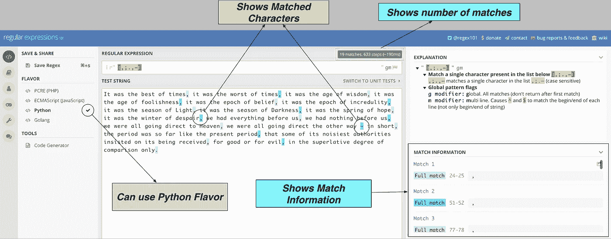
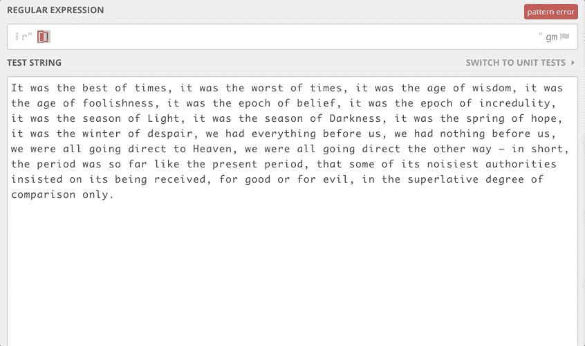
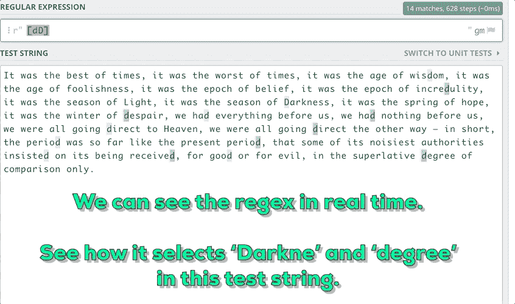
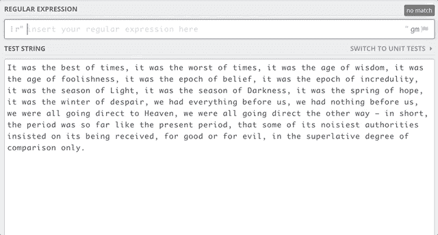
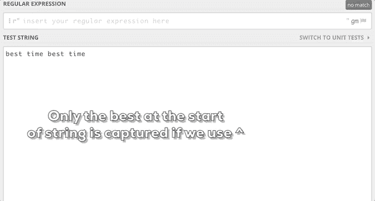
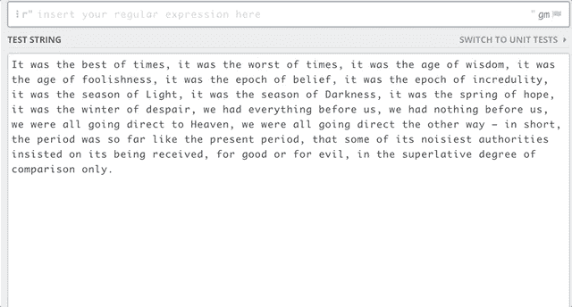

# 使用 Python 正则表达式模块的最终指南

> 原文：<https://towardsdatascience.com/the-ultimate-guide-to-using-the-python-regex-module-69aad9e9ba56?source=collection_archive---------8----------------------->


## 原始模式查找器

处理文本数据的主要任务之一是创建大量基于文本的要素。

人们可能希望找出文本、电子邮件(如果在文本中出现的话)以及大文本中的电话号码中的某些模式。

虽然实现这样的功能听起来很简单，但是如果我们使用 Python 的 regex 模块，就会简单得多。

例如，假设你的任务是找出一段特定文本中标点符号的数量。这里引用了狄更斯的文字。

你通常是怎么做的？

一个足够简单的方法是这样做:

```
target = [';','.',',','–']string = "**It was the best of times, it was the worst of times, it was the age of wisdom, it was the age of foolishness, it was the epoch of belief, it was the epoch of incredulity, it was the season of Light, it was the season of Darkness, it was the spring of hope, it was the winter of despair, we had everything before us, we had nothing before us, we were all going direct to Heaven, we were all going direct the other way – in short, the period was so far like the present period, that some of its noisiest authorities insisted on its being received, for good or for evil, in the superlative degree of comparison only.**"num_puncts = 0
for punct in target:
    if punct in string:
        num_puncts+=string.count(punct)print(num_puncts)
------------------------------------------------------------------
19
```

如果我们没有 re 模块的话，那就太好了。对于 re，它只有两行代码:

```
import re
pattern = r"[;.,–]"
print(len(re.findall(pattern,string)))
------------------------------------------------------------------
19
```

这篇文章是关于一个最常用的正则表达式模式和一些我经常使用的正则表达式函数。

# 什么是`regex`？

更简单地说，正则表达式(regex)用于在给定的字符串中查找模式。

我们想找到的模式可能是任何东西。

我们可以创建类似电子邮件或手机号码的模式。我们可以创建模式，从字符串中找出以 a 开头以 z 结尾的单词。

在上面的例子中:

```
import repattern = r'[,;.,–]'
print(len(re.findall(pattern,string)))
```

我们想要找出的模式是`r’[,;.,–]’`。这个模式捕获了我们想要捕获的 4 个字符中的任何一个。我发现 [regex101](https://regex101.com/) 是测试模式的好工具。这是模式应用于目标字符串时的样子。



正如我们所看到的，我们能够根据需要在目标字符串中找到所有出现的`,;.,–`。

每当我需要测试一个正则表达式时，我都会使用上面的工具。比一遍又一遍地运行 python 程序要快得多，调试也容易得多。

现在我们知道我们可以在目标字符串中找到模式，但是我们如何真正创建这些模式呢？

# 创建模式


使用 regex 时，我们需要学习的第一件事是如何创建模式。

我将逐一介绍一些最常用的模式。

正如您所想的，最简单的模式是一个简单的字符串。

```
pattern = r'times'string = "**It was the best of times, it was the worst of times.**"print(len(re.findall(pattern,string)))
```

但这不是很有用。为了帮助创建复杂的模式，regex 提供了特殊的字符/操作符。让我们一个一个地看一下这些操作符。请等待加载 gif 文件。

## 1.`[]` 操作员

这是我们在第一个例子中使用的。 ***我们想在这些方括号中找到任意字符的一个实例。***

`[abc]` -将找到 a 或 b 或 c 的所有出现

`[a-z]` -将查找 a 到 z 的所有事件。

`[a-z0–9A-Z]` -将查找 A 到 Z、A 到 Z 和 0 到 9 的所有事件。



在 Python 中，我们可以很容易地使用如下模式:

```
pattern = r'[a-zA-Z]'string = "**It was the best of times, it was the worst of times.**"print(len(re.findall(pattern,string)))
```

除了`.findall`之外，regex 中还有其他功能，但我们稍后会谈到。

## 2.点运算符

点运算符(。)用于匹配除换行符以外的任何字符*的单个实例。*

关于操作符最好的部分是我们可以把它们结合在一起使用。

例如，我们想找出字符串中以小写 D 或大写 D 开头，以长度为 6 的 e 结尾的子字符串。



## 3.一些元序列

在使用 regex 时，有一些模式我们会反复使用。所以 regex 为它们创建了一些快捷方式。最有用的快捷方式是:

`\w`，匹配任何字母、数字或下划线。相当于`[a-zA-Z0–9_]`

`\W`，匹配除字母、数字或下划线以外的任何内容。

`\d`，匹配任意十进制数字。相当于`[0–9]`。

`\D`，匹配除十进制数字以外的任何数字。

## 4.加号和星号运算符


点字符用于获取任何字符的单个实例。如果我们想找到更多。

加号字符`+`，用于表示最左边字符的一个或多个实例。

星形字符`*`，用于表示最左边字符的 0 个或多个实例。

比如我们想找出所有以 d 开头以 e 结尾的子串，我们可以在 d 和 e 之间有 ***零个字符或者更多的字符*** 我们可以用:`d\w*e`

如果我们想找出所有以 d 开头以 e 结尾的子串，并且在 d 和 e 之间至少有一个字符，我们可以使用:`d\w+e`



## 我们也可以通过{}使用更通用的方法

`\w{n}` -重复`\w`n 次。

`\w{n,}` -重复`\w`至少 n 次以上。

`\w{n1, n2}` -重复`\w`至少 n1 次，但不超过 n2 次。

## 5.`^`脱字符和`$` 美元符。

^匹配字符串的开头，$匹配字符串的结尾。



## 6.单词边界

这是一个重要的概念。

你有没有注意到在上面的例子中我总是匹配子串而不是一个单词？

那么，如果我们想找到所有以 d 开头的单词呢？

可以用`d\w*`做图案吗？让我们看看如何使用网络工具。



# 正则表达式函数

到目前为止，我们只使用了`re`包中的`findall`函数，但是它还支持更多的函数。让我们一个一个地研究这些函数。

## 1.`findall`

我们已经用了`findall`。这是我最常使用的正则表达式函数之一。让我们更正式地理解它。

***输入:*** 模式和测试字符串

***输出:*** 字符串列表。

```
#USAGE:pattern = r'[iI]t'
string = "**It was the best of times, it was the worst of times.**"matches = re.findall(pattern,string)for match in matches:
    print(match)------------------------------------------------------------
It
it
```

## 2.搜索


***输入:*** 模式和测试字符串

***输出:*** 定位第一个匹配的对象。

```
#USAGE:pattern = r'[iI]t'
string = "**It was the best of times, it was the worst of times.**"location = re.search(pattern,string)
print(location)------------------------------------------------------------
<_sre.SRE_Match object; span=(0, 2), match='It'>
```

我们可以使用以下方法获取这个位置对象的数据

```
print(location.group())
------------------------------------------------------------
'It'
```

## 3.代替者

这是另一个伟大的功能。当你使用 NLP 时，有时你需要用 X 来代替整数。或者你可能需要编辑一些文件。在任何文本编辑器中只有基本的查找和替换。

***输入:*** 搜索模式、替换模式和目标字符串

***输出:*** 被替换的字符串

```
string = "It was the best of times, it was the worst of times."
string = re.sub(r'times', r'life', string)
print(string)
------------------------------------------------------------
It was the best of life, it was the worst of life.
```

# 一些案例研究:

当需要验证时，在许多情况下使用正则表达式。你可能在网站上看到过类似“这不是一个有效的电子邮件地址”的提示。虽然可以使用多个 if 和 else 条件来编写这样的提示，但是 regex 可能是这种用例的最佳选择。

## 1.PAN 编号


在印度，我们用 PAN 号而不是美国的 SSN 号来识别税号。PAN 的基本验证标准是所有字母必须大写，字符必须按以下顺序排列:

```
<char><char><char><char><char><digit><digit><digit><digit><char>
```

所以问题是:

“ABcDE1234L”是有效的 PAN 吗？

如果没有正则表达式，你通常会如何解决这个问题？您很可能会编写一个 for 循环，并在字符串中保留一个索引。使用正则表达式，就像下面这样简单:

```
match=re.search(r’[A-Z]{5}[0–9]{4}[A-Z]’,'ABcDE1234L')
if match:
    print(True)
else:
    print(False)
-----------------------------------------------------------------
False
```

## 2.查找域名


有时我们有一个大的文本文档，我们必须从这个大的文本文档中找出电话号码或电子邮件 id 或域名的实例。

例如，假设您有以下文本:

你需要从这篇文章中找出所有的主要领域- `askoxford.com;bnsf.com;hydrogencarsnow.com;mrvc.indianrail.gov.in;web.archive.org`

你会怎么做？

```
match=re.findall(r'http(s:|:)\/\/([www.|ww2.|)([0-9a-z.A-Z-]*\.\w{2,3})',string)](http://www.|ww2.|)([0-9a-z.A-Z-]*\.\w{2,3})',string))
for elem in match:
    print(elem)
--------------------------------------------------------------------
(':', 'www.', 'askoxford.com')
(':', 'www.', 'hydrogencarsnow.com')
(':', 'www.', 'bnsf.com')
(':', '', 'web.archive.org')
(':', 'www.', 'mrvc.indianrail.gov.in')
(':', 'www.', 'mrvc.indianrail.gov.in')
```

|在这里是 or 运算符，match 返回元组，其中保存了()内的模式部分。

## 3.查找电子邮件地址:


下面是一个在长文本中查找电子邮件地址的正则表达式。

```
match=re.findall(r'([\w0-9-._]+@[\w0-9-.]+[\w0-9]{2,3})',string)
```

这些都是高级的例子，但是如果你试着自己理解这些例子，你应该对提供的信息很满意。

# 结论


虽然乍一看可能有点令人生畏，但在数据操作、创建特性和寻找模式方面，regex 提供了很大程度的灵活性。

当我处理文本数据时，我经常使用它，在处理数据验证任务时，也可以包含它。

我也是 regex101 工具的粉丝，经常用它来检查我的正则表达式。我想知道如果没有这个令人敬畏的工具，我是否还会使用正则表达式。

另外，如果你想在 [**了解更多关于 NLP** 的知识，这里的](https://coursera.pxf.io/9WjZo0)是一门很好的课程。您可以免费开始 7 天的免费试用。

谢谢你的阅读。将来我也会写更多初学者友好的帖子。在 [**媒体**](https://medium.com/@rahul_agarwal?source=post_page---------------------------) 关注我，或者订阅我的 [**博客**](http://eepurl.com/dbQnuX?source=post_page---------------------------) 了解他们。一如既往，我欢迎反馈和建设性的批评，可以通过 Twitter[**@ ml whiz**](https://twitter.com/MLWhiz?source=post_page---------------------------)联系。